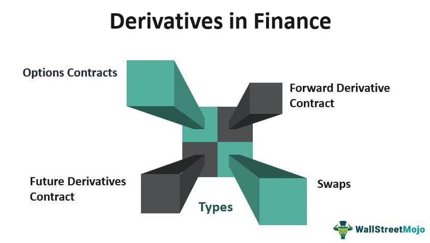

Financial derivatives have become an integral component of modern financial markets, providing investors with sophisticated tools for both risk management and speculative opportunities. Unlike traditional investments that require direct ownership, derivatives like options, futures, swaps, and Contracts for Difference (CFDs) allow investors to gain exposure to various underlying assets—such as stocks, bonds, currencies, and commodities—without the need to own them outright.

These financial instruments derive their value from underlying assets, offering unique strategies to hedge against potential market volatility or to speculate on price movements. As they can be tailored to meet specific financial goals, derivatives play a crucial role in contemporary investment portfolios, enabling more precise risk management and opening avenues for potential profit.



The realm of derivatives trading has been significantly enhanced by algorithmic trading, which employs computer algorithms to execute trades at high speeds and efficiencies, thereby reducing trading costs and maximizing profits. This advancement allows market participants to engage with derivatives markets more fluidly, responding to market changes rapidly and executing complex trading strategies with ease.

By exploring the various types of financial derivatives, their applications in trading and investment strategies, and the transformative effect of algorithmic trading, this article aims to provide a comprehensive overview of the dynamic role derivatives play in global finance.

## Table of Contents

## Understanding Financial Derivatives

Financial derivatives are financial instruments whose value is dependent on the value of another underlying asset. These underlying assets can be diverse, including stocks, bonds, currencies, and commodities. For example, the price of a stock option is linked to the price of the underlying stock. Derivatives are essentially contracts established between two or more parties, tailored to specific requirements related to an asset or a group of assets.

The primary purpose of derivatives is to manage risk, a mechanism known as hedging. By entering into a derivatives contract, a party can shield itself against fluctuations in market prices. For instance, a company expecting to receive payments in a foreign currency can use currency derivatives to lock in an exchange rate. 

Beyond risk management, derivatives have gained popularity for speculative purposes. Investors use derivatives to capitalize on price movements of underlying assets. Speculators can take positions that expect the asset price to rise or fall, thereby generating potential profits without owning the asset itself. 

Common types of derivatives include:

1. **Options**: These are contracts that give the holder the right, but not the obligation, to buy or sell an underlying asset at a specified strike price before or at a certain date. The two main types of options are calls and puts. A call option allows the holder to buy the asset, while a put option allows them to sell it.

2. **Futures**: These are standardized contracts obligating the buyer to purchase, or the seller to sell, an asset at a predetermined future date and price. Futures are traded on exchanges and are commonly used for hedging purposes by businesses to stabilize revenues and costs.

3. **Swaps**: These are agreements between parties to exchange cash flows or different financial instruments. The most common type is the interest rate swap, where parties exchange fixed interest rate payments for floating rate payments, or vice versa. Swaps are often utilized by companies looking to manage exposure to fluctuations in interest rates or foreign exchange rates.

4. **Forward Contracts**: Similar to futures, these are agreements to buy or sell an asset at a specified future date for a price that is agreed upon today. Unlike futures, forward contracts are customizable and traded over-the-counter (OTC), meaning they are not standardized or traded on exchanges.

Overall, derivatives are crucial in modern finance, offering instruments for both risk mitigation and speculative opportunities. The complexity and risk associated with derivatives require a comprehensive understanding of the markets and strategic foresight to manage effectively.

## Types of Derivatives

Financial derivatives are complex financial instruments with various forms, each serving unique purposes and implicating different strategies. Understanding the different types of derivatives is crucial for effective risk management and successful trading strategies.

### Options:
Options are versatile contracts offering the holder the right, but not the obligation, to buy or sell an asset at a specified price on or before a predetermined expiration date. They come in two primary types: calls and puts. A call option gives the investor the right to purchase an asset, while a put option grants the right to sell. The predetermined price is known as the "strike price." Options are used for hedging and speculation, providing leverage and limiting potential losses to the premium paid.

**Example of Option Payoff Calculation:**

For a call option:
$$
\text{Payoff} = \max(0, S - K)
$$

where $S$ is the spot price of the asset at expiration, and $K$ is the strike price. The put payoff can be similarly calculated as:
$$
\text{Payoff} = \max(0, K - S)
$$

### Futures:
Futures contracts are standardized agreements to buy or sell an asset at a specific future date and price. Unlike options, futures impose an obligation on both parties to fulfill the contract terms. Primarily used to hedge against price changes, they are prevalent in commodities markets for assets like oil, gold, and agricultural products. Futures are marked to market daily, requiring margin account maintenance to manage credit risk.

### Swaps:
Swaps are private agreements where two parties exchange future cash flows based on underlying instruments. The most common variants are [interest rate](/wiki/interest-rate-trading-strategies) swaps, where fixed-rate cash flows are exchanged for floating-rate cash flows, and currency swaps, dealing with currency exchange at pre-agreed rates and specific intervals. Swaps are essential for managing interest rate risk and currency exposure.

### CFDs (Contracts for Difference):
Contracts for Difference (CFDs) enable traders to speculate on an asset's price movement without owning the underlying asset. In CFD trading, the difference between the asset price at contract entry and [exit](/wiki/exit-strategy) is exchanged. CFDs provide easy access to a wide range of markets and are leveraged products, meaning traders can gain significant exposure with a small initial margin. However, leverage amplifies both potential gains and losses.

Understanding these derivative types is fundamental to employing them efficiently in various financial strategies, allowing traders to leverage, hedge risks, and gain exposure to different market sectors.

## Investment Instruments and Strategies

Derivatives play a pivotal role in various investment strategies by providing mechanisms to hedge against price [volatility](/wiki/volatility-trading-strategies) and enhance potential returns. Investors often incorporate derivatives into their portfolios to mitigate risks associated with fluctuations in the value of underlying assets, such as stocks, commodities, or currencies. This capability is particularly valuable in uncertain market conditions, allowing investors to stabilize portfolio returns and limit potential losses.

Hedging with derivatives is one of the primary strategies employed by investors. This involves using derivatives to offset potential losses in another part of an investment portfolio. For example, an investor holding a substantial amount of a particular stock could use options contracts—a type of derivative—to protect against a decline in the stock’s price. Options offer the right, but not the obligation, to buy or sell shares at a predetermined price, providing flexibility in managing investment risk.

Specifically, two common options strategies for risk management are covered calls and protective puts. A covered call involves writing a call option on an asset an investor already owns. This strategy can generate additional income through the option premium while potentially being called away if the asset price exceeds the strike price. A protective put, on the other hand, involves purchasing a put option to protect against a decline in the price of the underlying asset. This strategy acts as an insurance policy, limiting potential losses by allowing the investor to sell the asset at the specified strike price if market conditions deteriorate.

In addition to hedging, derivatives enable investors to leverage their positions, which can amplify returns on investment. By investing a relatively small amount of capital, investors can gain exposure to larger positions in the market through futures contracts or options. This leverage effect can result in significant profits if the market moves favorably; however, it also increases the potential for substantial losses, necessitating a thorough understanding of market dynamics and risk management techniques.

Investors may also combine derivatives with other financial instruments to meet specific investment objectives. For instance, a portfolio manager might use interest rate swaps to adjust the interest rate exposure of a bond portfolio without buying or selling the underlying bonds. This flexibility allows for more tailored investment approaches, aligning with an investor's risk tolerance and market outlook.

Successful use of derivatives requires a sound strategy, comprehensive market knowledge, and disciplined risk management practices. Although derivatives can enhance portfolio performance and provide resilience against market volatility, they must be used judiciously to avoid the pitfalls of over-leveraging or improper hedging tactics.

## Algorithmic Trading in Derivatives Markets

Algorithmic trading, a formidable force in derivatives markets, employs computer algorithms to make trading decisions and execute trades with high speed and efficiency. This form of trading is designed to capitalize on the precision and speed of computer systems, often resulting in reduced trading costs and enhanced potential profits. The application of [algorithmic trading](/wiki/algorithmic-trading) extends across a wide array of financial derivatives, including options, futures, and contracts for difference (CFDs).

The operations within algorithmic trading are centered around executing trades based on pre-set criteria. These criteria may involve price levels, [volume](/wiki/volume-trading-strategy), or statistical models that analyze market conditions. By automating the trading process, algorithmic trading minimizes human intervention, thereby reducing the potential for errors that stem from manual trading.

High-frequency trading ([HFT](/wiki/high-frequency-trading-strategies)), a specialized subset of algorithmic trading, emphasizes executing a large volume of orders at extremely rapid speeds. HFT strategies typically employ sophisticated algorithms that can execute a huge number of trades within fractions of a second. This level of rapid execution could take advantage of minute price discrepancies with significant trading volumes. HFT necessitates access to cutting-edge technology, including high-speed data feeds and co-location services near exchange servers to minimize latency.

Algorithmic trading systems often employ various techniques such as statistical [arbitrage](/wiki/arbitrage), [trend following](/wiki/trend-following), and market-making strategies to analyze and exploit market inefficiencies. Statistical arbitrage, for example, relies on quantitative models to identify mispricings in derivative contracts, while market-making algorithms provide [liquidity](/wiki/liquidity-risk-premium) by continuously quoting buy and sell prices.

An example of a simple trading algorithm in Python might involve calculating a moving average crossover strategy:

```python
import pandas as pd

def moving_average_crossover(df, short_window=40, long_window=100):
    signals = pd.DataFrame(index=df.index)
    signals['signal'] = 0.0

    # Short moving average
    signals['short_mavg'] = df['Close'].rolling(window=short_window, min_periods=1).mean()

    # Long moving average
    signals['long_mavg'] = df['Close'].rolling(window=long_window, min_periods=1).mean()

    # Generate signals
    signals['signal'][short_window:] = \
        np.where(signals['short_mavg'][short_window:] > signals['long_mavg'][short_window:], 1.0, 0.0)

    # Calculate the trading positions
    signals['positions'] = signals['signal'].diff()

    return signals
```

This code snippet generates trading signals based on the intersection of a short-term and a long-term moving average, which could trigger buy or sell actions in a derivatives trading strategy.

While algorithmic trading provides significant advantages, such as speed and scalability, it also raises concerns related to financial stability and market transparency. The rapid pace can contribute to market volatility, as exemplified by events like the 2010 Flash Crash. Regulatory bodies continue to evaluate the impact of algorithmic trading on market dynamics, necessitating sophisticated risk management protocols for participants engaging in these strategies.

## Advantages and Risks of Trading Derivatives

Financial derivatives provide investors with benefits like effective risk management and leverage. By using derivatives, investors can hedge against adverse price movements, mitigating the risk of financial loss. For example, an investor holding a stock portfolio can buy put options to protect against potential declines in the market value of their holdings. This method of hedging allows for risk reduction by providing a safety net against price volatility.

Leverage is another significant advantage of derivatives. By using derivatives, investors can gain greater exposure to the underlying assets with a relatively smaller amount of capital. This amplifies potential returns, allowing investors to enhance their investment performance. For instance, through the use of options or futures, investors can control a large position in a stock or commodity with a fraction of the total investment required if owning the asset directly.

Despite these advantages, trading derivatives comes with inherent risks. Market risk, which refers to the possibility of losses due to unfavorable market movements, is prevalent in derivatives trading. For example, an incorrect speculation on the direction of market prices can result in significant financial losses, despite the potential for large profits.

Moreover, derivatives can suffer from limited liquidity. In less liquid markets, executing trades at favorable prices becomes challenging, potentially leading to increased transaction costs or losses from selling at a discount. This risk is especially prominent in over-the-counter (OTC) derivatives, which are less standardized and often traded in less transparent markets.

The leverage provided by derivatives also poses a double-edged sword. While it can magnify gains, it also amplifies losses. If the market moves adversely, the financial losses can exceed the initial investment, leading to substantial financial consequences for the investor.

To manage these risks effectively, it is essential for traders to implement robust risk management strategies. This includes setting appropriate stop-loss orders, diversifying their derivative positions, and continuously monitoring market conditions and volatility indicators. Additionally, it is crucial to fully understand the derivatives being traded, as well as the underlying assets, to make informed trading decisions.

In conclusion, while derivatives can offer significant advantages such as risk management and increased leverage, they also pose considerable risks. A comprehensive understanding of both the advantages and the risks, combined with effective risk management strategies, is critical for successful derivatives trading in modern financial markets.

## Conclusion

Financial derivatives and algorithmic trading have significantly transformed market engagement for investors, offering powerful tools to manage risk and engage in speculative activities. These financial instruments, such as options, futures, swaps, and contracts for difference (CFDs), provide sophisticated mechanisms for trading across a variety of underlying assets without the need for direct ownership. By doing so, they have opened up new possibilities and strategies that were previously inaccessible in traditional markets.

While derivatives present the potential for enhanced returns, successful utilization necessitates a comprehensive understanding of the markets they pertain to and the associated risks. Investors must be well-versed in pricing models, market dynamics, and the broader economic factors that influence underlying asset values. This knowledge is crucial to designing effective hedging strategies and identifying profitable opportunities, thus minimizing the inherent risks, including market volatility and liquidity constraints.

Advancements in technology, particularly the advent of algorithmic trading, have further influenced derivatives trading, making it more efficient and accessible. Algorithms—capable of executing trades rapidly and accurately based on pre-set criteria—have reduced human errors and lowered transaction costs. High-frequency trading (HFT), a subset of algorithmic trading, has notably altered the landscape by executing a large volume of trades at speeds unattainable by human traders alone.

The ongoing evolution of these technologies and trading methodologies suggests that derivatives will continue to play an increasingly prominent role in global finance. As markets continue to innovate, the integration of [artificial intelligence](/wiki/ai-artificial-intelligence) and [machine learning](/wiki/machine-learning) into trading algorithms may offer even greater precision in predicting market movements and optimizing trade executions. This progressive trajectory holds the promise of further refining financial strategies and enhancing the capacity of investors to navigate complex financial landscapes safely and effectively.

## References & Further Reading

[1]: Hull, John C. (2018). ["Options, Futures, and Other Derivatives."](https://www.semanticscholar.org/paper/Options%2C-Futures%2C-and-Other-Derivatives-Hull/89bdee500c8623864fc9eb7a471546aa713acc44) Pearson.

[2]: Lopez de Prado, Marcos. (2018). ["Advances in Financial Machine Learning."](https://www.amazon.com/Advances-Financial-Machine-Learning-Marcos/dp/1119482089) Wiley.

[3]: Chan, Ernest P. (2009). ["Quantitative Trading: How to Build Your Own Algorithmic Trading Business."](https://github.com/ftvision/quant_trading_echan_book) Wiley.

[4]: Jarrow, Robert A., & Chatterjee, Siddhartha. (2019). ["An Introduction to Derivative Securities, Financial Markets, and Risk Management."](https://www.scribd.com/document/686888944/Robert-Jarrow-Arkadev-Chatterjea-An-Introduction-to-Derivative-Securities-Financial-Markets-And-Risk-Management-2nd-Edition-World-Scientific-US) W.W. Norton & Company.

[5]: Aldridge, Irene. (2010). ["High-Frequency Trading: A Practical Guide to Algorithmic Strategies and Trading Systems."](https://www.ahmetbeyefendi.com/wp-content/uploads/2020/07/High-Frequency-Trading-Irene-Aldridge.pdf) Wiley.

[6]: Aronson, David R. (2006). ["Evidence-Based Technical Analysis: Applying the Scientific Method and Statistical Inference to Trading Signals."](https://onlinelibrary.wiley.com/doi/book/10.1002/9781118268315) Wiley.

[7]: Black, Fischer, & Scholes, Myron. (1973). ["The Pricing of Options and Corporate Liabilities."](https://www.cs.princeton.edu/courses/archive/fall09/cos323/papers/black_scholes73.pdf) Journal of Political Economy, 81(3), 637–654.

[8]: Jansen, Stefan. (2020). ["Machine Learning for Algorithmic Trading."](https://github.com/stefan-jansen/machine-learning-for-trading) Packt Publishing.