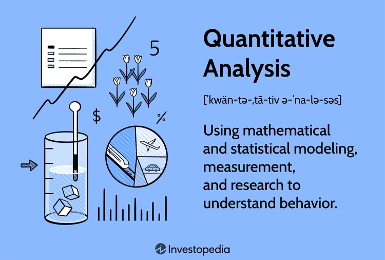

In the modern financial landscape, quantitative analysis has become a cornerstone for data-driven decision-making. This analytical approach employs mathematical and statistical methodologies to assess financial markets, offering a systematic and empirical basis for making investment decisions. The integration of quantitative analysis with data analysis methods and algorithmic trading has transformed trading practices, enhancing the ability to generate robust, data-fueled strategies. These strategies are designed not only to maximize returns but also to manage risks efficiently, a critical balance in achieving investment success.

The synergy between quantitative analysis and algorithmic trading has introduced precision and speed to financial markets, which were once dominated by manual interventions and qualitative judgments. By leveraging technologies like machine learning and big data analytics, traders can now automate and refine decision-making processes at an unprecedented scale and speed. Through these technological advancements, algorithms are developed to identify market patterns and opportunities almost instantaneously, allowing traders to execute transactions swiftly while minimizing human errors and emotional biases.



Readers will gain insights into the various tools and techniques at play in today's algorithmic trading environments. The exploration of statistical models, data mining techniques, and high-frequency trading strategies will paint a picture of how contemporary market participants harness computational power to stay ahead. Ultimately, the integration of quantitative analysis with advanced data handling capabilities forms the bedrock of modern trading methodologies, driving the evolution of investment strategies in today's complex financial markets.

## Table of Contents

## Understanding Quantitative Analysis

Quantitative analysis involves applying mathematical and statistical techniques to evaluate financial data, providing a framework for making objective, data-driven decisions. This approach is essential in forecasting future market developments, using methods that include regression analysis, probability distributions, and econometric modeling.

**Regression Analysis:** Regression analysis is a statistical tool used to identify the nature of the relationship between different variables. For instance, it can assess how a dependent variable, such as a stock price, changes with one or more independent variables, like interest rates or economic indicators. The linear regression model is frequently applied, which is expressed as:

$$
Y = \beta_0 + \beta_1X_1 + \beta_2X_2 + \ldots + \beta_nX_n + \epsilon
$$

where $Y$ is the dependent variable, $X_1, X_2, \ldots, X_n$ are independent variables, $\beta_0$ is the intercept, $\beta_1, \beta_2, \ldots, \beta_n$ are the coefficients, and $\epsilon$ is the error term.

**Probability Distributions:** Understanding probability distributions is crucial for modeling financial variables and assessing their associated risks. For example, the normal distribution is often assumed in the context of asset returns, which allows for the evaluation of the likelihood of different return outcomes. Other distributions such as the log-normal or chi-squared might be used depending on data characteristics and the specific financial context.

**Econometric Modeling:** This involves creating statistical models to test hypotheses and forecast future events in economics. Econometric models are essentially a set of equations describing various economic phenomena, which can be used to predict future trends. These models are instrumental in policy analysis, financial market forecasting, and risk management.

Quantitative analysis plays a critical role across various financial sectors, including stocks, bonds, and derivatives trading. In these domains, it provides insights and predictive power that inform strategic decision-making. Quantitative analysts, often known simply as 'quants', are specialists in developing trading algorithms that automate the trading process using advanced mathematical and statistical techniques. These algorithms scan market patterns to identify optimal buy and sell signals, functioning autonomously to execute trades at speeds unattainable by human traders.

The automation of trading through algorithms enables more efficient market operations and improved [liquidity](/wiki/liquidity-risk-premium). However, the effectiveness of such algorithms relies heavily on the quality and appropriateness of the quantitative models they are based on. Consequently, quants are continuously refining algorithms to enhance accuracy, utilizing vast amounts of historical and real-time data to adapt to ever-changing market conditions.

## Quantitative vs. Qualitative Analysis

Quantitative analysis and qualitative analysis represent two distinct methods of evaluating financial data, each offering unique insights and advantages. Quantitative analysis primarily relies on mathematical and statistical methods to interpret numerical data. It emphasizes objective metrics, such as performance indicators and statistical measures, to make data-driven decisions. Techniques like regression analysis, probability distributions, and econometric models are hallmarks of this approach, allowing investors to forecast market trends and evaluate investment opportunities based on quantifiable evidence.

In contrast, qualitative analysis emphasizes non-numerical data that cannot be easily measured or quantified, yet it is crucial for providing a comprehensive understanding of an investment's potential. This method focuses on factors such as management quality, corporate governance, competitive positioning, and industry trends. By considering these human and contextual elements, qualitative analysis brings depth to the evaluation process that pure numerical analysis might overlook.

These two approaches are not mutually exclusive; rather, they complement each other in forming a more holistic view of the financial landscape. For instance, while quantitative metrics can indicate a company's historical performance and predict future profitability, qualitative insights can assess the company's adaptability and strategic vision, which are pivotal during market disruptions or leadership changes.

Firms often integrate both quantitative and qualitative analyses to enhance their decision-making processes. For example, a company might employ quantitative models to screen for potential investments based on financial ratios while using qualitative assessment to make final investment decisions based on leadership and market dynamics. This blended approach helps mitigate the limitations inherent in relying solely on one type of analysis, ensuring a more robust investment strategy that balances empirical data with subjective insights.

## Data Analysis in Quantitative Methods

Data analysis plays a foundational role in quantitative methods by enabling analysts to extract meaningful insights from large volumes of market data. Fundamental techniques in quantitative analysis include data mining and [machine learning](/wiki/machine-learning). These methods are crucial for identifying patterns, anomalies, and other underlying structures within vast datasets, allowing for more accurate market forecasts and trading strategies.

Data mining involves the systematic examination of large data repositories to discover patterns or relationships not immediately apparent. It employs methods such as clustering, classification, and association rule learning. For example, clustering can group historical market data based on similarities, identifying sectors or times of high [volatility](/wiki/volatility-trading-strategies). Classification algorithms can predict the category to which a new observation belongs, such as forecasting whether a stock's price will rise or fall based on past data. Association rule learning can identify hidden correlations among different financial instruments, which are invaluable for developing strategies like [pair trading](/wiki/pair-trading).

Machine learning, a subset of [artificial intelligence](/wiki/ai-artificial-intelligence), takes data analysis a step further by enabling systems to learn patterns and make data-driven decisions with minimal human intervention. Techniques such as supervised learning (e.g., linear regression, decision trees) and unsupervised learning (e.g., k-means clustering, principal component analysis) are frequently applied. In supervised learning, models are trained on labeled datasets to predict outcomes, such as future stock prices. Unsupervised learning, on the other hand, finds hidden structures in unlabeled data, which can help identify potential investment opportunities. Advanced algorithms like neural networks and [deep learning](/wiki/deep-learning) have also been adopted to capture complex, non-linear relationships in financial data.

Quantitative analysts utilize these techniques to build predictive models. These models are designed to simulate various market conditions and generate probable future outcomes. The objective is to optimize trading strategies to capitalize on anticipated market movements. For example, a predictive model might use historical pricing data to project future price movements, guiding buy or sell decisions to maximize profits.

Python, a popular programming language in quantitative finance, provides robust libraries for data analysis and machine learning. Libraries such as Pandas and NumPy facilitate data manipulation and numerical computations, while scikit-learn and TensorFlow enable the development and deployment of machine learning models. A basic example of using Python for predictive modeling could involve using a linear regression model to forecast stock prices:

```python
import pandas as pd
from sklearn.model_selection import train_test_split
from sklearn.linear_model import LinearRegression

# Load dataset
data = pd.read_csv('historical_stock_prices.csv')
X = data[['feature1', 'feature2', 'feature3']]
y = data['stock_price']

# Split data into training and testing sets
X_train, X_test, y_train, y_test = train_test_split(X, y, test_size=0.2, random_state=42)

# Initialize and train the regression model
model = LinearRegression()
model.fit(X_train, y_train)

# Predict stock prices
predictions = model.predict(X_test)
```

In conclusion, data analysis within quantitative methods enables the construction of sophisticated models that provide traders with a competitive edge. By leveraging data mining and machine learning, quantitative analysts can formulate robust trading strategies optimized for future market conditions.

## Algorithmic Trading Strategies

Algorithmic trading, widely adopted in modern financial markets, uses computer algorithms to automate the trading process, executing trades at speeds and frequencies impractical for human traders. These algorithms analyze market data and perform trades based on predetermined criteria or complex mathematical formulas. The primary advantage of [algorithmic trading](/wiki/algorithmic-trading) is its ability to process vast amounts of data and make decisions almost instantaneously, reducing the emotional and psychological biases that can affect human traders.

### Key Strategies

1. **Statistical Arbitrage**: This strategy involves identifying and exploiting price inefficiencies between related securities. The underlying principle is the assumption that temporary pricing discrepancies will correct themselves over time. Practitioners use statistical and econometric models to forecast the future price movements of securities, often involving pairs trading where two correlated assets are traded to capture mispricing. For example, if two stocks usually move in tandem but temporarily diverge in price, an algorithm may short the over-performing stock while buying the under-performing one, profiting when the spread narrows.

2. **Market Making**: Market makers provide liquidity to the markets by simultaneously offering to buy and sell a particular security, profiting from the bid-ask spread. Algorithms in this strategy continuously update and manage bid and ask prices to maintain a neutral position, earning the spread on each transaction. This requires sophisticated algorithms capable of managing inventory and risk dynamically, often in highly volatile environments.

3. **Trend Following**: Unlike statistical arbitrage, trend following does not attempt to predict market changes. Instead, it identifies and rides on existing market trends. This can be done using moving averages, breakouts, or other indicators that signal an emerging trend. For example, a simple moving average crossover strategy might involve buying an asset when a short-term moving average crosses above a long-term moving average, and selling when the opposite occurs.

### Empowering Individual Traders

The democratization of computational power and the availability of sophisticated trading platforms have enabled individual traders to employ algorithmic strategies previously reserved for large institutions. Programming languages like Python have become instrumental due to their rich ecosystem of financial libraries such as Pandas for data manipulation, NumPy for numerical analysis, and scikit-learn for machine learning, allowing traders to develop and back-test their strategies efficiently.

Here's a basic Python example demonstrating a simple moving average crossover strategy:

```python
import pandas as pd

# Load historical stock data
data = pd.read_csv('historical_stock_data.csv')

# Calculate short-term and long-term moving averages
data['short_avg'] = data['Close'].rolling(window=40, min_periods=1).mean()
data['long_avg'] = data['Close'].rolling(window=100, min_periods=1).mean()

# Generate buy/sell signals
data['signal'] = 0
data['signal'][40:] = np.where(data['short_avg'][40:] > data['long_avg'][40:], 1, -1)

# Calculate daily returns based on signals
data['returns'] = data['Close'].pct_change()
data['strategy_returns'] = data['returns'] * data['signal'].shift(1)

# Print final strategy returns
print(f"Strategy Returns: {data['strategy_returns'].sum()}")
```

This script calculates the short-term and long-term moving averages for a stock, determines when to buy or sell based on these averages, and calculates the returns from this strategy. Such strategies can be refined further with more sophisticated models and real-time data processing.

Algorithmic trading strategies continue to evolve with advancements in artificial intelligence and machine learning, offering paths to harness market dynamics efficiently. However, it remains essential for traders, regardless of their technological capabilities, to understand market nuances and maintain strategic oversight to mitigate associated risks.

## Risks and Challenges in Algo Trading

Algorithmic trading, while fundamentally transforming financial markets through speed and efficiency, also introduces several risks and challenges that need careful management. Among the primary concerns is data misinterpretation. Algorithms depend heavily on the quality and accuracy of input data, and errors or biases in data can lead to faulty conclusions and poor trading decisions. As algorithms process massive datasets, even small errors can amplify and result in significant losses.

Another major challenge in algorithmic trading is the potential for market manipulation. Algorithms can sometimes exploit market anomalies to gain unfair advantages, leading to artificially manipulated market prices. This behavior can undermine market integrity and may result in regulatory scrutiny and penalties.

Technical glitches pose substantial risks as well. System failures or software bugs can cause unintended trading actions or prevent the execution of trades altogether, which can be costly in the fast-paced environment of algorithmic trading. These glitches may arise from issues such as network outages, hardware failures, or errors in algorithm coding.

Moreover, algorithmic trading strategies often rely extensively on historical data to forecast future trends. However, past performance is not always indicative of future results, especially under unprecedented market conditions. This dependency can lead to inadequate strategies that fail in different economic climates, leading to financial losses.

Balancing automation with strategic oversight is essential to mitigate these risks. This involves maintaining human oversight to review and validate the automated trading strategies continuously. By setting up robust risk management frameworks, traders can better handle aberrations and unexpected market conditions while leveraging the speed and precision of algorithmic trading systems.

In summary, while algorithmic trading offers many benefits, addressing its inherent risks through vigilant data management, robust technical infrastructures, strategic human oversight, and strict adherence to ethical standards is crucial for sustaining its advantages in competitive, fast-moving markets.

## Future Trends in Quantitative Trading

Advancements in artificial intelligence (AI) and machine learning (ML) are expected to considerably enhance the landscape of [quantitative trading](/wiki/quantitative-trading). As computational power continues to grow, trading algorithms are evolving to be more efficient and robust, leading to more precise trading strategies and improved risk management. Enhanced algorithms could incorporate deep learning techniques, which are already showing promise in improving predictive models due to their ability to process large and complex datasets effectively.

The integration of natural language processing (NLP) technologies is further advancing algorithmic capabilities, allowing trading models to analyze newsfeeds, reports, and social media sentiment instantaneously. This provides traders with real-time insights, enabling more informed decision-making than ever before.

Python has emerged as a preferred language for implementing these sophisticated models due to its extensive libraries such as NumPy, Pandas, and TensorFlow. Consider the following Python code snippet implementing a simple deep learning model using neural networks for price prediction:

```python
import numpy as np
import pandas as pd
from keras.models import Sequential
from keras.layers import Dense

# Load data
data = pd.read_csv('market_data.csv')

# Preprocess data
X = data[['feature1', 'feature2']].values
y = data['target'].values

# Create a simple neural network model
model = Sequential()
model.add(Dense(units=64, activation='relu', input_dim=X.shape[1]))
model.add(Dense(units=1, activation='linear'))

# Compile and fit the model
model.compile(optimizer='adam', loss='mean_squared_error')
model.fit(X, y, epochs=50, batch_size=10)

# Predict future prices
predictions = model.predict(X)
```

However, these technological advancements introduce new regulatory and ethical challenges. As algorithms grow more autonomous, ensuring they operate within the boundaries of ethical trading becomes crucial. Regulatory bodies are tasked with the challenge of keeping pace with rapid technological changes, ensuring market integrity, preventing manipulation, and avoiding systemic risks. Consequently, ongoing dialogue between technology developers, market participants, and regulators is vital to shape frameworks that foster innovation while safeguarding public interest.

In summary, as AI and ML technologies evolve, they are expected to transform quantitative trading, optimizing returns and managing risks more effectively. Nonetheless, the evolution of these tools must be balanced with appropriate oversight and regulation to ensure their responsible deployment.

## Conclusion

As financial markets continue to innovate and expand, quantitative analysis and algorithmic trading remain essential in shaping effective investment strategies. These methodologies allow traders and investors to systematically process vast amounts of data, enabling them to make decisions that are informed by statistical rigor and historical evidence. By effectively harnessing these tools, participants in the financial markets can align their strategies with their specific risk appetites and return objectives.

Quantitative analysis, utilizing mathematical models and statistical techniques, provides a framework for evaluating market conditions and predicting potential outcomes. This analytical approach, when coupled with algorithmic trading, allows for the execution of trades based on predefined criteria, removing emotional biases and enhancing the consistency of trading results. For instance, algorithms can be programmed to exploit statistical [arbitrage](/wiki/arbitrage) or follow emerging market trends, executing trades with precision and speed that are beyond human capabilities.

The successful implementation of quantitative and algorithmic strategies requires an ongoing commitment to staying informed about the latest innovations and trends within quantitative finance. Advancements in artificial intelligence, machine learning, and computational power are poised to further refine these trading strategies. As these technologies evolve, they not only offer potential for greater efficiency and profitability but also present challenges in terms of ethical considerations and regulatory frameworks.

Investors and traders who remain vigilant of these developments are better positioned to capitalize on new opportunities while managing emerging risks. In conclusion, maintaining a comprehensive understanding of the dynamic landscape of quantitative finance is crucial for sustaining competitive advantage and achieving long-term success in the financial markets.

## References & Further Reading

[1]: Bergstra, J., Bardenet, R., Bengio, Y., & Kégl, B. (2011). ["Algorithms for Hyper-Parameter Optimization."](https://papers.nips.cc/paper/4443-algorithms-for-hyper-parameter-optimization) Advances in Neural Information Processing Systems 24.

[2]: ["Advances in Financial Machine Learning"](https://www.amazon.com/Advances-Financial-Machine-Learning-Marcos/dp/1119482089) by Marcos Lopez de Prado

[3]: ["Evidence-Based Technical Analysis: Applying the Scientific Method and Statistical Inference to Trading Signals"](https://www.amazon.com/Evidence-Based-Technical-Analysis-Scientific-Statistical/dp/0470008741) by David Aronson

[4]: ["Machine Learning for Algorithmic Trading"](https://github.com/stefan-jansen/machine-learning-for-trading) by Stefan Jansen

[5]: ["Quantitative Trading: How to Build Your Own Algorithmic Trading Business"](https://www.amazon.com/Quantitative-Trading-Build-Algorithmic-Business/dp/1119800064) by Ernest P. Chan