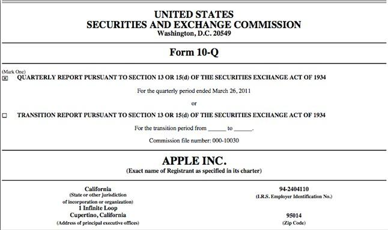

## Table of Contents

## What is an SEC filing?

An SEC filing is a document that companies have to send to the Securities and Exchange Commission (SEC). The SEC is a government group that makes sure companies follow the rules when they sell stocks or bonds to the public. Companies send these filings to the SEC to share important information about their business, like how much money they are making or losing, who is running the company, and any big changes happening.

These filings are important because they help investors make smart choices about buying or selling stocks. By reading the filings, investors can learn about a company's financial health and future plans. Some common types of SEC filings include the annual report (called Form 10-K), the quarterly report (called Form 10-Q), and the report of major events (called Form 8-K). All these filings are available to the public, so anyone can look at them to learn more about a company.

## Why are SEC filings important for investors?

SEC filings are important for investors because they give a lot of useful information about a company. When a company sends an SEC filing, it has to tell the truth about its money situation, who is in charge, and any big changes happening. This helps investors see if the company is doing well or if it might have problems. By looking at these filings, investors can decide if they want to buy, sell, or keep their stocks in that company.

These filings also help investors understand the risks of investing in a company. For example, if a company's SEC filing shows it is losing a lot of money, an investor might decide it's too risky to buy its stock. On the other hand, if the filing shows the company is making more money and growing, an investor might feel good about buying its stock. In short, SEC filings help investors make smarter choices with their money by giving them clear and honest information about companies.

## What are the most common SEC filing forms?

The most common SEC filing forms are Form 10-K, Form 10-Q, and Form 8-K. Form 10-K is an annual report that companies have to file every year. It gives a detailed look at the company's financial health, including how much money it made or lost, what it owns, and what it owes. It also talks about the company's business, the risks it faces, and what it plans to do in the future.

Form 10-Q is a quarterly report that companies file every three months. It's like a shorter version of the 10-K and gives updates on the company's financial situation and any big changes that happened in the last three months. Form 8-K is used to report important events that happen between the quarterly reports. These events can include things like a new CEO being hired, a merger with another company, or a big change in the company's financial situation.

These three forms are very important because they help investors keep up with what's going on with a company. By reading them, investors can make better decisions about buying or selling stocks.

## What is the purpose of Form 10-K?

Form 10-K is a very important document that companies have to file with the SEC every year. It's like a big report card that tells investors everything they need to know about a company's financial health. The 10-K includes detailed information about how much money the company made or lost during the year, what it owns, and what it owes. It also talks about the company's business, like what it does, how it makes money, and who its customers are.

The 10-K also helps investors understand the risks of investing in the company. It lists things that could go wrong, like if the company depends a lot on one customer or if it's facing a lawsuit. The report also talks about the company's plans for the future, like new products it wants to make or new markets it wants to enter. By reading the 10-K, investors can get a clear picture of the company and make smarter choices about buying or selling its stock.

## How does Form 10-Q differ from Form 10-K?

Form 10-Q and Form 10-K are both important reports that companies have to file with the SEC, but they serve different purposes. Form 10-Q is a quarterly report that companies file every three months. It gives investors an update on the company's financial health and any big changes that have happened since the last report. The 10-Q is shorter and less detailed than the 10-K, focusing mainly on the company's financial statements and any recent events that might affect its business.

Form 10-K, on the other hand, is an annual report that companies file once a year. It's much more detailed than the 10-Q and includes a lot more information about the company. The 10-K talks about the company's business, its financial performance for the whole year, what it owns and owes, the risks it faces, and its plans for the future. While the 10-Q is important for keeping investors updated every few months, the 10-K gives a complete picture of the company's health and direction, helping investors make long-term decisions about their investments.

## What information is required in a Form 8-K?

Form 8-K is a special report that companies have to file with the SEC when something important happens. It's used to tell investors about big changes or events that happen between the regular quarterly reports. This can include things like a new CEO being hired, a merger with another company, or a big change in the company's financial situation. The idea is to keep investors informed about anything that could affect their decision to buy or sell the company's stock.

The information in a Form 8-K can be different depending on what's happening, but it always includes the date of the event and a clear description of what changed. For example, if a new CEO is hired, the 8-K would say when they start and give some details about their background. If the company is merging with another company, the 8-K would explain the terms of the merger and how it will affect the business. By reading the 8-K, investors can stay up-to-date on important events and make better choices about their investments.

## What is the significance of Form S-1 in the context of IPOs?

Form S-1 is a very important document that companies have to file with the SEC when they want to go public and sell their stock to the public for the first time. This is called an Initial Public Offering, or IPO. The Form S-1 tells investors everything they need to know about the company before they decide to buy its stock. It includes details about the company's business, how it makes money, who its leaders are, and how much money it wants to raise from the IPO.

The Form S-1 is important because it helps investors make smart choices. By reading the Form S-1, investors can learn about the company's financial health, the risks of investing in it, and what the company plans to do with the money it raises. This information is crucial for investors to decide if they want to buy the company's stock during the IPO. The SEC reviews the Form S-1 to make sure it has all the right information and that the company is following the rules.

## How do Schedule 13D and Schedule 13G filings differ?

Schedule 13D and Schedule 13G are both forms that investors file with the SEC when they own a big part of a company's stock. Schedule 13D is used when someone owns more than 5% of a company's stock and wants to change how the company is run. This could mean they want to change the company's leaders or the way it does business. The person has to file the 13D within 10 days of owning more than 5% and tell the SEC about their plans for the company.

Schedule 13G, on the other hand, is for investors who own more than 5% of a company's stock but don't want to change how the company is run. This form is simpler and easier to fill out than the 13D. It's for people who are just investing in the company and not trying to take control of it. The 13G has to be filed within 45 days after the end of the year if the investor's ownership goes over 5%, or within 10 days if it goes over 10%.

## What are the key components of a Form 4 filing?

Form 4 is a document that company insiders, like executives and big shareholders, have to file with the SEC when they buy or sell the company's stock. It's important because it helps investors see what the people who know the company best are doing with their own money. When someone files a Form 4, they have to do it within two business days of the trade. This makes sure that the information is shared quickly and everyone knows what's happening.

The key parts of a Form 4 include the name of the person who made the trade, the date of the trade, how many shares were bought or sold, and the price per share. It also says if the person still owns any shares after the trade and how many. By looking at a Form 4, investors can see if insiders are buying or selling a lot of stock, which can give them clues about how the company is doing and what might happen to the stock price in the future.

## How does Form 144 relate to the sale of restricted or control securities?

Form 144 is a document that people have to file with the SEC when they want to sell restricted or control securities. Restricted securities are stocks that someone got through a private sale and can't sell right away. Control securities are stocks owned by people who have a lot of control over the company, like big shareholders or company leaders. The form helps the SEC keep track of these sales and make sure they follow the rules.

When someone wants to sell these kinds of securities, they have to file Form 144 if they are selling more than a certain amount of stock in a short time. The form tells the SEC how many shares the person wants to sell, the price they plan to sell them at, and when they plan to sell them. This helps make sure that the sale is done in a fair way and doesn't hurt other investors.

## What are the implications of late or inaccurate SEC filings?

If a company files its SEC reports late or with wrong information, it can get into big trouble. The SEC can fine the company a lot of money, and the company's leaders might even face legal action. This is because the SEC wants to make sure that companies tell the truth and share information on time, so investors can make good choices. If a company doesn't follow these rules, it can lose the trust of investors, which can make its stock price go down and make it hard to get money in the future.

Late or wrong SEC filings can also hurt the company's reputation. When investors see that a company isn't being honest or is late with its reports, they might think the company has something to hide. This can make investors sell their stocks and look for other companies to invest in. In the end, late or inaccurate filings can make it harder for a company to grow and succeed because it loses the trust and support of the people who invest in it.

## How can advanced data analytics be used to gain insights from SEC filings?

Advanced data analytics can help people learn a lot from SEC filings by looking at big amounts of information quickly and finding patterns that might be hard to see otherwise. For example, by using special computer programs, analysts can go through many years of a company's 10-K and 10-Q reports to see how its money situation has changed over time. They can also compare the company's numbers with other companies in the same business to see if it's doing better or worse. This can help investors understand if a company is a good investment or if it might have problems in the future.

Another way data analytics can help is by looking at things like insider trading from Form 4 filings. By studying when and how much company leaders are buying or selling their own stock, analysts can get clues about what these insiders think about the company's future. If a lot of insiders are selling their stock, it might mean they think the stock price will go down. On the other hand, if they are buying a lot, it could mean they think the stock will go up. By using data analytics to look at all this information, investors can make smarter choices about buying or selling stocks.

## References & Further Reading

[1]: U.S. Securities and Exchange Commission. ["EDGAR—Search and Access."](https://www.sec.gov/search-filings) 

[2]: Steven M. Bragg. ["Running an Effective Investor Relations Department."](https://onlinelibrary.wiley.com/doi/book/10.1002/9781118268209) Wiley & Sons.

[3]: Benjamin Graham & David Dodd. ["Security Analysis: Sixth Edition, Foreword by Warren Buffett."](https://www.amazon.com/Security-Analysis-Foreword-Buffett-Editions/dp/0071592539) McGraw-Hill Education.

[4]: SEC Office of Investor Education and Advocacy. ["How to Read a 10-K/10-Q."](https://www.sec.gov/about/divisions-offices/office-investor-education-advocacy)

[5]: Richard A. Brealey, Stewart C. Myers, and Franklin Allen. ["Principles of Corporate Finance."](https://www.mheducation.com/highered/product/Principles-of-Corporate-Finance-Brealey.html) McGraw-Hill Education.