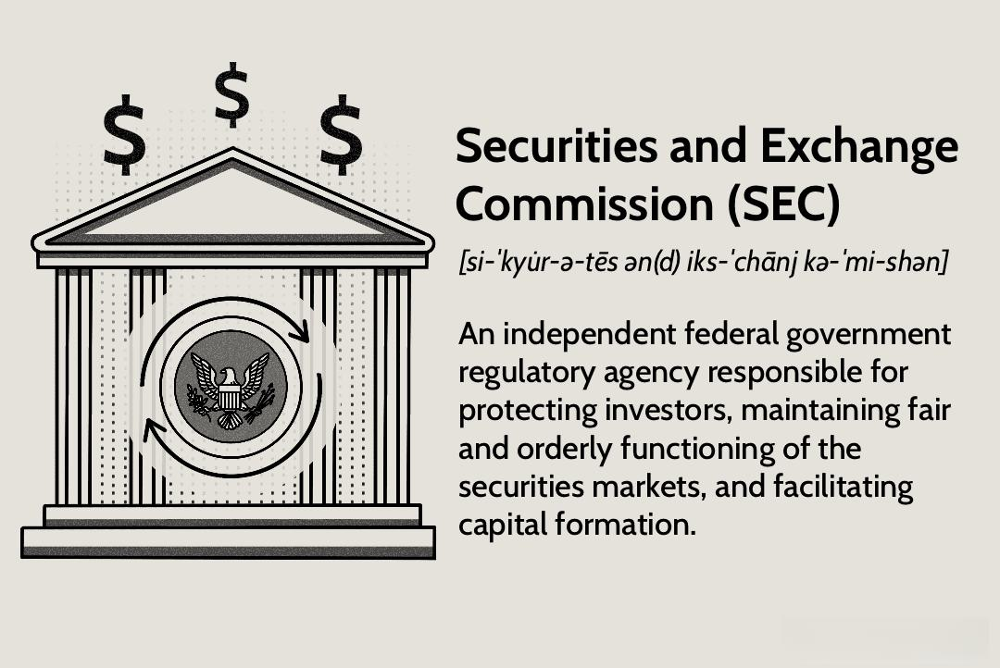

Financial regulation plays a crucial role in ensuring the integrity of markets by establishing rules and standards that protect investors, maintain fair and efficient markets, and facilitate capital formation. The Securities and Exchange Commission (SEC) stands as a pivotal entity in the United States, charged with the oversight of securities markets. Established to enforce securities laws which promote full public disclosure, protect investors against fraudulent and manipulative practices, and regulate and monitor corporate takeovers, the SEC is integral to maintaining market order. Its responsibilities include the enforcement of federal securities laws, the regulation of securities exchanges, and the oversight of securities firms, investment advisors, and mutual funds, thereby building confidence among investors.

The emergence and growth of algorithmic trading have reshaped the landscape of financial markets. Algorithmic trading, which involves the use of computer algorithms to execute trades at speeds and frequencies unattainable by human traders, has seen rapid adoption due to its potential to improve efficiency, increase trading speed, and provide liquidity. This form of trading uses complex mathematical models and the application of data analytics to decide on the precise timing, pricing, and quantity of orders.

However, the innovative mechanisms associated with algorithmic trading necessitate stringent regulatory oversight. The complexity and high-speed nature of algorithmic trading present significant risks, including market volatility and systemic disruptions. These challenges underscored the essential need for regulatory frameworks to ensure that such technologies do not compromise the integrity of the securities market. Regulators like the SEC work to devise strategies and implement regulations that can effectively mitigate these risks, balancing innovation with the protection of market participants and the broader financial system.

Thus, financial regulation, led by organizations like the SEC, is essential in safeguarding market integrity in the face of evolving trading strategies and technologies. Continued vigilance and adaptive oversight are fundamental to ensuring the securities market remains robust and resilient, capable of withstanding the challenges posed by modern trading innovations.

## Table of Contents

## History of the SEC

The history of the United States Securities and Exchange Commission (SEC) is intricately linked to the financial upheaval brought about by the Great Depression. In the aftermath of the 1929 stock market crash, confidence in the financial markets plummeted as reports of fraudulent activities and lack of transparency emerged. In response, the U.S. government recognized the urgent need for a regulatory body to restore trust and enforce ethical practices in securities trading.

The SEC was established by the Securities Exchange Act of 1934, a legislative milestone aimed at addressing the financial instability that had profoundly affected both the economy and the public. This act followed the Securities Act of 1933, which was designed as the first federal effort to regulate the offer and sale of securities and to ensure transparency and fairness in financial markets. Together, these acts laid the groundwork for a regulatory environment whereby financial disclosure and investor protection were paramount.

The core principles upon which the SEC was founded include transparency, investor protection, and market integrity. Transparency was deemed essential to allow investors to make informed decisions based on accurate and full disclosure of an entity's financial information. To protect investors, the SEC enforced rules against fraud and insider trading, ensuring that market participants operated on a level playing field. Market integrity was maintained through stringent oversight and regulation, aiming to prevent manipulation and foster confidence in the fairness and efficacy of investment markets.

Key legislative acts have been instrumental in providing the SEC with its authority and mandate. The Securities Act of 1933, often referred to as the "truth in securities" law, mandated that all securities offered or sold to the public must be registered and provide fundamental financial information. Following this foundational act, the Securities Exchange Act of 1934 established the SEC itself, granting it the authority to enforce securities laws, regulate the stock exchange, and ensure the proper conduct of brokerage firms and self-regulatory organizations.

Over time, additional significant legislation has bolstered the SEC's capabilities. The Investment Company Act of 1940 and the Investment Advisers Act of 1940 expanded the SEC's jurisdiction to include oversight of investment companies and advisers, enhancing its role in safeguarding the interests of investors via comprehensive regulatory oversight. These legislative frameworks collectively empower the SEC to monitor and maintain the integrity of the evolving securities landscape.

In summary, the SEC's formation during the tumult of the Great Depression marked a pivotal development in U.S. financial history, embodying a commitment to transparent, fair, and effective market practices. This commitment continues to guide the SEC in its mission to foster investor confidence and uphold the integrity of the securities industry. 

## The Role of the SEC in Modern Financial Markets

The U.S. Securities and Exchange Commission (SEC) plays an essential role in modern financial markets, particularly through its well-structured organizational framework. The current structure of the SEC comprises five main divisions: Corporation Finance, Trading and Markets, Investment Management, Enforcement, and Economic and Risk Analysis. Each division serves a specific function that collectively enhances the SEC's capability to oversee securities markets effectively.

The Division of Corporation Finance is tasked with ensuring that investors receive material information needed to make informed investment decisions, primarily through reviewing corporate filings. The Division of Trading and Markets is responsible for maintaining fair, orderly, and efficient markets, which involves overseeing securities exchanges, brokers, and other key market participants. The Division of Investment Management regulates investment companies, variable insurance products, and federally registered investment advisors to protect investors and maintain healthy investment markets. The Division of Enforcement is crucial to the SEC's mission, as it investigates potential violations of securities laws and regulations, imposing penalties where necessary. Finally, the Division of Economic and Risk Analysis provides financial and economic analysis to support the agency's rulemaking, enforcement, and examination functions.

The SEC collaborates with various bodies to strengthen its oversight capabilities. Notably, it works with the Financial Industry Regulatory Authority (FINRA), the Commodity Futures Trading Commission (CFTC), and international regulatory agencies. This collaboration is vital, given the interconnected nature of global financial markets and the complexities of securities trading. Through memoranda of understanding and other cooperative agreements, these regulatory bodies coordinate cross-border activities, ensuring that regulatory requirements are harmonized and the markets are safeguarded against systemic risks.

Enforcing securities laws is a significant component of the SEC's mission. The agency adopts a proactive approach by continuously monitoring market activities and promptly addressing misconduct. The SEC has authority to impose civil penalties and return illegally gained profits through disgorgement. In cases of severe violations, the SEC can suspend or bar wrongdoers from certain activities related to securities trading. Furthermore, the SEC often works with the Department of Justice to pursue criminal charges when fraud or other egregious activities are uncovered.

The SEC's multifaceted role is critical in maintaining market integrity and protecting investors. By leveraging its divisions, collaborating with other regulatory bodies, and employing a stringent enforcement strategy, the SEC remains a cornerstone of stability in today's fast-evolving financial markets.

 to Algorithmic Trading

Algorithmic trading is a method of executing orders in financial markets using automated and pre-programmed trading instructions accounting for variables such as time, price, and [volume](/wiki/volume-trading-strategy). This approach relies heavily on computer-driven decision-making, where algorithms, or sets of rules defined by mathematical models, facilitate the quick and accurate execution of trades. Algorithms are designed to analyze market data continuously, identify trading opportunities, and execute trades at speeds impossible for human traders to achieve.

The popularity of [algorithmic trading](/wiki/algorithmic-trading) has surged over the years due to its ability to enhance trading efficiency and precision. Algorithms can process vast amounts of market data swiftly, execute trades at optimal prices, and mitigate the impact of human emotions, thereby reducing errors influenced by psychology. The precision offered by algorithmic trading is particularly advantageous for large volume trades where slight price differences can significantly impact profit margins. Moreover, algorithms can operate across multiple markets and instruments simultaneously, optimizing portfolio performance in complex financial environments.

Several technological advancements have contributed significantly to the growth of algorithmic trading. The expansion of high-frequency trading ([HFT](/wiki/high-frequency-trading-strategies)) techniques, which involve executing a large number of orders at very high speeds, is one such development. HFT has been made feasible by the advancement of supercomputing and low-latency communication networks, enabling trades to occur in microseconds.

Additionally, advancements in [machine learning](/wiki/machine-learning) and [artificial intelligence](/wiki/ai-artificial-intelligence) have further propelled algorithmic trading. These technologies allow algorithms to learn from historical data, adapt to changing market conditions, and predict future price trends with increased accuracy. For instance, [reinforcement learning](/wiki/reinforcement-learning), a subset of machine learning, can be employed to optimize trading algorithms over time based on the outcomes of past trades.

Another vital technological enabler is the rise of big data analytics. Financial markets generate a constant flow of information, from trading data to economic indicators. Algorithms can sift through this big data, extracting actionable insights and informing trading strategies. This is often achieved using sophisticated data analysis tools and programming languages, such as Python, which is commonly used for developing trading algorithms due to its extensive libraries and user-friendly nature.

In summary, the advancements in computing power, along with innovations in artificial intelligence and data analytics, have firmly established algorithmic trading as a cornerstone of modern financial markets, delivering enhanced efficiency, precision, and speed.

## SEC's Regulation of Algorithmic Trading

Algorithmic trading, while offering significant advantages in terms of speed and efficiency, poses several risks and challenges that require regulatory oversight. One major concern is market stability. Algorithmic trading systems can execute large volumes of trades in milliseconds, which, under certain conditions, may lead to significant market disruptions. Events like the "Flash Crash" of May 6, 2010, where algorithmic activities contributed to a dramatic plunge in U.S. equity markets, underscore such risks.

The SEC has implemented various regulatory strategies to address these challenges. One primary mechanism is the Regulation National Market System (Reg NMS), which aims to improve the fairness and efficiency of the national market system by promoting competition and ensuring that investors receive the best possible price. Reg NMS includes rules that prevent trade-throughs, which occur when a trade is executed at a price worse than the best available price.

Furthermore, the SEC has introduced the Consolidated Audit Trail (CAT), a comprehensive database that allows regulators to track all order and trade information across various markets. This enhances the SEC's ability to detect and investigate unusual market activity potentially related to algorithmic trades.

To mitigate risks associated with high-frequency trading (HFT), a subset of algorithmic trading characterized by high levels of automation and speed, the SEC has proposed that firms engage in "pre-trade risk checks" to verify that automatic trades comply with regulatory requirements before execution. These measures aim to curtail extreme trading practices that might threaten market equilibrium.

Recent enforcement actions by the SEC reflect its commitment to regulating algorithmic trading practices. For instance, cases have been brought against firms that employed manipulative algorithms to influence market prices artificially. The SEC's actions highlight its stance against deceptive trading activities and its broader effort to ensure that algorithmic trading contributes positively to market integrity and does not exploit or exacerbate market vulnerabilities.

The SEC also collaborates with other regulatory bodies to streamline its oversight strategies. Coordination with the Commodity Futures Trading Commission (CFTC) and international regulators ensures a cohesive approach to managing the global and interconnected nature of algorithmic trading markets.

In sum, through the implementation of comprehensive rules and active collaboration with other institutions, the SEC strives to balance the innovative aspects of algorithmic trading with necessary safeguards to preserve the stability and integrity of financial markets.

## Impact of Algorithmic Trading Regulations

Algorithmic trading regulations enforced by the U.S. Securities and Exchange Commission (SEC) affect a diverse array of market participants, including retail and institutional investors. These regulations play a critical role in maintaining market fairness and transparency. By imposing specific rules and guidelines, the SEC ensures that algorithmic systems operate within a framework that prioritizes the equitable treatment of all market entities and prevents manipulative trading practices.

One significant impact of SEC regulations on market participants is the leveling of the playing field. The complexity and speed associated with algorithmic trading often create advantages for those with advanced computing resources and access to high-frequency trading technology. SEC regulations mitigate these disparities by enforcing rules that require transparency in trading activities and by curbing practices that could lead to unfair market advantages. For instance, the SEC requires regular reporting and disclosure from trading firms to ensure that market behaviors remain transparent. This transparency is crucial for retail investors, who may not have access to sophisticated trading tools.

For institutional investors, SEC regulations foster a stable and predictable trading environment. Institutions rely on the integrity and efficiency of the market for decision-making and strategic planning. Regulatory measures such as the implementation of circuit breakers and limits on trading velocities help minimize market disruptions that can occur from algorithm-induced [volatility](/wiki/volatility-trading-strategies). This contributes to maintaining market stability and protecting investor interests.

From the perspective of traders using algorithmic systems, these regulations present both benefits and drawbacks. On the positive side, regulations standardize operational procedures and enhance the reputation of algorithmic trading by ensuring that all players adhere to ethical and legal standards. This, in turn, can increase market participation and trust. However, there are also significant challenges. Compliance with regulations often requires substantial investment in infrastructure and ongoing monitoring systems, adding operational costs for trading firms. Furthermore, stringent rules can potentially limit the flexibility and innovation capacity of algorithmic traders.

Overall, SEC regulations on algorithmic trading impact the market by fostering fairness and transparency, which helps protect investors from manipulative practices. These measures support a stable and predictable trading environment while balancing the need for regulatory oversight with the innovation and efficiency offered by algorithmic systems. However, the adaptation costs and operational constraints imposed on traders highlight the ongoing need to continually assess and adjust regulatory frameworks to optimize both market integrity and trading system efficiency.

## Future of Financial Regulation and Algorithmic Trading

The financial landscape continues to evolve as algorithmic trading technologies advance, presenting ongoing challenges and opportunities for financial regulators, including the U.S. Securities and Exchange Commission (SEC). As algorithmic trading systems become more sophisticated, the SEC faces the imperative of adapting its regulatory frameworks to ensure these technologies contribute positively to market integrity and stability.

One of the key developments is the increasing use of artificial intelligence and machine learning models in algorithmic trading. These models can analyze massive datasets at unprecedented speeds, enabling more accurate prediction of market movements. However, their complexity also raises challenges for regulators tasked with ensuring such systems do not compromise fairness or contribute to market manipulation. The opacity of certain algorithmic models, often referred to as "black boxes," makes it difficult for regulators to understand how trading decisions are made, thus posing significant oversight challenges. Adaptive regulatory practices are essential to address these challenges without stifling innovation. 

The SEC could explore the development of guidelines that mandate transparency in algorithmic models, requiring traders to demonstrate the decision-making logic and risk control measures embedded in their systems. By fostering an environment of transparency, the SEC can better assess potential systemic risks posed by algorithmic trading. Additionally, enhancing the SEC’s own technological capabilities to monitor and analyze trading patterns in real-time is crucial. This could involve investing in advanced surveillance tools and data analytics technologies to detect and respond to irregularities more swiftly and efficiently.

Looking forward, potential future regulations might focus on the implementation of stress-testing protocols tailored for algorithmic systems, akin to those used in traditional financial institutions. Such protocols could assess how algorithms perform under various market scenarios, ensuring they can withstand and adapt to volatile conditions without precipitating systemic risks.

Moreover, as algorithmic trading spreads to global markets, international collaboration among regulatory bodies may become increasingly important. By engaging with global counterparts, the SEC can work towards harmonized regulatory standards, reducing the risk of regulatory [arbitrage](/wiki/arbitrage) where traders exploit differences between jurisdictions.

In conclusion, as algorithmic technologies advance, they introduce both opportunities for enhanced market efficiency and risks that require vigilant regulatory oversight. By keeping pace with these innovations through adaptive regulatory practices, the SEC can uphold its mandate to protect investors and maintain orderly markets.

## Conclusion

The Securities and Exchange Commission (SEC) stands as a pivotal entity in regulating the ever-evolving financial markets, particularly amidst the burgeoning landscape of technology-driven trading mechanisms like algorithmic trading. This regulatory body’s vigilance ensures that market operations are not only efficient but also transparent and fair to all participants. As financial markets become increasingly complex due to technological advancements, the SEC's adaptability in enforcing regulations becomes vital in safeguarding market integrity.

The dynamic nature of financial markets necessitates ongoing vigilance from the SEC to identify and mitigate emerging risks that could compromise market stability. For instance, algorithmic trading, with its potential to amplify systemic risks through speed and volume, requires robust oversight to prevent market distortions. The SEC’s role in continuously updating its regulatory frameworks in response to technological innovations ensures that regulatory gaps are addressed promptly, maintaining the public’s confidence in the financial system.

Moreover, fostering continuous dialogue between regulators, industry participants, and technology innovators is crucial. Such collaboration can lead to more effective regulatory strategies that encourage innovation while protecting investor interests. By engaging with technology developers and financial institutions, the SEC can better understand the tools and methods being deployed in modern trading, allowing for more nuanced and effective oversight.

In summary, the SEC's role in the context of a technology-driven trading environment is indispensable. Its continuous adaptation to new trading practices and engagement with market stakeholders uphold the integrity and resilience of financial markets. As technology progresses, the SEC's proactive and collaborative approach will play a critical role in ensuring that market advancement harmonizes with principles of fairness and transparency.

## References & Further Reading

[1]: Stiglitz, J. E. (1989). "Using Tax Policy to Curb Speculative Short-Term Trading." Journal of Financial Services Research, 3(2-3), 101-115. [Link to paper](https://link.springer.com/article/10.1007/BF00122795)

[2]: "Flash Boys: A Wall Street Revolt" by Michael Lewis

[3]: Haldane, A. G., & Madouros, V. (2012). "The Dog and the Frisbee." Speech given at the Federal Reserve Bank of Kansas City’s 36th Economic Policy Symposium. [Link to speech](https://www.bis.org/review/r120905a.pdf)

[4]: MacKenzie, D. (2014). "Be Grateful for Drizzle." London Review of Books, 36(6), 17-20. [Link to article](https://www.lrb.co.uk/the-paper/v36/n17/donald-mackenzie/be-grateful-for-drizzle)

[5]: Hasbrouck, J., & Saar, G. (2013). "Low-latency Trading." Journal of Financial Markets, 16(4), 646-679. [Link to paper](https://papers.ssrn.com/sol3/papers.cfm?abstract_id=1695460)