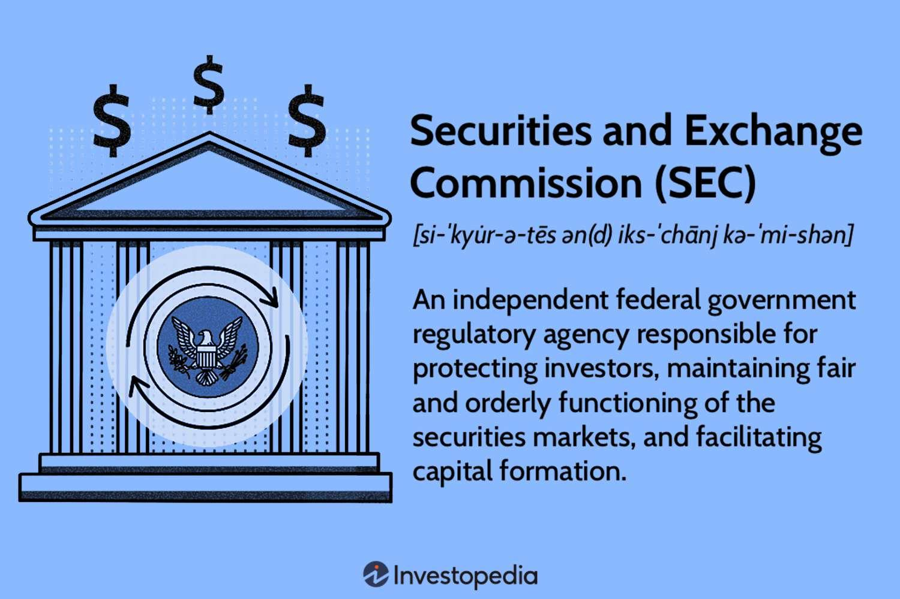

## Table of Contents

## What is the Securities and Exchange Commission (SEC)?

The Securities and Exchange Commission (SEC) is a government agency in the United States. It was created to protect people who invest in stocks and other securities. The SEC makes sure that companies tell the truth about their businesses and how they are doing financially. This helps investors make smart choices with their money.

The SEC also keeps an eye on the stock market to make sure it is fair and honest. It stops people from doing bad things like insider trading, where someone uses secret information to make money. If someone breaks the rules, the SEC can take them to court and punish them. This helps keep the market safe for everyone who wants to invest.

## When was the SEC established and why?

The Securities and Exchange Commission (SEC) was established in 1934. This happened during the Great Depression, a time when many people lost their money because of problems in the stock market. The government wanted to make sure this wouldn't happen again, so they created the SEC to watch over the stock market and protect investors.

The main reason for setting up the SEC was to make the stock market more honest and safe. Before the SEC, some people were cheating and using secret information to make money, which hurt other investors. The SEC was made to stop this kind of cheating and to make sure companies told the truth about their businesses. This way, people could trust the market and feel safer when they invested their money.

## What are the main functions of the SEC?

The Securities and Exchange Commission (SEC) has several important jobs. One big job is to make sure companies tell the truth about their business and money. Companies have to share honest information with investors so they can make good choices. The SEC checks this information to make sure it is correct and complete. This helps keep the market fair and honest.

Another main function of the SEC is to watch over the stock market and stop bad behavior. The SEC looks out for things like insider trading, where someone uses secret information to make money. If they find someone breaking the rules, the SEC can take them to court and punish them. This helps keep the market safe for everyone who wants to invest their money.

Overall, the SEC works to protect investors and keep the stock market running smoothly. By making sure companies are honest and stopping bad behavior, the SEC helps people feel more confident about investing their money.

## Who oversees the operations of the SEC?

The operations of the Securities and Exchange Commission (SEC) are overseen by the U.S. government. The SEC is an independent federal agency, which means it is not part of any other government department. However, it is still accountable to the government and the public. The President of the United States appoints the five commissioners who run the SEC, and the U.S. Senate has to approve these appointments. This makes sure that the people in charge of the SEC are chosen carefully.

The SEC's commissioners serve staggered five-year terms, which means they don't all start and end at the same time. This helps keep the SEC stable and consistent. Only three of the five commissioners can be from the same political party, which helps make sure different views are represented. The commissioners work together to set the rules and policies for the SEC. They also make sure the SEC is doing its job to protect investors and keep the stock market fair and honest.

## How does the SEC protect investors?

The SEC protects investors by making sure companies tell the truth about their business and money. Companies have to share honest information with investors, like how much money they are making and any big problems they have. The SEC checks this information to make sure it is correct and complete. This way, investors can make smart choices with their money and trust that the information they get is true.

The SEC also watches over the stock market to stop bad behavior. They look out for things like insider trading, where someone uses secret information to make money unfairly. If the SEC finds someone breaking the rules, they can take them to court and punish them. This helps keep the market fair and safe for everyone who wants to invest. By stopping cheating and making sure companies are honest, the SEC helps people feel more confident about putting their money into the stock market.

## What types of securities does the SEC regulate?

The SEC regulates different types of securities that people can invest in. These include stocks, which are shares in a company that people can buy and sell. Bonds are another type of security the SEC oversees; these are like loans that investors give to companies or the government, and they get paid back with interest. The SEC also keeps an eye on mutual funds, which are big pools of money from many investors that are used to buy different securities.

In addition to these, the SEC regulates exchange-traded funds (ETFs), which are similar to mutual funds but can be traded like stocks during the day. The SEC also watches over options, which are contracts that give investors the right to buy or sell securities at a certain price in the future. By making sure all these different types of securities follow the rules, the SEC helps keep the market fair and safe for everyone who wants to invest.

## How does the SEC enforce securities laws?

The SEC enforces securities laws by keeping a close watch on the stock market and the companies that are part of it. If the SEC finds out that a company or a person is not following the rules, they can start an investigation. They look at documents, talk to people, and gather evidence to see if the rules were broken. If they find enough proof, the SEC can take the case to court. They can ask the court to make the person or company stop what they are doing and pay money back to the people who were hurt.

The SEC also has the power to punish people who break the rules. They can fine them, which means the person has to pay money as a punishment. Sometimes, the SEC can also stop someone from working in the stock market again. This is called a ban or a bar. By doing these things, the SEC makes sure that people follow the rules and that the stock market stays fair and safe for everyone who wants to invest their money.

## What is the role of the SEC in maintaining fair and efficient markets?

The SEC plays a big role in making sure the stock market is fair and works well. They do this by making rules that everyone has to follow. These rules stop people from cheating and using secret information to make money. The SEC also makes sure that companies tell the truth about their business and money. This way, everyone has the same information and can make good choices about where to invest their money.

The SEC also watches the stock market all the time to make sure it is running smoothly. If they see something wrong, they can step in and fix it. They can take people to court and punish them if they break the rules. By doing all these things, the SEC helps keep the market fair for everyone. This makes people feel more confident about investing their money, which helps the whole economy.

## How does the SEC interact with other financial regulatory bodies?

The SEC works with other financial regulatory bodies to make sure the whole financial system is safe and fair. One important group they work with is the Financial Industry Regulatory Authority (FINRA). FINRA helps the SEC by watching over the people and companies that sell stocks and other securities. They make sure these people follow the rules and treat investors fairly. The SEC and FINRA share information and work together to stop bad behavior in the market.

The SEC also works with other government agencies like the Commodity Futures Trading Commission (CFTC). The CFTC looks after the markets for things like oil and wheat, which are different from the stocks and bonds the SEC watches. But sometimes, these markets can affect each other, so the SEC and CFTC talk to each other and share information to keep everything running smoothly. By working together, these agencies help make the whole financial system more honest and safe for everyone.

## What are some major cases or actions taken by the SEC in recent years?

In recent years, the SEC has taken big steps to protect investors and keep the market fair. One major case was against Theranos, a company that claimed to have new technology for blood tests. The SEC found out that Theranos was not telling the truth about their technology and how well it worked. They charged the company's founder, Elizabeth Holmes, and the president, Ramesh "Sunny" Balwani, with fraud. Both of them had to pay big fines and were not allowed to be officers or directors of any public company for many years.

Another important action was against Elon Musk and Tesla. In 2018, Musk tweeted that he was thinking about taking Tesla private and had "funding secured." The SEC thought this tweet was not true and could trick investors. They took Musk and Tesla to court. In the end, Musk and Tesla had to pay fines, and Musk had to step down as chairman of Tesla. He also had to have his tweets about Tesla checked by a lawyer before posting them. These cases show how the SEC works hard to make sure companies and their leaders follow the rules and tell the truth.

## How does the SEC adapt to new financial technologies and markets?

The SEC keeps up with new financial technologies and markets by always learning and making new rules. They watch the market to see what new things are happening, like cryptocurrencies and online trading platforms. When they see something new, they study it to understand how it works and what risks it might have. Then, they make rules to make sure these new technologies are safe for investors. For example, the SEC has made rules about how companies that use blockchain technology have to tell investors about their business.

The SEC also works with other groups to stay on top of new technologies. They talk to experts and other government agencies to learn more about things like [artificial intelligence](/wiki/ai-artificial-intelligence) and how it might affect the market. By working together, they can make better rules that keep up with the fast changes in the financial world. This helps make sure that even as new technologies come along, the market stays fair and safe for everyone who wants to invest.

## What are the current challenges and future directions for the SEC?

The SEC faces many challenges today. One big challenge is keeping up with new technology like cryptocurrencies and online trading. These new things can be hard to understand and control. The SEC has to make sure these new technologies are safe for people to use and invest in. Another challenge is making sure the market stays fair when there are so many different kinds of investments and ways to trade. The SEC has to watch over all of this and stop people from cheating or using secret information to make money.

In the future, the SEC will need to keep learning and changing. They will need to make new rules to fit with new technologies and markets. This means working with experts and other groups to understand these new things and how they might affect investors. The SEC will also need to use new tools like artificial intelligence to help them watch the market better. By doing these things, the SEC can keep the market fair and safe for everyone, even as the world of investing keeps changing.

## References & Further Reading

[1]: Stiglitz, J. E. (1989). "Using Tax Policy to Curb Speculative Short-Term Trading." Journal of Financial Services Research, 3(2-3), 101-115. [Link to paper](https://link.springer.com/article/10.1007/BF00122795)

[2]: "Flash Boys: A Wall Street Revolt" by Michael Lewis

[3]: Haldane, A. G., & Madouros, V. (2012). "The Dog and the Frisbee." Speech given at the Federal Reserve Bank of Kansas City’s 36th Economic Policy Symposium. [Link to speech](https://www.bis.org/review/r120905a.pdf)

[4]: MacKenzie, D. (2014). "Be Grateful for Drizzle." London Review of Books, 36(6), 17-20. [Link to article](https://www.lrb.co.uk/the-paper/v36/n17/donald-mackenzie/be-grateful-for-drizzle)

[5]: Hasbrouck, J., & Saar, G. (2013). "Low-latency Trading." Journal of Financial Markets, 16(4), 646-679. [Link to paper](https://papers.ssrn.com/sol3/papers.cfm?abstract_id=1695460)