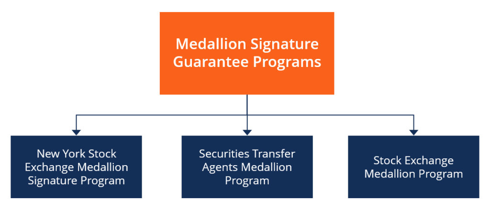

## Table of Contents

## What is the Securities Transfer Agents Medallion Program (STAMP)?

The Securities Transfer Agents Medallion Program (STAMP) is a program that helps make sure that people who own stocks and bonds can safely transfer them to someone else. It's like a special stamp that shows the transfer is okay and not fake. Banks and other financial places can give out these stamps, but they have to be part of the STAMP program.

When someone wants to transfer their stocks or bonds, they need to go to a place that has the STAMP. The person at the bank or financial place will check to make sure everything is right and then put the special stamp on the transfer papers. This stamp tells everyone that the transfer is real and safe. It helps stop people from stealing or faking stock and bond transfers.

## Why was the STAMP created?

The STAMP was created to make sure that when people transfer their stocks and bonds, it's done safely and correctly. Before STAMP, it was easier for someone to pretend to be the owner of stocks or bonds and transfer them to themselves. This was a big problem because it meant people could lose their money if someone stole their stocks or bonds. The STAMP program helps stop this by making sure only the real owner can transfer their stocks or bonds.

The program works by having special stamps that only certain banks and financial places can use. These places check everything carefully before they put the stamp on the transfer papers. The stamp shows that the transfer is real and not fake. This makes everyone feel safer when they are buying or selling stocks and bonds because they know the transfer is protected by the STAMP program.

## Who can participate in the STAMP?

The STAMP program is for banks and other financial places that want to help people transfer their stocks and bonds safely. To be part of STAMP, these places need to sign up and follow the rules set by the program. They have to be careful and check everything before they put the special stamp on the transfer papers.

Once a bank or financial place joins STAMP, they can help their customers transfer stocks and bonds. The customers go to these places when they want to move their stocks or bonds to someone else. The bank or financial place will make sure everything is right and then use the STAMP to show the transfer is safe and real.

## What types of securities transactions require a Medallion Guarantee?

A Medallion Guarantee is needed for certain types of securities transactions where someone is transferring ownership of stocks, bonds, or other securities. This includes when someone wants to sell or give their stocks or bonds to someone else. It's also needed when someone is moving their securities from one account to another, like when they change brokers or investment companies.

The guarantee is important because it makes sure the person transferring the securities is really who they say they are. It helps stop fraud and keeps the transfer safe. Banks and financial places that are part of the STAMP program can give out these guarantees, but they have to check everything carefully first.

## How does the Medallion Guarantee protect investors?

The Medallion Guarantee helps keep investors safe by making sure that when they transfer their stocks or bonds, it's done the right way. It stops people from pretending to be someone else and stealing stocks or bonds. When an investor wants to move their securities, they go to a bank or financial place that is part of the STAMP program. The people there check everything carefully to make sure the investor is really who they say they are and that the transfer is okay. Then, they put a special stamp on the transfer papers to show it's safe and real.

This special stamp, or Medallion Guarantee, tells everyone that the transfer has been checked and is not fake. It makes investors feel more secure because they know their stocks and bonds are protected. If someone tries to do something wrong, like steal or fake a transfer, the Medallion Guarantee helps stop it. This way, investors can trust that their money and investments are safe when they are buying, selling, or moving their securities.

## What are the different levels of Medallion Guarantee coverage?

The Medallion Guarantee has different levels of coverage to match the value of the securities being transferred. There are three levels: the first level covers transfers up to $100,000, the second level covers transfers up to $500,000, and the third level covers transfers up to $10 million. Each level has a different stamp that shows how much coverage it provides.

When someone wants to transfer their stocks or bonds, they need to go to a bank or financial place that is part of the STAMP program. The bank will check the value of the securities and give them the right level of Medallion Guarantee. This makes sure the transfer is safe and matches the value of what is being moved.

## How does one obtain a Medallion Guarantee?

To get a Medallion Guarantee, you need to go to a bank or financial place that is part of the STAMP program. These places have special stamps that they can use to show that your transfer of stocks or bonds is safe and real. You'll need to bring the transfer papers and any other documents the bank asks for. The bank will check everything carefully to make sure you are who you say you are and that the transfer is okay.

Once the bank is happy with everything, they will put the Medallion Guarantee stamp on your transfer papers. The stamp they use will depend on how much your stocks or bonds are worth. There are different levels of coverage, so the bank will give you the right one for your transfer. This stamp shows everyone that your transfer is protected and not fake, making sure your stocks or bonds are safe when you move them.

## What are the requirements for financial institutions to become Medallion Guarantors?

To become a Medallion Guarantor, a financial institution needs to join the Securities Transfer Agents Medallion Program (STAMP). They have to sign up and agree to follow the rules set by the program. This means they need to be careful and check everything before they put the special stamp on transfer papers. They also need to have enough money to cover any losses if something goes wrong with a transfer they guarantee.

Once a financial institution is part of the STAMP program, they can help their customers transfer stocks and bonds safely. They will check the identity of the person transferring the securities and make sure the transfer is okay. Then, they will use the right level of Medallion Guarantee stamp based on the value of the securities. This helps keep the transfer safe and stops people from stealing or faking stock and bond transfers.

## What are the potential liabilities for a Medallion Guarantor?

A Medallion Guarantor can be responsible for any losses if something goes wrong with a transfer they guarantee. If someone fakes a transfer and the bank didn't check everything carefully, the bank might have to pay back the money that was lost. This is why banks need to have enough money to cover these possible losses. They have to be very careful when they put the special stamp on the transfer papers.

The rules of the STAMP program help make sure that banks do their job right. If a bank doesn't follow the rules and someone loses money because of it, the bank can get in trouble. They might have to pay fines or even lose their right to be a Medallion Guarantor. This is why it's important for banks to check everything carefully and make sure the person transferring the stocks or bonds is really who they say they are.

## How does the STAMP differ from other signature guarantee programs?

The STAMP program is one of three main signature guarantee programs, the others being the Stock Exchanges Medallion Program (SEMP) and the New York Stock Exchange Medallion Signature Program (MSP). STAMP is different because it is run by the Securities Transfer Association (STA), which is a group of transfer [agents](/wiki/agents). This means STAMP focuses more on the people who actually move the stocks and bonds from one owner to another. Banks and financial places that join STAMP can help their customers transfer securities safely, and they use special stamps to show the transfer is real.

The other programs, SEMP and MSP, are run by stock exchanges. SEMP is managed by the American Stock Exchange, NASDAQ, and other regional exchanges, while MSP is run by the New York Stock Exchange. These programs might be used more by people who trade stocks directly on these exchanges. Even though all three programs help make sure transfers are safe, STAMP is special because it works closely with transfer agents and has a wider network of banks and financial places that can give out the guarantees.

## What are the best practices for managing and mitigating risks associated with Medallion Guarantees?

To manage and lower the risks of giving out Medallion Guarantees, banks and financial places need to be very careful when they check the person who wants to transfer their stocks or bonds. They should always make sure the person is who they say they are by looking at their ID and other important papers. It's also a good idea to ask the person questions about their account to make sure they really know about it. Banks should keep good records of everything they check and do, so if something goes wrong, they can show they did their job right.

Another important thing is to train the people who work at the bank well. They need to know all about the rules of the STAMP program and how to spot if someone might be trying to do something wrong. Banks should also have enough money saved up to cover any losses if a transfer they guaranteed turns out to be fake. By being careful, keeping good records, training their workers, and having money ready, banks can help make sure that giving out Medallion Guarantees is as safe as possible.

## What future developments or changes are expected in the STAMP?

In the future, the STAMP program might change to use more technology. Right now, people have to go to a bank to get a Medallion Guarantee, but soon they might be able to do it online. This could make it easier and faster for people to transfer their stocks and bonds. But, the program will still need to be very careful to make sure no one can steal or fake transfers.

Another change could be about how the program works with other countries. As more people buy and sell stocks and bonds all over the world, the STAMP program might need to work with other countries' programs. This would help make sure that transfers are safe no matter where someone is. The program will always try to keep up with new ways of doing things while making sure investors are protected.

## References & Further Reading

[1]: National Securities Clearing Corporation. ["Medallion Signature Guarantee Program"](https://www.investor.gov/introduction-investing/investing-basics/glossary/medallion-signature-guarantees-preventing) - Overview of the Medallion Program and its role in secure securities transactions.

[2]: Hasbrouck, J. (2007). ["Empirical Market Microstructure: The Institutions, Economics, and Econometrics of Securities Trading"](https://academic.oup.com/book/52241) - A detailed study on the machinery of securities trading, including algorithmic trading.

[3]: Aldridge, I. (2013). ["High-Frequency Trading: A Practical Guide to Algorithmic Strategies and Trading Systems"](https://onlinelibrary.wiley.com/doi/pdf/10.1002/9781119203803.fmatter) - A comprehensive reference on high-frequency trading and strategy development.

[4]: Securities and Exchange Commission (SEC). ["Transfer Agents Guide"](https://www.sec.gov/rules-regulations/1977/06/regulation-transfer-agents) - Regulatory guidelines and roles of transfer agents in securities transactions.

[5]: Narang, R. K. (2009). ["Inside the Black Box: The Simple Truth About Quantitative Trading"](https://onlinelibrary.wiley.com/doi/book/10.1002/9781118267738) - Insights into the technologies that drive algorithmic trading.