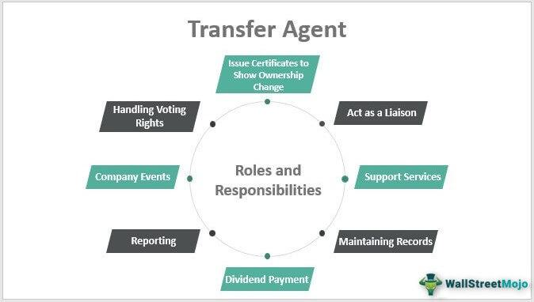

The financial industry has seen continuous evolution with the advent of significant innovations like the Medallion Program and algorithmic trading. These systems have become essential components in the financial markets, contributing to their security and efficiency.

The Medallion Program is a critical security measure that ensures the secure and efficient transfer of securities. By guaranteeing signatures on securities transfers, it plays an essential role in preventing fraud and unauthorized transactions. Its implementation provides a crucial layer of trust and assurance in financial transactions, safeguarding both investors and financial institutions.

Algorithmic trading, on the other hand, revolutionizes the execution of trades by using complex algorithms to process trades at high speeds and volumes. This approach leverages computational power to analyze market data and execute trades based on predefined criteria, significantly reducing human error and increasing trading efficiency. The use of algorithms has allowed traders to implement complex trading strategies at scales and speeds unattainable through manual processes.

This article examines how these two systems intertwine within the financial world. Their integration represents a holistic approach to modern securities trading, offering a combination of security and performance optimization. Understanding the intricacies of both the Medallion Program and algorithmic trading provides valuable insights into the current landscape of securities trading. These mechanisms, while distinct, together embody the evolving complexity and sophistication of the financial industry.

## Table of Contents

## Understanding the Securities Transfer Agents Medallion Program

The Securities Transfer Agents Medallion Program (STAMP) is a critical component in the world of financial transactions, providing an advanced verification system to guarantee the authenticity of signatures on physical securities certificates. This program plays an indispensable role in ensuring the security of transactions by preventing unauthorized transfers and forgery. In essence, STAMP facilitates the secure movement of securities, safeguarding both investors and institutions from potential fraud.

At the core of STAMP is its ability to authenticate that the signatory is indeed authorized to execute the transaction. This authentication process involves a medallion imprint, which is a unique stamp provided by financial institutions that participate in the program. The imprint serves as a visual assurance that the transaction has undergone rigorous scrutiny and has been verified by a trusted entity. 

STAMP's recognition extends across numerous financial institutions in the United States and Canada, underscoring its widespread acceptance and reliability. The endorsement by the Securities Transfer Association further solidifies its credibility as a standard for secure securities transactions. The association's role in recommending STAMP highlights its confidence in the program's ability to mitigate risks associated with forgeries and unauthorized transfers.

Transfer [agents](/wiki/agents), who are pivotal in managing securities transactions, leverage STAMP to ascertain the legitimacy of these processes. Their responsibilities include maintaining accurate records of ownership and ensuring that security transfers comply with regulations set forth by bodies like the Securities and Exchange Commission (SEC). The requirement for a medallion imprint as part of the transfer process is a robust deterrent against fraud, enhancing the overall integrity of the securities market.

In conclusion, the Securities Transfer Agents Medallion Program is an essential safeguard within the financial industry. Through rigorous signature verification, it fortifies the legitimacy and security of transactions involving physical securities, thereby protecting investors and upholding market integrity.

## Role of Transfer Agents in Securities Transactions

Transfer agents play a crucial role in ensuring the integrity and smooth operation of securities transactions. One of their primary responsibilities is maintaining accurate records of ownership changes, issuances, and cancellations of securities. This function is vital for publicly traded companies and their shareholders, as it ensures that shareholders receive their dividends and other entitlements in a timely and accurate manner.

Transfer agents are also pivotal in upholding compliance with regulations set forth by the Securities and Exchange Commission (SEC). These regulations are designed to protect investors and ensure fair and transparent markets. By adhering to these guidelines, transfer agents help in maintaining the trust and reliability of the securities market.

A key component of a transfer agent's role is the requirement of a signature guarantee, commonly provided through a Medallion imprint. This guarantee is necessary for the transfer of physical securities certificates and is an assurance from a financial institution that the signature is genuine and the signer has the authority to conduct the transaction. The Medallion Program thereby acts as a safeguard against unauthorized or fraudulent securities transfers, offering an added layer of security in these transactions.

Moreover, the involvement of transfer agents in securities transactions serves to mitigate the risk of fraud. By employing stringent verification protocols, such as the Medallion signature guarantee, transfer agents significantly lower the probability of fraudulent activities. This protective measure is critically important in preserving market integrity, as it reassures investors that their investments are secure from unauthorized manipulation or deceitful practices.

In summary, transfer agents are indispensable in the execution of secure and compliant securities transactions. Through meticulous record-keeping, adherence to SEC regulations, and rigorous verification processes, they substantially reduce the risks associated with securities transfers, thereby contributing to a secure and trustworthy financial market environment.

 to Algorithmic Trading

Algorithmic trading, often referred to as algo trading, utilizes complex algorithms to execute trades based on predefined criteria without manual intervention. These algorithms are designed to leverage computational power to analyze market data and execute trades at high speeds, often executing multiple trades in seconds. This capability allows traders to manage large volumes and execute complex trading strategies efficiently.

The primary advantage of [algorithmic trading](/wiki/algorithmic-trading) lies in its ability to reduce human error associated with manual trading. Traders can write algorithms that automatically analyze current market conditions, compare them against historical data, and make informed decisions based on pre-set rules and mathematical models. This approach is exemplified in strategies such as [arbitrage](/wiki/arbitrage), where algorithms exploit price discrepancies between markets, and in [trend following](/wiki/trend-following), where trades are made based on expected directions of market prices.

The efficiency of algorithmic trading is also evident in its scalability. By automating trading processes, algorithms are capable of handling thousands of transactions simultaneously, a feat that human traders cannot perform without significant risk of error. This automation, combined with the ability to process large datasets quickly, makes algorithmic trading a robust tool for institutions and individual traders aiming for precision and speed in volatile markets.

Furthermore, algorithmic trading contributes to market [liquidity](/wiki/liquidity-risk-premium) and price discovery. By executing trades rapidly, algorithms help narrow bid-ask spreads and contribute to more efficient market pricing. However, high-frequency trading, a subset of algorithmic trading, has raised concerns about market stability as it can sometimes lead to increased [volatility](/wiki/volatility-trading-strategies) and systemic risks, emphasizing the need for proper regulatory frameworks.

In summary, algorithmic trading represents a significant shift in modern trading methods, emphasizing speed, efficiency, and the minimization of human error while presenting both opportunities and challenges for market participants.

## The Intersection of Medallion Programs and Algo Trading

The integration of Medallion Programs and algorithmic trading (algo trading) in financial markets delivers significant improvements in security and efficiency. Medallion Programs are designed to secure transactions by guaranteeing the authenticity and validity of the signatures involved in securities transfers. They are instrumental in reducing the risk of fraud and unauthorized transfers, thereby safeguarding the integrity of the financial transaction.

On the other hand, algo trading enhances trading performance by utilizing computational algorithms to automate decision-making processes related to buying or selling securities. These algorithms process large volumes of data at high speeds, executing trades based on predefined criteria without the need for direct human intervention. Algorithmic trading's ability to minimize human error and swiftly execute complex trading strategies makes it indispensable in modern trading environments.

Together, these systems represent a comprehensive approach to securities trading in the modern financial landscape. Medallion Programs provide the security framework needed for the safe and legitimate transfer of securities, while algorithmic trading optimizes the speed and efficiency of market transactions. This combination not only ensures the protection of market participants against fraudulent activities but also enhances market performance by enabling rapid and precise trade executions.

The coexistence and interaction between Medallion Programs and algo trading demonstrate how combining security protocols with technological advancements in trading can sustain robust and reliable financial markets. As these systems continue to evolve, their integration will likely become even more critical, driving further innovations and potentially setting new standards for efficiency and security in securities trading.

## The Impact on the Financial Industry

The integration of Medallion guarantees and algorithmic trading has brought a substantial impact on the financial industry by enhancing investor confidence through secure and efficient transactions. The Medallion Program plays a crucial role in preventing unauthorized transfers and forgeries in securities transactions, ensuring a higher level of trustworthiness. By verifying the legitimacy of signatures involved in security transfers, it mitigates the risk of fraud, thereby maintaining the integrity of the securities market.

On the other hand, algorithmic trading contributes significantly to the efficiency of modern financial markets. The use of automated algorithms to execute trades at high speeds—often involving large volumes and complex strategies—helps in minimizing human error and maximizing market performance. By leveraging predefined criteria, algorithmic trading allows for timely and efficient execution of trades, which is invaluable in the fast-paced environment of the stock market.

Together, these systems foster a more secure and efficient trading environment by combining the strengths of high-speed trading performance with robust transaction security. This combination is pivotal in upholding market integrity, as they ensure that the transfer of securities is both safeguarded and expedited. Consequently, the adoption of these systems contributes to the competitiveness of financial services, as they provide a dual focus on maximizing operational excellence while ensuring stringent security measures.

The dynamic synergy between the Medallion Program and algorithmic trading stands as a comprehensive approach to modern securities trading. This integration is indispensable in maintaining investor confidence, as it assures participants in the financial markets that their transactions are conducted securely and efficiently. By continuously evolving to meet the demands of contemporary trading practices, these systems are crucial in sustaining the trust and competitiveness that underpin the global financial industry.

## Conclusion

The Medallion Program and algorithmic trading collectively form a backbone of modern financial markets, offering complementary advantages in terms of security and operational efficiency. The Medallion Program ensures that the transaction processes are safeguarded against forgery and unauthorized actions. It enforces stringent verification standards that secure the integrity of securities transfers, contributing significantly to the trustworthiness of financial markets.

On the other hand, algorithmic trading optimizes the execution of trades through automation, minimizing latency and errors inherent in manual trading processes. By allowing for rapid and precise transaction executions, it increases market liquidity and reduces the trading costs associated with time delays and human errors.

When these two systems are integrated, they create a robust structure that supports both secure and high-performance trading environments. The combined framework enhances investor confidence by ensuring that while the transactions are executed with speed and efficiency, the processes remain secure and conform to rigorous verification standards.

For individuals and institutions involved in securities trading, understanding these systems is crucial. Familiarity with the Medallion Program and algorithmic trading provides valuable insights and allows market participants to engage in financial markets more effectively. It enables informed decision-making, promotes better risk management, and leverages advanced trading strategies to maximize returns. As the landscape of financial markets continues to evolve, these systems will remain essential components for navigating the intricacies of modern securities trading.

## References & Further Reading

[1]: National Securities Clearing Corporation. ["Medallion Signature Guarantee Program"](https://www.investor.gov/introduction-investing/investing-basics/glossary/medallion-signature-guarantees-preventing) - Overview of the Medallion Program and its role in secure securities transactions.

[2]: Hasbrouck, J. (2007). ["Empirical Market Microstructure: The Institutions, Economics, and Econometrics of Securities Trading"](https://academic.oup.com/book/52241) - A detailed study on the machinery of securities trading, including algorithmic trading.

[3]: Aldridge, I. (2013). ["High-Frequency Trading: A Practical Guide to Algorithmic Strategies and Trading Systems"](https://onlinelibrary.wiley.com/doi/pdf/10.1002/9781119203803.fmatter) - A comprehensive reference on high-frequency trading and strategy development.

[4]: Securities and Exchange Commission (SEC). ["Transfer Agents Guide"](https://www.sec.gov/rules-regulations/1977/06/regulation-transfer-agents) - Regulatory guidelines and roles of transfer agents in securities transactions.

[5]: Narang, R. K. (2009). ["Inside the Black Box: The Simple Truth About Quantitative Trading"](https://onlinelibrary.wiley.com/doi/book/10.1002/9781118267738) - Insights into the technologies that drive algorithmic trading.