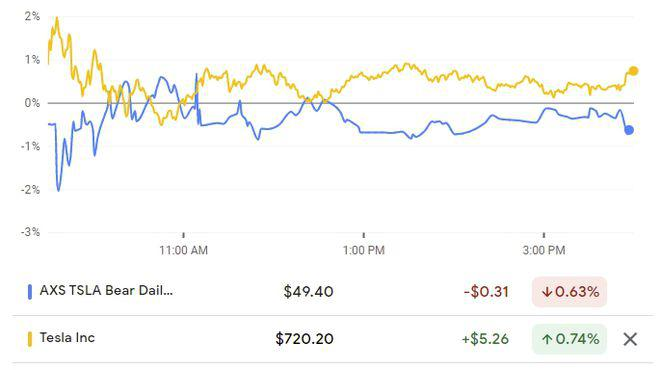

In the ever-evolving world of investment, exchange-traded funds (ETFs) have revolutionized the way investors approach the financial markets. From beginners to experienced investors, ETFs offer a versatile and cost-effective means to gain exposure across various asset classes. A recent development in the ETF landscape is the advent of single-stock ETFs, which focus on the performance of individual stocks rather than a diversified portfolio.

Single-stock ETFs are an innovation aimed at providing investors with specialized tools to harness the potential of specific stocks, especially when integrated with cutting-edge algorithmic trading strategies. This combination of single-stock ETFs and algorithmic trading represents a new frontier in investment, offering opportunities for both speculative gains and sophisticated hedging strategies.



The core objective of this article is to explore the mechanics behind single-stock ETFs, the advantages and risks they present, and the role of algorithmic trading in maximizing their potential. By understanding these elements, investors can better navigate the complexities of these instruments and identify ways to optimize their investment strategies.

As we embark on this exploration, we will first focus on understanding what single-stock ETFs are, their structure, and how they have evolved to cater to the needs of contemporary traders seeking targeted exposure within the stock market.

## Table of Contents

## Understanding Single-Stock ETFs

Single-stock ETFs are a type of exchange-traded fund specifically engineered to track the stock performance of a single corporation. Unlike traditional ETFs, which consist of a diversified basket of assets, these ETFs hone in on one particular stock. This specialization offers a unique investment vehicle that combines the characteristics of individual stock trading with the structured nature of ETFs.

To achieve their objectives, single-stock ETFs frequently incorporate leverage, which allows investors to gain amplified exposure to the stock's movements. Leverage can magnify both gains and losses, as it essentially means borrowing capital to increase potential returns on investment. The mathematics of leverage can be understood through the simple formula:

$$
\text{Leverage Ratio} = \frac{\text{Total Exposure}}{\text{Equity}}
$$

For example, a leverage ratio of 2:1 would double the impact of the stock's performance on the investor's portfolio. This feature is especially attractive for investors looking to capitalize on short-term price movements without directly trading on margin.

The first iterations of single-stock ETFs emerged in European financial markets, paving the way for their introduction in the United States in 2022. This development presented investors with new instruments for speculative profit and risk management through hedging strategies. The U.S. market's acceptance signaled an increased demand for innovative investment products aligning closely with modern trading strategies.

The architecture of single-stock ETFs generally involves the use of financial derivatives such as futures and options. These derivatives allow the [ETF](/wiki/etf-trading-strategies) to mimic the leveraged or inverse price movements of the underlying stock. Options and futures contracts provide the necessary exposure and flexibility to adjust the leverage levels as market conditions evolve.

Despite their potential for substantial gains, single-stock ETFs [carry](/wiki/carry-trading) significant risks, especially if held over extended periods. The key risks stem from their reliance on leverage and derivatives, which can lead to a divergence between the ETF's performance and that of the underlying stock. Moreover, the compounding effect inherent in leveraged products can exacerbate losses in volatile markets, making them more suitable for short-term strategies rather than long-term holdings.

Investors must weigh these risks carefully, considering factors such as transaction costs, regulatory advisories, and the intricacies of derivative instruments. Understanding the construction and mechanics of single-stock ETFs is crucial for navigating the challenges and opportunities they present in today's financial landscape.

## How Single-Stock ETFs Work

Single-stock exchange-traded funds (ETFs) are unique financial instruments that aim to replicate or inversely track the daily performance of a single underlying stock, utilizing financial derivatives to achieve this goal. Unlike traditional ETFs, which hold a basket of various securities to provide broad market exposure and diversify risk, single-stock ETFs concentrate their focus on one company, thereby providing investors with opportunities to capitalize on a specific stock's movement.

The operation of single-stock ETFs is underpinned by the strategic use of derivatives such as swaps, futures, and options. These derivatives are employed to amplify the stock's daily returns. For example, a 2x leveraged single-stock ETF would aim to deliver twice the daily return of the underlying stock, while an inverse single-stock ETF seeks to achieve the opposite movement of the stock, potentially profiting from declines.

Investors engaging with single-stock ETFs gain access to these leveraged or inverse positions without the complexity of managing margin accounts or engaging in direct short selling. This simplifies the process for retail investors who are adept with conventional trading platforms, as these ETFs are listed and traded on major exchanges, thus offering [liquidity](/wiki/liquidity-risk-premium) and ease of access. The simplicity of trading through traditional brokerage accounts makes these products appealing to savvy traders looking for short-term market plays.

Active management is crucial for single-stock ETFs due to their reliance on derivatives to maintain the targeted exposure. The daily resetting nature means that over a longer period, the returns can diverge significantly from the expected long-term performance of the underlying stock, a phenomenon known as the compounding effect. This requires the ETF manager to rebalance the portfolio regularly to ensure alignment with their stated leverage objectives, thus making these products more calibrated for short-term tactics rather than for buy-and-hold strategies.

The complexity and leverage associated with single-stock ETFs position them as advanced financial instruments suited for experienced investors who understand both the market dynamics of the underlying stock and the inherent risks of derivative-based products. Proper utilization of these products can offer substantial opportunities for returns, but they require careful consideration of market conditions and the investor’s risk tolerance.

## The Role of Algorithmic Trading

Algorithmic trading, commonly known as 'algo trading', utilizes software algorithms to automate the process of trading decisions and executions. This automation is based on predefined criteria such as timing, price, and [volume](/wiki/volume-trading-strategy). By employing advanced mathematical models and statistical analysis, [algorithmic trading](/wiki/algorithmic-trading) reduces human intervention, thereby minimizing emotional and cognitive biases that often interfere with making objective trading decisions.

In the context of single-stock ETFs, algorithmic trading plays a crucial role in optimizing entry and [exit](/wiki/exit-strategy) points. These ETFs, given their focused strategy on a single underlying stock, exhibit significant [volatility](/wiki/volatility-trading-strategies) which can be capitalized upon through rapid trading strategies. Algorithms are capable of monitoring market conditions in real-time, making swift decisions that can capture opportunities or mitigate risks much faster than manual trading methods.

Moreover, algorithmic trading enhances the efficiency of executing trades at high speeds, which is particularly beneficial for high-frequency trading ([HFT](/wiki/high-frequency-trading-strategies)) environments typical of single-stock ETFs. The capacity to execute trades in milliseconds allows traders to exploit even minute fluctuations in stock prices, thereby achieving consistency and potentially higher profitability. Algorithms can also be designed to adapt and recalibrate in response to shifts in market volatility, further optimizing trading strategies.

Effective algorithmic strategies utilize a combination of technical indicators, market data, and historical price patterns. For instance, moving averages, [momentum](/wiki/momentum) indicators, and statistical [arbitrage](/wiki/arbitrage) can be integrated into the algorithms to forecast market movements. A simplistic example of a trading signal for a single-stock ETF using moving averages in Python might look like this:

```python
import pandas as pd

# Example pseudocode for implementing a moving average crossover strategy
# Assume 'data' is a DataFrame with stock prices including 'Close' column

def moving_average_strategy(data, short_window=40, long_window=100):
    data['Short_MA'] = data['Close'].rolling(window=short_window, min_periods=1).mean()
    data['Long_MA'] = data['Close'].rolling(window=long_window, min_periods=1).mean()

    data['Signal'] = 0
    data['Signal'][short_window:] = np.where(data['Short_MA'][short_window:] > data['Long_MA'][short_window:], 1, 0)
    data['Position'] = data['Signal'].diff()

    return data

# Call the function with example data
# result = moving_average_strategy(your_dataframe)

```

This code represents a basic moving average crossover strategy, where a buy signal is generated when a short-term moving average crosses above a long-term moving average, and a sell signal when the opposite occurs. Automating this process allows trades to be executed with precision and speed, which would be otherwise unattainable through conventional trading methods.

Algorithmic trading's ability to systematically exploit the volatility and leverage characteristics of single-stock ETFs offers traders a powerful tool to navigate rapidly changing market conditions. As a result, it is essential for traders to continually refine and adapt their algorithms to maintain a competitive edge and harness the full potential of these financial instruments.

## Advantages and Risks of Single-Stock ETFs

Single-stock ETFs present several strategic advantages for investors, particularly those looking for short-term market positions with lower transaction costs than direct option purchases. By allowing leverage without the necessity of borrowing, they provide an appealing entry point for traders seeking amplified exposure to the performance of individual stocks. When traded like regular stocks on major exchanges, these ETFs offer substantial flexibility and liquidity, essential for short-term trading tactics.

However, potential risks accompany these advantages. A primary concern is the possible discrepancies between the performance of the ETF and its underlying stock. These discrepancies can arise due to tracking errors or the time decay inherent in derivative products used to construct the ETF. Tracking error refers to the deviation of the ETF's returns from the actual performance of the underlying asset. Time decay in options and other derivatives leads to a loss in value as they approach expiration, affecting the ETF's value.

To highlight the potential variance in returns, consider the following simplified formula to assess tracking error:

$$

\text{Tracking Error} = \sqrt{\frac{1}{N} \sum_{i=1}^N \left(R_i^{ETF} - R_i^{Stock}\right)^2} 
$$

where $R_i^{ETF}$ and $R_i^{Stock}$ are the returns of the ETF and the underlying stock, respectively, over $N$ periods.

Moreover, regulatory agencies like the Securities and Exchange Commission (SEC) have expressed concerns about the complexity of these instruments and their suitability for retail investors. This complexity might obscure the true risks, requiring that investors engage in comprehensive research and apply rigorous risk management techniques before incorporating these products into their investment strategies. Investors should stay informed, leveraging financial education and possibly professional advice, to effectively navigate the intricacies and risks associated with single-stock ETFs.

## Case Studies: Examples of Single-Stock ETFs

Several single-stock ETFs have gained considerable traction in financial markets, particularly those associated with renowned companies like Tesla and Nvidia. These exchange-traded funds provide investors with an opportunity to gain leveraged exposure to the performance of a single underlying stock, offering both potential advantages and inherent risks.

One prominent example is the TSLQ ETF. This ETF is designed to inversely track Tesla's daily performance, effectively offering investors the chance to profit when Tesla’s stock price declines. This inverse ETF employs a range of financial instruments, including derivatives, to achieve its investment objective. By providing a means to capitalize on negative price movements, TSLQ serves as a strategic tool for those seeking to hedge their portfolios or speculate on the volatility of Tesla’s stock.

Analyzing the performance of single-stock ETFs like TSLQ reveals several key insights. Firstly, their reliance on derivatives such as futures and options introduces a layer of complexity, necessitating active management and astute timing to align with the market movements effectively. The time decay associated with options, for example, can impact the ETF's performance, particularly if held over an extended period beyond their designed short-term horizon.

Additionally, such ETFs accentuate the importance of active trading strategies. Investors leveraging these products are encouraged to regularly monitor market trends and maintain a keen awareness of the news and events impacting the underlying stock. The success of utilizing single-stock ETFs hinges not only on correctly predicting stock movements but also on executing trades efficiently, often facilitated by algorithmic trading systems.

The examination of single-stock ETFs extends beyond mere performance tracking to include regulatory considerations. Regulatory bodies, like the U.S. Securities and Exchange Commission (SEC), have raised concerns regarding the suitability of these complex investment vehicles for retail investors. The potential for tracking deviations and amplified volatility underscores the necessity for comprehensive understanding and robust risk management protocols.

In conclusion, single-stock ETFs, such as those tracking Tesla or Nvidia, exemplify a sophisticated financial instrument designed for dynamic investor strategies. Their real-world applications demonstrate the potency of leveraging financial derivatives to gain singular stock exposure, reiterating the need for active management and strategic trading methodologies.

## Conclusion and Best Practices

Single-stock ETFs, when coupled with algorithmic trading strategies, present an enticing opportunity for experienced investors seeking to leverage market volatility and short-term stock movements. The integration of these instruments provides a sophisticated approach to market participation, allowing for potential amplified gains due to the leveraged nature of single-stock ETFs. Algorithmic trading further enhances this by enabling precise entry and exit points based on rigorous quantitative criteria, which could potentially result in an edge over more traditional investment approaches.

Despite their potential, these financial products are inherently risky and necessitate a comprehensive understanding of stock behavior and derivative instruments. The mechanics of derivatives, pivotal in the construction of single-stock ETFs, can introduce complexities such as time decay and tracking errors, making these products suitable primarily for those with proficient market knowledge and experience. 

To navigate these risks effectively, investors are advised to undertake thorough research and maintain up-to-date knowledge of market conditions. Implementing a robust risk management framework is crucial. This might include setting strict stop-loss limits, leveraging diversification strategies where possible, and continuously monitoring the performance of ETFs relative to their underlying stocks. Investors should also consider employing tools like Monte Carlo simulations to model potential outcomes and assess the statistical probability of different market scenarios.

Additionally, seeking professional financial advice can be invaluable when managing the intricacies associated with single-stock ETFs. Financial advisors can offer tailored advice based on individual risk tolerance and investment goals, potentially steering investors away from unsuitable exposures.

In a rapidly evolving market landscape, adaptability is key. By understanding the characteristics of single-stock ETFs and aligning trading strategies with informed insights and robust risk management, investors can potentially enhance their portfolio's performance. As these instruments continue to develop, ensuring a strategic and informed approach will remain paramount in capitalizing on these cutting-edge investment opportunities.

## References & Further Reading

[1]: Bergstra, J., Bardenet, R., Bengio, Y., & Kégl, B. (2011). ["Algorithms for Hyper-Parameter Optimization."](https://proceedings.neurips.cc/paper/2011/file/86e8f7ab32cfd12577bc2619bc635690-Paper.pdf) Advances in Neural Information Processing Systems 24.

[2]: ["Advances in Financial Machine Learning"](https://www.amazon.com/Advances-Financial-Machine-Learning-Marcos/dp/1119482089) by Marcos Lopez de Prado

[3]: ["Evidence-Based Technical Analysis: Applying the Scientific Method and Statistical Inference to Trading Signals"](https://www.amazon.com/Evidence-Based-Technical-Analysis-Scientific-Statistical/dp/0470008741) by David Aronson

[4]: ["Machine Learning for Algorithmic Trading"](https://github.com/stefan-jansen/machine-learning-for-trading) by Stefan Jansen

[5]: ["Quantitative Trading: How to Build Your Own Algorithmic Trading Business"](https://www.amazon.com/Quantitative-Trading-Build-Algorithmic-Business/dp/1119800064) by Ernest P. Chan