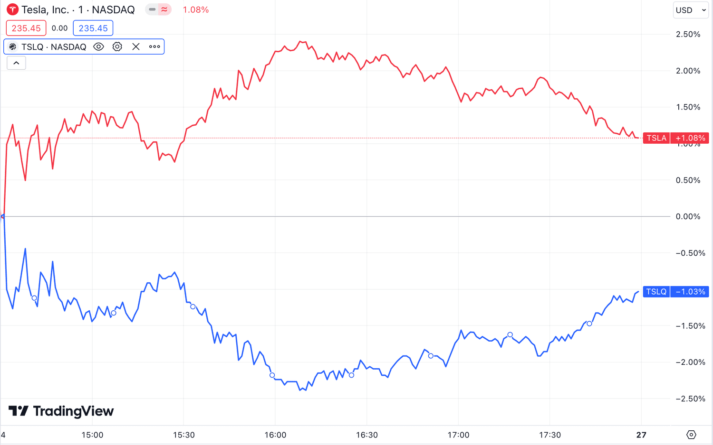

## Table of Contents

## What is a single-stock ETF?

A single-stock ETF is a type of exchange-traded fund that focuses on just one company's stock. Instead of spreading investments across many different companies like most ETFs, a single-stock ETF uses financial strategies to give investors exposure to the performance of one specific stock. This can be done through options, futures, or other derivatives that track the stock's price movements.

These ETFs are often used by investors who want to bet on the future performance of a particular company without buying the stock directly. They can be attractive because they offer a way to use leverage, meaning investors can potentially earn more from small price changes in the stock. However, they also come with higher risks because they are less diversified and can be more volatile than traditional ETFs or owning the stock outright.

## How does a single-stock ETF differ from a traditional ETF?

A single-stock ETF is different from a traditional ETF because it focuses on just one company's stock, while a traditional ETF usually holds a basket of different stocks or other assets. This means that when you invest in a single-stock ETF, your money is tied to the performance of that one company. On the other hand, a traditional ETF spreads your investment across many companies or assets, which can help reduce risk because if one company does poorly, the others might do well and balance it out.

Another key difference is that single-stock ETFs often use financial tools like options and futures to track the stock's price. This can make them more complex and risky than traditional ETFs. These tools can also allow for leverage, meaning you might make more money if the stock goes up, but you could also lose more if it goes down. Traditional ETFs, in contrast, typically buy the actual stocks or assets directly, which can be less risky but also might not offer the same potential for high returns.

## What are the benefits of investing in single-stock ETFs?

One benefit of investing in single-stock ETFs is that they can give you a chance to make more money from small changes in a company's stock price. This is because these ETFs often use something called leverage, which means they can increase the amount you might earn if the stock goes up. If you think a certain company is going to do really well, a single-stock ETF can be a way to bet on that company without buying the stock directly.

Another benefit is that single-stock ETFs can be easier to buy and sell than the actual stock. They trade on stock exchanges just like regular ETFs, so you can buy and sell them during the day whenever the market is open. This can be helpful if you want to quickly change your investments based on what's happening in the market. Plus, you don't need to worry about owning the actual stock, which can sometimes come with extra costs or rules.

## What are the risks associated with single-stock ETFs?

Investing in single-stock ETFs can be risky because they focus on just one company's stock. If that company does poorly, your investment could lose a lot of value. Unlike traditional ETFs that spread your money across many companies, single-stock ETFs don't have that safety net. If the one company you're invested in has a bad quarter or faces a scandal, your investment could drop quickly.

Another big risk comes from the use of leverage in single-stock ETFs. Leverage means you can make more money if the stock goes up, but it also means you can lose more if the stock goes down. This can make single-stock ETFs much more volatile than regular ETFs or even the stock itself. It's like trying to ride a roller coaster that goes up and down faster than normal, which can be exciting but also scary and risky.

Also, single-stock ETFs can be more complex and harder to understand than traditional ETFs. They often use financial tools like options and futures, which can be confusing. If you don't fully understand how these tools work, you might make decisions that lead to bigger losses. It's important to know what you're getting into before you invest in single-stock ETFs.

## How are single-stock ETFs structured?

Single-stock ETFs are set up to focus on just one company's stock. Instead of buying the actual stock, these ETFs use financial tools like options and futures to track the price of the stock. This means they can give investors a way to bet on the stock going up or down without owning it directly. The structure of these ETFs often involves using leverage, which means they can increase the amount of money you might make or lose based on small changes in the stock's price.

Because they use these financial tools, single-stock ETFs can be more complicated than regular ETFs. They need to be managed carefully to make sure they keep tracking the stock's price correctly. This management can involve buying and selling the options and futures regularly, which adds to the complexity. If you're thinking about investing in a single-stock ETF, it's important to understand how it's set up and how it works, so you know what you're getting into.

## What are the tax implications of investing in single-stock ETFs?

When you invest in single-stock ETFs, you need to think about taxes. These ETFs can be different from regular ETFs because they often use options and futures. These financial tools can lead to more tax events, like capital gains, even if you don't sell your ETF. This means you might have to pay taxes on money you haven't actually gotten yet. It's important to know that these ETFs can create more tax paperwork and possibly higher taxes than other investments.

Another thing to remember is that the tax rules can change depending on where you live and how long you hold the ETF. If you keep the ETF for less than a year, any profit you make might be taxed as short-term capital gains, which can be higher than long-term gains. It's a good idea to talk to a tax expert to understand how investing in single-stock ETFs might affect your taxes. They can help you figure out the best way to manage your investments and keep your tax bill as low as possible.

## How can single-stock ETFs be used in a diversified investment portfolio?

Single-stock ETFs can be a part of a diversified investment portfolio if you use them carefully. They focus on just one company's stock, which can be risky because if that company does badly, your investment could lose a lot of value. But if you think a certain company will do well, you can use a single-stock ETF to bet on that company without buying the stock directly. This can be a way to add some excitement to your portfolio and possibly make more money if the stock goes up.

To keep your portfolio diversified, you shouldn't put too much money into single-stock ETFs. Instead, you can use them as a small part of your overall investments. For example, you might have most of your money in regular ETFs that spread your investment across many companies, and then a small amount in a single-stock ETF. This way, you can still take advantage of the potential high returns from a single-stock ETF while keeping your overall risk lower by having a mix of different investments.

## What are the key factors to consider when choosing a single-stock ETF?

When choosing a single-stock ETF, one of the most important things to think about is the company the ETF focuses on. You need to believe in the company's future and think it will do well. Look at the company's past performance, what it does, and any news or events that might affect its stock price. Also, consider how much risk you're okay with. Single-stock ETFs can be more risky than other investments because they only focus on one company, so make sure you're comfortable with that risk before you invest.

Another key [factor](/wiki/factor-investing) is understanding how the ETF is set up. Single-stock ETFs often use options and futures, which can make them more complicated. You should know how these financial tools work and how they might affect your investment. Also, check if the ETF uses leverage, which can make your potential gains or losses bigger. Finally, think about the fees and costs. Single-stock ETFs might have higher fees than regular ETFs, so make sure you know what you'll be paying and if it's worth it for the potential returns.

## How do single-stock ETFs perform compared to the underlying stock?

Single-stock ETFs are designed to track the price of one company's stock, but they don't always move exactly the same way as the stock itself. This is because single-stock ETFs often use financial tools like options and futures to follow the stock's price. These tools can make the ETF's price go up or down more than the stock's price, especially if the ETF uses leverage. Leverage means the ETF can make bigger gains or losses from small changes in the stock's price. So, if the stock goes up a little, the ETF might go up a lot, but if the stock goes down, the ETF could lose more value too.

Because of these financial tools, single-stock ETFs can be more volatile than the stock they're based on. This means their price can change a lot in a short time, which can be risky. If you're thinking about investing in a single-stock ETF, it's important to understand how it might perform differently from the stock. While the ETF can give you a chance to make more money if the stock does well, it can also lead to bigger losses if the stock doesn't do as expected. Always do your research and think about how much risk you're okay with before you invest.

## What are the regulatory considerations for single-stock ETFs?

Single-stock ETFs are watched closely by regulators because they can be risky and complex. In the United States, the Securities and Exchange Commission (SEC) makes rules to keep these investments safe for people. They check how the ETFs use options and futures to make sure they're not too risky. The SEC also wants to make sure that people who invest in these ETFs know what they're getting into. So, they might ask the companies that offer these ETFs to explain things clearly to investors.

Another thing regulators look at is how single-stock ETFs are traded. They want to make sure that the prices are fair and that people can buy and sell them easily. Sometimes, regulators might put limits on how much leverage these ETFs can use. This is to stop the ETFs from becoming too risky. If you're thinking about investing in a single-stock ETF, it's good to know that regulators are working to keep things safe, but you should still be careful and understand the risks.

## How do leverage and inverse single-stock ETFs work?

Leveraged single-stock ETFs are designed to give you bigger gains or losses based on the price changes of one company's stock. They use financial tools like options and futures to try to make the ETF go up or down by a multiple of the stock's price change. For example, if the stock goes up 1%, a 2x leveraged ETF might try to go up 2%. But this also means that if the stock goes down 1%, the ETF could go down 2%. This makes these ETFs very risky because the ups and downs can be much bigger than with the stock itself.

Inverse single-stock ETFs are meant to do the opposite of what the stock does. If the stock goes up, the inverse ETF goes down, and if the stock goes down, the inverse ETF goes up. These ETFs also use options and futures to track the stock's price in reverse. They can be useful if you think a company's stock is going to drop, but they can also be very risky. Just like leveraged ETFs, inverse ETFs can make bigger moves than the stock, so you could lose a lot of money if you're wrong about the stock's direction.

## What advanced strategies can be employed with single-stock ETFs?

One advanced strategy with single-stock ETFs is using them for short-term trading. Because these ETFs can be very volatile, you might try to buy and sell them quickly to make money from small price changes. This can be exciting, but it's also risky. You need to watch the market closely and be ready to make fast decisions. If you think a company's stock will go up a little in the next few days, you might buy a leveraged single-stock ETF to try to make more money from that small move. But if the stock goes down instead, you could lose more money than if you had just bought the stock itself.

Another strategy is using inverse single-stock ETFs to hedge your investments. If you own a lot of stock in a company and you're worried that its price might drop, you can buy an inverse ETF based on that stock. This can help protect your money because if the stock goes down, the inverse ETF will go up, balancing out some of your losses. It's like having an insurance policy for your stock. But remember, hedging with inverse ETFs can be complicated and might not always work the way you want, so it's important to understand the risks and costs involved.

## What are Single-Stock ETFs and how do they work?

Single-stock ETFs are a type of exchange-traded fund specifically engineered to track the stock performance of a single corporation. Unlike traditional ETFs, which consist of a diversified basket of assets, these ETFs hone in on one particular stock. This specialization offers a unique investment vehicle that combines the characteristics of individual stock trading with the structured nature of ETFs.

To achieve their objectives, single-stock ETFs frequently incorporate leverage, which allows investors to gain amplified exposure to the stock's movements. Leverage can magnify both gains and losses, as it essentially means borrowing capital to increase potential returns on investment. The mathematics of leverage can be understood through the simple formula:

$$
\text{Leverage Ratio} = \frac{\text{Total Exposure}}{\text{Equity}}
$$

For example, a leverage ratio of 2:1 would double the impact of the stock's performance on the investor's portfolio. This feature is especially attractive for investors looking to capitalize on short-term price movements without directly trading on margin.

The first iterations of single-stock ETFs emerged in European financial markets, paving the way for their introduction in the United States in 2022. This development presented investors with new instruments for speculative profit and risk management through hedging strategies. The U.S. market's acceptance signaled an increased demand for innovative investment products aligning closely with modern trading strategies.

The architecture of single-stock ETFs generally involves the use of financial derivatives such as futures and options. These derivatives allow the [ETF](/wiki/etf-trading-strategies) to mimic the leveraged or inverse price movements of the underlying stock. Options and futures contracts provide the necessary exposure and flexibility to adjust the leverage levels as market conditions evolve.

Despite their potential for substantial gains, single-stock ETFs [carry](/wiki/carry-trading) significant risks, especially if held over extended periods. The key risks stem from their reliance on leverage and derivatives, which can lead to a divergence between the ETF's performance and that of the underlying stock. Moreover, the compounding effect inherent in leveraged products can exacerbate losses in volatile markets, making them more suitable for short-term strategies rather than long-term holdings.

Investors must weigh these risks carefully, considering factors such as transaction costs, regulatory advisories, and the intricacies of derivative instruments. Understanding the construction and mechanics of single-stock ETFs is crucial for navigating the challenges and opportunities they present in today's financial landscape.

## What are the advantages and risks of single-stock ETFs?

Single-stock ETFs present several strategic advantages for investors, particularly those looking for short-term market positions with lower transaction costs than direct option purchases. By allowing leverage without the necessity of borrowing, they provide an appealing entry point for traders seeking amplified exposure to the performance of individual stocks. When traded like regular stocks on major exchanges, these ETFs offer substantial flexibility and [liquidity](/wiki/liquidity-risk-premium), essential for short-term trading tactics.

However, potential risks accompany these advantages. A primary concern is the possible discrepancies between the performance of the ETF and its underlying stock. These discrepancies can arise due to tracking errors or the time decay inherent in derivative products used to construct the ETF. Tracking error refers to the deviation of the ETF's returns from the actual performance of the underlying asset. Time decay in options and other derivatives leads to a loss in value as they approach expiration, affecting the ETF's value.

To highlight the potential variance in returns, consider the following simplified formula to assess tracking error:

$$

\text{Tracking Error} = \sqrt{\frac{1}{N} \sum_{i=1}^N \left(R_i^{ETF} - R_i^{Stock}\right)^2} 
$$

where $R_i^{ETF}$ and $R_i^{Stock}$ are the returns of the ETF and the underlying stock, respectively, over $N$ periods.

Moreover, regulatory agencies like the Securities and Exchange Commission (SEC) have expressed concerns about the complexity of these instruments and their suitability for retail investors. This complexity might obscure the true risks, requiring that investors engage in comprehensive research and apply rigorous risk management techniques before incorporating these products into their investment strategies. Investors should stay informed, leveraging financial education and possibly professional advice, to effectively navigate the intricacies and risks associated with single-stock ETFs.

## References & Further Reading

[1]: Bergstra, J., Bardenet, R., Bengio, Y., & Kégl, B. (2011). ["Algorithms for Hyper-Parameter Optimization."](https://proceedings.neurips.cc/paper/2011/file/86e8f7ab32cfd12577bc2619bc635690-Paper.pdf) Advances in Neural Information Processing Systems 24.

[2]: ["Advances in Financial Machine Learning"](https://www.amazon.com/Advances-Financial-Machine-Learning-Marcos/dp/1119482089) by Marcos Lopez de Prado

[3]: ["Evidence-Based Technical Analysis: Applying the Scientific Method and Statistical Inference to Trading Signals"](https://www.amazon.com/Evidence-Based-Technical-Analysis-Scientific-Statistical/dp/0470008741) by David Aronson

[4]: ["Machine Learning for Algorithmic Trading"](https://github.com/stefan-jansen/machine-learning-for-trading) by Stefan Jansen

[5]: ["Quantitative Trading: How to Build Your Own Algorithmic Trading Business"](https://www.amazon.com/Quantitative-Trading-Build-Algorithmic-Business/dp/1119800064) by Ernest P. Chan