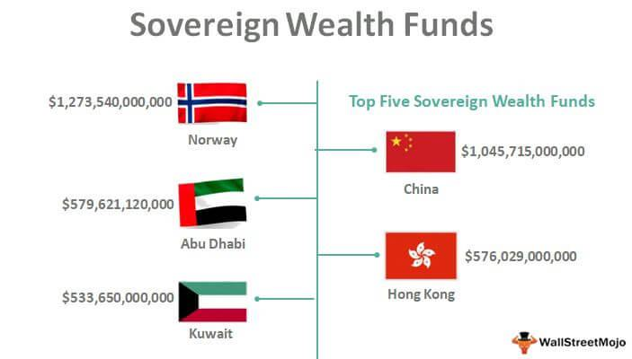

National assets investment funds, commonly known as sovereign wealth funds (SWFs), are state-owned investment portfolios consisting of various asset classes such as real estate, equities, bonds, and other financial instruments. Their primary purpose is to manage a nation's wealth to achieve strategic economic goals, such as stabilizing the economy, diversifying assets, ensuring savings for future generations, or funding specific governmental projects. In the global economy, these funds are significant due to their vast capital and ability to influence financial markets and economic policies worldwide.

Sovereign wealth funds have evolved significantly since their inception. Traditionally, they were established to manage the surplus revenues from natural resources like oil and gas. However, over the years, the evolution of SWFs has seen them branching into diverse sectors beyond natural resources. These funds have grown in sophistication and complexity, adapting to global financial trends and managing their portfolios across various asset classes for long-term stability and growth.



Algorithmic trading, a contemporary advancement in financial markets, incorporates computer algorithms to execute trading strategies. It has gained prominence due to its efficiency, speed, and precision, allowing for the processing of vast amounts of data to optimize trading decisions. Algorithmic trading utilizes mathematical models and statistical analyses to predict market movements and execute trade orders without human intervention.

The intersection of sovereign wealth funds and algorithmic trading represents a pivotal development in fund management. As these funds strive for better risk management and enhanced returns, they increasingly leverage algorithmic trading techniques. The integration of technology into SWFs offers opportunities to refine investment strategies through data-driven approaches, thus optimizing asset management and increasing overall fund performance.

Moving forward, this article will investigate how sovereign wealth funds are incorporating algorithmic trading strategies into their investment operations, aiming to understand the underlying motivations, benefits, and challenges associated with this trend. This analysis will shed light on the evolving landscape of national assets investment funds and the transformative role of technology in their governance.

## Table of Contents

## Understanding National Assets Investment Funds

National assets investment funds, commonly recognized as sovereign wealth funds (SWFs), are state-owned investment vehicles that manage a country's surplus wealth. These funds play a crucial role in optimizing national financial resources for economic stabilization and long-term wealth preservation. Their importance in the global economy is underscored by their significant investment capabilities which can influence international markets and contribute to global financial stability.

### Objectives of National Assets Investment Funds

The primary objectives of national assets investment funds include the stabilization of national economies and the safeguarding of wealth for future generations. Economic stabilization is achieved by allocating resources to manage fiscal surpluses, mitigate the [volatility](/wiki/volatility-trading-strategies) of commodity prices (particularly for resource-rich nations), and cushion the impact of global economic fluctuations. These resources are critical during periods of economic downturn, providing a financial safety net and enabling continued public expenditure without disrupting essential services.

Moreover, these funds are designed to future-proof a nation's wealth by investing in diversified and sustainable assets. By strategically deploying capital, sovereign wealth funds aim to secure long-term returns that can be used to benefit the nation's future economic landscape.

### Types of Assets Managed

National assets investment funds manage a diverse portfolio of investments, encompassing various asset classes. Some of the primary types of assets include:

1. **Real Estate:** Investment in commercial and residential properties across the globe is a common strategy, providing steady income streams and potential capital appreciation.

2. **Equities:** These funds often hold substantial positions in global equities, investing in both established and emerging markets. Equity investments offer potential for high returns, albeit with greater risk.

3. **Bonds:** Government and corporate bonds are central to the portfolios of many sovereign wealth funds, offering more stable returns and serving as a hedge against equity market volatility.

4. **Alternative Investments:** Including private equity, infrastructure, and hedge funds, these investments provide further diversification and the potential for enhanced returns.

### Global Footprint and Notable Examples

The global footprint of national assets investment funds is expansive, with assets under management (AUM) collectively exceeding several trillion dollars. This impact is reflected in the breadth of their investments, spanning multiple sectors and geographical regions.

Notable examples of sovereign wealth funds include:

- **Norway’s Government Pension Fund Global:** Often cited as a pioneer, this fund is renowned for its comprehensive and transparent management of oil revenues for the benefit of current and future generations.

- **Abu Dhabi Investment Authority (ADIA):** One of the largest SWFs in the world, it invests globally in a wide array of asset classes, from real estate to equities and beyond.

- **China Investment Corporation (CIC):** Established to diversify China's foreign exchange holdings, CIC invests in global markets with the goal of achieving reasonable returns with sound risk management.

These funds not only contribute to their national economies but also play a pivotal role in the broader global market dynamics, making their strategies and decisions influential on a worldwide scale. Through prudent and diversified investments, sovereign wealth funds endeavor to achieve stability and growth, aligning their objectives with the economic goals of their respective nations.

## The Role of Sovereign Wealth Funds

Sovereign Wealth Funds (SWFs) are state-owned investment vehicles that manage a country's national wealth with the objective of achieving long-term financial returns. These funds are typically created from balance of payments surpluses, official foreign currency operations, the proceeds of privatizations, fiscal surpluses, and receipts from resource exports. Unlike other investment mechanisms such as pension funds or private equity funds, SWFs are predominantly government-owned and focus on investing in a diversified portfolio that may include stocks, bonds, real estate, and alternative investments to maximize returns over time.

The historical context of SWFs dates back to the mid-20th century. The Kuwait Investment Authority, established in 1953, is widely regarded as the first sovereign wealth fund, created to manage oil revenues for future generations. Over time, the concept gained traction as other countries recognized the need to manage their resource-driven wealth responsibly while preparing for an eventual decline in natural resource revenue or other economic shocks. Thus, SWFs began as stabilizing forces to cushion economies against volatility and ensure fiscal and macroeconomic stability.

As global financial markets became more interconnected, SWFs expanded their influence significantly. They have become crucial players, capable of exerting considerable impact through their investment decisions. The size and stability of SWFs allow them to take larger and longer-term positions compared to other investors. For instance, during the 2008 global financial crisis, many SWFs provided much-needed [liquidity](/wiki/liquidity-risk-premium) to struggling financial institutions, thereby playing a critical stabilizing role amidst market turmoil.

Several notable examples of major sovereign wealth funds illustrate their strategies and influence. The Government Pension Fund of Norway, often referred to as the "Oil Fund," is one of the largest SWFs globally, with over $1 trillion in assets as of 2021. Its strategy is characterized by a heavy emphasis on equity investments, which make up around 70% of its portfolio. Another significant fund, the China Investment Corporation, established in 2007, actively invests across various asset classes, including direct stakes in major corporations and global infrastructure projects.

These funds often pursue diverse strategies based on their economic goals and risk tolerance. For instance, the Abu Dhabi Investment Authority focuses on a wide array of asset classes with a long-term investment horizon, while Singapore's GIC emphasizes value investing, targeting long-term, sustainable returns.

SWFs are not only instrumental in securing the economic futures of their home countries but also serve as key influences on the international investment landscape. Their ability to deploy substantial capital and adopt innovative investment strategies continues to shape financial markets worldwide, ensuring that the role of SWFs remains pivotal in both national and global economic contexts.

## Algorithmic Trading: An Overview

Algorithmic trading, often referred to as algo trading, is a method of executing orders using automated and pre-programmed trading instructions. These instructions account for variables such as time, price, and [volume](/wiki/volume-trading-strategy), allowing traders to execute orders at speeds and frequencies that would be impossible for a human trader. The basic principle of [algorithmic trading](/wiki/algorithmic-trading) is to utilize computer systems to execute a sequence of trading instructions that encompass various decision-making criteria at high speeds across multiple markets.

The rise of algorithmic trading can be attributed to several technological advancements. Key among these are the developments in computer processing power, data storage capabilities, and high-frequency trading platforms. These technologies enable the rapid processing of extensive datasets and the execution of complex algorithms, making it feasible to capitalize on small price discrepancies in the market that last for just fractions of a second. Furthermore, improvements in communications technology have facilitated low-latency trading, where minimal delays between the generation of trading signals and their execution are crucial for maintaining competitive advantages.

The primary benefits of algorithmic trading include increased efficiency, speed, and precision. Automated systems can process large volumes of data instantly and execute trades across multiple markets simultaneously, reducing the likelihood of human errors and enhancing liquidity. Precision in the execution of trades ensures that the orders are filled at the best possible prices, which is particularly advantageous in highly volatile markets. Moreover, the ability to backtest algorithms against historical data helps in refining trading strategies and forecasting future market trends with greater accuracy.

Despite its advantages, algorithmic trading is not without challenges and risks. One significant risk is market volatility, which can be exacerbated by the high-speed trading strategies employed by algorithms. The "flash crash" of May 6, 2010, is a prominent example where rapid selling triggered by algorithmic strategies led to a sudden and brief market downturn. Additionally, technological failures, such as software bugs or hardware malfunctions, can result in significant losses if not promptly addressed. Furthermore, the complexity of algorithms increases the risk of unforeseen interactions between other market participants' algorithms, leading to adverse market conditions.

To mitigate these risks, firms engaging in algorithmic trading implement robust risk management systems and continuously monitor and update their algorithms. Compliance with regulatory frameworks is also critical, as they provide guidelines to ensure market stability and protect against fraudulent trading practices. The ongoing development in [artificial intelligence](/wiki/ai-artificial-intelligence) and [machine learning](/wiki/machine-learning) technologies promises to enhance the predictive capabilities and adaptability of algorithms, potentially transforming the landscape of trading systems in financial markets.

## Integration of Algorithmic Trading in Sovereign Wealth Funds

Sovereign wealth funds (SWFs) are increasingly adopting algorithmic trading strategies to enhance their investment operations, driven by the desire for greater efficiency, speed, and quantitative accuracy. As major players in the global financial markets, SWFs are exploring technological advancements to capitalize on market opportunities while mitigating risks.

#### Motivations for Integration

The primary motivations behind the integration of algorithmic trading within SWFs include the need for improved efficiency in trade execution and portfolio management. Algorithmic trading allows for the automation of trading processes, freeing up resources and enabling fund managers to focus on strategic decision-making. This technology also facilitates better risk management through precise modeling of market conditions and execution of pre-defined trading strategies. Additionally, algorithmic trading provides SWFs with access to sophisticated market analysis tools, enhancing their ability to respond swiftly to market fluctuations and capitalize on [arbitrage](/wiki/arbitrage) opportunities.

#### Case Studies and Examples

Several sovereign wealth funds have begun to successfully integrate algorithmic trading into their operations, highlighting the benefits of this approach. For instance, the Government Pension Fund of Norway, one of the largest SWFs globally, has employed algorithmic trading to optimize its asset allocation and ensure competitive returns while minimizing transaction costs. Similarly, the Abu Dhabi Investment Authority has harnessed advanced algorithms to streamline its trading processes and enhance the quality of its investment decisions.

In another notable example, Singapore's GIC (Government of Singapore Investment Corporation) has leveraged algorithmic strategies to diversify its portfolio and enhance its adaptive market strategies. By using machine learning algorithms to analyze vast datasets, GIC can predict and respond effectively to emerging trends, further solidifying its stance as a forward-thinking investment entity.

#### Impacts on Performance

The adoption of algorithmic trading has significantly improved the performance of sovereign wealth funds, allowing for greater agility in the execution of trades. The use of sophisticated algorithms enables SWFs to engage in high-frequency trading, capturing fleeting market opportunities that would be inaccessible through traditional trading methods. This results in a competitive edge when managing large and diversified investment portfolios.

Moreover, algorithmic trading contributes to the optimization of transaction costs, reducing slippage and improving the overall returns of the funds. By automating the trading process, these funds can also reduce the likelihood of human errors, which are often detrimental in fast-paced trading environments.

In conclusion, the integration of algorithmic trading into sovereign wealth funds represents a transformative shift in how these entities manage and optimize their vast portfolios. Through the deployment of advanced trading algorithms, SWFs can achieve enhanced efficiency, better risk-adjusted returns, and a stronger competitive position in the global market. As technology continues to advance, the strategic incorporation of algorithmic trading will likely become a standard practice among sovereign wealth funds seeking to leverage data-driven insights for superior investment outcomes.

## Benefits and Risks of Algo Trading for Sovereign Wealth Funds

Algorithmic trading offers several benefits to sovereign wealth funds (SWFs) aiming to maximize their investment potential and manage assets effectively. One of the primary advantages is enhanced returns. Through sophisticated algorithms, SWFs can analyze vast datasets, identify trends, and execute trades at speeds unattainable by human traders. This capability allows funds to capitalize on short-term market inefficiencies and implement strategies like [statistical arbitrage](/wiki/statistical-arbitrage), [momentum](/wiki/momentum) trading, and high-frequency trading. Algorithmic trading also optimizes asset management by maintaining liquidity and continuously rebalancing portfolios to adhere to strategic allocation models.

Incorporating algorithmic trading into their operations enables SWFs to minimize transaction costs. Algorithms can determine the most cost-efficient way to execute large orders by breaking them down into smaller trades across various exchanges and time intervals, thereby reducing market impact and slippage. Additionally, algorithmic systems operate with precision and consistency, mitigating the risk of human error and emotional bias, which can often lead to suboptimal decision-making.

However, the integration of algorithmic trading is not devoid of risks. Market volatility poses a significant challenge, as unexpected price fluctuations can lead to substantial losses if algorithms are not designed to adapt swiftly to changing market conditions. Furthermore, technological failures, such as software glitches or hardware malfunctions, can disrupt trading activities and potentially result in financial losses. The "flash crash" phenomenon, where rapid, automated trading leads to massive sell-offs, exemplifies the potential dangers associated with algorithmic systems.

To mitigate these risks, SWFs implement robust risk management frameworks. These frameworks involve rigorous [backtesting](/wiki/backtesting) of algorithms under various market scenarios to ensure reliability and resilience. Regular audits and updates of algorithmic models are conducted to incorporate new data and market dynamics, thereby maintaining their relevance and accuracy. Additionally, SWFs often employ real-time monitoring systems to detect anomalies and halt trading activities if predefined thresholds are breached, effectively preventing runaway losses.

By striking a balance between leveraging advanced technologies and implementing strong risk controls, sovereign wealth funds can harness the full potential of algorithmic trading, achieving superior returns while safeguarding against inherent risks.

## Future Outlook for Sovereign Wealth Funds and Algo Trading

Analyzing the future trends in the intersection of sovereign wealth funds (SWFs) and algorithmic trading reveals a dynamic landscape shaped by technological advancements, regulatory evolutions, and strategic financial innovations.

**Regulatory Changes and Their Implications**

The increasing reliance on algorithmic trading by SWFs is prompting enhanced scrutiny from global regulatory bodies. Potential regulatory changes are expected to focus on transparency, data security, and market manipulation prevention. As governments seek to safeguard financial markets from the risks posed by high-frequency trading, regulations might mandate stricter compliance measures, including real-time data reporting and audit trails for algorithmic trades. Such regulations could increase operational costs for SWFs but also improve market stability and investor confidence.

**Role of AI and Machine Learning in Advancing Algo Trading for SWFs**

Artificial intelligence (AI) and machine learning (ML) are increasingly integral to the advancement of algorithmic trading strategies in SWFs. These technologies enable the processing of vast amounts of data to identify patterns and inform decision-making processes. Machine learning algorithms, particularly [deep learning](/wiki/deep-learning) models, are adept at forecasting market trends, optimizing asset allocation, and managing risks by learning from historical data and adapting to new market conditions. Python libraries such as TensorFlow and scikit-learn are commonly utilized tools for developing such models.

For example, an AI-powered algorithm might employ a [neural network](/wiki/neural-network) to predict stock price movements based on historical price data and other financial indicators. Here is a simple illustration using Python:

```python
from sklearn.model_selection import train_test_split
from sklearn.neural_network import MLPRegressor
import numpy as np

# Example dataset
X = np.array([[data_point_1], [data_point_2], ..., [data_point_n]])  # Features
y = np.array([price_1, price_2, ..., price_n])  # Predicted prices

# Split the dataset
X_train, X_test, y_train, y_test = train_test_split(X, y, test_size=0.2, random_state=42)

# Initialize and train the model
model = MLPRegressor(hidden_layer_sizes=(50, 50), activation='relu', solver='adam', max_iter=1000)
model.fit(X_train, y_train)

# Predict
predictions = model.predict(X_test)
```

**Reshaping the Landscape of Global Investments**

The integration of AI, ML, and algorithmic trading is likely to profoundly reshape global investment landscapes. SWFs utilizing these technologies can achieve superior prediction accuracy and optimized portfolio management, thus potentially enhancing investment returns. As a result, SWFs could become more influential players, possibly leading to an increase in competitive dynamics among global investors.

Furthermore, the automation and efficiency associated with algo trading might lead to shorter investment cycles and a greater emphasis on quantitative investment strategies. Consequently, SWFs might shift focus toward sectors and asset classes that benefit from high liquidity and data availability, such as technology stocks or digital assets.

In conclusion, the future interplay between sovereign wealth funds and algorithmic trading indicates a trajectory of increasing sophistication in investment strategies, guided by technological innovation and shaped by emerging regulatory frameworks. This evolution holds potential to significantly impact the global economic landscape through enhanced efficiency and strategic asset allocation.

## Conclusion

In this exploration of the intersection between national assets investment funds and algorithmic trading, several critical points emerge. National assets investment funds, particularly sovereign wealth funds (SWFs), play a pivotal role in managing a nation's wealth by investing in a diverse range of assets. These funds aim to stabilize economies, safeguard future wealth, and exert a significant influence on global financial markets.

Algorithmic trading has become an increasingly important tool in the arsenal of sovereign wealth funds. Its benefits, including enhanced efficiency, speed, and precision, bolster the management and optimization of these large-scale investments. As financial markets become more complex and integrated, the deployment of algorithmic strategies offers SWFs a competitive edge, enabling them to react swiftly to market changes and optimize investment returns.

The integration of technology, especially algorithmic trading, signifies a paradigm shift for national assets investment funds. This technological evolution is not without risks, such as market volatility and potential technological failures. However, SWFs continue to refine their strategies and risk management to harness the benefits of algorithmic trading effectively.

Looking ahead, the role of technology, including AI and machine learning, is expected to further revolutionize investment strategies for SWFs. As they navigate regulatory landscapes and technological advancements, these funds are poised to influence the future of global investments significantly. In sum, the growing importance of algorithmic trading within SWFs underscores a broader trend of technological integration in the management of national wealth, heralding a new era for global financial dynamics.

## References & Further Reading

[1]: Bergstra, J., Bardenet, R., Bengio, Y., & Kégl, B. (2011). ["Algorithms for Hyper-Parameter Optimization."](https://papers.nips.cc/paper/4443-algorithms-for-hyper-parameter-optimization) Advances in Neural Information Processing Systems 24.

[2]: ["Advances in Financial Machine Learning"](https://www.amazon.com/Advances-Financial-Machine-Learning-Marcos/dp/1119482089) by Marcos Lopez de Prado

[3]: ["Evidence-Based Technical Analysis: Applying the Scientific Method and Statistical Inference to Trading Signals"](https://www.amazon.com/Evidence-Based-Technical-Analysis-Scientific-Statistical/dp/0470008741) by David Aronson

[4]: ["Machine Learning for Algorithmic Trading"](https://github.com/stefan-jansen/machine-learning-for-trading) by Stefan Jansen

[5]: ["Quantitative Trading: How to Build Your Own Algorithmic Trading Business"](https://www.amazon.com/Quantitative-Trading-Build-Algorithmic-Business/dp/1119800064) by Ernest P. Chan