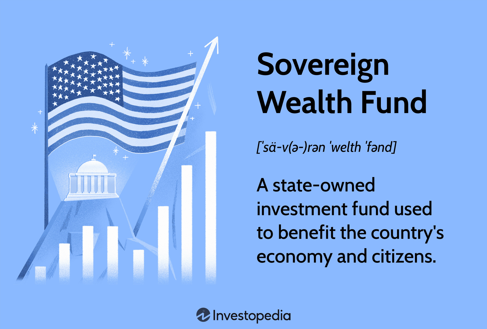

## Table of Contents

## What is a sovereign wealth fund?

A sovereign wealth fund is a big pool of money that a country owns and manages. It's like a giant savings account that the government uses to invest in things like stocks, bonds, and real estate. Countries usually set up these funds using money from selling oil, gas, or other natural resources, or from extra money they have from their budget.

These funds help countries save money for the future, so they can use it when they need it. For example, if a country's oil runs out, they can use the money from the fund to help their economy. Sovereign wealth funds also help countries invest in other countries, which can help them make more money and build better relationships with other nations.

## How do sovereign wealth funds differ from other types of investment funds?

Sovereign wealth funds are different from other investment funds because they are owned and managed by a country's government. This means they are backed by the full faith and credit of the nation, which can make them more stable and trustworthy. Other types of investment funds, like mutual funds or hedge funds, are usually run by private companies or financial institutions. These funds are often focused on making money for their investors, while sovereign wealth funds might have broader goals, like saving for future generations or supporting the country's economy.

Another big difference is where the money comes from. Sovereign wealth funds often get their money from selling natural resources like oil or gas, or from extra money the government has. This is different from other funds, which usually get their money from people or organizations that want to invest. Because of this, sovereign wealth funds can be much bigger and have a longer-term focus. They might invest in things that take a long time to pay off, like infrastructure projects or foreign companies, while other funds might focus on shorter-term gains.

## What are the primary sources of capital for sovereign wealth funds?

Sovereign wealth funds get their money from a few main places. One big source is money from selling natural resources like oil, gas, or minerals. Countries that have a lot of these resources can sell them and put the money into their sovereign wealth fund. This helps them save for the future, especially if they know their resources might run out one day.

Another source of money for sovereign wealth funds is extra money from the government's budget. If a country is doing well and has more money than it needs, it can put that extra money into the fund. This helps the country save for times when it might not have as much money. Sometimes, countries also use money from trade surpluses or foreign exchange reserves to add to their sovereign wealth funds.

## Can you name some of the largest sovereign wealth funds in the world?

Some of the biggest sovereign wealth funds in the world are the Government Pension Fund Global of Norway, the China Investment Corporation, and the Abu Dhabi Investment Authority. Norway's fund is the largest and it gets its money from selling oil and gas. It's used to save for the future and help the country's economy. China's fund is also very big and it uses money from the country's foreign exchange reserves to invest in different things around the world. The Abu Dhabi Investment Authority is another huge fund that comes from oil money and helps the United Arab Emirates invest in many places.

These funds are important because they help their countries save money and invest in the future. They can also help the global economy by investing in different countries and businesses. For example, Norway's fund invests in stocks, bonds, and real estate all over the world. China's fund does the same, and it helps China build relationships with other countries. The Abu Dhabi Investment Authority also invests in many different things, which helps the UAE grow its economy and influence around the world.

## What are the main objectives of sovereign wealth funds?

Sovereign wealth funds have a few main goals. One big goal is to save money for the future. Countries set up these funds to make sure they have money to use when they need it. For example, if a country makes a lot of money from selling oil, it can put that money into a sovereign wealth fund. Then, if the oil runs out one day, the country can use the money from the fund to help its economy. This helps the country plan for the future and make sure it has money even if things change.

Another goal of sovereign wealth funds is to help the country's economy grow. By investing the money in the fund, countries can make more money and create jobs. Sovereign wealth funds often invest in things like stocks, bonds, and real estate in other countries. This can help the country make more money and build better relationships with other nations. It's like putting money into a big savings account that can help the country in many ways.

## How do sovereign wealth funds impact global financial markets?

Sovereign wealth funds have a big impact on global financial markets because they have a lot of money to invest. When these funds buy stocks, bonds, or real estate in other countries, it can move the prices of those investments. For example, if a big sovereign wealth fund decides to buy a lot of shares in a company, the price of those shares might go up. This can affect the whole market because other investors might see the fund's actions as a sign that the company is a good investment. So, sovereign wealth funds can help make markets more stable or sometimes cause big changes in prices.

Another way sovereign wealth funds affect global financial markets is by helping countries work together. When these funds invest in other countries, it can build stronger relationships between nations. This can lead to more trade and investment, which is good for the global economy. For example, if a sovereign wealth fund from one country invests in a company in another country, it can help both countries grow their economies. This kind of investment can also help spread money around the world, making the global financial system more connected and stable.

## What are the governance structures typically found in sovereign wealth funds?

Sovereign wealth funds usually have a special group of people who make the big decisions. This group is often called a board of directors or a governing council. The people on this board are usually chosen by the government, and they are responsible for making sure the fund is run well and follows the country's rules. They decide where the fund's money should be invested and make sure it is used in a way that helps the country's goals. Sometimes, the board also has to report to the government or the public about what they are doing with the fund's money.

Besides the board, sovereign wealth funds also have people who manage the day-to-day work. These people are called the management team, and they take care of things like buying and selling investments, keeping track of the fund's money, and making sure everything is done correctly. The management team works closely with the board to make sure the fund's goals are met. In some countries, there are also special rules or laws that say how the fund should be run, to make sure it is fair and transparent. This helps make sure the fund is used in a way that helps the country and its people.

## How do sovereign wealth funds manage risk and ensure long-term sustainability?

Sovereign wealth funds manage risk by spreading their investments across different types of assets and countries. This is called diversification. By not putting all their money in one place, they can protect themselves if one investment does not do well. For example, if they invest in stocks, bonds, and real estate in different parts of the world, a problem in one market might not hurt the whole fund. They also use experts to study the markets and make smart choices about where to invest. This helps them avoid big losses and keep the fund safe.

To ensure long-term sustainability, sovereign wealth funds focus on investments that will grow over time. They often have a long-term plan that looks far into the future, sometimes many years ahead. This means they might invest in things like infrastructure projects or companies that are expected to do well in the future. They also set clear goals and rules for how the fund should be managed, so it can keep helping the country for a long time. By doing this, they make sure the fund can support the country's economy and people, even when things change.

## What role do sovereign wealth funds play in economic stabilization and development?

Sovereign wealth funds help keep a country's economy stable by saving money for tough times. When a country has extra money, like from selling oil or having a good budget, it can put that money into the fund. Then, if the economy has problems, like if oil prices drop or there's a financial crisis, the country can use the money from the fund to help. This can mean giving money to the government to spend on important things, or investing in businesses to keep them going. By doing this, sovereign wealth funds act like a safety net, making sure the country can handle economic ups and downs.

Sovereign wealth funds also help a country's economy grow and develop. They do this by investing in different things, like stocks, bonds, and real estate, both at home and in other countries. When they invest in other countries, it can bring more money back to their own country and create jobs. It also helps build good relationships with other nations, which can lead to more trade and investment. By focusing on long-term growth, sovereign wealth funds can help make sure the country's economy stays strong and keeps getting better over time.

## How do transparency and accountability affect the operations of sovereign wealth funds?

Transparency and accountability are really important for sovereign wealth funds. When a fund is transparent, it means it tells people what it is doing with its money. This can help build trust with the public and other countries. If people know where the money is going, they are more likely to think the fund is being run well. Accountability means the people in charge of the fund have to explain their actions and can be held responsible if they do something wrong. This helps make sure the fund is used in a way that helps the country and its people.

When sovereign wealth funds are transparent and accountable, it can make their operations better. For example, if the fund has to report what it is doing, it might be more careful about where it invests its money. This can lead to better decisions and less risk. Also, being open about what the fund is doing can help it work better with other countries and businesses. If everyone knows the fund is being run well, they might be more willing to work with it. This can help the fund grow and help the country's economy in the long run.

## What are the ethical considerations and controversies surrounding sovereign wealth funds?

Sovereign wealth funds can sometimes face ethical issues and controversies. One big issue is how the money is used. Some people worry that the government might use the fund's money in ways that are not fair or good for the country. For example, they might invest in companies that harm the environment or do not treat workers well. There are also concerns about whether the fund's investments help the country's people or just make a few people richer. This can lead to debates about what the fund should be doing and how it should be run.

Another controversy is about transparency and control. Some sovereign wealth funds are not very open about what they are doing with their money. This can make people suspicious and worried that the fund is being used in secret ways. There are also questions about who should be in charge of the fund and how much power they should have. If the government has too much control, it might use the fund for political reasons instead of helping the country's economy. These issues can lead to big debates and sometimes even protests about how sovereign wealth funds should work.

## How might future trends and geopolitical shifts influence the strategies of sovereign wealth funds?

Future trends and geopolitical shifts could change how sovereign wealth funds work. As the world moves towards more green energy, countries that rely on oil and gas might need to change their strategies. They might invest more in renewable energy projects to make sure they have money in the future. Also, as technology grows, sovereign wealth funds might put more money into tech companies and new inventions. This can help them stay ahead and make more money in the long run. Geopolitical changes, like new trade deals or conflicts between countries, can also affect where sovereign wealth funds invest. They might need to be careful about investing in certain countries or regions if there are tensions or risks.

Another big trend is the focus on sustainability and social responsibility. More and more, people want companies and funds to think about the environment and treat workers well. Sovereign wealth funds might start to invest more in companies that are good for the planet and society. This can help them build a better image and attract more investors. At the same time, they need to balance these goals with making money. Geopolitical shifts can also push sovereign wealth funds to work more with other countries. For example, if countries form new alliances, funds might invest more in those countries to build stronger relationships. All these changes mean sovereign wealth funds need to be flexible and ready to adapt their strategies to stay successful.

## References & Further Reading

[1]: Bergstra, J., Bardenet, R., Bengio, Y., & Kégl, B. (2011). ["Algorithms for Hyper-Parameter Optimization."](https://papers.nips.cc/paper/4443-algorithms-for-hyper-parameter-optimization) Advances in Neural Information Processing Systems 24.

[2]: ["Advances in Financial Machine Learning"](https://www.amazon.com/Advances-Financial-Machine-Learning-Marcos/dp/1119482089) by Marcos Lopez de Prado

[3]: ["Evidence-Based Technical Analysis: Applying the Scientific Method and Statistical Inference to Trading Signals"](https://www.amazon.com/Evidence-Based-Technical-Analysis-Scientific-Statistical/dp/0470008741) by David Aronson

[4]: ["Machine Learning for Algorithmic Trading"](https://github.com/stefan-jansen/machine-learning-for-trading) by Stefan Jansen

[5]: ["Quantitative Trading: How to Build Your Own Algorithmic Trading Business"](https://www.amazon.com/Quantitative-Trading-Build-Algorithmic-Business/dp/1119800064) by Ernest P. Chan