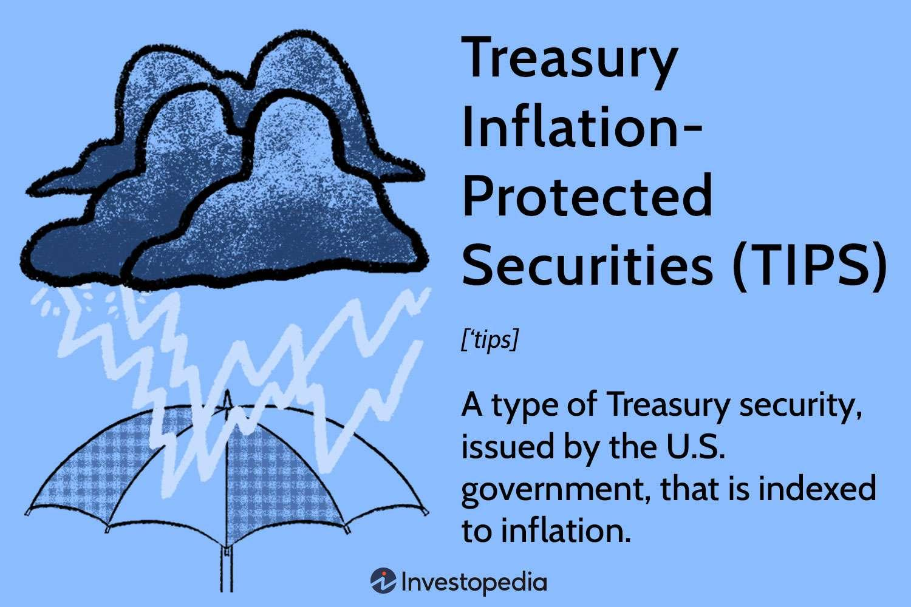

## Table of Contents

## What are Treasury Inflation-Protected Securities (TIPS)?

Treasury Inflation-Protected Securities, or TIPS, are a type of bond issued by the U.S. government. They are designed to help protect investors from inflation. When you buy TIPS, the principal amount of the bond goes up or down with inflation. This means that if prices rise, the value of your bond increases, and when you get your money back at the end, it will be worth more. If prices fall, the value might go down, but it will never be less than the original amount you invested.

TIPS pay interest every six months, but the interest rate stays the same. Because the principal amount changes with inflation, the interest payments you receive can also change. For example, if inflation goes up, the principal increases, so the interest payment you get will be larger. TIPS are considered a safe investment because they are backed by the U.S. government, and they help your money keep up with the cost of living.

## How do TIPS protect against inflation?

TIPS protect against inflation by adjusting the bond's principal value based on changes in the Consumer Price Index (CPI). If inflation goes up, the CPI increases, and so does the principal of your TIPS. This means that if you bought a TIPS for $1,000 and inflation rises by 2%, your principal would increase to $1,020. This adjustment happens every six months, helping to keep the value of your investment in line with the cost of living.

The [interest rate](/wiki/interest-rate-trading-strategies) on TIPS stays the same throughout the life of the bond, but because the principal changes, the actual interest payment you receive also changes. For example, if your TIPS has a 1% interest rate and the principal goes up to $1,020, you would get interest payments based on that new, higher principal. This way, TIPS not only protect the value of your initial investment but also ensure that the interest you earn keeps pace with inflation.

## What is the difference between the principal and interest of TIPS?

The principal of TIPS is the main amount of money you invest in the bond. It changes with inflation. If inflation goes up, the principal goes up too, so your money keeps its value. If inflation goes down, the principal might go down, but it will never be less than what you originally paid. This means TIPS help protect your investment from losing value because of inflation.

The interest of TIPS is the money you earn on the bond. The interest rate stays the same for the whole time you own the bond, but the actual interest payment changes because it is based on the principal. If the principal goes up because of inflation, the interest payment goes up too. This way, the interest you earn also keeps up with inflation.

## How are TIPS priced and what affects their market value?

TIPS are priced based on a few things, like how much inflation is expected, the interest rate set by the government when they are issued, and what people think about the economy. When TIPS are first sold, they are usually priced at $1,000, which is called the face value. But after that, their price can go up or down based on what's happening in the market. If people think inflation will go up a lot, they might be willing to pay more for TIPS, which makes the price go up. If they think inflation will stay low, the price might go down.

The market value of TIPS can change because of different things. One big thing is how much inflation is expected in the future. If people think inflation will be high, TIPS become more valuable because they protect against inflation. Another thing that can change the market value is interest rates. If interest rates go up, the price of TIPS might go down because new bonds might offer better rates. Also, if the economy is doing well or if there's a lot of uncertainty, that can affect how people see TIPS and change their market value.

## What is the process for buying and selling TIPS?

Buying TIPS is pretty easy. You can buy them directly from the U.S. Treasury through their website, TreasuryDirect.gov. You just need to set up an account, and then you can buy TIPS when they are offered, usually in auctions that happen several times a year. You can also buy TIPS from a bank or a broker, but you might have to pay a fee. When you buy TIPS, you choose how much you want to spend and how long you want to keep the bond, which can be 5, 10, or 30 years.

Selling TIPS is also straightforward. If you bought your TIPS through TreasuryDirect, you can sell them back to the Treasury before they mature. You do this through the same website, and you'll get the current market value of the TIPS, which can be more or less than what you paid, depending on what's happening with inflation and interest rates. If you bought your TIPS through a bank or broker, you can sell them through that same bank or broker. They will handle the sale and might charge you a fee for their service.

## Who should consider investing in TIPS?

People who are worried about inflation should think about investing in TIPS. Inflation means prices go up, and if you have money saved, it might not buy as much in the future. TIPS help protect your money because they go up in value when prices go up. This is good for people saving for retirement or anyone who wants their money to keep its value over time.

Also, TIPS might be a good choice for people who want a safe investment. They are backed by the U.S. government, so they are very secure. If you don't like taking big risks with your money, TIPS can be a way to keep your savings safe while still getting some protection against inflation.

## How do TIPS compare to other inflation-indexed securities?

TIPS are a type of bond from the U.S. government that helps protect your money from inflation. They are similar to other inflation-indexed securities around the world, like the UK's Index-Linked Gilts and Canada's Real Return Bonds. All these securities work in a similar way: they adjust the bond's value based on changes in the cost of living. The main difference is where they come from and how they measure inflation. TIPS use the U.S. Consumer Price Index (CPI), while other countries might use different measures.

Another difference is how often the adjustments happen. TIPS adjust every six months, but some other inflation-indexed securities might adjust more or less often. Also, the interest rates and the way you can buy and sell these securities can be different depending on the country. But the main goal is the same: to help protect your money from losing value because of inflation. If you're looking for a safe way to keep your money's value, TIPS and similar securities from other countries can be good options.

## What are the tax implications of investing in TIPS?

When you invest in TIPS, you have to pay taxes on both the interest you earn and the increase in the principal because of inflation. The interest you get every six months is taxed as regular income. This means you'll pay taxes on it at the same rate as your salary or wages. The tricky part is the increase in the principal. Even though you don't get this money until the TIPS matures or you sell it, you still have to pay taxes on it every year. This can be confusing because you're paying taxes on money you haven't actually received yet.

To make things a bit easier, you can hold TIPS in a tax-deferred account like an IRA or a 401(k). This way, you won't have to pay taxes on the interest or the increase in the principal until you take the money out of the account. But if you hold TIPS in a regular investment account, you'll need to keep track of the inflation adjustments and report them on your taxes every year. It's a good idea to talk to a tax professional to make sure you're doing everything right and taking advantage of any tax benefits you might be eligible for.

## How does the deflationary adjustment work with TIPS?

When you invest in TIPS, they are designed to protect your money from inflation. But what if there's deflation, which means prices go down instead of up? With TIPS, if deflation happens, the principal of your bond can go down too. But there's a safety net: the principal will never go below the original amount you paid for the bond. So, if you bought a TIPS for $1,000 and deflation causes the principal to drop, it can go down to $1,000 but no lower.

Even if the principal goes down because of deflation, you still get interest payments every six months. The interest rate stays the same, but the interest payment is based on the adjusted principal. So, if deflation reduces the principal, your interest payment will be smaller. But remember, the principal can't go below your initial investment, so your money is still protected to some extent.

## What historical performance data is available for TIPS?

TIPS have been around since 1997, and their performance has gone up and down over the years, just like other investments. They are meant to help protect your money from inflation, so when inflation goes up, TIPS usually do well. For example, during times of high inflation, like the early 2000s and again in the late 2000s, TIPS saw good returns because their principal and interest payments went up with inflation. But when inflation is low or there's deflation, like during the 2008 financial crisis, TIPS might not do as well because their principal might not grow much or could even go down a bit.

Over the long term, TIPS have generally provided a steady return that keeps up with inflation. If you look at the data, you'll see that TIPS have had an average annual return of around 2-3% above inflation over many years. This means if inflation was 2%, you might expect to get a return of about 4-5% from TIPS. But remember, past performance doesn't tell you what will happen in the future. It's always a good idea to look at the bigger picture and think about your own investment goals when deciding if TIPS are right for you.

## How do TIPS fit into a broader investment strategy?

TIPS can be a good part of your overall investment plan, especially if you want to protect your money from inflation. They are safe because they are backed by the U.S. government, so they can help balance out riskier investments like stocks. If you put some of your money into TIPS, it can help make sure that part of your savings keeps up with the cost of living. This is really helpful if you are saving for retirement or have a long-term goal where you want your money to stay valuable over time.

Adding TIPS to your investment mix can also help spread out your risk. If you have a lot of money in stocks or other things that can go up and down a lot, TIPS can give you some stability. They don't usually change in value as much as stocks, so they can help keep your overall investment steady. This way, if the stock market goes down, your TIPS can help cushion the fall and keep your savings safe.

## What are the potential risks and limitations of investing in TIPS?

Investing in TIPS can be a smart move to protect your money from inflation, but there are some risks and limitations to keep in mind. One big risk is interest rate risk. If interest rates go up after you buy TIPS, the value of your TIPS might go down. This happens because new TIPS with higher interest rates become more attractive, making older TIPS less valuable. Also, while TIPS are meant to protect against inflation, they might not do as well if inflation stays low or if there's deflation. In those cases, the principal might not grow much or could even go down a bit, though it will never fall below your original investment.

Another limitation is the tax situation with TIPS. You have to pay taxes on the interest you earn and the increase in the principal every year, even if you haven't received that money yet. This can be tricky and might reduce the actual benefit you get from TIPS. Holding them in a tax-deferred account like an IRA can help with this, but not everyone has access to such accounts. Also, TIPS might not offer the highest returns compared to other investments like stocks. While they are safer, they usually don't grow as fast, so if you're looking for big gains, TIPS might not be the best choice.

## What are TIPS and how can they be understood?

Treasury Inflation-Protected Securities (TIPS) are U.S. Treasury bonds designed to shield investors from the adverse effects of inflation. Unlike standard Treasury bonds, TIPS offer a principal value that adjusts according to inflation, thereby preserving the purchasing power of the investment.

The core mechanism that distinguishes TIPS from regular bonds is their linkage to the Consumer Price Index (CPI), a widely used measure of inflation. As inflation occurs, the principal value of TIPS increases, reflecting the rise in prices. Conversely, in periods of deflation, the principal value decreases. This adjustment ensures that the real value of the investment is maintained over time, safeguarding investors from the erosion of purchasing power due to inflation.

Interest payments on TIPS are made semi-annually and are based on the adjusted principal. This means that the interest payments themselves are inflation-protected. The formula for calculating the interest payment is as follows:

$$
\text{Interest Payment} = \left( \frac{\text{Coupon Rate}}{2} \right) \times \text{Adjusted Principal}
$$

Here, the coupon rate is determined at the issuance of the TIPS and remains fixed throughout the life of the bond. The Adjusted Principal, however, fluctuates with inflation or deflation, ensuring that each interest payment reflects current economic conditions. For instance, if inflation causes the principal to rise, the interest payment correspondingly increases, providing further protection against inflationary loss.

The dual benefit of TIPS, comprising the stability of U.S. government bonds and the adaptive nature of the principal and interest payments, renders them an appealing option in inflation-conscious investment strategies. TIPS offer an investment vehicle where the real rate of return is maintained, aligning with the primary goal of safeguarding the investor's purchasing power against the backdrop of fluctuating economic conditions.

## What are the benefits of investing in TIPS?

Treasury Inflation-Protected Securities (TIPS) present a secure investment option, backed by the full faith and credit of the U.S. government, designed specifically to help investors combat inflation effectively. By ensuring that the bond's principal increases with inflation, TIPS safeguard the purchasing power of an investor's earnings. This intrinsic inflation-indexing mechanism leads to a notable reduction in the impact of inflation on investment returns, maintaining their real value over time.

### Portfolio Diversification and Risk Reduction

Incorporating TIPS into an investment portfolio can substantially enhance diversification, a critical strategy for minimizing risk. By holding assets that react differently to economic changes, such as inflation-indexed bonds alongside stocks or traditional fixed-income securities, investors can achieve a more balanced portfolio that mitigates [volatility](/wiki/volatility-trading-strategies). This diversification stems from the unique response of TIPS to inflationary trends, which often moves countercyclically to other fixed-income assets. For instance, during inflationary periods, where nominal bond prices might falter, TIPS adjust to preserve value, offering stability that conventional securities lack.

### Inflation Hedge

A significant advantage of TIPS is their role as an effective hedge against inflation, a feature that is increasingly vital in an era marked by variable economic conditions and fiscal stimuli. Unlike regular bonds that offer fixed interest returns vulnerable to inflation erosion, TIPS provide protection by adjusting both the principal value and interest payouts according to the Consumer Price Index (CPI). This adjustment ensures that the real yield remains constant, maintaining investor purchasing power.

Consider the formula for the adjusted principal of TIPS:

$$
\text{Adjusted Principal} = \text{Original Principal} \times (1 + \text{Inflation Rate})
$$

With interest payments calculated on this adjusted principal, TIPS ensure that the actual income stream benefits directly from inflationary pressures, unlike nominal bonds. Consequently, as inflation rates rise, so too does the yield on TIPS, providing a potent buffer against erosion of asset value.

### Strategic Role in Fixed-Income Portfolios 

In fixed-income portfolios, TIPS are uniquely positioned to address the limitations of other securities that offer fixed payments, which might lag inflationary growth. While traditional bonds might suffer real-value depreciation during inflationary times, TIPS continue to align with economic shifts due to their dynamic adjustment, offering a reliable income source. As part of a broader income strategy, they also enhance the portfolio's risk-adjusted returns by contributing a resilient asset that responds favorably when inflation manifests.

In summary, TIPS serve as a critical investment vehicle for maintaining real returns amid inflationary environments, while also providing significant benefits in terms of diversification and risk control within income portfolios. Their structural adaptation to inflation changes ensures that investors are shielded from purchasing power diminutions, thus effectively enabling the preservation of wealth.

## References & Further Reading

[1]: ["Treasury Inflation-Protected Securities (TIPS)."](https://www.treasurydirect.gov/indiv/products/prod_tips_glance.htm) U.S. Department of the Treasury.

[2]: Bodie, Z. (1990). "Inflation-Indexed Bonds: An Asset Allocation Puzzle." Journal of Fixed Income, 3(3), 47-55.

[3]: ["Investing in TIPS: Treasury Inflation Protected Securities"](https://money.usnews.com/investing/articles/how-to-invest-in-tips-treasury-inflation-protected-securities) by Dana Anspach, The Balance.

[4]: ["Algorithmic Trading and DMA: An Introduction to Direct Access Trading Strategies"](https://archive.org/details/algorithmictradi0000john) by Barry Johnson.

[5]: Fabozzi, F. J., & Mann, S. V. (2005). "Introduction to Fixed Income Analytics: Relative Value Analysis, Risk Measures, and Valuation." John Wiley & Sons. 

[6]: ["Understanding Inflation-Indexed Bond Markets"](https://www.brookings.edu/articles/understanding-inflation-indexed-bond-markets/) by Rhys Bidder and Pecchenino, Federal Reserve Bank of San Francisco.