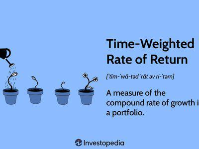

In the ever-evolving landscape of financial markets, investors are continually seeking strategies to maximize returns and manage risks. The convergence of investment strategies, overweight investing, financial analysis, and algorithmic trading represents a sophisticated approach to navigating modern investment opportunities. Each of these strategies plays a crucial role in optimizing portfolio performance and addressing the challenges posed by market volatility and economic uncertainty.

Investment strategies form the backbone of effective portfolio management. By understanding market dynamics and evaluating asset classes, investors can better position themselves to achieve their financial goals. Overweight investing involves allocating a disproportionately higher amount of capital to certain assets or sectors relative to benchmark indices, based on expectations of higher returns or anticipated favorable economic changes. This strategic allocation requires a deep understanding of market trends and potential performance deviations from standard indices.

Financial analysis is essential for informed decision-making in investments. It encompasses a range of tools and techniques to evaluate the valuation, risk, and performance potential of various stocks and sectors. Mastery of financial metrics is crucial for determining whether certain assets should be overweighted within a portfolio. These analyses often lead to more targeted investment choices that align with an investor's risk tolerance and return objectives.

Algorithmic trading introduces the advantage of speed and precision in executing trades. By leveraging advanced computer algorithms, investors can execute trades at speeds unattainable by humans, taking advantage of fleeting market opportunities. Algorithmic strategies, including trend following, arbitrage, and mean reversion, not only enhance the execution of trades but also support overweight investment strategies by providing real-time data analysis and decision-making insights.

This article illuminates the increasing sophistication of modern investment techniques by examining these strategies both independently and in conjunction. Understanding the synergy between these approaches equips investors with the tools necessary to navigate market complexities and strategically pursue enhanced portfolio performance.

## Table of Contents

## Understanding Overweight Investing

Overweight investing is an investment strategy where more capital is allocated to particular assets or sectors than suggested by a benchmark index. This approach is often adopted when investors anticipate that a specific asset or sector will yield higher returns compared to others. The decision to overweight might stem from various factors affecting financial markets and individual assets.

Factors influencing overweight recommendations include broad economic indicators, company-specific developments, and market trends. For example, an investor might choose to overweight technology stocks if there is a forecast for significant technological innovation or growth within the sector. Similarly, economic indicators such as GDP growth, interest rates, and inflation can impact sector performance, prompting investors to reallocate their portfolios.

Overweighting in sectors like renewable energy might be driven by anticipated regulatory changes favoring clean energy or shifts in consumer demand towards sustainable products. In contrast, an overweight position in a declining industry might be perceived as riskier, as it relies heavily on the investor's conviction about an upcoming turn-around or specific undervaluation.

Portfolio management involves balancing overweight positions with the rest of the portfolio to maintain a desired risk profile. This requires a comprehensive understanding of how each investment affects the overall portfolio. For example, overweighting one sector may increase the portfolio's exposure to macroeconomic risks specific to that sector.

For effective portfolio management, investors often use quantitative models to evaluate the impacts of overweight decisions. This involves calculating expected returns based on varying weights of assets, often leveraging the capital asset pricing model (CAPM). The CAPM is expressed as:

$$

E(R_i) = R_f + \beta_i (E(R_m) - R_f) 
$$

Where:
- $E(R_i)$ is the expected return of the investment
- $R_f$ is the risk-free rate
- $\beta_i$ is the beta of the investment, measuring its volatility relative to the market
- $E(R_m)$ is the expected return of the market

Investors use such models to decide whether the additional risk from overweighting a sector is justified by its potential return. The implications of such decisions are seen in the portfolio's risk-return profile, requiring continuous monitoring to ensure alignment with the investor’s objectives and risk tolerance.

In summary, overweight investing demands thorough research, constant monitoring, and a strategic approach to risk management, making it a sophisticated yet potentially rewarding investment strategy.

## Financial Analysis in Investment Strategies

Financial analysis is integral to making informed investment decisions. It involves evaluating the valuation and performance potential of stocks and sectors using various analytical tools and techniques. These analyses help investors determine whether to allocate more resources to a particular investment within a portfolio, a strategy known as overweight investing.

Several techniques are employed in financial analysis:

1. **Fundamental Analysis**: This method assesses a company's intrinsic value by examining related economic, financial, and other qualitative and quantitative factors. Analysts use metrics like Price-to-Earnings (P/E) ratio, Earnings Per Share (EPS), and Return on Equity (ROE) to gauge a company's performance and potential. A stock with a lower P/E ratio compared to industry peers might be considered undervalued, suggesting a potential overweight position.

2. **Technical Analysis**: This involves studying past market data, primarily price and volume, to forecast future price movements. Tools such as moving averages, relative strength index (RSI), and moving average convergence divergence (MACD) are employed to identify patterns and trends that might signal a favorable time to overweight a stock.

3. **Quantitative Analysis**: This uses mathematical and statistical models to evaluate investment opportunities. For instance, the Capital Asset Pricing Model (CAPM) helps investors understand the expected return on an investment relative to its risk. The formula for CAPM is:
$$
   \text{Expected Return} = R_f + \beta (R_m - R_f)

$$

   Where $R_f$ is the risk-free rate, $\beta$ is the stock's beta, reflecting its [volatility](/wiki/volatility-trading-strategies) in relation to the market, and $R_m$ is the expected market return.

4. **Risk Assessment Tools**: These tools measure a portfolio's risk exposure. The Sharpe Ratio, calculated as:
$$
   \text{Sharpe Ratio} = \frac{R_p - R_f}{\sigma_p}

$$

   where $R_p$ is the portfolio return, $R_f$ is the risk-free rate, and $\sigma_p$ is the portfolio's standard deviation, helps in understanding the risk-adjusted return of a portfolio.

Understanding financial metrics is crucial for making overweight decisions. Metrics like cash flow analysis, debt ratios, and sector-specific indicators provide insights into a company's financial health and industry position. By evaluating these factors, investors can identify opportunities where the market's perception of a stock's potential may not fully reflect its intrinsic value, making it a candidate for overweighting in a portfolio. 

Financial analysis, through its various methods and metrics, empowers investors to make decisions that align with their investment goals and risk tolerance, ultimately enhancing portfolio performance.

## Algorithmic Trading: Merging Technology with Investing

Algorithmic trading employs computer algorithms to execute trades at speeds and volumes that surpass human capability. This approach utilizes complex mathematical models and formulas to make high-speed financial decisions, allowing traders to capture opportunities that human traders might miss due to speed limitations. Distinguished by its efficiency, [algorithmic trading](/wiki/algorithmic-trading) is instrumental in implementing strategies such as [trend following](/wiki/trend-following), [arbitrage](/wiki/arbitrage), and mean reversion.

Trend following strategies capitalize on the inertia of market prices. They identify upward or downward trends in asset prices over various timeframes and execute trades to align with these trends. Algorithms in trend following can swiftly analyze historical data to project potential future price movements, thus optimizing entry and [exit](/wiki/exit-strategy) points for trades. For example, moving averages are commonly used to detect trends; an algorithm might buy when the short-term moving average crosses above a long-term moving average, and sell when the opposite occurs.

Arbitrage strategies exploit price discrepancies in different markets or instruments to secure risk-free profits. Algorithmic trading enables the rapid comparison of prices across exchanges and instantaneously executes trades when anomalies are detected. For instance, if a stock is priced lower on one exchange than another, the algorithm can buy on the lower-priced exchange and sell on the higher-priced one, [earning](/wiki/earning-announcement) a profit from the difference.

Mean reversion is based on the principle that prices and returns eventually move back to the mean or average over time. Algorithms monitor real-time prices and calculate the deviation from historical averages, executing trades to profit from the expected reversion. A crucial concept here is the z-score, which measures the number of standard deviations a data point is from the mean:
$$
\text{Z-score} = \frac{X - \mu}{\sigma}
$$
where $X$ is the observed price, $\mu$ is the average price, and $\sigma$ is the standard deviation of prices. The algorithm might trigger a trade if the z-score indicates a significant deviation, suggesting that the price is likely to revert.

Advanced technologies underpinning algorithmic trading include [machine learning](/wiki/machine-learning) and [artificial intelligence](/wiki/ai-artificial-intelligence), which enhance decision-making and operational efficiency. These technologies can process vast datasets, identify patterns invisible to the human eye, and adapt to new market conditions dynamically. Machine learning models can be trained on historical market data to predict price movements or identify optimal trading strategies, continually refining their performance as more data is ingested.

Furthermore, algorithmic trading systems are designed to minimize emotional and psychological biases that often affect human traders. Automated systems make decisions based purely on data and pre-set criteria, reducing the risk of errors due to human sentiment or subjective judgment.

Incorporating machine learning into algorithmic trading strategies can also support overweight investing by methodically adjusting asset weights in a portfolio based on predictive analytics. This could involve reallocating capital towards assets with higher expected returns or lower perceived risks, as predicted by sophisticated algorithmic models. The integration of technology in trading processes significantly enhances speed, accuracy, and flexibility, offering investors a powerful tool to improve their market engagement and optimize portfolio strategies.

## Integrating Overweight Investing with Algo Trading

Combining overweight investing with algorithmic trading can significantly enhance portfolio performance by leveraging the strengths of both strategies. Algorithmic trading enables investors to implement complex financial strategies swiftly and efficiently, making it ideal for adjusting overweight positions in response to fluctuating market conditions. This combination allows investors to capitalize on opportunities while mitigating risks through data-driven decisions.

Algorithms are designed to analyze vast datasets, monitoring market trends, sector performance, and economic indicators in real-time. By using such algorithms, investors can continually assess their overweight positions and make timely adjustments based on quantitative data analysis. This capability is crucial in maintaining an optimal asset allocation that aligns with both current market conditions and future projections.

A practical application of integrating these strategies is the use of market trend algorithms, which are programmed to identify upward or downward patterns in asset prices. For instance, if an investor has an overweight position in a technology sector [ETF](/wiki/etf-trading-strategies) and the algorithm detects a broad market shift favoring technology stocks, the algorithm can automatically increase the allocation to this sector. Conversely, if a downward trend is identified, the algorithm can decrease the exposure, thereby managing risk.

Another example involves the use of mean reversion strategies, where algorithms are configured to exploit the tendency of asset prices to revert to their historical means after large fluctuations. By analyzing statistical metrics such as moving averages, Bollinger Bands, or the Relative Strength Index (RSI), algorithms can instruct the portfolio to adjust overweight positions as assets move away from their average values, capitalizing on expected corrections.

Furthermore, algorithmic trading enables [backtesting](/wiki/backtesting) of overweight investment strategies against historical data, allowing investors to assess the viability and risk-reward profiles of their approaches before deployment. This reinforcement of data-driven decision-making reduces the uncertainty inherent in financial markets.

Real-world scenarios highlight the synergy between human expertise and automated systems in optimizing these strategies. Institutional investors often employ quantitative analysts to refine algorithms that monitor integration signals, ensuring that the algorithmic responses align with broader investment objectives and market forecasts. The human element remains crucial for setting strategic priorities and overseeing automated processes to maintain control over algorithmic outcomes.

The integration of overweight investing with algorithmic trading exemplifies how technology can enhance traditional investment strategies, allowing for more precise and informed decisions. However, this synergy requires continuous monitoring and refinement to address unexpected market developments and to adapt to technological advancements.

## Pros and Cons of Algorithmic and Overweight Strategies

Algorithmic and overweight investing strategies offer significant advantages, but they also [carry](/wiki/carry-trading) specific risks that must be carefully managed. Algorithmic trading allows for high-frequency trading and can process vast datasets to derive insights quicker than human capability. This precision and speed enable investors to capitalize on fleeting market opportunities, potentially leading to higher returns. Overweight investing strategically allocates more funds to select assets or sectors, aiming to outperform a benchmark index. When combined, these strategies can harness data-driven decision-making to optimize portfolio performance.

However, the integration of quantitative algorithms and focused investments risks reduced diversification. Overweight positions concentrate exposure in particular assets or sectors, which can amplify losses if market conditions turn adverse. The concept of diversification is a cornerstone in mitigating the idiosyncratic risk associated with individual investments. 

Moreover, reliance on technology introduces potential pitfalls like algorithmic errors or technology failures. Such events can result from coding flaws, unforeseen market scenarios, or cybersecurity threats. For example, a faulty algorithm might misinterpret a sudden market movement, leading to a cascade of erroneous trades. Therefore, robust risk management protocols are vital to minimize such risks.

Risk management involves not only setting stop-loss limits and maintaining appropriate asset allocations but also conducting exhaustive algorithm testing and maintaining a level of human oversight. Regular algorithm audits to ensure they perform as expected under various market conditions are crucial. It's equally important for investors to embed redundancy measures within their trading systems to protect against technology failures.

Furthermore, the combination of these investment strategies requires a careful balance to navigate significant market shifts without incurring excessive risk. The application of diversified practices and maintaining a portfolio that can withstand different economic scenarios will contribute to more stable, long-term gains. 

Ultimately, while algorithmic and overweight investing strategies provide a framework for potentially higher returns and market insight, investors should remain vigilant to their complexities and inherent risks. Staying educated about evolving market conditions and consulting financial professionals can help to make informed decisions while appropriately leveraging these sophisticated investment techniques.

## Conclusion

Investment strategies continue to evolve through technological integration, enhancing both efficiency and precision in financial decision-making. Overweight investing and algorithmic trading shine as potent strategies that potentially enhance portfolio performance. Overweight investing enables investors to take advantage of perceived opportunities by allocating additional capital to specific sectors or assets. On the other hand, algorithmic trading utilizes sophisticated software to execute trades with unmatched speed and accuracy, minimizing human error and maximizing the exploitation of market inefficiencies.

Despite their potential, these strategies are accompanied by challenges and risks. Overweight investing increases exposure to specific sectors, which can lead to reduced diversification and heightened vulnerability to market volatility. Algorithmic trading, while efficient, is subject to technological risks such as software glitches or cyber threats, which can result in significant financial losses.

Therefore, investors must maintain vigilance and remain well-informed to effectively navigate the financial landscape. Continuous education and consultation with financial professionals are crucial for optimizing the use of these strategies. By staying abreast of market developments and technological advancements, investors can adeptly manage the balance between the benefits and risks inherent in these sophisticated investment techniques, ultimately aiming for a well-managed and diversified portfolio.

## References & Further Reading

[1]: Bergstra, J., Bardenet, R., Bengio, Y., & Kégl, B. (2011). ["Algorithms for Hyper-Parameter Optimization."](https://dl.acm.org/doi/10.5555/2986459.2986743) Advances in Neural Information Processing Systems 24.

[2]: ["Advances in Financial Machine Learning"](https://www.amazon.com/Advances-Financial-Machine-Learning-Marcos/dp/1119482089) by Marcos Lopez de Prado

[3]: ["Evidence-Based Technical Analysis: Applying the Scientific Method and Statistical Inference to Trading Signals"](https://www.amazon.com/Evidence-Based-Technical-Analysis-Scientific-Statistical/dp/0470008741) by David Aronson

[4]: ["Machine Learning for Algorithmic Trading"](https://github.com/stefan-jansen/machine-learning-for-trading) by Stefan Jansen

[5]: ["Quantitative Trading: How to Build Your Own Algorithmic Trading Business"](https://www.amazon.com/Quantitative-Trading-Build-Algorithmic-Business/dp/1119800064) by Ernest P. Chan