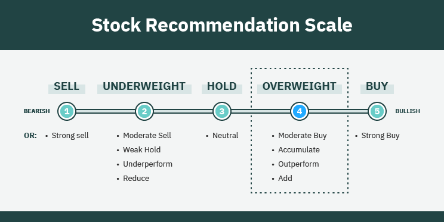

## Table of Contents

## What is meant by 'overweight' in the context of investing?

In the context of investing, 'overweight' is a term used by analysts and portfolio managers to describe a situation where they believe a particular stock, sector, or asset class will perform better than the overall market. When a portfolio manager says they are overweight in a certain stock, it means they have allocated a larger portion of their portfolio to that stock compared to its representation in the benchmark index, like the S&P 500. This indicates their strong belief in the future growth or stability of that investment.

For example, if a fund manager thinks the technology sector will do better than other sectors, they might choose to have a bigger part of their fund invested in tech stocks. This is called being overweight in technology. By doing this, the manager is trying to take advantage of the expected strong performance of the tech sector to boost the overall returns of their portfolio.

## How is an overweight position determined in a portfolio?

An overweight position in a portfolio is decided by looking at how much of the portfolio is put into a certain stock, sector, or type of investment compared to a standard benchmark, like the S&P 500. If a portfolio manager thinks a particular investment will do better than the overall market, they will put more money into it than what the benchmark suggests. For example, if the benchmark has 10% in tech stocks, but the manager puts 15% in tech, the portfolio is overweight in tech.

This decision is often based on the manager's research and predictions about which investments will perform well in the future. They might use different tools and data to help them decide. If they believe a sector like healthcare will grow a lot, they might choose to have a bigger part of the portfolio in healthcare stocks. This way, they hope to get better returns for the people who invest in their portfolio.

## What are the common reasons an investor might choose to be overweight in a particular asset or sector?

An investor might choose to be overweight in a particular asset or sector because they believe it will do better than other parts of the market. They might see that a sector, like technology, is growing fast and think it will keep growing. They could also look at news or trends and decide that a certain type of investment will be popular soon. For example, if they think more people will start using electric cars, they might put more money into companies that make electric cars or their batteries.

Another reason could be that the investor wants to spread their risk. If they already have a lot of money in other types of investments, they might choose to be overweight in a sector that they think is safer or less likely to lose value. This way, they can balance out their portfolio and feel more secure about their investments. Sometimes, they might also follow advice from experts or financial reports that suggest being overweight in a certain area could lead to better returns.

## What are the potential benefits of having an overweight position in a portfolio?

Having an overweight position in a portfolio can help an investor make more money if they pick the right asset or sector. If they think a certain part of the market, like technology, will do really well, they can put more money into it. If technology stocks go up a lot, the investor's portfolio will grow more than if they had just followed the market. This way, they can take advantage of big trends and get bigger returns.

Another benefit is that it can help manage risk. If an investor already has a lot of money in other types of investments, they might choose to be overweight in something they think is safer. This can balance out their portfolio and make it less likely to lose a lot of value all at once. By focusing more on a sector they believe in, they can feel more confident about their investments and potentially protect their money better.

## What risks are associated with being overweight in a specific investment?

Being overweight in a specific investment can be risky because if that investment does not do well, it can hurt the whole portfolio a lot. If an investor puts a lot of money into one stock or sector and it goes down, the losses can be bigger than if they had spread their money out more evenly. For example, if someone is overweight in tech stocks and the tech industry has a bad year, their portfolio might lose a lot of value.

Another risk is that being overweight might make the portfolio less balanced. If an investor focuses too much on one area, they might miss out on other good opportunities in the market. This can make their portfolio less diverse and more vulnerable to changes in just one part of the market. It's important for investors to think about how being overweight in one investment could affect their overall strategy and risk level.

## How does being overweight in one area affect the overall diversification of a portfolio?

Being overweight in one area can make a portfolio less diverse. When an investor puts a lot of money into one stock, sector, or type of investment, they are not spreading their money out as much. This means they are relying more on that one area to do well. If other parts of the market are doing great but the investor's overweight area is not, they might miss out on those gains. Diversification is important because it helps reduce risk by not putting all the eggs in one basket.

Having a less diverse portfolio because of an overweight position can also make it more vulnerable to big losses. If the area where the investor is overweight does badly, it can drag down the whole portfolio. For example, if someone is overweight in tech stocks and the tech industry has a bad year, their portfolio could lose a lot of value. Balancing an overweight position with other investments can help manage this risk, but it's important to think about how being overweight affects the overall mix of the portfolio.

## What are some strategies to manage an overweight position effectively?

One way to manage an overweight position is to keep an eye on how it's doing. If the stock or sector is doing well, the investor might decide to keep the overweight position. But if it starts to do badly, they might want to sell some of it to reduce the risk. Another way is to balance the portfolio by adding more investments in other areas. This can help spread out the risk and make the portfolio more diverse. If the investor thinks the overweight position will still do well but wants to be safer, they can slowly add more to other parts of the portfolio over time.

Another strategy is to set clear goals and limits for the overweight position. The investor can decide how much they want to gain or lose before making changes. If the investment reaches those goals or limits, they can adjust their position. This helps keep emotions out of the decision and makes it more about the numbers. It's also a good idea to regularly check the whole portfolio and see if the overweight position still makes sense. Things in the market can change, and what was a good idea before might not be the best choice now.

## How can investors use market analysis to decide when to take an overweight position?

Investors can use market analysis to decide when to take an overweight position by looking at different pieces of information about the market. They might look at trends, like if a certain sector is growing a lot or if people are starting to buy more of a certain type of product. They can also read reports from experts that talk about which parts of the market might do well in the future. By putting all this information together, an investor can decide if it makes sense to put more money into a specific stock or sector.

Another way to use market analysis is by looking at how the economy is doing overall. If the economy is growing and people are spending more money, some sectors might do better than others. For example, if the economy is strong, people might buy more cars, so the car industry could be a good place to be overweight. Investors can also use technical analysis, which is looking at charts and patterns to see if a stock's price might go up. By understanding these different pieces of the market puzzle, investors can make smarter choices about when to take an overweight position.

## What are the historical performance trends of portfolios with overweight positions in different market conditions?

Historically, portfolios with overweight positions can do really well when the market is going up. If an investor puts a lot of money into a sector that is growing fast, like technology during the dot-com boom or renewable energy in recent years, they can make a lot more money than if they had just followed the market. For example, during the tech boom of the late 1990s, investors who were overweight in tech stocks saw huge gains. But, this strategy can also be risky because if the market goes down, the losses can be bigger. If the sector an investor is overweight in does badly, like tech stocks during the dot-com crash, the whole portfolio can lose a lot of value.

In times when the market is not doing well, like during a recession, being overweight in certain sectors can be tricky. Some sectors, like consumer staples or healthcare, tend to be more stable and might not lose as much value. So, if an investor is overweight in these areas during a downturn, their portfolio might not drop as much as the overall market. But, if they are overweight in sectors that are hit hard by the recession, like luxury goods or travel, their portfolio could suffer more. It's important for investors to think about how different market conditions might affect their overweight positions and adjust their strategy accordingly.

## How do institutional investors approach overweight positions differently from retail investors?

Institutional investors, like big funds or banks, often have more resources and information than retail investors. They use teams of experts to study the market and decide where to put their money. When they choose to be overweight in a certain stock or sector, they do a lot of research first. They look at big trends, read lots of reports, and use special tools to predict what will happen. Because they manage a lot of money, they can also influence the market a bit. If they decide to be overweight in a sector, it might make other investors follow them, which can push the prices up.

Retail investors, on the other hand, usually don't have as many resources. They might not have a team of experts to help them, so they often rely on what they read in the news or what they hear from other people. When a retail investor decides to be overweight in something, it's often because they believe in it strongly or because they see a trend they want to follow. They might not have the same impact on the market as big investors, but they can still make good choices if they do their homework. Both types of investors need to be careful and think about the risks, but institutional investors usually have more tools to help them manage those risks.

## What are the regulatory and compliance considerations when maintaining an overweight position?

When investors, especially those managing big funds like institutional investors, decide to be overweight in a certain stock or sector, they need to think about rules and laws. These rules are there to make sure that everyone is playing fair and not doing anything that could hurt the market or other investors. For example, there are rules about how much of a company's stock a single investor can own, to stop one person from having too much control. Also, funds have to follow rules about how they tell people what they are investing in, so everyone knows what's going on.

Another thing to consider is making sure that the overweight position fits with the fund's goals and what it promised to do. If a fund says it will invest mostly in tech stocks, being overweight in something else might not be okay. There are also rules about making sure the portfolio stays balanced and doesn't take too many risks. Institutional investors have to keep good records and be ready to explain their choices to people who check on them, like regulators. For retail investors, the rules might not be as strict, but it's still important to know the laws about buying and selling stocks and to be honest about what they are doing.

## How can advanced quantitative models help in optimizing overweight positions in a portfolio?

Advanced quantitative models can help investors decide the best way to be overweight in a part of their portfolio. These models use math and computer programs to look at lots of data about the market, like how stocks are doing, what's happening in the economy, and what people are saying about different companies. By using this information, the models can figure out which stocks or sectors might do well in the future. This helps investors know when it's a good time to put more money into something and how much they should invest. The models can also show how being overweight in one area might affect the whole portfolio, so investors can make smarter choices.

These models also help with managing risks. They can run different scenarios to see what might happen if the market goes up or down. This way, investors can see if their overweight position could cause big problems and adjust their plan if needed. For example, if the model shows that being too heavy in one stock could lead to big losses, the investor might decide to spread their money out more. By using these models, investors can feel more confident about their decisions and try to get the best returns while keeping their portfolio safe.

## What is Understanding Overweight Investing?

Overweight investing is an investment strategy where more capital is allocated to particular assets or sectors than suggested by a benchmark index. This approach is often adopted when investors anticipate that a specific asset or sector will yield higher returns compared to others. The decision to overweight might stem from various factors affecting financial markets and individual assets.

Factors influencing overweight recommendations include broad economic indicators, company-specific developments, and market trends. For example, an investor might choose to overweight technology stocks if there is a forecast for significant technological innovation or growth within the sector. Similarly, economic indicators such as GDP growth, interest rates, and inflation can impact sector performance, prompting investors to reallocate their portfolios.

Overweighting in sectors like renewable energy might be driven by anticipated regulatory changes favoring clean energy or shifts in consumer demand towards sustainable products. In contrast, an overweight position in a declining industry might be perceived as riskier, as it relies heavily on the investor's conviction about an upcoming turn-around or specific undervaluation.

Portfolio management involves balancing overweight positions with the rest of the portfolio to maintain a desired risk profile. This requires a comprehensive understanding of how each investment affects the overall portfolio. For example, overweighting one sector may increase the portfolio's exposure to macroeconomic risks specific to that sector.

For effective portfolio management, investors often use quantitative models to evaluate the impacts of overweight decisions. This involves calculating expected returns based on varying weights of assets, often leveraging the capital asset pricing model (CAPM). The CAPM is expressed as:

$$

E(R_i) = R_f + \beta_i (E(R_m) - R_f) 
$$

Where:
- $E(R_i)$ is the expected return of the investment
- $R_f$ is the risk-free rate
- $\beta_i$ is the beta of the investment, measuring its volatility relative to the market
- $E(R_m)$ is the expected return of the market

Investors use such models to decide whether the additional risk from overweighting a sector is justified by its potential return. The implications of such decisions are seen in the portfolio's risk-return profile, requiring continuous monitoring to ensure alignment with the investor’s objectives and risk tolerance.

In summary, overweight investing demands thorough research, constant monitoring, and a strategic approach to risk management, making it a sophisticated yet potentially rewarding investment strategy.

## What role does financial analysis play in investment strategies?

Financial analysis is integral to making informed investment decisions. It involves evaluating the valuation and performance potential of stocks and sectors using various analytical tools and techniques. These analyses help investors determine whether to allocate more resources to a particular investment within a portfolio, a strategy known as overweight investing.

Several techniques are employed in financial analysis:

1. **Fundamental Analysis**: This method assesses a company's intrinsic value by examining related economic, financial, and other qualitative and quantitative factors. Analysts use metrics like Price-to-Earnings (P/E) ratio, Earnings Per Share (EPS), and Return on Equity (ROE) to gauge a company's performance and potential. A stock with a lower P/E ratio compared to industry peers might be considered undervalued, suggesting a potential overweight position.

2. **Technical Analysis**: This involves studying past market data, primarily price and volume, to forecast future price movements. Tools such as moving averages, relative strength index (RSI), and moving average convergence divergence (MACD) are employed to identify patterns and trends that might signal a favorable time to overweight a stock.

3. **Quantitative Analysis**: This uses mathematical and statistical models to evaluate investment opportunities. For instance, the Capital Asset Pricing Model (CAPM) helps investors understand the expected return on an investment relative to its risk. The formula for CAPM is:
$$
   \text{Expected Return} = R_f + \beta (R_m - R_f)

$$

   Where $R_f$ is the risk-free rate, $\beta$ is the stock's beta, reflecting its [volatility](/wiki/volatility-trading-strategies) in relation to the market, and $R_m$ is the expected market return.

4. **Risk Assessment Tools**: These tools measure a portfolio's risk exposure. The Sharpe Ratio, calculated as:
$$
   \text{Sharpe Ratio} = \frac{R_p - R_f}{\sigma_p}

$$

   where $R_p$ is the portfolio return, $R_f$ is the risk-free rate, and $\sigma_p$ is the portfolio's standard deviation, helps in understanding the risk-adjusted return of a portfolio.

Understanding financial metrics is crucial for making overweight decisions. Metrics like cash flow analysis, debt ratios, and sector-specific indicators provide insights into a company's financial health and industry position. By evaluating these factors, investors can identify opportunities where the market's perception of a stock's potential may not fully reflect its intrinsic value, making it a candidate for overweighting in a portfolio. 

Financial analysis, through its various methods and metrics, empowers investors to make decisions that align with their investment goals and risk tolerance, ultimately enhancing portfolio performance.

## References & Further Reading

[1]: Bergstra, J., Bardenet, R., Bengio, Y., & Kégl, B. (2011). ["Algorithms for Hyper-Parameter Optimization."](https://dl.acm.org/doi/10.5555/2986459.2986743) Advances in Neural Information Processing Systems 24.

[2]: ["Advances in Financial Machine Learning"](https://www.amazon.com/Advances-Financial-Machine-Learning-Marcos/dp/1119482089) by Marcos Lopez de Prado

[3]: ["Evidence-Based Technical Analysis: Applying the Scientific Method and Statistical Inference to Trading Signals"](https://www.amazon.com/Evidence-Based-Technical-Analysis-Scientific-Statistical/dp/0470008741) by David Aronson

[4]: ["Machine Learning for Algorithmic Trading"](https://github.com/stefan-jansen/machine-learning-for-trading) by Stefan Jansen

[5]: ["Quantitative Trading: How to Build Your Own Algorithmic Trading Business"](https://www.amazon.com/Quantitative-Trading-Build-Algorithmic-Business/dp/1119800064) by Ernest P. Chan