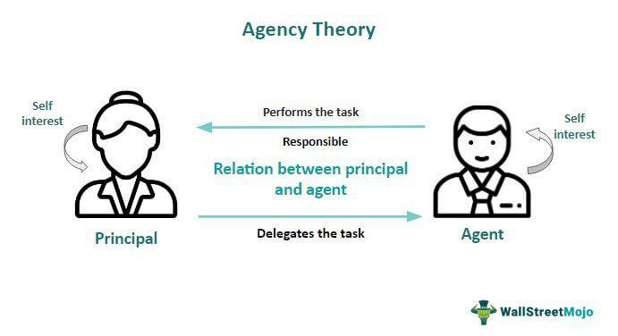

Algorithmic trading has dramatically transformed financial markets by enabling the execution of complex strategies at scales and speeds that were previously unattainable. This shift towards automation reflects a broader reliance on computational processes, where decision-making is heavily influenced by algorithms processing vast amounts of data in real-time. At the core of these systems are data management procedures that determine how efficiently and effectively trading operations can be executed. 

A crucial aspect of these procedures is the file system infrastructure. File systems play a vital role in organizing how data is stored and retrieved, impacting not only the speed at which data can be accessed but also the reliability and accuracy of the data itself. Different types of file systems—such as NTFS, EXT4, and others—offer various advantages and challenges in this context. The choice between them can have significant implications for latency and throughput, which are critical in a domain where milliseconds can determine profit or loss.

Another important factor in algorithmic trading is data overwriting. Given the volume of data processed—as well as storage and real-time demands—quickly updating datasets to reflect current market conditions is essential. Overwriting strategies must be designed to efficiently manage storage limits while maintaining data relevance and integrity. Advanced techniques like delta encoding and log-structured storage are employed to manage the trade-off between data freshness and historical context, optimizing system performance without compromising the overall quality and reliability of the data.

This article aims to explore these technical aspects and highlight how effective data management strategies can either enhance or impede trading operations. Through a detailed examination of file systems and data overwriting methods, readers will gain insight into the mechanisms that facilitate algorithmic trading. Furthermore, we will discuss how these practices affect the development and optimization of trading strategies, ensuring that traders remain informed and competitive in an ever-evolving financial landscape.

## Table of Contents

## Understanding File Systems in Algo Trading

File systems play a crucial role in the storage and retrieval of data within algorithmic trading platforms, affecting performance, speed, and reliability of data processing. These systems determine how trading data—comprising trade logs, market feeds, and execution reports—is structured, accessed, and managed in real-time. The efficiency of a file system is particularly important in algorithmic trading, where rapid data access and minimal latency are critical for success.

One important consideration is how file systems handle data throughput and latency. High-frequency trading platforms require file systems that support rapid, concurrent read and write operations to manage voluminous data streams efficiently. The file system's architecture affects latency—the time delay from data retrieval to processing—which is vital for making timely trading decisions.

Several file systems are commonly used in trading environments:

1. **NTFS** (New Technology File System) is prevalent in Windows-based servers. Its features such as file compression, encryption, and permission management can enhance data security and integrity. However, NTFS was initially optimized for desktop use rather than real-time data handling, potentially introducing delays in high-speed trading contexts.

2. **EXT4** (Fourth Extended File System) is widely used in Linux-based trading infrastructures. It is optimized for performance and scalability, supporting larger volumes and files. The EXT4 system reduces fragmentation, which boosts data throughput and lowers latency—a crucial factor in algorithmic strategies where trades must be executed instantly.

3. **XFS**, also used in Linux environments, is designed for handling large files and offers high-performance data throughput. XFS excels in environments that demand extensive data logging and retrieval, making it suitable for trading platforms dealing with large-scale data analysis.

Selecting the appropriate file system depends on the specific requirements of the trading operations, including the [volume](/wiki/volume-trading-strategy) of data handled and the latency-sensitive nature of high-frequency trading. An efficient file system directly translates to seamless data flow, ensuring lower latency and higher throughput, which are essential for maintaining a competitive edge in the fast-paced financial markets.

In summary, understanding and strategically choosing file systems are fundamental to enhancing the efficiency and reliability of data management in [algorithmic trading](/wiki/algorithmic-trading). Identifying the balance between performance and data integrity enables traders to capitalize on fleeting market opportunities while maintaining robust data governance.

## The Role of Data Overwriting

Data overwriting refers to the process of replacing outdated or irrelevant data with new, more pertinent information. This is particularly vital in high-frequency trading ([HFT](/wiki/high-frequency-trading-strategies)), where trading decisions are made in milliseconds and require the most current market information. By overwriting old data, traders ensure that their datasets are current, thereby aiding in accurate decision-making and strategy development.

In algorithmic trading, storage space is often at a premium. As trading firms accumulate data at an immense pace, the necessity to manage this data efficiently becomes paramount. By overwriting non-essential data, firms can effectively manage their storage limitations while maintaining the relevance of their datasets. This approach not only conserves storage but also enhances data processing speeds, which is critical in time-sensitive trading operations.

Data relevance is another crucial [factor](/wiki/factor-investing) in algorithmic trading. Market conditions can shift rapidly, and strategies that were effective yesterday may no longer be applicable today. Overwriting allows traders to discard obsolete data, ensuring that their trading models reflect the current market dynamics. This helps in adapting strategies quickly, thus providing a potential competitive edge.

To minimize data loss and preserve data quality during overwriting, traders employ various strategies. One such approach is the use of version control systems, which can keep track of changes made to datasets over time. This helps in reverting to previous versions if necessary, thus safeguarding against accidental data loss.

Advanced techniques such as delta encoding and log-structured storage have been developed to enhance the efficiency of data overwriting. Delta encoding, for instance, involves storing only the changes (deltas) between successive data points rather than the entire dataset. This method significantly reduces storage requirements and can speed up data retrieval processes. In contrast, log-structured storage organizes data into a sequential log, optimizing both write performance and data recovery processes.

Incorporating these sophisticated techniques into data management systems allows trading firms to maintain a balance between data [volatility](/wiki/volatility-trading-strategies) and historical integrity. By effectively overwriting data, traders can keep their algorithms tuned to the latest market signals without sacrificing critical historical context. This dynamic management of data ensures that trading operations remain fluid, responsive, and, ultimately, advantageous in fast-paced markets.

## Challenges of Overwriting in Data Management

Overwriting in data management presents significant challenges, particularly in the context of algorithmic trading, where the integrity and timeliness of data are paramount. A major issue with overwriting is the potential loss of historical data, which can be invaluable for future analysis and in forming trading strategies. Historical data serves as a foundation for [backtesting](/wiki/backtesting) trading algorithms, allowing traders to simulate how their strategies would have performed in the past. Losing this data undermines the ability to verify and refine these strategies, leading to possible missteps in decision-making.

Accidental overwriting due to system errors or misconfigurations is another serious concern. For instance, if a trading platform inadvertently overwrites critical data due to a scripting error or a software bug, the ramifications could be disastrous, leading to incorrect trades or a failure to execute essential market orders. Such errors highlight the importance of implementing meticulous system checks and balances.

Efficiently managing write operations is crucial to avoid bottlenecks, which can hinder trading performance. In high-frequency trading environments, where decisions are made in fractions of a second, the speed at which data is read and written directly influences the success of trading strategies. Bottlenecks can arise from suboptimal file system performance or inadequate hardware resources, causing delays that make the difference between profit and loss in trading scenarios.

Ensuring data consistency and reliability necessitates employing robust data backup and recovery solutions. For example, maintaining redundant copies of data can help protect against corruption or loss, ensuring that the trading operations can continue smoothly even in the event of unexpected overwrites or system failures. Backup strategies must be designed to restore data rapidly in a manner that minimizes disruption.

Overwriting also complicates data management when different trading strategies require varying data windows. Some algorithms might depend on real-time data, while others may require weeks or even months of historical data. Balancing the need for up-to-date information with the retention of historical data requires sophisticated data management strategies. Techniques such as delta encoding or log-structured storage can help manage these differing needs by focusing on storing changes or 'deltas' rather than complete data sets, thus optimizing storage utilization without compromising on data availability.

In summary, while data overwriting is a critical element of maintaining relevant and up-to-date information in algorithmic trading, it must be handled with care to protect data integrity and historical value. Advanced data management practices and technologies are necessary to mitigate the inherent risks and ensure the seamless operation of trading algorithms.

## Strategies to Optimize Data Management

Implementing effective strategies for data management is crucial in algorithmic trading, where the precision and speed of data handling can significantly influence trading success. One of the foundational practices is implementing version control. This method helps mitigate risks associated with overwriting errors by maintaining a history of data changes. With version control systems like Git, traders can track modifications over time, allowing them to revert to previous states if necessary, thereby reducing the risk of data loss or corruption due to erroneous overwriting.

Cloud-based storage solutions provide scalability and redundancy, essential for handling the vast volumes of data involved in algo trading. Services like Amazon Web Services (AWS) or Google Cloud Platform (GCP) offer virtually unlimited storage capacities and automated backup systems, ensuring data is both scalable and secure. These platforms can distribute data geographically, enhancing redundancy and protecting against data loss from localized failures.

Real-time data analytics is another vital strategy that determines which data should be overwritten. By analyzing data as it is being collected, traders can prioritize current, high-impact information while discarding or archiving less critical data. This approach optimizes storage usage and enhances the freshness of the data available for making trading decisions. Technologies like Apache Kafka enable the processing of real-time data streams, offering robust mechanisms for data ingestion and analysis.

Machine learning further enhances decision-making processes in data management by predicting patterns and assisting in the intelligent overwriting of data. Algorithms can be trained to identify which data sets are most likely to be relevant or contribute to successful trading strategies. For instance, a supervised learning model could be used to predict market trends and suggest data updating priorities based on historical success rates of similar data points.

Cybersecurity measures are paramount in protecting data integrity during overwriting operations. Implementing encryption protocols and access controls can prevent unauthorized data modifications. Technologies such as blockchain can also be used to enhance data integrity, providing an immutable ledger that records all data transactions and overwriting events, ensuring transparency and security. Blockchain's decentralized nature reduces the risk of single points of failure or tampering in data storage systems.

By leveraging these strategies—version control, cloud-based storage, real-time analytics, [machine learning](/wiki/machine-learning), and robust cybersecurity measures—traders can optimize data management, reduce risks associated with overwriting, and maintain data integrity. These initiatives enable algorithmic trading systems to remain robust, responsive, and competitive in a rapidly evolving financial landscape.

## Case Studies in Algo Trading Data Management

Algorithmic trading (algo trading) has seen the strategic utilization of data management systems that provide marked advantages in financial markets. Efficiency in managing trading data has often resulted in a significant trading edge. One notable example is the adept data management strategies employed by the [quantitative trading](/wiki/quantitative-trading) firm Renaissance Technologies. Known for its Medallion Fund, Renaissance builds comprehensive data repositories that utilize robust file systems and processes for efficient data overwriting. By maintaining a balance of data freshness and relevancy, Renaissance Technologies can exploit momentary inefficiencies in the market with high precision.

Conversely, there have been notable cases where poor data management adversely affected trading performance. For instance, the 2010 Flash Crash was partially attributed to inadequate data handling systems. Some firms were unable to process the influx of high-frequency trading data, leading to erroneous order executions and exacerbated market volatility. This highlighted the importance of maintaining a data infrastructure capable of adapting to rapid changes in data volume and market conditions.

From these experiences, several lessons and best practices in data management have emerged. A core lesson is the necessity of implementing a robust data backup and recovery system to ensure consistency and reliability, even in the face of data overwriting challenges. Additionally, careful configuration of file systems is crucial to prevent accidental data overwriting due to system errors.

Leading financial institutions now often deploy cloud-based data solutions to enhance scalability and provide redundancy against data loss. For example, investment banks like Goldman Sachs have adopted cloud computing and distributed storage mechanisms to maintain extensive market data and transaction logs, ensuring data availability and integrity. Such institutions also leverage real-time analytics and machine learning models to dynamically assess which data should be retained or overwritten, optimizing their trading strategies.

One innovative approach in overcoming data overwriting challenges has been the use of log-structured storage and delta encoding techniques. These methods allow institutions to focus on storage efficiency by only recording changes or differences in data over time, rather than overwriting the entire data set. This not only conserves storage space but also preserves historical data crucial for retrospective analysis and the development of predictive models.

In sum, effective data management strategies in algo trading require a blend of traditional practices and modern technological solutions. Financial firms that successfully implement these strategies can enhance their trading efficacy, a significant competitive advantage in fast-paced markets.

## Conclusion

Effective data management is critical for the success of algorithmic trading, with a substantial focus on the interplay between file systems and data overwriting. The rapid pace of market changes necessitates a balance between maintaining the freshness of data and preserving historical information, both of which are crucial for informed decision-making. This requires a robust infrastructure where the choice of file systems significantly affects the accessibility and reliability of trading data.

Traders and financial firms must perpetually innovate to preserve and enhance their competitive positions. This innovation often involves embracing cutting-edge technologies and methodologies to ensure the effective handling of massive volumes of data. For example, file systems like NTFS and EXT4, with their distinct advantages in terms of file handling capabilities and speed, are integral to achieving lower latency and higher data throughput. As technology progresses, these systems evolve, offering new features that can be harnessed for optimizing data storage and retrieval processes.

An effective data management strategy also means mastering data overwriting techniques to sustain data relevance without compromising on quality. Implementing sophisticated strategies, such as delta encoding or employing log-structured storage systems, can significantly improve overwrite efficiency and minimize data loss. Furthermore, advanced machine learning algorithms can be utilized to enhance decision-making processes regarding data overwriting, making sure that only pertinent data is retained while outdated information is discarded.

Continuous learning and adaptation are indispensable in the evolving landscape of algorithmic trading. The dynamic nature of technology demands that traders remain informed and agile, ready to incorporate new data management techniques as they become available. Hence, there is an ongoing need for education and implementation of the latest technologies, securing the integrity and execution speed which are fundamental in today's trading environments.

By prioritizing effective data management strategies, including the prudent use of file systems and data overwriting methods, traders can maintain their edge in the competitive world of algorithmic trading. As market conditions and technologies evolve, an adaptive approach to data management will remain critical for sustaining trading performance and gaining insights that pave the way for future success.

## References & Further Reading

[1]: ["Operating Systems: Three Easy Pieces"](https://pages.cs.wisc.edu/~remzi/OSTEP/) by Remzi H. Arpaci-Dusseau and Andrea C. Arpaci-Dusseau

[2]: Cormen, T. H., Leiserson, C. E., Rivest, R. L., & Stein, C. (2009). ["Introduction to Algorithms"](https://archive.org/details/introduction-to-algorithms-third-edition-2009) (3rd ed.). The MIT Press.

[3]: Tanenbaum, A. S., & Bos, H. (2014). ["Modern Operating Systems"](https://www.amazon.com/Modern-Operating-Systems-Andrew-Tanenbaum/dp/013359162X) (4th ed.). Pearson.

[4]: Ghemawat, S., Gobioff, H., & Leung, S.-T. (2003). ["The Google File System"](https://www.semanticscholar.org/paper/The-Google-file-system-Ghemawat-Gobioff/68b07bb990ee6c7fce28ea56c9a7808f607f0eac). ACM.

[5]: Silberschatz, A., Galvin, P. B., & Gagne, G. (2018). ["Operating System Concepts"](https://archive.org/details/operatingsystemconcepts10th) (10th ed.). John Wiley & Sons.

[6]: Hirsch, M. (2022). ["File System Latency: The Unsung Hero of High-Speed Trading."](https://aws.amazon.com/blogs/aws/amazon-elastic-file-system-update-sub-millisecond-read-latency/). Traders Magazine.