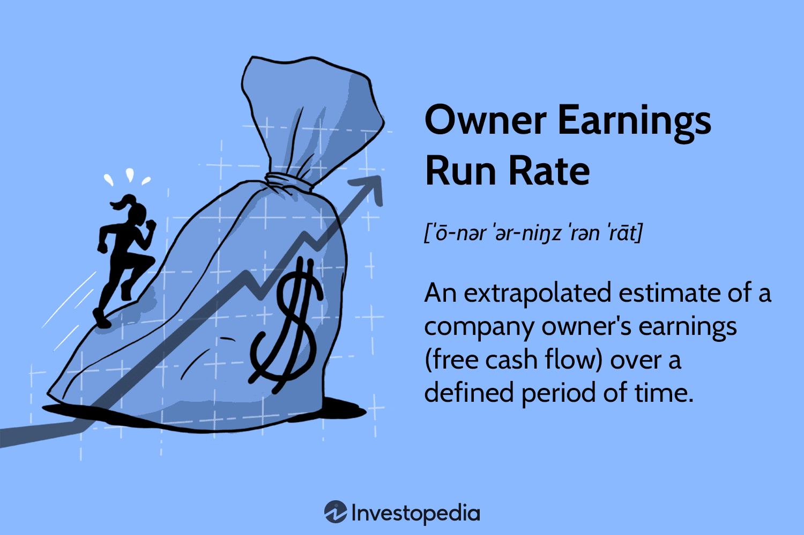

In the dynamic world of finance, understanding key metrics is crucial for achieving success. This article explores important financial concepts, including run rate analysis, owner earnings, and algorithmic trading.

Run rate analysis is a method of forecasting future financial performance based on current data, offering insights into potential future earnings and growth. This approach is particularly valuable for companies lacking extensive historical data, such as startups, allowing them to project annual performance figures by extrapolating recent data. However, run rate analysis assumes consistent revenue streams and may be less reliable for businesses subject to cyclical or fluctuating income patterns.

Owner earnings provide a clearer picture of a company’s financial health by highlighting the actual cash flow available to shareholders. Unlike traditional metrics like net income, which can be distorted by accounting practices, owner earnings focus on the cash that can be distributed to owners of the business after accounting for necessary capital expenditures, depreciation, and amortization. This approach, championed by renowned investor Warren Buffett, offers a more realistic assessment of a company’s ability to generate value for its shareholders over the long term.

Algorithmic trading utilizes computer programs and quantitative models to execute trades, relying on financial metrics like run rate and owner earnings to inform decision-making. By leveraging these metrics, trading algorithms aim to predict market trends and optimize trade execution in real-time. However, given the ever-evolving nature of financial markets, reliance solely on these metrics can be risky, underscoring the importance of integrating diverse predictive and analytical tools.

This article will explore these concepts, their interconnections, and their significance in trading and business financing. Understanding these financial tools can significantly enhance decision-making and strategic planning for analysts, investors, and business leaders.

## Table of Contents

## Understanding Run Rate Analysis

Run rate is a financial metric used to forecast an organization's future performance based on its current financial data. This measurement is particularly beneficial for startups or businesses that lack extensive historical data, enabling them to estimate their annual performance from recent metrics. The basic premise of run rate involves extrapolating current financial figures, such as revenue or sales, to project future earnings. The formula for projecting the annual run rate is generally straightforward:

$$
\text{Annual Run Rate} = \text{Current Period Performance} \times \text{Number of Periods in a Year}
$$

Where the current period performance can be monthly, quarterly, or any consistent time frame. For example, if a company earns $100,000 in revenue in January, the annual run rate would be:

$$
\$100,000 \times 12 = \$1,200,000
$$

Run rate is a common tool in financial planning and assessment due to its simplicity and immediate utility for businesses seeking a quick projection of future performance. However, it is important to note that run rate calculations assume consistency in revenue streams. This means they are based on the premise that the conditions affecting current performance will remain unchanged over the extrapolated period.

This assumption presents a limitation, particularly for businesses with cyclical or fluctuating incomes. Industries such as retail or hospitality often experience seasonal variations that run rate projections may not accurately capture. As such, while run rate provides valuable insights, it should be used in conjunction with a more comprehensive analysis of factors that could impact future performance, such as market trends or potential economic changes. This ensures a more holistic approach to financial forecasting, reducing the risk of overly optimistic or inaccurate projections based only on current data.

## Role of Run Rate in Algorithmic Trading

Algorithmic trading relies on computer programs and quantitative models to execute trades with minimal human intervention. This process requires precise and timely data to make informed decisions, and run rate analysis plays a critical role in providing such information. By analyzing transaction data, run rate analysis forecasts market trends and trading volumes, enabling algorithms to model expected market behaviors and inform trading strategies.

Run rate is essentially an extrapolation technique used to predict future performance. In the context of [algorithmic trading](/wiki/algorithmic-trading), it helps assess future market conditions based on current data. For example, if a particular stock shows a consistent rise in trading [volume](/wiki/volume-trading-strategy) over a specific period, the algorithm can use the run rate of this data to predict future trading volumes and execute trades accordingly.

However, the dynamic nature of financial markets means that relying solely on run rate can be risky. Market conditions are influenced by a myriad of factors such as economic news, geopolitical events, and investor sentiment, which can cause abrupt shifts not captured by run rates. Therefore, algorithms must integrate additional predictive and analytical tools to refine their models. Techniques such as [machine learning](/wiki/machine-learning), statistical analysis, and real-time data analytics complement run rate calculations to enhance prediction accuracy and trading performance.

Despite the need for auxiliary tools, run rate analysis remains foundational in developing trading algorithms. It provides a baseline prediction that can be adjusted as more data and factors come into play. This enables the creation of adaptive models that can respond to changes in market conditions, thus optimizing trade execution and improving profitability.

Ultimately, while run rate analysis is invaluable for its simplicity and utility in forecasting, it must be used as part of a broader strategy incorporating various analytical techniques to effectively navigate the complexities of algorithmic trading.

## Owner Earnings: A Complement to Traditional Financial Metrics

Owner earnings provide a nuanced perspective on a company's financial health by focusing on the cash truly available to shareholders. This contrasts with more traditional metrics, such as net income, which may not fully represent the cash generation capacity of a business. Owner earnings are calculated by adjusting net income to consider depreciation, amortization, and necessary capital expenditures. The formula for owner earnings can be expressed as:

$$
\text{Owner Earnings} = \text{Net Income} + \text{Depreciation and Amortization} - \text{Capital Expenditures}
$$

This metric is particularly crucial because it accounts for the non-cash charges and necessary investments in the business, offering a clearer picture of the financial resources that a company can distribute to shareholders after maintaining its operational capacity. 

Warren Buffett, a renowned investor, popularized the use of owner earnings as a more accurate gauge of a company's financial potential compared to net income. He emphasized that owner earnings reflect the company's ability to generate cash flow, which is fundamental for long-term value creation.

Understanding owner earnings enables investors to evaluate a company's ability to sustainably generate shareholder value. This metric helps assess whether a business can continue to thrive while rewarding its investors with dividends or share buybacks, without compromising on necessary investments for long-term growth. By focusing on owner earnings, investors gain a more comprehensive understanding of a company's financial dynamics and potential future performance.

## Interplay between Run Rate and Owner Earnings

Combining run rate with owner earnings provides a nuanced approach to assessing a company's financial standing, particularly beneficial for strategic planning and investment decisions. Run rate analysis serves as a predictive tool, setting expectations for future earnings by projecting current financial data over a set period. This forward-looking perspective is especially advantageous when long-term historical data is sparse, allowing businesses, particularly startups, to estimate annual performance from recent metrics.

Owner earnings, on the other hand, focus on actual cash flow availability, offering insights into the financial health and efficiency of cash utilization. This metric takes into account essential factors such as depreciation, amortization, and necessary capital expenditures, thus offering a more realistic view of financial viability compared to net income. It is a concept championed by Warren Buffett, who emphasized its importance in determining a company’s ability to generate sustainable shareholder value.

The integration of these two metrics allows financial analysts and business leaders to navigate market [volatility](/wiki/volatility-trading-strategies) more effectively and optimize resource allocation. By using the run rate to forecast top-line growth and owner earnings to ensure bottom-line sustainability, companies can create robust financial strategies that align predicted revenue growth with actual cash generation capabilities.

For example, consider a technology startup that has recently seen a significant increase in monthly subscription revenues due to a successful product launch. By applying a run rate analysis, the startup can project this enhanced revenue performance over the next year, providing a framework for anticipated growth. Simultaneously, calculating owner earnings will highlight the cash available to reinvest in product development or distribute to shareholders, considering operational costs and necessary capital reinvestments.

In practical terms, merging these metrics supports more informed decision-making. For instance, a company projecting robust run rate growth might use owner earnings analysis to determine if it can reinvest profits into expansion without compromising financial stability. This balanced approach aids in preparing for possible market downturns and underscores the importance of maintaining a healthy cash flow position to leverage growth opportunities.

While both tools are powerful independently, their combined application offers a comprehensive financial overview, allowing for strategic foresight in various economic climates. As such, they are indispensable in the toolkit of any financial analyst aiming to enhance predictive capabilities and ensure long-term business success.

## Advantages and Limitations in Financial Forecasting

Both run rate and owner earnings are valuable tools in assessing a company's financial trajectory, assisting in planning and decision-making. These metrics, however, are not without their limitations and must be used judiciously.

Run rate evaluates potential future performance by projecting current financial data, enabling companies, particularly startups or those without extensive historical data, to forecast future earnings. Yet, its heavy reliance on current and possibly short-term data makes it susceptible to unanticipated market fluctuations. For instance, if a company experiences an uncharacteristic surge in sales due to a one-time event, run rate projections may falsely assume this level of revenue is sustainable. As a result, financial projections based solely on run rate could be misleading during sudden economic shifts or cyclical downturns.

Owner earnings offer a clearer picture of financial health by focusing on actual cash flow available to shareholders, factoring in depreciation, amortization, and capital expenditures. This metric provides a more accurate assessment of shareholder value over time compared to net income. However, owner earnings may not be fully responsive to immediate economic changes or shocks, as it generally provides insights over a longer horizon.

To navigate these limitations, financial analysts must integrate run rate and owner earnings with other metrics to form a comprehensive view of a company's financial health. For example, incorporating key performance indicators (KPIs) such as price-to-earnings (P/E) ratio, debt-to-equity ratio, and return on equity (ROE) can enhance analysis by providing insight into different facets of financial performance.

Additionally, scenario planning and sensitivity analysis are crucial approaches in mitigating the inherent uncertainties associated with these methodologies. Scenario planning involves creating detailed narratives about possible future environments and assessing the impact of these on the company. Sensitivity analysis, on the other hand, examines how various inputs into a financial model can affect outputs, allowing analysts to understand how sensitive their projections are to changes in key assumptions.

By combining these strategies with run rate and owner earnings, analysts can create more robust financial forecasts that account for a wider range of potential scenarios and variables, enhancing decision-making and strategic planning.

## Conclusion

Run rate analysis and owner earnings are vital tools for financial analysts and investors. These metrics offer unique insights into a company's financial standing, helping stakeholders make informed decisions. Run rate analysis enables the projection of a company’s future performance based on its current financial data, which is particularly beneficial for new businesses or those experiencing rapid change. Owner earnings, popularized by Warren Buffett, provide a more accurate depiction of the cash available to shareholders by accounting for expenditures such as depreciation and amortization.

To optimize the use of run rate analysis and owner earnings, it is crucial to combine them with other financial metrics. This holistic approach allows for a comprehensive understanding of a company’s financial health, taking into consideration industry-specific variations and dynamic market conditions. For instance, run rate analysis relies heavily on the assumption of constancy in revenue streams, which may not hold true in all business sectors, particularly those with seasonal fluctuations. Therefore, integrating these metrics with sensitivity analysis and scenario planning is advisable to cushion against unexpected market shifts.

In algorithmic trading, these financial metrics enhance predictive capabilities, offering a foundation for developing sophisticated trading algorithms. However, caution must be exercised due to the inherent limitations of these tools. Financial markets are inherently volatile and complex, meaning that relying on any single metric could lead to suboptimal decision-making. Consequently, a multifaceted approach is recommended for traders and analysts who are working on creating robust algorithmic strategies.

In summary, understanding and strategically applying run rate analysis and owner earnings can lead to more effective decision-making and strategic planning. These financial concepts, when used wisely, have the potential to significantly bolster business success and trading efficacy in diverse contexts.

## References & Further Reading

[1]: Investopedia. ["Run Rate"](https://www.investopedia.com/terms/r/runrate.asp)

[2]: Buffett, Warren E. ["Berkshire Hathaway Inc. Shareholder Letters"](https://www.berkshirehathaway.com/letters/letters.html)

[3]: ["Security Analysis"](https://www.wallstreetmojo.com/security-analysis/) by Benjamin Graham and David Dodd

[4]: Aldridge, Irene. ["High-Frequency Trading: A Practical Guide to Algorithmic Strategies and Trading Systems"](https://www.amazon.com/High-Frequency-Trading-Practical-Algorithmic-Strategies/dp/1118343506)

[5]: Bloomberg. ["Algorithmic Trading"](https://www.bloomberg.com/professional/insights/trading/buyside-becoming-more-reliant-on-algorithmic-trading-solutions/)

[6]: Taleb, Nassim Nicholas. ["Antifragile: Things That Gain from Disorder"](https://en.wikipedia.org/wiki/Antifragile_(book))