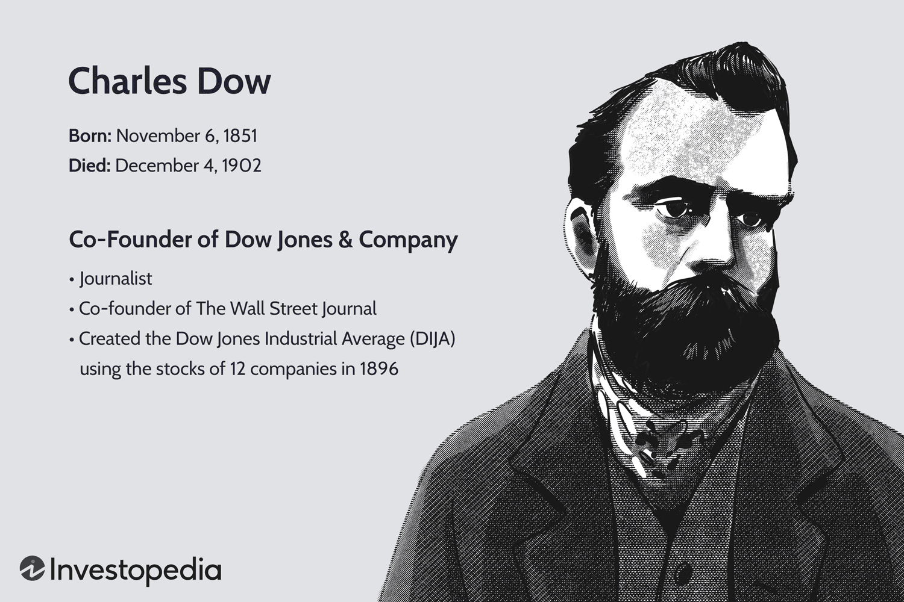

## Table of Contents

## What is Dow Jones & Company?

Dow Jones & Company is a company that provides news and business information. It was started in 1882 by Charles Dow, Edward Jones, and Charles Bergstresser. They are most famous for the Dow Jones Industrial Average, which is a way to measure how well big companies in the United States are doing.

The company owns many important publications, like The Wall Street Journal, which is a very popular newspaper about business and finance. They also have other services like Barron's and MarketWatch, which give people news and information about the stock market and economy. Dow Jones & Company helps people understand what is happening in the world of business.

## Who currently owns Dow Jones & Company?

Dow Jones & Company is owned by a big company called News Corp. News Corp bought Dow Jones in 2007. News Corp is run by Rupert Murdoch, who is a very famous person in the news business.

News Corp is a large company that owns many different kinds of media, like newspapers, TV channels, and websites. They have businesses all over the world. By owning Dow Jones, News Corp can give people important news about business and finance through well-known publications like The Wall Street Journal.

## When was Dow Jones & Company acquired by its current owner?

Dow Jones & Company was bought by News Corp in 2007. News Corp is a big company that owns many different kinds of media, like newspapers, TV channels, and websites. They have businesses all over the world.

Rupert Murdoch, who runs News Corp, wanted to own Dow Jones because it has important publications like The Wall Street Journal. By owning Dow Jones, News Corp can give people important news about business and finance.

## How much was paid for the acquisition of Dow Jones & Company?

News Corp paid about $5 billion to buy Dow Jones & Company in 2007. This was a big amount of money, showing how important Dow Jones was to News Corp. The deal was one of the biggest in the world of media and business news.

The purchase was led by Rupert Murdoch, who saw the value in owning a company like Dow Jones. With this acquisition, News Corp gained control over important publications like The Wall Street Journal, which helped them expand their reach in the business and finance news sector.

## What are the main business segments of Dow Jones & Company?

Dow Jones & Company has several main business segments that help it provide news and information to people. One of the biggest segments is its professional information business, which includes services like Factiva and Dow Jones Risk & Compliance. These services help businesses and professionals get the information they need to make smart decisions. Factiva, for example, is a tool that lets people search through lots of news and information from around the world.

Another important segment is its news and media business, which includes well-known publications like The Wall Street Journal, Barron's, and MarketWatch. These publications give people news about business, finance, and the economy. The Wall Street Journal is especially famous and is read by many people who want to stay updated on what's happening in the business world. Dow Jones also has a digital segment that focuses on delivering news and information through websites and apps, making it easier for people to get the latest updates on their phones or computers.

## How has the ownership of Dow Jones & Company changed over time?

Dow Jones & Company was started in 1882 by Charles Dow, Edward Jones, and Charles Bergstresser. For a long time, it was owned by the people who started it and their families. They ran the company and made it grow by creating important things like the Dow Jones Industrial Average and The Wall Street Journal. The company stayed in the hands of the founders and their families until the late 20th century.

In 1902, after Charles Dow died, Clarence Barron bought the company. Barron was a businessman who helped make The Wall Street Journal even more popular. The Barron family kept control of Dow Jones until 1967 when they sold it to the Bangor Punta Corporation. Bangor Punta owned Dow Jones for a while, but in 1984, the company was bought back by its employees through an employee stock ownership plan. This meant that the people working at Dow Jones owned the company. However, this changed in 2007 when News Corp, led by Rupert Murdoch, bought Dow Jones for about $5 billion. Since then, News Corp has been the owner of Dow Jones & Company.

## What impact did the acquisition have on Dow Jones & Company's operations?

When News Corp bought Dow Jones & Company in 2007, it changed how the company worked. Before the acquisition, Dow Jones was run by its employees through an employee stock ownership plan. This meant the people working there had a say in how the company was run. After News Corp took over, the company became part of a bigger media group. This meant Dow Jones had more resources and could reach more people around the world. However, it also meant that decisions about the company were made by News Corp, which is led by Rupert Murdoch.

The acquisition also led to some changes in how Dow Jones did its business. News Corp wanted to use Dow Jones's famous publications, like The Wall Street Journal, to grow its own business. They invested a lot of money in making these publications better and more digital. This helped Dow Jones reach more people through websites and apps. But some people who worked at Dow Jones were worried about losing the company's independence and the way it had always done things. Overall, the acquisition helped Dow Jones grow and become more modern, but it also meant big changes for the people who worked there.

## Who were the key figures involved in the acquisition of Dow Jones & Company?

The key figures in the acquisition of Dow Jones & Company were Rupert Murdoch and Les Hinton. Rupert Murdoch is the head of News Corp, the big company that bought Dow Jones in 2007. He saw how important Dow Jones was because of its famous publications like The Wall Street Journal. Murdoch wanted to make his company bigger and more powerful in the world of news and business information. Les Hinton was also very important in the deal. He worked for News Corp and was in charge of making sure the acquisition happened smoothly. Hinton helped talk to the people at Dow Jones and made sure everything went well during the buying process.

Another important person was Richard Zannino, who was the CEO of Dow Jones at the time of the acquisition. He had to decide if selling to News Corp was the right thing to do for the company and its employees. Zannino worked with the board of directors at Dow Jones to think about the offer from News Corp. They decided that selling to News Corp was a good choice because it would give Dow Jones more resources and help it grow. These key figures played big roles in making the acquisition happen and shaping what Dow Jones & Company would do next.

## What strategic reasons were given for the acquisition of Dow Jones & Company?

News Corp wanted to buy Dow Jones & Company because it saw a big chance to grow its business. Dow Jones had famous publications like The Wall Street Journal, which many people read for news about business and finance. By owning Dow Jones, News Corp could reach more people and make more money. Rupert Murdoch, who runs News Corp, thought that having The Wall Street Journal would help his company become even bigger in the world of news and information. He wanted to use Dow Jones's resources to make his own company stronger and more successful.

Another reason for the acquisition was to help Dow Jones grow and become more modern. News Corp had a lot of money and resources that it could use to improve Dow Jones's publications and services. They wanted to make The Wall Street Journal and other Dow Jones products better and easier to use, especially on the internet and through apps. This would help Dow Jones reach more people around the world. Even though some people at Dow Jones were worried about losing their independence, the acquisition gave the company a chance to get bigger and keep up with changes in the news business.

## How does the ownership structure of Dow Jones & Company affect its editorial independence?

When News Corp bought Dow Jones & Company, it changed how the company made decisions about what to write and publish. Before, Dow Jones was owned by its employees, which meant they had more control over the news they reported. After News Corp took over, the company became part of a bigger group led by Rupert Murdoch. This meant that decisions about what to write could be influenced by what News Corp wanted. Some people at Dow Jones were worried that this might make it harder for them to report the news freely and independently.

However, News Corp said that it would respect Dow Jones's editorial independence. They promised that The Wall Street Journal and other publications would still be able to report the news without being told what to say. Even so, some people still worried that the new owners might try to influence the news in small ways. Overall, the change in ownership made some people at Dow Jones feel less sure about their ability to report the news freely, even though News Corp said it would not interfere.

## What are the financial implications of the ownership for Dow Jones & Company?

When News Corp bought Dow Jones & Company, it meant a lot of money changed hands. News Corp paid about $5 billion for the company, which was a big amount. This money helped Dow Jones because it gave them more resources to grow and improve their business. For example, they could invest in making their publications like The Wall Street Journal better and more digital. This helped Dow Jones reach more people and make more money in the long run.

On the other hand, being owned by a big company like News Corp also meant that Dow Jones had to share its profits with its new owner. News Corp expected Dow Jones to do well and make money for them. This could put pressure on Dow Jones to keep its costs down and find ways to earn more. Overall, the financial support from News Corp helped Dow Jones grow, but it also came with the responsibility to perform well and meet the expectations of its new owner.

## What future changes in ownership might be anticipated for Dow Jones & Company?

It's hard to know exactly what will happen with Dow Jones & Company's ownership in the future. Right now, News Corp owns Dow Jones, and they seem happy with it. But big companies like News Corp sometimes buy and sell other companies to grow or change their business. If News Corp decides it wants to focus on different things or needs money, they might sell Dow Jones to someone else. Another possibility is that a different big company could see how valuable Dow Jones is and want to buy it from News Corp.

If Dow Jones changes owners again, it could affect how the company works. A new owner might want to do things differently, like changing what news they focus on or how they make money. But any change in ownership would need to be good for both the buyer and Dow Jones. The people who work at Dow Jones would also have to adjust to new ways of doing things. For now, though, Dow Jones seems to be doing well under News Corp, so any big changes might not happen soon.

## References & Further Reading

[1]: ["Dow Jones & Company"](https://en.wikipedia.org/wiki/Dow_Jones_%26_Company) - Encyclopaedia Britannica.

[2]: Tetlock, P.C. (2007). ["Giving Content to Investor Sentiment: The Role of Media in the Stock Market."](https://onlinelibrary.wiley.com/doi/abs/10.1111/j.1540-6261.2007.01232.x) The Journal of Finance, 62(3), 1139-1168.

[3]: Kothari, S.P., & Short, J.E. (2021). ["The Impact of Algorithmic Trading on the Financial Markets."](https://papers.ssrn.com/sol3/papers.cfm?abstract_id=1113337) Journal of Financial Markets.

[4]: ["The Wall Street Journal"](https://www.wsj.com/) - Official website for Dow Jones & Company’s leading publication. 

[5]: Flemming, J., Kirby, C., & Ostdiek, B. (2001). ["The Impact of Financial News on the Stock Market: Evidence from Dow Jones & Company."](https://www.jstor.org/stable/4480367) Journal of Business, 74(1), 171-193.

[6]: ["The New Media Monopoly: A Completely Revised and Updated Edition with Seven New Chapters"](https://www.amazon.com/New-Media-Monopoly-Completely-Chapters/dp/0807061875) by Ben H. Bagdikian.