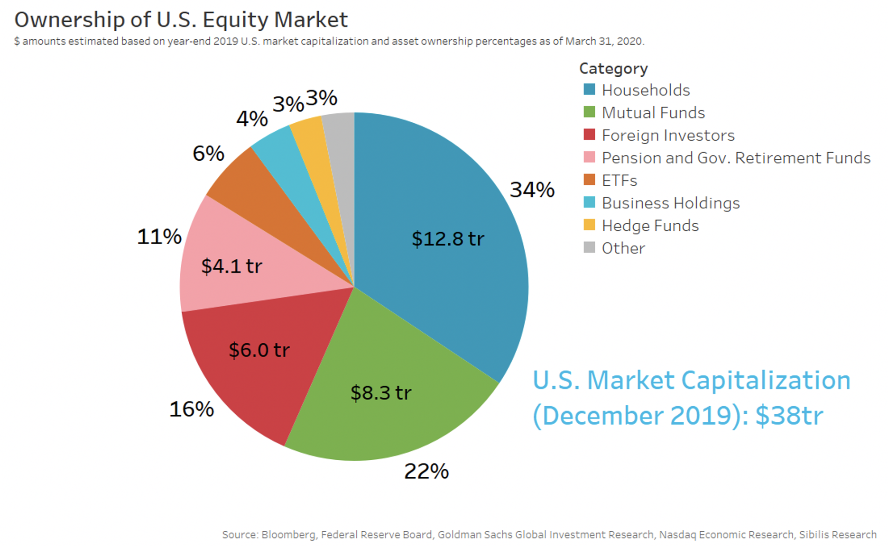

Stock exchanges are pivotal institutions in global finance, serving as platforms where securities are bought and sold. They function as crucial intermediaries that facilitate capital flow between investors and companies seeking to raise funds. The operations of stock exchanges are deeply intertwined with ownership structures and financial mechanisms. Ownership models of stock exchanges, whether traditional or demutualized, significantly influence how these institutions are governed and how they formulate policies. For instance, demutualized exchanges, which are often publicly listed, prioritize shareholder value and typically adopt more competitive and profit-oriented strategies compared to their mutually-owned counterparts. 

A notable development in the financial landscape is the rise of algorithmic trading. This type of trading involves the use of computer algorithms to automatically execute trades based on predetermined criteria. Algorithmic trading has transformed the nature of stock market transactions, contributing significantly to the trading volume on major exchanges. Its impact is profound, enhancing market efficiency by narrowing spreads and increasing liquidity, yet it also poses risks such as market volatility and flash crashes, which require regulatory oversight.

The significance of stock exchanges extends beyond their role as marketplaces. They are key to economic growth and globalization by enabling companies to access international capital markets. The global integration of financial systems has made stock exchanges more interconnected, resulting in synchronized market movements across different regions. Major stock exchanges such as the New York Stock Exchange (NYSE), NASDAQ, the London Stock Exchange (LSE), and the Hong Kong Exchanges and Clearing Limited (HKEX) have become global financial hubs, each with unique characteristics and specialties.

Technology continues to reshape finance, with algorithmic trading at the forefront of this transformation. The integration of advanced computing technologies, such as artificial intelligence and machine learning, into trading strategies is further revolutionizing how financial markets operate. As these technologies evolve, they influence trading dynamics, risk management, and regulatory frameworks, underscoring the need for continuous adaptation by all market participants. 

In conclusion, understanding the intricate connection between stock exchanges, ownership structures, and financial mechanisms is essential. The evolving landscape, driven significantly by technological advancements and algorithmic trading, underscores the need for a balanced approach that embraces innovation while ensuring robust regulatory systems to safeguard market stability.

## Table of Contents

## The Role of Stock Exchanges in Global Finance

Stock exchanges are centralized platforms that facilitate the buying and selling of securities, such as stocks and bonds, among investors. They play a crucial role in the financial ecosystem by providing a structured environment for trading, ensuring transparency, price discovery, liquidity, and regulatory oversight. Major exchanges include the New York Stock Exchange (NYSE), NASDAQ, London Stock Exchange (LSE), and Hong Kong Exchange (HKEX), each with its specific characteristics and roles.

Stock exchanges serve as an essential mechanism for businesses seeking to raise capital. Companies can access funds by listing their stocks, allowing them to issue shares to the public (an initial public offering, or IPO). This process enables businesses to garner significant investment capital, which can be used to fuel expansion, invest in new projects, and drive innovation. Additionally, listing on a stock exchange enhances a company's visibility and credibility, often translating into increased trust from both consumers and investors.

A fundamental function of stock exchanges is to ensure market [liquidity](/wiki/liquidity-risk-premium), which refers to how easily assets can be bought and sold without causing significant price changes. High liquidity is indicative of a healthy market where investors can quickly convert securities into cash. Stock exchanges accomplish this by aggregating buyers and sellers, creating a competitive market environment where securities' prices are determined based on supply and demand dynamics.

Stock exchanges are integral to fostering economic growth and globalization. By facilitating access to capital, they allow businesses from various industries to expand and innovate, contributing to job creation and economic diversification. Additionally, stock exchanges promote financial globalization by enabling cross-border transactions and investments. This interconnectedness helps align global economic interests, encouraging international trade and investment and linking economies more closely.

When examining the world's major stock exchanges, differences in size, trading [volume](/wiki/volume-trading-strategy), and market focus are evident. The NYSE, the largest in the world by market capitalization, is renowned for its stringent listing requirements and large, established companies. NASDAQ, known for its electronic trading system, hosts numerous technology giants and is synonymous with innovation-driven enterprises. The London Stock Exchange offers strong international listings, serving as a bridge between European and global markets. In contrast, the Hong Kong Exchange is a crucial gateway for investments into and out of China and the broader Asian region.

In summary, stock exchanges are pivotal to global finance, providing a platform for [capital raising](/wiki/hedge-fund-capital-raising), ensuring liquidity, inducing economic growth, and facilitating globalization. Their significance is amplified by their unique characteristics, functions, and contributions to the ever-evolving landscape of financial markets.

## Ownership Structures of Stock Exchanges

Stock exchanges, pivotal to global finance, have long been influenced by their ownership structures. Understanding the dichotomy between traditional ownership and demutualized structures provides insight into how exchanges operate.

Traditionally, stock exchanges were owned by member brokers who traded on them. These mutualized structures granted ownership and decision-making power to the members. While this member-centric model emphasized collective governance, it often led to inefficiencies and limited growth potential due to insular decision-making processes that primarily benefited the owners, not necessarily the wider market participants.

In contrast, demutualization marks the shift from member-owned to shareholder-owned exchanges. This transition involves transforming exchanges from private entities with limited access to capital into publicly traded companies. Demutualization allows exchanges to tap into broader capital markets, enhancing their ability to invest in technology, improve infrastructure, and pursue global expansions. Public ownership renders exchanges accountable to a wider range of stakeholders, including institutional investors, which can improve transparency and corporate governance.

Different ownership models greatly influence governance and policy-making within exchanges. Traditional structures might struggle with conflicts of interest, as member-owners could prioritize personal benefits over the exchange’s strategic direction. Demutualized exchanges, however, often establish more formalized governance structures with boards that include independent directors. This shift encourages decisions that balance shareholder profits with market integrity and operational efficiency.

The influence of shareholders and stakeholders on exchanges underscores the dynamic environment in which these entities operate. Shareholders in a demutualized context may push for profitability and efficiency, potentially advocating for cost-cutting or technological investments. Conversely, stakeholders such as regulatory bodies, listed companies, and trading participants may emphasize stability, fairness, and transparency, pushing exchanges toward robust regulatory compliance and fair access.

Notable transitions in stock exchange ownership demonstrate the varied impacts of these structural changes. For instance, the New York Stock Exchange (NYSE) transitioned from a member-owned entity to a publicly traded company in 2006, which augmented its organizational flexibility and financial resources. Similarly, the London Stock Exchange underwent demutualization, which facilitated its merger pursuits and technological advancements.

In summary, the evolution from traditional to demutualized ownership models demonstrates the pivotal role of governance structures in shaping stock exchanges. These transitions highlight the balancing act exchanges must perform between adapting to shareholder demands and maintaining a stable and fair trading environment for all market participants.

## Finance and Its Evolving Landscape

Financial markets have undergone significant transformation over the last few decades, driven largely by globalization, technological advancements, regulatory changes, and the rise of fintech. These changes have reshaped the financial landscape, influencing the way capital is raised, managed, and traded across borders.

Globalization has markedly influenced financial systems and stock exchanges. The integration of global markets has led to increased capital flows and investment opportunities, enhancing the liquidity and efficiency of stock exchanges. Cross-border trading and foreign investments have become more accessible, promoting economic growth and financial interdependence. However, this interconnectedness also poses systemic risks, as financial crises or economic disturbances can rapidly spread across borders.

Regulatory changes have continually shaped the financial landscape, aiming to enhance transparency, reduce systemic risk, and protect investors. Following the 2008 financial crisis, there was a significant overhaul in financial regulation, notably with the introduction of measures like the Dodd-Frank Act in the United States. Such regulations have sought to improve the resilience of financial systems while addressing the challenges posed by increasingly complex financial instruments and trading practices.

Technological advancements have fundamentally reshaped financial services, enabling greater efficiency, speed, and accessibility. Innovations like electronic trading platforms have revolutionized how assets are bought and sold, significantly reducing transaction costs and broadening market participation. Additionally, technology has facilitated the rise of new financial products and services, offering investors more diverse opportunities.

The rise of financial technology (fintech) has further integrated with traditional financial platforms, driving innovation and competition in the industry. Fintech solutions, ranging from mobile payment platforms to robo-advisors, have expanded financial inclusion and democratized access to financial services. These innovations challenge conventional financial institutions to adapt and innovate to meet evolving consumer needs.

In summary, the evolving landscape of finance is characterized by an amalgamation of globalization, technological advancement, regulatory changes, and fintech integration. These factors are continuously reshaping how financial markets operate and interact, creating both opportunities and challenges for stakeholders worldwide.

## The Advent of Algorithmic Trading

Algorithmic trading, often referred to as algo trading, involves the use of computer algorithms to execute trading orders efficiently and effectively at speeds and frequencies beyond human capabilities. These algorithms, governed by pre-defined criteria, make decisions about aspects such as timing, price, and quantity of orders. Algorithms can be built to incorporate various strategies ranging from statistical [arbitrage](/wiki/arbitrage) to [market making](/wiki/market-making).

### Historical Development of Algorithmic Trading in Financial Markets
Algorithmic trading has its origins in the late 20th century, with its use becoming prominent during the 1980s due to advancements in computing power. The New York Stock Exchange (NYSE) introduced the "designated order turnaround" system in 1976, which marked one of the initial steps toward the automation of trading activities. However, the technological rise in the 1990s, especially with the development of electronic communication networks (ECNs), significantly propelled the spread of algo trading. By the early 2000s, [algorithmic trading](/wiki/algorithmic-trading) accounted for a significant portion of stock trading volumes, particularly in major exchanges like NYSE and NASDAQ.

### Dominance of Algo Trading in Today's Stock Trading Volumes
Today, algorithmic trading is responsible for a majority of stock market transactions. According to a 2019 study by BIS, algorithmic trading constituted approximately 60% to 70% of the overall equity trading volume in the United States. The inherent capability of algorithms to process volumes of data in milliseconds enables them to outperform traditional manual trading methods, making them pivotal in high-frequency trading ([HFT](/wiki/high-frequency-trading-strategies)) scenarios. This dominance is attributed to their ability to exploit market inefficiencies with precision and at scale.

### Benefits and Risks Associated with Algo Trading
Algorithmic trading offers numerous benefits. It enhances market liquidity through rapid order execution, reduces transaction costs by minimizing human intervention, and increases trading efficiency by executing optimal strategies. For investors, algo trading can yield improved price discovery and reduced instances of market manipulation.

However, the risks cannot be overlooked. The speed and volume at which algo trading operates can induce market [volatility](/wiki/volatility-trading-strategies), evident in occurrences such as the 2010 "Flash Crash", when the Dow Jones Industrial Average plunged about 1,000 points within minutes before recovering. The risk of systemic failures and erroneous trades due to algorithm malfunctions also pose significant threats. Investors must acknowledge these factors when considering algorithmic strategies.

### Regulatory Perspectives and Challenges
Regulatory bodies worldwide are actively addressing the challenges posed by algorithmic trading. Authorities like the U.S. Securities and Exchange Commission (SEC) have implemented regulations aimed at safeguarding markets from the potential adverse impacts of algo trading. For instance, the SEC's Regulation National Market System (NMS) aims to foster transparent and competitive markets.

Challenges lie in crafting regulations that prevent abuse of algorithmic strategies while not stifling technological innovation. Striking a balance between permitting fast, efficient market operations and ensuring market stability remains a focus for regulators. Enhanced surveillance systems using cutting-edge technologies such as [machine learning](/wiki/machine-learning) are increasingly being employed for monitoring trading activities and maintaining market integrity.

Algorithmic trading, despite its complexities, continues to evolve, adapting to the rapid advancements in technologies like [artificial intelligence](/wiki/ai-artificial-intelligence) and machine learning. The landscape it creates is one where both opportunities and challenges must be navigated with informed strategies and robust regulatory frameworks.

## Impact of Algo Trading on Stock Exchanges

Algorithmic trading, particularly high-frequency trading (HFT), has significantly influenced stock exchanges and market dynamics. HFT uses automated, powerful algorithms for executing large orders at high speed, transforming how stock exchanges operate and impacting market efficiency.

High-frequency trading enhances market efficiency by facilitating faster execution of trades, reducing spreads, and improving price discovery. By quickly incorporating information into prices, HFT can create more accurate market valuations. This efficiency stems from algorithms processing vast amounts of data and executing transactions in milliseconds, a speed unattainable by human traders. A study by Brogaard, Hendershott, and Riordan (2014) demonstrated that HFT firms provide significant liquidity and help narrow spreads, resulting in reduced trading costs for investors[^1^].

However, the high speed and automation inherent in algo trading introduce potential downsides, notably increased market volatility and the occurrence of flash crashes. Flash crashes, such as the infamous May 6, 2010, event, result from rapid, overwhelming automated sell-offs that create drastic, temporary price drops. These incidents expose vulnerabilities in automated trading systems, as algorithms may react to erroneous data or amplify sudden market movements without human oversight.

Stock exchanges globally have responded to the rise of algorithmic trading by implementing measures to mitigate associated risks. Circuit breakers, for example, are now common regulatory tools designed to temporarily halt trading during extreme price volatility. Additionally, exchanges impose fees on excessive orders or utilize trading halts to maintain orderly markets. The New York Stock Exchange (NYSE) and NASDAQ have adapted their infrastructure to better accommodate high-volume, high-speed trading while also enhancing regulatory frameworks to ensure fair and transparent market conditions.

Several exchanges have proactively adapted to the algo trading trend through technological and strategic innovations. For example, the London Stock Exchange Group introduced the high-speed Millennium Exchange trading platform, designed to cater to low-latency trading demands. Meanwhile, the Tokyo Stock Exchange revamped its Arrowhead system, significantly enhancing order processing speeds and data throughput.

In summary, algorithmic trading, particularly HFT, has reshaped stock exchanges, driving increased efficiency but also highlighting risks. Exchanges continue to evolve, implementing regulatory measures and adopting new technologies to ensure they meet the needs of a rapidly changing trading environment.

[^1^]: Brogaard, J., Hendershott, T., & Riordan, R. (2014). "High-Frequency Trading and Price Discovery." *The Review of Financial Studies*, 27(8), 2267-2306.

## Future Directions and Innovations

Stock exchanges and their ownership models are undergoing significant transformations driven by technology and evolving regulatory landscapes. Traditional mutual ownership structures are increasingly giving way to public ownership, enhancing transparency and broadening the stakeholder base. This shift is expected to continue, with exchanges potentially venturing into hybrid models that integrate both equity and cooperative ownership elements. Furthermore, the rise of decentralized exchanges (DEXs) powered by blockchain technology is challenging conventional exchanges by offering peer-to-peer trading without centralized control, thus appealing to a growing class of tech-savvy investors who value autonomy and reduced counterparty risk.

Algorithmic trading, particularly high-frequency trading (HFT), is expected to continue its dominance in global financial markets. Its evolution will likely focus on more sophisticated algorithms capable of processing vast datasets efficiently. The integration of machine learning and artificial intelligence is poised to enhance these algorithms, enabling predictive analytics and real-time decision-making. However, the increasing complexity of these systems will necessitate robust risk management frameworks to mitigate potential systemic threats, such as flash crashes.

Innovations in blockchain technology and artificial intelligence (AI) are reshaping trading platforms, offering potential solutions for faster, more secure, and transparent trading processes. Blockchain's immutable ledgers provide an efficient mechanism for trade verification and settlement, which could significantly reduce the time and cost associated with these processes. Meanwhile, AI's role in enhancing algorithmic trading strategies and improving fraud detection mechanisms is anticipated to expand, making financial markets more resilient and efficient.

Regulatory bodies are closely monitoring these technological advancements, and future regulations are expected to address the complexities introduced by algorithmic and high-frequency trading. These regulations may emphasize transparency, risk mitigation, and market stability. Moreover, as decentralized finance (DeFi) gains traction, regulators will likely develop frameworks to oversee these platforms, focusing on investor protection and anti-money laundering (AML) measures.

Market trends in the coming years are likely to reflect these technological and regulatory influences. Investments in technology-driven sectors, such as AI, blockchain, and cybersecurity, may continue to grow as they become integral to the evolution of financial services. Additionally, sustainability and [ESG](/wiki/esg-investing) (Environmental, Social, and Governance) considerations are expected to increasingly inform investment strategies, driven by the global emphasis on socially responsible and sustainable development.

In summary, the convergence of technological innovation, evolving ownership structures, and proactive regulatory frameworks is shaping the future trajectory of stock exchanges and global financial markets. As these factors continue to interplay, stakeholders must remain vigilant and adaptive to leverage opportunities and mitigate risks associated with these dynamic developments.

## Conclusion

Stock exchanges, ownership structures, finance, and algorithmic trading form a complex and interconnected network that shapes the global financial landscape. Stock exchanges are pivotal, acting as platforms where capital is raised, ownership transferred, and liquidity maintained. The way these exchanges are owned and governed directly influences their efficacy in fulfilling these roles. A shift towards public ownership has often been associated with increased transparency and efficiency, but also introduces the challenge of balancing shareholder and stakeholder interests.

The advent of technology, particularly algorithmic trading, has added a new layer of complexity and speed to market operations. Algorithmic trading, driven by advanced algorithms and high-frequency transactions, enhances market efficiency by improving price discovery and liquidity. However, it also necessitates robust regulatory frameworks to mitigate risks such as market manipulation and flash crashes. As the financial sector adapts to these technological shifts, regulators must strike a delicate balance between fostering innovation and ensuring market stability.

Looking forward, the global financial system is poised for further transformation. Advances in blockchain and artificial intelligence hold the potential to revolutionize trading platforms, offering improved security, efficiency, and data analytics. Future regulatory changes will likely center on accommodating these innovations while safeguarding market integrity and protecting investors.

In this dynamic environment, staying informed and engaged is crucial for all market participants, from individual investors to large financial institutions. Keeping abreast of technological trends, regulatory updates, and market developments is essential for making informed investment decisions and actively contributing to the evolution of financial systems. As the pace of change continues, the ability to adapt and integrate new technologies will be a key determinant of success in the global financial markets.

## References & Further Reading

[1]: Bergstra, J., Bardenet, R., Bengio, Y., & Kégl, B. (2011). ["Algorithms for Hyper-Parameter Optimization."](https://papers.nips.cc/paper/4443-algorithms-for-hyper-parameter-optimization) Advances in Neural Information Processing Systems 24.

[2]: ["Advances in Financial Machine Learning"](https://www.amazon.com/Advances-Financial-Machine-Learning-Marcos/dp/1119482089) by Marcos Lopez de Prado

[3]: Brogaard, J., Hendershott, T., & Riordan, R. (2014). ["High-Frequency Trading and Price Discovery."](https://www.jstor.org/stable/24465658) The Review of Financial Studies, 27(8), 2267-2306.

[4]: ["Quantitative Trading: How to Build Your Own Algorithmic Trading Business"](https://www.amazon.com/Quantitative-Trading-Build-Algorithmic-Business/dp/1119800064) by Ernest P. Chan

[5]: Budish, E., Cramton, P., & Shim, J. (2015). ["The High-Frequency Trading Arms Race: Frequent Batch Auctions as a Market Design Response."](https://academic.oup.com/qje/article/130/4/1547/1916146) The Quarterly Journal of Economics, 130(4), 1547–1624. 

[6]: Harris, L. (2003). ["Trading and Exchanges: Market Microstructure for Practitioners."](https://academic.oup.com/book/52292) Oxford University Press.