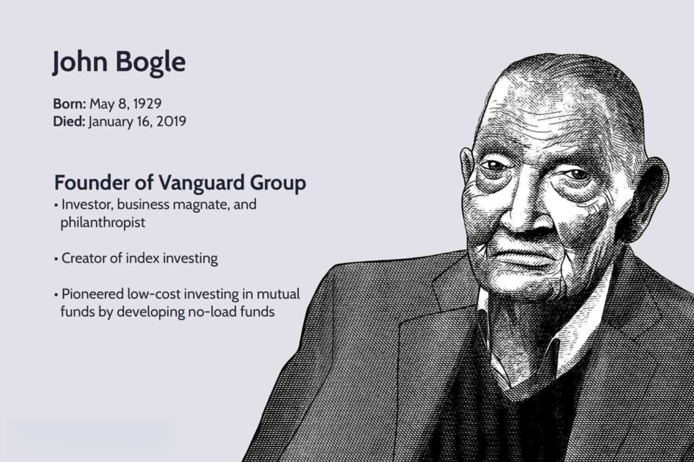

## Table of Contents

## What is Vanguard Group?

Vanguard Group is a big company that helps people save and invest their money. It was started in 1975 by a man named John C. Bogle. Vanguard is known for something called index funds, which are a way to invest in many different companies at once without trying to pick the best ones. This makes it easier and often cheaper for people to invest their money.

The company is based in the United States, in a place called Pennsylvania. It has lots of customers all over the world. Vanguard is different from many other investment companies because it is owned by the people who invest in its funds. This means that the company works to help its customers, not just to make money for itself. This is called being a "client-owned" company.

Vanguard offers many different ways for people to invest, like saving for retirement or for their kids' education. They have funds that focus on different parts of the world or different types of companies. Because they focus on keeping costs low, many people choose Vanguard to help them grow their savings over time.

## Who founded Vanguard Group?

Vanguard Group was founded by a man named John C. Bogle. He started the company in 1975. John Bogle had a big idea about making investing easier and cheaper for regular people. He believed that instead of trying to pick the best stocks, people could do well by just owning a little bit of a lot of different companies.

This idea led to the creation of index funds, which Vanguard became famous for. Index funds are a way to invest in a big group of companies all at once. This makes it simpler and often costs less money than other ways of investing. John Bogle's work with Vanguard changed how many people think about saving and investing their money.

## When was Vanguard Group established?

Vanguard Group was started in 1975. A man named John C. Bogle founded it. He wanted to make investing easier and cheaper for everyone. John Bogle came up with the idea of index funds. These funds let people own a little bit of a lot of different companies all at once.

Vanguard became well-known for these index funds. They helped people save money and grow their investments without having to pick the best stocks themselves. The company is based in Pennsylvania, in the United States. It has grown a lot since 1975 and now helps people all over the world with their savings and investments.

## What is the ownership structure of Vanguard Group?

Vanguard Group has a unique ownership structure. It is owned by the people who invest in its funds. This means that instead of being owned by a few rich people or a big company, Vanguard is owned by its own customers. This setup is called being "client-owned."

Because Vanguard is owned by its clients, it works to help them save money and grow their investments. The company focuses on keeping costs low and making it easy for people to invest. This is different from many other investment companies, which might focus more on making profits for their owners.

## How does Vanguard's ownership model differ from other investment firms?

Vanguard's ownership model is unique because it is owned by the people who invest in its funds. This means that instead of being owned by a few rich people or a big company, Vanguard is owned by its own customers. This setup is called being "client-owned." Because Vanguard is owned by its clients, it works to help them save money and grow their investments. The company focuses on keeping costs low and making it easy for people to invest.

Many other investment firms are structured differently. They might be owned by a few people, a big corporation, or even be publicly traded on the stock market. These firms often focus on making profits for their owners or shareholders. This can mean higher fees for their clients because the company needs to make money for its owners. Vanguard's model, on the other hand, aligns the company's goals with its clients' goals, which is to help them save and invest as effectively as possible.

## Who are the current owners of Vanguard Group?

The current owners of Vanguard Group are the people who invest in its funds. This means that if you have money in a Vanguard fund, you are part owner of the company. This way of owning a company is called being "client-owned." It's different from other companies that might be owned by a few rich people or big corporations.

Because Vanguard is owned by its clients, it works to help them save and grow their money. The company tries to keep costs low and make investing easy for everyone. This is different from many other investment firms, which might focus on making profits for their owners instead of helping their clients as much.

## How does the ownership of Vanguard Group affect its operations?

The ownership of Vanguard Group, where it is owned by the people who invest in its funds, affects how the company runs in a big way. Because the clients are the owners, Vanguard works hard to keep costs low and make investing easy for everyone. This is different from other companies that might be owned by a few rich people or big corporations. Those companies might focus more on making money for their owners, which can mean higher fees for their clients.

Vanguard's focus on helping its clients save and grow their money means it tries to offer the best services at the lowest possible cost. This is because the company's success is tied directly to the success of its clients. If the clients do well with their investments, the company does well too. This setup encourages Vanguard to always think about what's best for the people who invest with them, making it a unique and client-friendly place to save and invest money.

## What are the benefits of Vanguard's ownership structure for its clients?

Vanguard's ownership structure, where it is owned by the people who invest in its funds, has big benefits for its clients. Because the clients are the owners, Vanguard works hard to keep costs low. This means that when you invest with Vanguard, you pay less in fees than you might with other companies. Lower fees are good because they let you keep more of your money, which can grow over time.

Another benefit is that Vanguard focuses on making investing easy and good for everyone. Since the company's success depends on its clients doing well, Vanguard tries to offer the best services at the lowest cost. This setup means that Vanguard always thinks about what's best for the people who invest with them, making it a friendly and helpful place to save and grow your money.

## How has Vanguard's ownership evolved over time?

Vanguard Group was started in 1975 by John C. Bogle. From the very beginning, it was set up to be owned by its clients. This means that instead of being owned by a few rich people or a big company, Vanguard is owned by the people who invest in its funds. This idea was very different from other investment companies at the time, and it helped Vanguard grow and become successful.

Over the years, Vanguard's ownership has stayed the same. It is still owned by the people who invest in its funds. This setup has helped Vanguard keep its focus on helping its clients save money and grow their investments. Because the company's success is tied to its clients' success, Vanguard works hard to keep costs low and make investing easy for everyone. This way of being owned has not changed and continues to be a big part of what makes Vanguard special.

## What governance mechanisms are in place due to Vanguard's ownership structure?

Vanguard's ownership structure, where it is owned by its clients, means that the company has to have special ways to make decisions and be run. Instead of a few rich people or a big company making all the choices, Vanguard has a board of directors that looks out for the investors. This board makes sure that Vanguard keeps costs low and works to help its clients save and grow their money. They meet regularly to talk about important things and make decisions that are good for everyone who invests in Vanguard.

Because Vanguard is owned by its clients, the company also has to be very clear about what it does. It has to share a lot of information with its investors so they know how their money is being used. This openness helps build trust between Vanguard and its clients. It also means that if clients are not happy with how things are going, they can say something and maybe even vote on big decisions. This way, everyone who invests in Vanguard has a say in how the company runs, which is different from many other investment firms.

## How does Vanguard's ownership impact its investment strategies?

Vanguard's ownership by its clients means it focuses on making investment strategies that help everyone who invests with them. Because the company's success depends on its clients doing well, Vanguard works hard to keep costs low and offer simple, effective ways to invest. This means they often use index funds, which let people own a little bit of a lot of different companies all at once. Index funds are usually cheaper and easier than trying to pick the best stocks yourself.

Vanguard also tries to make investing easy for everyone, not just people who know a lot about the stock market. They offer different types of funds that focus on different parts of the world or different kinds of companies. This way, clients can choose what fits their goals best. Because Vanguard is owned by its clients, it always thinks about what's best for them, which means they keep fees low and work to help people save and grow their money over time.

## What are the potential risks or criticisms associated with Vanguard's ownership model?

One potential risk of Vanguard's ownership model is that it might make the company less focused on making big profits. Because Vanguard is owned by its clients, it works hard to keep costs low and help people save and grow their money. But some people might think this means Vanguard doesn't try hard enough to find the best investments or make as much money as it could. They might say that a company owned by a few rich people or a big corporation might push harder to make more money, even if it means charging clients more.

Another criticism is that Vanguard's focus on index funds might make it less interested in [picking](/wiki/asset-class-picking) individual stocks or trying new investment ideas. Some people think that by sticking mostly to index funds, Vanguard might miss out on big opportunities to make more money for its clients. They might say that other investment firms, which are not owned by their clients, might be more willing to take risks and try new things to grow their clients' money faster.

## What is Algorithmic Trading at Vanguard?

Vanguard Group employs advanced [algorithmic trading](/wiki/algorithmic-trading) to optimize investment strategies and enhance performance outcomes. By leveraging [machine learning](/wiki/machine-learning) models, the company seeks to improve alpha generation, allowing for more adaptive and responsive investments in relation to fluctuating market conditions. These sophisticated algorithms work by identifying intricate patterns within extensive financial data sets, enabling more informed and data-driven decision-making processes.

The core mechanism of Vanguard's algorithmic trading lies in its utilization of machine learning techniques, which are designed to adjust and learn from new data continuously. These models analyze vast arrays of market information, from price movements to trading volumes, and adjust strategies to capitalize on emerging trends or anomalies. As a result, this dynamic approach helps Vanguard to achieve better predictive accuracy and investment returns.

Machine learning in algorithmic trading typically involves training models with historical financial data to recognize patterns that correlate with profitable outcomes. These patterns are then used to construct predictive models which can guide trading decisions in real-time. For instance, a machine learning model might use regression analysis to forecast future stock prices based on historical trends and current market indicators. The generalized regression equation can be written as:

$$

y = \beta_0 + \beta_1x_1 + \beta_2x_2 + \ldots + \beta_nx_n + \epsilon 
$$

where $y$ is the dependent variable (e.g., future stock price), $\beta_0$ is the intercept, $\beta_1, \beta_2, \ldots, \beta_n$ are the coefficients for each independent variable $x_1, x_2, \ldots, x_n$, and $\epsilon$ represents the error term.

Beyond mathematical models, Vanguard's algorithms may employ techniques such as natural language processing (NLP) for sentiment analysis, gauging investor sentiment from news articles and social media to anticipate market moves. Furthermore, clustering algorithms like k-means can be applied to categorize stocks into groups with similar characteristics, aiding in diversified portfolio generation.

The integration of these advanced algorithmic tools into Vanguard's trading processes ensures more robust, systematic approaches to investment strategy implementation, underpinning the pursuit of superior investment outcomes. By utilizing these technologies, Vanguard advances its capability to manage risks efficiently and maximize returns, all while remaining sensitive to the ever-evolving landscape of global financial markets.

## References & Further Reading

[1]: Bogle, J. C. (1999). ["Common Sense on Mutual Funds: New Imperatives for the Intelligent Investor."](https://www.amazon.com/Common-Sense-Mutual-Funds-Imperatives/dp/0471392286) John Wiley & Sons.

[2]: ["Advances in Financial Machine Learning"](https://www.amazon.com/Advances-Financial-Machine-Learning-Marcos/dp/1119482089) by Marcos Lopez de Prado

[3]: ["The Little Book of Common Sense Investing: The Only Way to Guarantee Your Fair Share of Stock Market Returns"](https://www.amazon.com/Little-Book-Common-Sense-Investing/dp/1119404509) by John C. Bogle

[4]: ["Machine Learning for Algorithmic Trading"](https://github.com/PacktPublishing/Machine-Learning-for-Algorithmic-Trading-Second-Edition) by Stefan Jansen

[5]: ["Principles of Quantitative Equity Investing: A Complete Guide to Creating, Evaluating, and Implementing Trading Strategies"](https://ptgmedia.pearsoncmg.com/images/9780134192796/samplepages/9780134192796.pdf) by Sugata Ray