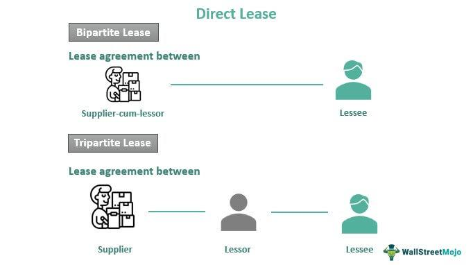

The intersection of property ownership, leased land, real estate, and algorithmic trading represents an emerging frontier in modern investment strategies. This convergence allows investors to harness the power of technology to enhance decision-making processes and optimize investment portfolios. Property ownership on leased land offers a unique model where individuals possess the structures but lease the underlying land, often resulting in reduced costs and prime location access. Such arrangements demand a keen understanding of legal and financial aspects to maximize benefits while managing potential risks. 

Algorithmic trading, traditionally rooted in securities markets, is extending its reach into real estate, offering the ability to analyze vast datasets, predict market shifts, and execute transactions with unprecedented speed and precision. By integrating algorithmic trading with real estate investments, investors can identify trends, project future market behaviors, and optimize property management. This analysis enables a more informed approach to navigating both traditional and innovative investment landscapes.



These topics form a foundation for evaluating the ways technology influences real estate and financial markets, shaping new opportunities and posing novel challenges. Understanding the potential impact of these interconnected areas is crucial for investors seeking to adapt to the evolving market conditions and maintain competitive portfolios. As technology continues to advance, its role in transforming real estate and investment strategies will undoubtedly grow, inviting stakeholders to explore how these developments may influence future markets.

## Table of Contents

## Understanding Property Ownership on Leased Land

Leased land, a distinct form of property ownership, enables individuals to possess and manage structures erected on land that is leased from another entity. This arrangement can result in substantial cost savings and grants access to coveted locations at more affordable prices. The dynamics of leased land are prevalent in both residential and commercial sectors, each offering unique characteristics that cater to diverse investor and tenant needs.

### Types of Leased Land Properties

1. **Residential Leased Land Communities**: These are often seen in mobile home parks, retirement communities, and certain condominium settings. Homeowners may own their residences but pay regular fees to lease the land upon which their homes are situated. This setup often reduces upfront costs compared to purchasing both land and structure. It allows homeowners access to residence in desirable areas at reduced financial entry points.

2. **Commercial Leases**: In commercial real estate, businesses may lease prime real estate locations for offices, retail stores, or industrial uses while another entity owns the land. This can provide businesses the strategic advantage of operating in prime areas without the substantial capital investment required to purchase land outright.

### Legal and Financial Considerations

Understanding the legal and financial nuances of leased land is imperative for maximizing potential returns and making informed investment decisions:

- **Lease Agreements**: Typically outlining terms, length, renewal options, and rent escalations, lease agreements govern land use. These agreements can vary widely, influencing the stability and predictability of long-term costs. 

- **Cost Analysis**: Leased land generally allows for lower initial capital expenditure than purchasing real estate outright, influencing investment strategies and financial plans. Investors can allocate resources towards enhancing or developing structures instead of land purchases.

- **Tax Implications**: Leasing rather than owning land can result in different property tax obligations. Leaseholders may benefit from reduced property taxes since these are often based on the value of the leased asset, not including the land.

- **Valuation and Risk Management**: Investors must carefully assess the economic life and depreciation of structures on leased land while considering lease expiration and renewal risks. Lease agreements often encompass specific terms related to improvements, maintenance responsibilities, and potential buyout clauses which should be meticulously evaluated.

By navigating these facets adeptly, investors and property owners can make strategic choices that align with their financial goals and market conditions. Informed decision-making in leased land investments hinges on a comprehensive understanding of both the beneficial opportunities and the inherent risks associated with these unique ownership arrangements.

## Advantages and Disadvantages of Leased Land

Leased land presents an intriguing investment option, offering numerous advantages alongside certain inherent drawbacks. The primary advantage of leased land is the potential for reduced purchase prices. When acquiring property, investors can secure only the buildings and improvements, while leasing the land itself. This arrangement can result in significantly lower initial costs compared to outright land ownership, releasing capital for other investments or property enhancements.

Access to desirable locations represents another significant advantage of leased land arrangements. Leasing land allows investors to gain entry to prime areas which might otherwise be financially inaccessible due to high land values. This is particularly beneficial in metropolitan or highly sought-after regions where the cost of land can be prohibitive.

Lower property taxes are also an advantage for those leasing land. Because the property's assessed value generally includes only the leased structures and not the land itself, property taxes can be substantially lower than they would be for entirely owned properties, offering further financial relief to the investor.

Conversely, disadvantages accompany the decision to invest in leased land. A notable risk is the potential for escalating lease fees. Lease agreements often contain clauses that permit periodic rent increases, which can strain an investor’s budget and erode profit margins over time.

Additionally, there are often limitations regarding property improvements. Leaseholders may face restrictions imposed by the landowner on significant alterations or expansions to the property. Such limitations can impede the ability to enhance the property’s value or adapt it to changing needs, potentially affecting the investment's long-term viability.

Finally, complications can arise at the termination of the lease. Investors must consider the risk of non-renewal, which forces the removal of structures or expensive renegotiations. This scenario poses a substantial risk, especially if the property has been improved significantly during the lease term.

In summary, when assessing leased land for investment, careful evaluation of these benefits and drawbacks is crucial. An understanding of these dynamics will help investors decide if leasing aligns with their long-term goals and risk tolerance.

## Algorithmic Trading in Real Estate

Algorithmic trading in real estate involves the use of sophisticated computer algorithms to automate and enhance investment strategies by rapidly analyzing vast datasets related to market trends, property metrics, and broader economic indicators. These algorithms are designed to identify profitable investment opportunities with greater precision and speed than human analysts could achieve.

The application of [algorithmic trading](/wiki/algorithmic-trading) in real estate allows for the optimization of investment portfolios. By leveraging historical data and predictive analytics, algorithms can forecast market shifts and price movements, enabling investors to make informed decisions on property acquisitions and sales. This not only increases efficiency but also reduces the likelihood of human error in the decision-making process.

One of the primary advantages is the capability to systematically interpret complex datasets that encompass property values, rental yields, demographic trends, and economic conditions. For example, algorithms can be programmed to produce predictive models that assess the impact of macroeconomic factors like [interest rate](/wiki/interest-rate-trading-strategies) changes or employment rates on real estate prices. This analytical approach provides a comprehensive view that helps in anticipating and responding to market [volatility](/wiki/volatility-trading-strategies) effectively.

However, several challenges exist in implementing algorithmic trading in the real estate sector. Unlike traditional financial markets, real estate markets are generally less liquid, which can limit the frequency and size of transactions that algorithms can process. Additionally, the quality and availability of data are crucial; inaccuracies or gaps in data can lead to erroneous predictions and suboptimal investment decisions. Furthermore, real estate investments often involve qualitative factors such as property condition, which are difficult to quantify and integrate into algorithmic models.

Integrating non-quantitative factors requires advanced techniques and can benefit from technologies like [machine learning](/wiki/machine-learning), which can adapt to new data patterns over time. For instance, machine learning algorithms can be trained to evaluate amenities, local infrastructure, and neighborhood desirability, thereby enriching the dataset used for making investment decisions.

Overall, algorithmic trading has the potential to revolutionize real estate investment by enhancing predictive accuracy and operational efficiency. As technology evolves, the integration of [artificial intelligence](/wiki/ai-artificial-intelligence) and machine learning is expected to further refine these strategies, overcoming existing challenges and unlocking new opportunities for investors.

## Integrating Algorithmic Trading with Leased Land Investments

Integrating algorithmic trading with leased land investments offers novel ways to approach real estate portfolio management. Algorithms can analyze complex datasets, enabling investors to make more informed decisions regarding the timing of property acquisitions, monitoring lease conditions, and predicting financial outcomes. The integration of algorithms in leased land investments involves various technological and strategic considerations.

**Timing Property Acquisitions**

Algorithms can process vast amounts of data to assess the optimal timing for property acquisitions. By analyzing market trends, economic indicators, and historical data, these algorithms can forecast potential market shifts, allowing investors to buy properties at advantageous times. This capability reduces the risk of purchasing at peak market prices and can improve overall investment returns. For instance, a regression model could be applied to historical price data and macroeconomic variables to predict future property values.

```python
import numpy as np
import pandas as pd
from sklearn.model_selection import train_test_split
from sklearn.linear_model import LinearRegression

# Sample code for predicting property prices
data = pd.read_csv('property_data.csv')
X = data[['economic_indicator_1', 'economic_indicator_2', 'historical_price']]
y = data['future_price']

X_train, X_test, y_train, y_test = train_test_split(X, y, test_size=0.2, random_state=42)
model = LinearRegression()
model.fit(X_train, y_train)
predictions = model.predict(X_test)
```

**Monitoring Lease Terms**

Algorithms can systematically monitor lease terms, ensuring compliance and effective management of leased land properties. By automating lease management, investors can track expiration dates, renewal options, and potential escalation of lease fees. This proactive approach enables investors to make strategic decisions about renewing leases or exploring alternative investments before lease terms become unfavorable.

**Predicting Financial Outcomes**

Another strategic advantage of algorithmic trading is the ability to predict financial outcomes. By utilizing machine learning models, algorithms can simulate various scenarios affecting leased land investments, such as changes in interest rates, inflation, or shifts in tenant demand. These simulations aid investors in understanding potential risks and returns, enabling more robust financial planning and risk management strategies.

For example, a decision tree model can be used to evaluate the impact of different variables on projected financial performance.

```python
from sklearn.tree import DecisionTreeRegressor

# Sample code for predicting financial outcomes
X = data[['interest_rate', 'inflation_rate', 'tenant_demand']]
y = data['financial_outcome']

X_train, X_test, y_train, y_test = train_test_split(X, y, test_size=0.2, random_state=42)
decision_tree = DecisionTreeRegressor()
decision_tree.fit(X_train, y_train)
financial_predictions = decision_tree.predict(X_test)
```

**Case Studies and Practical Examples**

Several case studies highlight the effective application of algorithmic trading combined with leased land investments. For instance, a real estate firm might use algorithms to optimize its portfolio by continuously analyzing lease data and market conditions, resulting in improved asset performance and risk mitigation. Additionally, sophisticated models can be employed to predict the impact of external economic events on property values, allowing for proactive adjustments to investment strategies.

In conclusion, integrating algorithmic trading with leased land investments brings a data-driven approach to real estate management, enhancing decision-making, improving risk assessment, and potentially increasing returns. As technology continues to evolve, the use of algorithms in this domain is likely to grow, providing investors with increasingly refined tools for optimizing their real estate portfolios.

## Future Trends and Considerations

Emerging technologies and evolving market conditions are poised to significantly impact property ownership and investment strategies. The integration of artificial intelligence (AI) and machine learning in algorithmic trading offers a transformative potential for the real estate sector. These advanced technologies can refine trading strategies by analyzing vast datasets for optimal decision-making. Algorithms that learn patterns and predict outcomes based on historical data and market trends are becoming increasingly sophisticated, offering investors a competitive edge in timing the market and asset allocation.

Moreover, the growing emphasis on sustainable investments is likely to influence the utilization of leased land and algorithmic trading. Property investors are increasingly considering environmental, social, and governance ([ESG](/wiki/esg-investing)) factors when making decisions. This shift towards sustainability could affect the desirability and valuation of properties, particularly those on leased land. Investors who integrate ESG criteria into their portfolios may not only mitigate risks but also capitalize on new opportunities as regulatory frameworks and consumer preferences evolve.

Investors must also remain vigilant regarding legal frameworks, market dynamics, and technological advancements. Changes in zoning laws, lease agreements, and environmental regulations can have profound implications for property ownership and investment strategies. Technology advancements continue to redefine market dynamics, creating both opportunities and challenges. Investors need a proactive approach, continually updating their strategies and leveraging cutting-edge technology to remain competitive in a rapidly changing landscape. 

By staying informed and adaptable, investors can better navigate future trends in property ownership and algorithmic trading, positioning themselves to optimize returns and contribute to sustainable economic growth.

## Conclusion

The convergence of property ownership on leased land and algorithmic trading presents dynamic opportunities and challenges that are reshaping the investment landscape. This synergy offers investors a multilayered approach by marrying the tangible assets of real estate with the precision and efficiency of algorithm-driven strategies.

Investors can gain significantly by understanding both the traditional tenets of real estate investment and the innovative applications of technology. The historical knowledge of property value, location dynamics, and economic indicators remains crucial, but it is increasingly complemented by the ability to process large datasets instantaneously, identify patterns, and automate decision-making processes. This dual understanding allows for the optimization of investment portfolios, where the risk and return profile can be continually balanced through algorithmic adjustments.

Careful analysis and strategic planning are indispensable in leveraging these advancements. Utilizing algorithms, investors can enhance portfolio performance by predictive analytics that monitor market shifts and asset price fluctuations, and automate transactions to capitalize on favorable conditions. Strategic integration of these elements allows for the agility needed to adapt to market changes, a crucial advantage in real estate markets that are traditionally less liquid and slower to react compared to financial securities.

Embracing these trends not only provides the potential for improved portfolio outcomes but also encourages sustainable investment practices. As algorithmic trading systems develop and integrate aspects like AI and machine learning, they can further refine investment approaches to accommodate environmental and social governance (ESG) considerations. By considering the evolving legal frameworks, staying attuned to market dynamics, and adopting cutting-edge technological advancements, investors position themselves to make informed, responsible, and profitable decisions that align with future market aspirations.

## References & Further Reading

[1]: Bergstra, J., Bardenet, R., Bengio, Y., & Kégl, B. (2011). ["Algorithms for Hyper-Parameter Optimization."](https://dl.acm.org/doi/10.5555/2986459.2986743) Advances in Neural Information Processing Systems 24.

[2]: ["Advances in Financial Machine Learning"](https://www.amazon.com/Advances-Financial-Machine-Learning-Marcos/dp/1119482089) by Marcos Lopez de Prado

[3]: ["Evidence-Based Technical Analysis: Applying the Scientific Method and Statistical Inference to Trading Signals"](https://www.amazon.com/Evidence-Based-Technical-Analysis-Scientific-Statistical/dp/0470008741) by David Aronson

[4]: ["Machine Learning for Algorithmic Trading"](https://github.com/stefan-jansen/machine-learning-for-trading) by Stefan Jansen

[5]: ["Quantitative Trading: How to Build Your Own Algorithmic Trading Business"](https://www.amazon.com/Quantitative-Trading-Build-Algorithmic-Business/dp/1119800064) by Ernest P. Chan