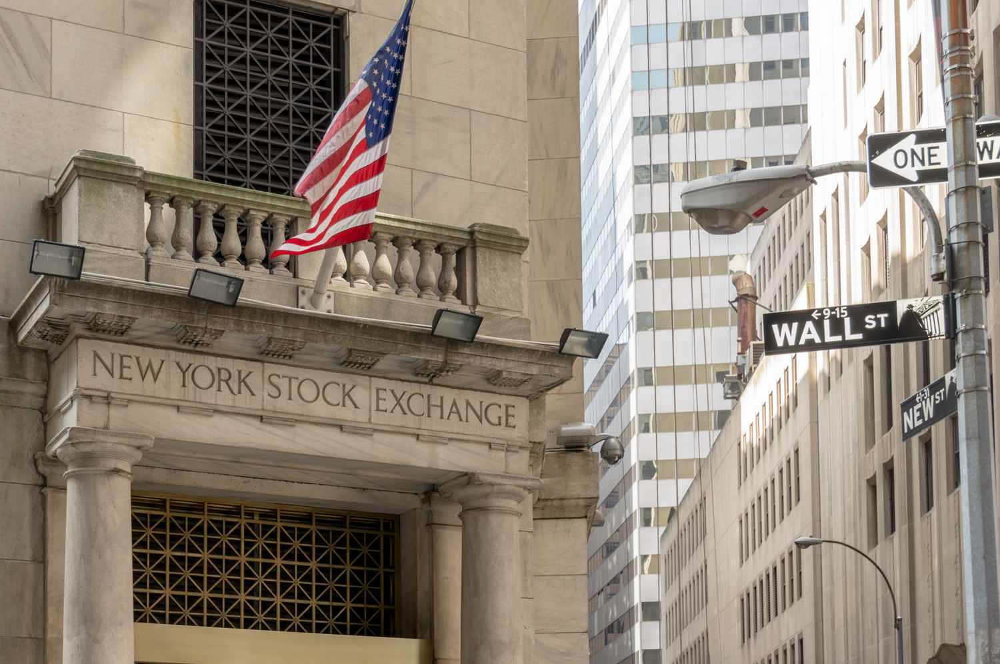

Financial markets are complex systems constituted by various instruments, participants, and platforms. They provide the infrastructure required for the issuance, buying, and selling of financial securities such as stocks, bonds, and commodities. Among these participants, stock exchanges play a crucial role by acting as organized venues where these transactions occur, ensuring liquidity and transparency in the market. Stock exchanges serve as barometers of economic health by reflecting the collective valuation of publicly traded companies. The New York Stock Exchange (NYSE), the largest and one of the most prestigious stock exchanges globally, stands as a pillar of the financial markets.

Founded in 1792, the NYSE has been significant not just for its transaction volume and market capitalization but also as a symbol of economic progress. Located on Wall Street in New York City, the NYSE has historically represented the epicenter of capitalism and financial innovation. Historically, membership on the NYSE involved purchasing a "seat," which provided the holder with the right to trade on the floor of the exchange. Seat ownership was synonymous with prestige and influence, reflecting a tangible connection to the financial industry's forefront. However, with technological advancements, the concept of stock exchange membership has evolved from physical ownership of seats to a more accessible, digital realm of trading, where membership is defined by access privileges rather than physical presence.

The advent of algorithmic trading marks a pivotal transformation in the functioning of stock exchanges. It involves using pre-programmed trading instructions based on various market variables such as time, price, and volume. The speed and precision of algorithmic trading have dramatically increased market efficiency and liquidity while reducing transaction costs and human error. Nonetheless, this rapid execution capability has also introduced new challenges, such as market volatility and the potential for systemic risks.

This article aims to explore the historical and present dynamics of NYSE seat ownership and the profound impact of algorithmic trading on stock exchanges. Through this exploration, we will understand the transition from traditional to modern trading practices and the opportunities and challenges posed by the integration of technology in financial markets.

## Table of Contents

## What is the NYSE?

The New York Stock Exchange (NYSE), located on Wall Street in New York City, is one of the most significant and prestigious financial markets globally. Established in 1792, the NYSE began under the Buttonwood Agreement, signed by 24 stockbrokers, which laid the foundation for organized securities trading in the United States. Over the centuries, the NYSE evolved, cementing its position as a cornerstone of global finance.

The NYSE plays a pivotal role in the global financial market, serving as a platform for companies to raise capital by listing their shares for investors. It contributes to economic growth and wealth creation by enabling efficient capital allocation and facilitating liquidity. As a hub of trading activity, the NYSE influences global economic indicators and provides transparency and confidence to investors worldwide.

In contemporary times, the NYSE operates through a combination of traditional and digital trading mechanisms. Historically known for its physical trading floor where brokers engage in open outcry trading, the exchange has embraced technological advancements to enhance efficiency. Today, digital trading dominates, with transactions executed electronically at lightning-fast speeds. The NYSE leverages automated systems and algorithms to optimize trade execution while maintaining its iconic trading floor as a symbolic representation of its rich history.

Key [statistics](/wiki/bayesian-statistics) underscore the stature of the NYSE. It lists over 2,400 companies, with a combined market capitalization exceeding $30 trillion as of recent data. The exchange facilitates the trading of billions of shares daily, significantly impacting stock prices and market [momentum](/wiki/momentum). The NYSE's benchmarks, such as the Dow Jones Industrial Average (DJIA) and the S&P 500, serve as barometers for global economic health.

In summary, the NYSE stands as a beacon of economic activity, balancing its storied past with innovative technological integration. Its influence extends beyond national borders, shaping the dynamics of international financial markets and underpinning the global economic infrastructure.

## The Concept of Seat Ownership on the NYSE

The concept of owning a seat on the New York Stock Exchange (NYSE) has historically represented both prestige and influence within the financial markets. A "seat" on the NYSE primarily referred to the right of a person or firm to trade directly on the floor of the exchange. Originating in the early 19th century, these seats were highly sought after, often fetching prices in the millions of dollars during competitive periods.

Initially, owning a seat was synonymous with holding significant market power and personal status. Members who owned seats were not only entitled to trade on the exchange, but they also had a voice in the governance of the NYSE and close proximity to crucial market information.

Over time, the concept of seat ownership evolved. The traditional model required a physical presence on the trading floor, which began to change with the rise of electronic trading in the late 20th century. As technology advanced, the necessity for a physical trading spot diminished, giving way to the idea of memberships that allowed for remote and electronic trading. This shift reflected a broader transformation in global markets, moving towards faster, more efficient means of executing trades without the constraints of a physical location.

The transition from seat ownership to a member-based system reached a significant milestone in 2006, when the NYSE adopted a for-profit business model following its merger with Archipelago Holdings. This change marked the official end of traditional seat ownership. Instead of owning a seat, individuals and firms now purchased licenses that granted them similar trading privileges without the need for a physical seat on the trading floor.

Today, the licenses operate within a demutualized structure, enabling participants to trade and engage with the market in a more flexible and technologically savvy way. This evolution is part of a broader shift across financial markets toward digital trading and algorithmic processes, aligning seat ownership with modern trading practices that emphasize speed and technology over physical presence.

## Algorithmic Trading in Modern Financial Markets

Algorithmic trading, commonly referred to as algo trading, has become an integral component of modern financial markets. It involves the use of computer algorithms to automate trading decisions and execute orders at speeds and frequencies that surpass human capabilities. The growing popularity of [algorithmic trading](/wiki/algorithmic-trading) is largely driven by advancements in technology and increased access to market data, which have enabled traders to implement complex strategies with precision and efficiency.

One of the primary benefits of algorithmic trading is its ability to enhance trading speed. Algorithms can execute orders in milliseconds, minimizing the latency between trading decisions and their implementation. This speed allows traders to capitalize on fleeting market opportunities that might be missed in manual trading. Additionally, by automating the trading process, algorithmic trading significantly improves efficiency. Traders can process and analyze large volumes of data in real-time, allowing them to make informed decisions based on comprehensive market assessments. Moreover, the reduced human intervention in trading minimizes the risk of errors caused by emotional and psychological factors, thus enhancing the overall reliability of trading operations.

Algorithmic trading encompasses a variety of strategies, each tailored to achieve specific objectives. Common strategies include [market making](/wiki/market-making), [arbitrage](/wiki/arbitrage), and [trend following](/wiki/trend-following). Market making involves providing [liquidity](/wiki/liquidity-risk-premium) to the market by continuously quoting buy and sell prices. Arbitrage exploits price differences of the same asset across different markets or financial instruments to generate profit. Trend following, on the other hand, identifies and capitalizes on market momentum by buying or selling assets based on their historical price trends. More advanced strategies might involve [statistical arbitrage](/wiki/statistical-arbitrage), delta-neutral strategies, and mean-reversion, each leveraging sophisticated math models to predict price movements.

The impact of algorithmic trading on stock exchange operations is profound. It has increased market liquidity and reduced bid-ask spreads, facilitating smoother and more efficient trading. However, it has also introduced new challenges such as the potential for increased market [volatility](/wiki/volatility-trading-strategies) and the risk of flash crashes, where rapidly executed trades lead to sudden and significant market disruptions. Exchanges have had to adapt by updating their infrastructure to handle the high-frequency trading activity and implementing safeguards to maintain market stability.

Overall, algorithmic trading has transformed the landscape of financial markets, offering unparalleled opportunities for innovation and growth while simultaneously presenting challenges that demand robust regulatory frameworks and continuous technological advancements.

## The Intersection of NYSE Membership and Algo Trading

Algorithmic trading has significantly transformed NYSE membership by altering how trading is conducted and reshaping the profile of members involved in the marketplace. Traditional membership once revolved around physically owning a seat on the exchange, representing a prestigious position that allowed brokers to trade directly on the floor. This model has evolved significantly due to technological advancements, and algorithmic trading plays a central role.

### How Algorithmic Trading Has Transformed NYSE Membership

Algorithmic trading uses computer systems to execute orders based on pre-defined criteria at speeds much faster than human traders could achieve. For NYSE members, this means less emphasis on physical presence and more focus on technological prowess and capabilities. The rise of algorithmic trading has democratized access to trading, previously dominated by those with the financial means to secure a seat. Now, firms with advanced technology and efficient algorithms can compete on a more level playing field.

### The Current Landscape of Trading on the NYSE in the Digital Age

Trading on the NYSE is now characterized by a blend of traditional and electronic markets. While the iconic trading floor still exists, most trades are executed automatically through electronic systems. This shift has reduced the number of floor brokers as more firms opt to implement algorithmic systems that can operate without human intervention. The landscape is dominated by high-frequency trading ([HFT](/wiki/high-frequency-trading-strategies)), where firms use complex algorithms to engage in trades that are settled within milliseconds.

The adoption of electronic trading systems has increased the number of trades executed daily, enhancing liquidity and reducing transaction costs for investors. The advent of algorithmic trading strategies like market making, arbitrage, and trend following has enabled a range of participants, including hedge funds and proprietary trading firms, to become influential NYSE members without ever setting foot on the trading floor.

### Adapting to Technology: From Traditional Brokers to Electronic Trading Systems

Traditional brokers have had to adapt by acquiring and mastering new technologies to remain competitive. Adaptation has involved substantial investment in infrastructure, including co-location services, to minimize latency and gain a competitive edge. Professional traders must also develop skills in quantitative analysis and coding to develop and maintain sophisticated trading algorithms.

There is an ongoing shift towards a hybrid model where human judgment complements algorithmic decision-making. This model allows brokers and traders to leverage the strengths of both systems—humans provide strategic insights, while algorithms handle rapid execution and data analysis.

### Challenges and Opportunities for NYSE Members

While algorithmic trading presents numerous opportunities for improved efficiency and profitability, it also poses challenges for NYSE members. The reliance on complex systems means increased risks of technical failures and algorithmic errors that could lead to significant financial losses and market disruptions. Additionally, as the competition is largely based on technological capabilities, smaller firms may find themselves at a disadvantage compared to larger firms with more resources to invest in technology.

On the opportunity side, algorithmic trading enables firms to execute sophisticated trading strategies that optimize returns and minimize risk through diversification and hedging. The ability to analyze and react to vast quantities of data instantaneously provides a strategic advantage in a fast-paced market environment.

In conclusion, algorithmic trading has redefined the concept of NYSE membership by shifting the focus from physical presence and personal networking to technological innovation and strategic analysis. The evolving nature of the financial markets requires continuous adaptation and learning to navigate the challenges and harness the opportunities presented by algorithmic trading.

## Regulatory Aspects of NYSE Membership and Algo Trading

The regulatory environment of the New York Stock Exchange (NYSE) and algorithmic trading entails multiple levels of oversight aimed at maintaining market integrity and protecting investors. Key regulatory bodies include the U.S. Securities and Exchange Commission (SEC) and the Financial Industry Regulatory Authority (FINRA). These organizations are responsible for enforcing regulations that govern trading activities and maintain fair market practices.

### Overview of Regulatory Bodies

The SEC is the principal federal regulatory authority overseeing the NYSE. It enforces securities laws designed to protect investors, facilitate capital formation, and ensure fair and efficient markets. The SEC achieves these objectives by regulating securities markets, reviewing regulatory filings, and investigating misconduct. Meanwhile, FINRA operates as a self-regulatory organization focusing on broker-dealer oversight. It is responsible for ensuring member firms' adherence to federal securities laws and FINRA’s own rules.

### Key Regulations Impacting Algorithmic Trading and Membership Licenses

Algorithmic trading, characterized by high-speed executions and complex decision-making processes, necessitates specific regulatory considerations. One of the primary regulations impacting algorithmic trading is the SEC's Regulation NMS (National Market System), which includes the Order Protection Rule mandating the execution of orders across exchanges to ensure price efficiency.

Moreover, FINRA Rule 2010 emphasizes ethical business conduct and integrity within market activities, which extends to algorithmic strategies. Membership at the NYSE requires adherence to these regulations, alongside licensing and registration stipulations that ensure market participants are qualified and compliant.

### The Role of Compliance and Ethics

Compliance and ethics are foundational to the operation of both traditional and algorithmic trading frameworks. Firms employing algorithmic trading strategies must implement robust risk management systems, which typically include the surveillance of trading activities, parameter thresholds, and real-time monitoring tools. Often, these systems are coupled with compliance programs to ensure adherence to existing regulations and guard against market abuse, such as manipulation or insider trading.

Corporate governance plays a vital role in enforcing ethical conduct. Financial institutions are required to have comprehensive compliance departments and audit procedures in place, fostering a culture of transparency and accountability throughout their trading activities.

### Future Regulatory Trends

The evolution of trading technologies and practices, including increased reliance on data analytics and [machine learning](/wiki/machine-learning), presents new regulatory challenges. Future trends might involve more stringent oversight of algorithmic trading systems, with regulators potentially introducing additional requirements for testing and certification of algorithms to ensure they act within prescribed ethical and performance parameters.

Furthermore, as the market adopts increasingly sophisticated trading systems, regulatory bodies may enhance their data analysis capabilities and employ technology-driven monitoring solutions to better detect irregularities. Increased collaboration between regulators and market participants is likely as both parties adapt to the rapidly changing landscape, emphasizing dialogue and the development of guidelines that balance innovation with investor protection.

As the financial markets continue to evolve, maintaining regulatory frameworks that safeguard market stability and investor confidence is essential. Regulators and market participants alike must stay agile, ensuring regulations keep pace with technological advancements and emerging trading methodologies.

## Conclusion

In conclusion, the landscape of stock exchanges and trading has undergone profound transformations, primarily driven by technological advancements and shifts in market dynamics. The New York Stock Exchange (NYSE), as a prominent global financial center, exemplifies these changes. Historically, ownership of a seat on the NYSE symbolized prestige and influence, serving as a gateway to the heart of financial trading. However, as the market transitioned towards a digital framework, traditional seat ownership evolved into a membership model within a for-profit organization.

Parallel to these developments, algorithmic trading emerged as a revolutionary force, reconfiguring trading practices with its speed and efficiency. Once characterized by bustling trading floors and human brokers, the NYSE now operates through sophisticated electronic systems, emphasizing the necessity of continuous adaptation among its members. Algorithmic trading presents both opportunities and challenges, accelerating trades and minimizing errors while introducing complexities in regulation and compliance.

Looking forward, the future of NYSE membership intertwines closely with burgeoning technologies such as machine learning and [artificial intelligence](/wiki/ai-artificial-intelligence). These innovations promise to further enhance trading strategies and execution. For participants in the financial markets, embracing continuous learning and technological proficiency will be critical in navigating the evolving landscape.

Ultimately, the evolution of stock exchanges is a testament to the relentless drive towards efficiency and accessibility in financial markets. Traders, regulators, and investors must remain agile, embracing innovation while upholding ethical standards, to thrive in this dynamic environment. The journey of the NYSE from physical seats to algorithmic pulses underscores the imperative of adaptation in ensuring its enduring significance in the global financial ecosystem.

## References

## References

1. NYSE Group, Inc. (2016). **NYSE Historic Timeline**. Available at: https://www.nyse.com/about/history
   - An official source detailing the historical evolution and milestones of the New York Stock Exchange from its inception to modern-day operations.

2. Securities and Exchange Commission (SEC). **Algorithmic Trading Impact and Regulations**. Available at: https://www.sec.gov/algo-trading
   - This website provides information on regulatory measures and guidelines governing algorithmic trading in U.S. financial markets.

3. Harris, L. (2003). **Trading & Exchanges: Market Microstructure for Practitioners**. Oxford University Press.
   - This book offers an in-depth examination of the inner workings of trading and stock exchanges, including the evolution of seat ownership and the advent of electronic trading systems.

4. Aldridge, I. (2013). **High-Frequency Trading: A Practical Guide to Algorithmic Strategies and Trading Systems**. Wiley.
   - A comprehensive guide to understanding the mechanics, strategies, and regulatory considerations of high-frequency and algorithmic trading.

5. Financial Industry Regulatory Authority (FINRA). **Compliance Guidelines for Trading Systems**. Available at: https://www.finra.org/complianceguidelines
   - FINRA’s page provides essential compliance advice and best practices for trading systems used by NYSE members and algorithmic traders.

6. Jones, C. M. (2013). **What Do We Know About High-Frequency Trading?** *Columbia Business School Research Paper.* Available at SSRN: https://ssrn.com/abstract=2236201
   - An academic paper analyzing the effects and implications of high-frequency trading on financial markets.

### Further Reading Suggestions
- **The Nasdaq Stock Market: Historical Foundations** by Roberta Romano for insights on the development and operation of another major stock exchange.
- **Digital Transformation in Financial Markets** by David Kuo Chuen Lee for understanding the broader context of digital advancements in financial trading.

### Acknowledgments
- Special thanks to financial market experts and academics who provided insights on the evolution of trading technologies.
- Acknowledgment to regulatory professionals and industry insiders for elucidating compliance and regulatory aspects of NYSE membership and algorithmic trading.

## References & Further Reading

[1]: NYSE Group, Inc. (2016). ["NYSE Historic Timeline."](https://www.nyse.com/history-of-nyse)

[2]: SEC. ["Algorithmic Trading Impact and Regulations."](https://www.investopedia.com/the-sec-s-new-rules-target-trading-apps-that-use-predictive-algorithms-7565878)

[3]: Harris, L. (2003). ["Trading & Exchanges: Market Microstructure for Practitioners."](https://www.amazon.com/Trading-Exchanges-Market-Microstructure-Practitioners/dp/0195144708) Oxford University Press.

[4]: Aldridge, I. (2013). ["High-Frequency Trading: A Practical Guide to Algorithmic Strategies and Trading Systems."](https://www.amazon.com/High-Frequency-Trading-Practical-Algorithmic-Strategies/dp/1118343506) Wiley.

[5]: FINRA. ["Compliance Guidelines for Trading Systems."](https://www.finra.org/rules-guidance)

[6]: Jones, C. M. (2013). ["What Do We Know About High-Frequency Trading?"](https://www.wsj.com/public/resources/documents/HFT0324.pdf) Columbia Business School Research Paper.

[7]: ["Advances in Financial Machine Learning"](https://www.amazon.com/Advances-Financial-Machine-Learning-Marcos/dp/1119482089) by Marcos Lopez de Prado

[8]: Aronson, D. (2006). ["Evidence-Based Technical Analysis: Applying the Scientific Method and Statistical Inference to Trading Signals."](https://www.amazon.com/Evidence-Based-Technical-Analysis-Scientific-Statistical/dp/0470008741) Wiley.

[9]: Jansen, S. (2018). ["Machine Learning for Algorithmic Trading."](https://github.com/stefan-jansen/machine-learning-for-trading) 

[10]: Chan, E. P. (2009). ["Quantitative Trading: How to Build Your Own Algorithmic Trading Business."](https://github.com/ftvision/quant_trading_echan_book) Wiley.