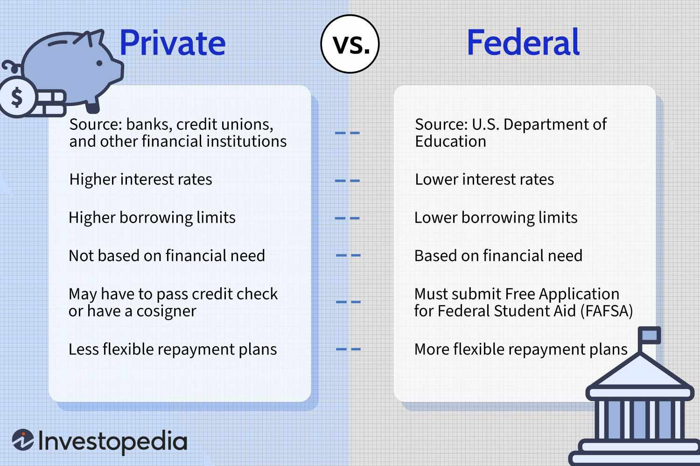

Student loan debt represents a substantial financial burden for countless individuals across the United States, profoundly influencing both personal economic decisions and broader economic dynamics. With over $1.7 trillion in student loan debt outstanding, this issue affects not only borrowers' financial futures but also impacts national economic patterns such as consumer spending and home ownership rates. The ownership of these student loans—predominantly by the federal government and, to a lesser extent, private financial institutions—plays a crucial role in determining the framework and feasibility of repayment and the propensity for default.

The intersection of student loans with financial markets adds layers of complexity in their management. Financial markets, driven increasingly by algorithmic trading, facilitate the rapid execution of trades through advanced algorithms, impacting various sectors. This integration creates an environment where the stability of financial markets can directly influence the handling of student loan portfolios, and vice versa. While algorithmic trading can bring efficiency and liquidity to markets, it may also foster volatility, particularly in economically strained periods, affecting investor confidence and financial stability.

This article aims to shed light on the complex tapestry of student loan ownership, the far-reaching implications of student loan debt on individuals and the larger economy, and the critical role that algorithmic trading plays within the financial ecosystem. Understanding these elements is essential to formulating strategies that can mitigate associated risks and foster economic resilience.

## Table of Contents

## Understanding Loan Ownership

Student loans in the United States are predominantly owned by two major entities: the federal government and private financial institutions. Each type of ownership presents distinct characteristics and implications for borrowers, lenders, and policymakers.

The federal government plays a substantial role in the student loan landscape. It owns and guarantees the bulk of student loans through programs such as the William D. Ford Federal Direct Loan Program. This government ownership reduces the default risk for associated financial entities such as banks. When loans are held or guaranteed by the government, they typically come with benefits such as fixed interest rates and income-driven repayment plans. These features help alleviate some financial pressure on borrowers, potentially lowering default rates and reducing financial uncertainty for lenders.

In contrast, private student loans are usually owned by private financial institutions, including banks, credit unions, and other lending entities. These loans are often not backed by government guarantees and, consequently, tend to have higher interest rates and less flexible repayment options than federal loans. Private loans are frequently serviced by third-party companies, which manage billing, collections, and customer service. This arrangement can complicate loan management for borrowers, as the servicing company may handle all interactions and transactions without the lender's direct involvement.

Understanding the ownership dynamics of student loans is crucial for assessing their broader economic implications. Federal loan programs facilitate access to higher education by mitigating financial barriers, although the sheer [volume](/wiki/volume-trading-strategy) of loans poses challenges to public finance and policy. On the other hand, private loans offer an alternative source of funding but at a potentially higher cost to borrowers, influencing their financial decisions and economic behavior.

References indicate that the federal government holds a significant portion of the approximately $1.7 trillion total student loan debt,[1] providing a substantial safety net against widespread defaults in the private banking sector. However, the growth of private loans necessitates careful monitoring to ensure they do not become a disproportionate burden on borrowers.

## Student Loan Debt: An Overview

Student loan debt in the United States has surpassed $1.7 trillion as of recent estimates, affecting millions of individuals and contributing to broader economic challenges. This substantial financial burden impacts borrowers' capacity to engage in pivotal economic activities, such as purchasing homes, investing in businesses, and contributing to consumer spending, all of which are critical drivers of economic growth.

High levels of student loan debt can significantly delay or even prevent individuals from making major life and financial decisions. With a considerable portion of their income devoted to debt repayment, borrowers may find it challenging to qualify for mortgages, thereby lowering rates of homeownership. According to data from the Federal Reserve, the inability to afford a down payment or qualify for a mortgage due to existing debt obligations is a common hurdle for many young adults.

The economic ripple effects of student loan debt are far-reaching. Reduced consumer spending is a notable consequence, as a substantial segment of the population must allocate a significant portion of their income to repay loans rather than spend on goods and services. This reduction in spending can slow economic activity, as consumer spending accounts for a large proportion of the nation’s GDP.

Moreover, the drag on entrepreneurship is another result of overwhelming student loan debt. Emerging entrepreneurs often require startup capital and the financial freedom to take risks, both of which can be severely hampered by outstanding debt obligations. This reduction in entrepreneurship can stifle innovation and limit job creation, further curtailing economic dynamism.

In summary, the pervasive nature of student loan debt in the U.S. has multifaceted implications that extend beyond individual hardships. It affects the national economy by influencing consumer behavior, homeownership rates, and entrepreneurial ventures, highlighting the need for comprehensive strategies to address this financial challenge.

## The Role of Algorithmic Trading

Algorithmic trading harnesses advanced computational algorithms to execute trades at velocities and volumes previously unattainable through traditional trading methods. This form of trading significantly influences financial markets by optimizing transaction timing and scale, potentially reshaping market dynamics.

The core advantage of [algorithmic trading](/wiki/algorithmic-trading) lies in its ability to process vast arrays of market data, performing transactions within milliseconds. This high-speed processing contributes to increased market efficiency by narrowing bid-ask spreads, thus enhancing [liquidity](/wiki/liquidity-risk-premium). As a result, it enables market participants to execute trades with reduced transaction costs.

Despite these benefits, algorithmic trading is not without its drawbacks. It has been observed to contribute to market [volatility](/wiki/volatility-trading-strategies), particularly during periods of economic stress. The speed at which algorithms operate means that they can respond to market changes almost instantaneously, which can be detrimental in times of instability. For instance, during a sharp market downturn, algorithms might simultaneously trigger sell orders in response to negative market indicators, leading to a cascade effect known as a "flash crash". This reactionary behavior is rooted in the algorithms' reliance on pre-set conditions and market signals, which, in volatile conditions, can result in amplified market fluctuations.

Moreover, in scenarios of economic downturns, the lack of human oversight in algorithmic trading can exacerbate these downturns. While the algorithms are designed to capitalize on market inefficiencies, their inability to interpret nuanced economic signals, such as political changes or unexpected global events, may lead to suboptimal decisions that further destabilize markets. 

In contrast, during stable market conditions, algorithmic trading can serve as a stabilizing force. By consistently providing liquidity, algorithms contribute to market depth and resilience. Their continuous presence in the market can deter drastic price movements, as they act swiftly to exploit [arbitrage](/wiki/arbitrage) opportunities and recalibrate asset prices, maintaining equilibrium.

Overall, the intricate role of algorithmic trading in financial markets is twofold—providing liquidity and efficiency but also contributing to volatility during crises. Recognizing the dual nature of these impacts is essential for managing market risks and fostering a more resilient financial ecosystem. Understanding these dynamics can aid stakeholders in implementing safeguards to contain negative outcomes while leveraging its benefits for robust market functioning.

## Interrelation Between Student Loan Defaults and Financial Markets

High student loan default rates can significantly impact economic stability by straining credit markets and undermining investor confidence. As defaults increase, the financial burden shifts to lenders and financial institutions, leading to tighter credit conditions. This can have a ripple effect, reducing the availability of credit for other sectors and slowing economic growth. 

Algorithmic trading systems, which rely on sophisticated algorithms to conduct high-frequency transactions, can play a pivotal role in this context. These systems might amplify market sell-offs when rising default rates are detected. Due to their design, algorithmic trading systems react to market movements quickly, often based on pre-set conditions or real-time data analysis. In a scenario where student loan default rates rise, these systems might interpret this as a broader economic risk, prompting large-scale automated sell-offs. Such actions can increase market volatility, potentially exacerbating financial instability.

The relationship between student loan defaults and trading strategies necessitates careful understanding and management. Continuous monitoring of loan performance indicators and the development of algorithms that can differentiate between short-term fluctuations and long-term trends can mitigate unnecessary volatility. Additionally, incorporating fail-safes into trading algorithms to prevent overreaction to economic indicators like default rates can help in maintaining market stability.

Balancing the algorithms' capabilities to provide market liquidity and the need to avoid enhancing economic downturns is crucial for fostering economic resilience. By refining trading strategies and integrating more nuanced economic indicators, financial markets can better withstand the shocks induced by high student loan default rates. This integration is essential to promote a stable economic environment and prevent a cyclical chain reaction that could further destabilize the market.

## Mitigating Financial Risks

Strategies derived from algorithmic trading, particularly the use of predictive analytics, have the potential to enhance the management of student loan portfolios. Predictive analytics involves the use of historical data, statistical algorithms, and [machine learning](/wiki/machine-learning) techniques to identify the likelihood of future outcomes based on data. This approach allows stakeholders to anticipate potential defaults and manage loan portfolios proactively. By employing predictive models, lenders can classify borrowers according to risk levels and tailor repayment plans or interventions to minimize defaults and ensure more consistent cash flows.

Financial literacy programs and borrower support initiatives play an essential role in reducing student loan default rates. Educating borrowers about financial management, interest rates, and repayment options empowers them to make informed decisions. Financial literacy can influence positive borrowing behavior, leading to lower chances of default and enhanced financial well-being for the borrower. Support initiatives may include counseling services, flexible repayment plans, and tools that allow borrowers to better understand their debt obligations.

Policymakers and lenders are advised to leverage innovative fintech solutions to improve the borrower experience and reduce financial risks. Fintech can streamline processes such as loan applications, repayment tracking, and customer service through digital platforms. Automation and user-friendly interfaces can simplify complex information, making it more accessible to borrowers. Furthermore, fintech solutions facilitate real-time data analysis, improving lenders' ability to respond to market changes and borrower needs more effectively. These technological interventions aim to create a more robust and responsive student loan management system, thereby reducing the economic repercussions associated with high default rates.

## Conclusion

Addressing the complexities of student loan debt in the United States necessitates a comprehensive strategy that encompasses policy interventions, technological advancements, and enhanced financial literacy among borrowers. These elements must work synergistically to tackle the multifaceted challenges posed by the sizable student loan burden.

Policy interventions play a vital role in mitigating student loan debt. Legislative measures can provide relief through [interest rate](/wiki/interest-rate-trading-strategies) reductions, loan forgiveness programs, and adjustments in repayment plans that align with borrowers' financial capabilities. Such actions not only ease individual financial pressures but also contribute to broader economic stability by preventing defaults that can ripple through financial markets.

Technological solutions, particularly those gleaned from algorithmic trading, present promising opportunities for improving student loan management. By integrating predictive analytics and data-driven strategies, lenders can more accurately assess borrower risks and tailor support initiatives accordingly. For example, machine learning models could forecast default probabilities, guiding intervention measures before loans become delinquent. This proactive approach not only helps borrowers but also stabilizes loan portfolios, reducing systemic risk.

Increasing financial literacy is another cornerstone of a robust strategy. Empowering borrowers with the knowledge to manage their finances effectively can mitigate default rates and enable informed decision-making regarding student loans. Financial literacy programs can cover budget management, understanding loan terms, and strategies for increasing savings, providing individuals with tools to navigate their financial obligations more effectively.

Ultimately, fostering financial stability in relation to student loan debt demands collaboration across various sectors, including government bodies, financial institutions, educational entities, and technology providers. This collective effort can help craft comprehensive solutions that alleviate the student loan crisis and enhance the resilience of the U.S. economy. By addressing these challenges with a holistic perspective, we can move towards a more equitable and financially secure future for millions of borrowers.

## References & Further Reading

[1]: Baum, S., & O'Malley, M. (2003). ["College on Credit: How Borrowers Perceive Their Education Debt"](https://ir.library.louisville.edu/cgi/viewcontent.cgi?article=1068&context=jsfa). Journal of Student Financial Aid, 33(3), 7-19.

[2]: Mian, A., & Sufi, A. (2014). ["House of Debt: How They (and You) Caused the Great Recession, and How We Can Prevent It from Happening Again"](https://www.amazon.com/House-Debt-Recession-Prevent-Happening/dp/022627165X). University of Chicago Press.

[3]: Federal Reserve Board. (2023). ["Consumer Credit - G.19 Release"](https://www.federalreserve.gov/Releases/g19/current/)

[4]: Choi, J.J., Laibson, D., & Madrian, B.C. (2009). ["Why Does the Law of One Price Fail? An Experiment on Index Mutual Funds"](https://academic.oup.com/rfs/article-abstract/23/4/1405/1591053). American Economic Review, 99(6), 2312-2329.

[5]: Böhme, R., & Köpsell, S. (2010). ["Trained to accept? A field experiment on consent dialogs."](https://dl.acm.org/doi/10.1145/1753326.1753689) ACM SIGCHI Conference on Human Factors in Computing Systems, 8(10), 2403-2406.

[6]: Stevenson, B. (2010). ["The impact of the size and visibility of the minority population on the relationship between economic growth and heterogeneity"](https://abc.com/show/9bfe2f4f-41ad-4492-a6dd-0b67db180543). Journal of Economic Literature, 48(3), 598-632. 

[7]: Singletary, M. (2019). ["Breaking the student loan debt spiral"](https://www.washingtonpost.com/people/michelle-singletary/). The Washington Post. 

[8]: Lo, A. W., & MacKinlay, A. C. (1999). ["A Non-Random Walk Down Wall Street"](https://www.jstor.org/stable/j.ctt7tccx). Princeton University Press.

[9]: Vissing-Jorgensen, A. (2012). ["Consumer credit: Trends, functions, and implications"](https://sites.google.com/view/annette-vissing-jorgensen/). Brooking Papers on Economic Activity, Fall, 299-362.