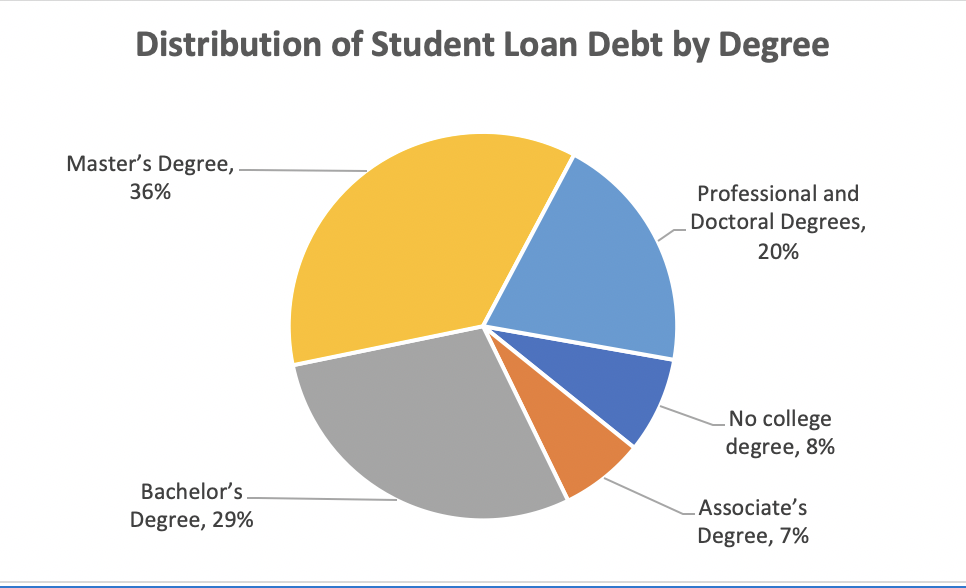

## Table of Contents

## What is student loan debt?

Student loan debt is money that students borrow to pay for college or university. They need to pay this money back after they finish their studies. Many students take out loans because school can be very expensive. The total amount of student loan debt in a country can be very large because so many people go to college.

When students graduate, they start paying back their loans. This can take many years, sometimes even decades. The monthly payments can make it hard for them to buy things like a house or a car. Some people worry that too much student loan debt can hurt the economy. Governments and schools are trying to find ways to make college cheaper so students don't have to borrow as much money.

## How is student loan debt distributed across different demographics in the U.S.?

In the U.S., student loan debt is not spread out evenly among different groups of people. A big part of the debt is held by women. This is because more women go to college than men, and they often take longer to pay back their loans because they might earn less money after they graduate. Also, Black and African American students usually have more student loan debt than other groups. This happens because they might need to borrow more money to go to college, and they might have a harder time finding good-paying jobs after they finish school.

Another group that has a lot of student loan debt is people who went to for-profit colleges. These schools can be very expensive, and the degrees they offer might not help students get good jobs. Older students also have a lot of debt. They might go back to school to learn new skills, but they already have other debts like mortgages or credit card bills. So, student loan debt is higher for some groups because of things like the type of school they go to, how much money they earn, and other debts they have.

## What are the primary sources of student loans in the United States?

In the United States, student loans come from two main places: the government and private lenders. The biggest source is the federal government. They offer different types of loans, like Direct Subsidized Loans, Direct Unsubsidized Loans, and PLUS Loans. These loans usually have lower interest rates and better repayment options than loans from other places. Students can apply for these loans by filling out a form called the Free Application for Federal Student Aid, or FAFSA.

The other source of student loans is private lenders. These can be banks, credit unions, or other financial companies. Private loans often have higher interest rates than federal loans, and they might not offer as many ways to pay them back. Students usually need someone to co-sign the loan, which means another person agrees to pay the loan if the student can't. Private loans are often used when federal loans are not enough to cover the cost of school.

Sometimes, schools themselves offer loans to students. These are called institutional loans and can be a small part of the total student loan debt. But most student loans come from the federal government or private lenders.

## How has the total amount of student loan debt in the U.S. changed over the past decade?

Over the past decade, the total amount of student loan debt in the U.S. has grown a lot. In 2013, the total student loan debt was about $1.08 trillion. By 2023, it had risen to over $1.7 trillion. This big increase happened because more people went to college, and the cost of going to college also went up. Many students had to borrow more money to pay for their education.

The growth in student loan debt has slowed down a bit in recent years. This is because some people are choosing not to go to college because of the high cost, and others are looking for cheaper ways to get an education, like going to community colleges or online schools. Also, the government and some schools have started programs to help students pay less for college. But even with these changes, student loan debt is still a big problem for many people in the U.S.

## What are the differences between federal and private student loans?

Federal student loans come from the government. They usually have lower interest rates than private loans. This means you pay less money over time. Federal loans also have different ways to pay them back. You might be able to pay less each month if you don't make a lot of money. Sometimes, the government can even forgive your loan if you work in certain jobs, like teaching or nursing. To get a federal loan, you fill out a form called the FAFSA. You don't need a good credit score to get one, which is good for students who might not have much credit history.

Private student loans come from banks, credit unions, or other companies. They often have higher interest rates than federal loans. This means you pay more money over time. Private loans might not give you as many ways to pay them back. You usually need someone to co-sign the loan, which means another person agrees to pay if you can't. Private loans can be harder to get because you need a good credit score or a co-signer with a good credit score. People usually use private loans when federal loans aren't enough to cover the cost of school.

## How does student loan debt impact borrowers' financial decisions and life choices?

Student loan debt can make it hard for people to make big financial decisions. When someone has a lot of student loan debt, they might have to pay a lot of money each month. This can make it tough to save money for things like buying a house or a car. Some people might even have to wait longer to get married or have kids because they need to focus on paying off their loans first. It can also make it harder to save for retirement because so much money is going towards the loans.

The stress of having a lot of student loan debt can also affect people's life choices. Some people might choose jobs that pay more money, even if they don't like the job as much, just so they can pay off their loans faster. Others might decide not to go back to school for more education because they don't want to take on more debt. This can limit their career options and make it harder to follow their dreams. Overall, student loan debt can change the way people live their lives and make important choices.

## What are the current interest rates and repayment options for student loans?

For federal student loans, the interest rates change every year. For the 2023-2024 school year, undergraduate students get a 5.50% [interest rate](/wiki/interest-rate-trading-strategies) on Direct Subsidized and Unsubsidized Loans. Graduate students get a 7.05% rate on Direct Unsubsidized Loans, and parents or graduate students borrowing through PLUS Loans get an 8.05% rate. These rates are lower than many private loans and don't change over the life of the loan. Private student loans have different interest rates based on the lender and the borrower's credit score. They can be higher than federal loan rates and might be fixed or change over time.

Federal student loans offer different ways to pay them back. One way is the Standard Repayment Plan, where you pay a fixed amount each month for up to 10 years. Another option is the Income-Driven Repayment Plans, which set your monthly payments based on how much money you make. These plans can last 20 to 25 years, and if you still owe money at the end, the rest might be forgiven. There's also the Graduated Repayment Plan, where your payments start low and get bigger over time, and the Extended Repayment Plan, which lets you pay over 25 years with either fixed or graduated payments. Private student loans usually don't offer as many options, and you might have to pay them back over a shorter time, like 5 to 15 years.

## What government policies are in place to manage or alleviate student loan debt?

The U.S. government has several policies to help people with student loan debt. One big policy is income-driven repayment plans. These plans let people pay back their loans based on how much money they make. If they still owe money after paying for 20 or 25 years, the rest of the loan might be forgiven. Another policy is loan forgiveness programs. These programs can forgive the rest of a person's loan if they work in certain jobs, like teaching or nursing, for a certain number of years. The government also has a program called Public Service Loan Forgiveness, which can forgive the rest of a person's loan if they work in public service jobs for 10 years and make their payments on time.

Another way the government helps is by offering a pause on loan payments during tough times. For example, during the COVID-19 pandemic, the government let people stop making payments on their federal student loans for a while. This helped a lot of people who were struggling to pay their bills. The government also sometimes changes the rules to make it easier for people to get into income-driven repayment plans or loan forgiveness programs. These policies are meant to make it easier for people to manage their student loan debt and live their lives without too much stress.

## How do income-driven repayment plans work, and who qualifies for them?

Income-driven repayment plans help people pay back their student loans based on how much money they make. Instead of paying a fixed amount every month, your payments change if your income goes up or down. There are a few different kinds of these plans, but they all work in a similar way. You send in your tax returns every year to show how much money you made, and then the plan figures out how much you should pay each month. This can make your payments smaller if you don't make a lot of money. If you still owe money after paying for 20 or 25 years, the rest of your loan might be forgiven.

To qualify for an income-driven repayment plan, you need to have federal student loans. Private loans don't work with these plans. You also need to fill out a form and send it to your loan servicer, the company that handles your loans. They will look at your income and family size to see how much you should pay each month. Anyone with federal student loans can apply for these plans, but they are especially helpful for people who don't make a lot of money or have a lot of other bills to pay.

## What are the economic implications of high levels of student loan debt in the U.S. economy?

High levels of student loan debt can slow down the U.S. economy. When people have a lot of student loan debt, they have less money to spend on other things. This can hurt businesses because fewer people are buying their products. It can also make it harder for people to buy homes or start businesses because they need to use their money to pay off their loans. When people can't buy homes or start businesses, it can slow down the whole economy. Economists worry that too much student loan debt can make the economy grow more slowly.

On the other hand, student loan debt helps more people go to college. When more people go to college, they can get better jobs and earn more money. This can help the economy grow because people with more education often spend more money and pay more taxes. But if the debt is too high, it can still hurt the economy in the long run. The government and schools are trying to find ways to make college cheaper so that students don't have to borrow as much money, which could help the economy in the future.

## How does student loan debt compare internationally, particularly with countries like Canada, the UK, and Australia?

In the United States, student loan debt is much higher than in countries like Canada, the UK, and Australia. The U.S. has over $1.7 trillion in student loan debt, which is a lot more than these other countries. In Canada, the total student loan debt is around $27 billion. In the UK, it's about £180 billion, which is around $225 billion. Australia has about A$70 billion in student loan debt, which is around $47 billion in U.S. dollars. The big difference is because college in the U.S. is very expensive, and more students need to borrow money to pay for it.

These countries also handle student loan debt differently. In Canada, students can get loans from the government, and the interest rates are usually lower than in the U.S. The UK has a system where students start paying back their loans only when they earn above a certain amount of money, and the debt can be forgiven after 30 years. In Australia, students pay back their loans through the tax system, and they only start paying when they earn enough money. These systems can make it easier for students to manage their debt compared to the U.S., where students often start paying back their loans right after they finish school, no matter how much money they make.

## What are the potential long-term effects of student loan debt on wealth inequality and social mobility?

Student loan debt can make wealth inequality worse. When people have a lot of debt, it's hard for them to save money or buy things like a house. This means they can't build wealth as easily as people who don't have student loans. In the U.S., groups like Black and African American students often have more student loan debt. This can make it harder for them to catch up with other groups who might not have as much debt. Over time, this can make the gap between rich and poor even bigger because people with less debt can save and invest more.

Student loan debt can also affect social mobility. Social mobility means moving up in society, like getting a better job or making more money. When people have a lot of student loan debt, they might have to take jobs they don't like just to pay off their loans. This can stop them from following their dreams or getting better jobs. It can also make it harder for them to go back to school to learn new skills because they don't want more debt. Over time, this can make it harder for people to move up in society and can keep them stuck in the same place.

## References & Further Reading

[1]: Baum, S., & O'Malley, M. (2003). ["College on Credit: How Borrowers Perceive Their Education Debt"](https://ir.library.louisville.edu/cgi/viewcontent.cgi?article=1068&context=jsfa). Journal of Student Financial Aid, 33(3), 7-19.

[2]: Mian, A., & Sufi, A. (2014). ["House of Debt: How They (and You) Caused the Great Recession, and How We Can Prevent It from Happening Again"](https://www.amazon.com/House-Debt-Recession-Prevent-Happening/dp/022627165X). University of Chicago Press.

[3]: Federal Reserve Board. (2023). ["Consumer Credit - G.19 Release"](https://www.federalreserve.gov/Releases/g19/current/)

[4]: Choi, J.J., Laibson, D., & Madrian, B.C. (2009). ["Why Does the Law of One Price Fail? An Experiment on Index Mutual Funds"](https://academic.oup.com/rfs/article-abstract/23/4/1405/1591053). American Economic Review, 99(6), 2312-2329.

[5]: Böhme, R., & Köpsell, S. (2010). ["Trained to accept? A field experiment on consent dialogs."](https://dl.acm.org/doi/10.1145/1753326.1753689) ACM SIGCHI Conference on Human Factors in Computing Systems, 8(10), 2403-2406.

[6]: Stevenson, B. (2010). ["The impact of the size and visibility of the minority population on the relationship between economic growth and heterogeneity"](https://abc.com/show/9bfe2f4f-41ad-4492-a6dd-0b67db180543). Journal of Economic Literature, 48(3), 598-632. 

[7]: Singletary, M. (2019). ["Breaking the student loan debt spiral"](https://www.washingtonpost.com/people/michelle-singletary/). The Washington Post. 

[8]: Lo, A. W., & MacKinlay, A. C. (1999). ["A Non-Random Walk Down Wall Street"](https://www.jstor.org/stable/j.ctt7tccx). Princeton University Press.

[9]: Vissing-Jorgensen, A. (2012). ["Consumer credit: Trends, functions, and implications"](https://sites.google.com/view/annette-vissing-jorgensen/). Brooking Papers on Economic Activity, Fall, 299-362.