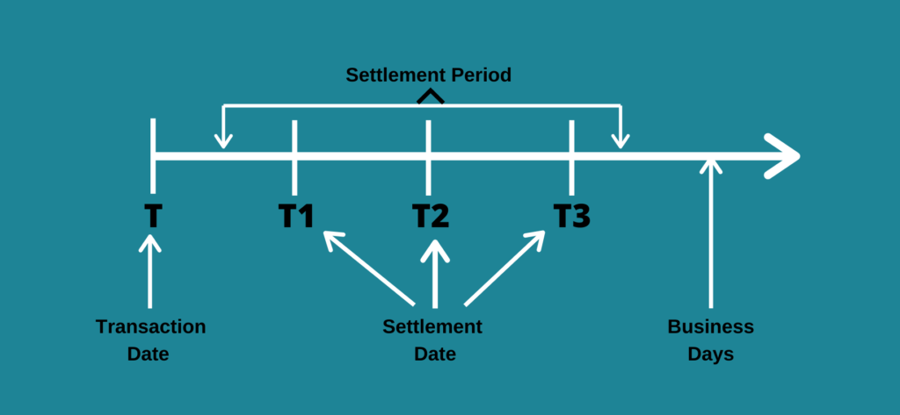

## Table of Contents

## What is the difference between a trade date and a settlement date in stock transactions?

In stock transactions, the trade date is the day when you buy or sell a stock. It's when you and the other person agree on the price and decide to make the trade. Think of it as the moment you shake hands on the deal.

The settlement date is different. It's the day when the actual exchange happens. This is when the money leaves your account and goes to the seller, and the stock moves from the seller's account to yours. Usually, this happens a few days after the trade date, giving time for all the paperwork and money transfers to be completed.

## Why is the timing of ownership important in stock transactions?

The timing of ownership in stock transactions is important because it decides when you actually own the stock and when you have to pay for it. If you buy a stock, the trade date is when you agree to buy it, but you don't own it until the settlement date. This means you can't do things like vote at shareholder meetings or get dividends until the stock is officially in your account on the settlement date.

Also, knowing when you own the stock helps you keep track of your money and investments. If you sell a stock, you need to know when the money will be back in your account so you can plan your next moves. The time between the trade date and the settlement date gives everyone involved time to make sure all the paperwork and money transfers are done correctly. This helps keep the stock market running smoothly and fairly for everyone.

## How long does it typically take for a stock transaction to settle?

In the United States, it usually takes two business days for a stock transaction to settle. This means if you buy a stock on Monday, you will own it and have to pay for it by Wednesday. This time is called T+2, where "T" stands for the trade date and "2" means two business days after.

This two-day period gives everyone involved time to make sure all the paperwork and money transfers are done right. It helps keep the stock market running smoothly and fairly. Before 2017, it used to take three business days (T+3), but it was changed to make things faster and more efficient.

## Can you explain the concept of T+2 settlement cycle?

The T+2 settlement cycle means that when you buy or sell a stock, it takes two business days for the trade to be fully completed. The "T" stands for the trade date, which is the day you agree to buy or sell the stock. The "+2" means that two business days after the trade date, the money and the stock will move between accounts. So if you buy a stock on Monday, you will own it and have to pay for it by Wednesday.

This two-day period is important because it gives everyone involved time to make sure all the paperwork and money transfers are done correctly. It helps keep the stock market running smoothly and fairly. Before 2017, it used to take three business days (T+3), but it was changed to T+2 to make things faster and more efficient.

## What happens if a stock transaction does not settle on time?

If a stock transaction does not settle on time, it can cause problems for everyone involved. When you buy a stock, you need to pay for it by the settlement date. If you don't, the stock might be taken away from you, and you could owe money to cover any losses. This is called a "failed trade," and it can lead to extra fees and charges.

On the other side, if you're selling a stock and the buyer doesn't pay on time, you won't get your money right away. This can mess up your plans for using that money. Both the buyer and the seller might have to deal with fines or other penalties from their brokers or the stock exchange. It's important for everyone to follow the rules and make sure trades settle on time to keep the stock market running smoothly.

## How does the trade date affect the ownership and the financial responsibilities of the buyer and seller?

The trade date is when you and another person agree to buy or sell a stock. It's like shaking hands on the deal. Even though you agree on the trade date, you don't actually own the stock or have to pay for it right away. The buyer doesn't become the owner, and the seller doesn't get the money until the settlement date, which is usually a few days later.

This delay between the trade date and the settlement date gives everyone time to make sure all the paperwork and money transfers are done right. If something goes wrong and the trade doesn't settle on time, it can cause problems. The buyer might lose the stock and have to pay extra fees, while the seller might not get their money when they expected it. So, the trade date sets the start of the process, but the real ownership and financial responsibilities don't kick in until the settlement date.

## What are the implications of the settlement date for dividend payments and voting rights?

The settlement date is important for dividend payments because it decides who gets the money. If a company decides to pay a dividend, they set a date called the "record date." You need to own the stock by the record date to get the dividend. Since it takes a few days for a trade to settle, you need to buy the stock before the record date, so it settles in your account by that date. If you buy the stock after the record date, you won't get the dividend until the next time the company pays one.

The settlement date also affects voting rights at shareholder meetings. To vote, you need to be a shareholder on the record date set by the company. Just like with dividends, you need to buy the stock early enough so that it settles in your account by the record date. If your trade doesn't settle in time, you won't be able to vote at the meeting. So, knowing when the settlement date is helps you plan when to buy or sell stocks to make sure you can get dividends and vote at meetings.

## How do different markets and countries handle the timing of stock transaction settlements?

Different countries and markets have their own rules about how long it takes for a stock trade to settle. In the United States, it takes two business days, which is called T+2. This means if you buy a stock on Monday, you will own it and have to pay for it by Wednesday. In Europe, many countries also use the T+2 system, but some might have different rules. For example, in the UK, they used to use T+3 but switched to T+2 to match other major markets.

In Asia, the rules can vary a lot. In Japan, they use T+2 like the U.S. and many European countries. But in India, it's even faster at T+1, meaning the trade settles the next business day. This quick settlement helps keep the market moving fast. Each country sets its own rules based on what works best for their market, and these rules can change over time to make things more efficient and fair for everyone involved.

## What are the risks associated with the timing of ownership in stock transactions?

The timing of ownership in stock transactions can create risks for both buyers and sellers. If you buy a stock, you don't actually own it until the settlement date. This means if the company announces something good or bad before your trade settles, you might miss out on the benefits or face losses without being able to do anything about it. For example, if the stock price goes up before the settlement date, you'll have to pay more than you expected. If it goes down, you might feel like you overpaid.

On the other hand, sellers face risks too. If you sell a stock, you won't get your money until the settlement date. If the buyer can't pay on time, you might have to wait longer to get your money, which can mess up your plans. There's also the risk of a "failed trade," where the trade doesn't settle at all. This can happen if there's a problem with the payment or if the buyer doesn't have enough money. If a trade fails, both the buyer and seller might have to pay extra fees and deal with other problems.

## How can investors manage the risks related to trade date and settlement date discrepancies?

Investors can manage the risks related to trade date and settlement date discrepancies by planning their trades carefully. They need to think about how long it will take for a trade to settle and make sure they buy or sell stocks early enough to get the benefits they want, like dividends or voting rights. For example, if a company is about to pay a dividend, an investor should buy the stock a few days before the record date so it settles in time. This way, they can make sure they get the dividend. It's also important to keep enough money in their account to cover the cost of the stock until it settles.

Another way to manage these risks is by understanding the rules of the market they are trading in. Different countries and markets have different settlement times, like T+2 in the U.S. and T+1 in India. By knowing these rules, investors can plan better and avoid surprises. They should also be aware of the risks of failed trades and make sure they have enough money to complete their transactions on time. This helps them avoid extra fees and keeps their trading smooth and trouble-free.

## What regulatory changes have affected the timing of stock transaction settlements in recent years?

In recent years, a big change in the U.S. was moving from a T+3 to a T+2 settlement cycle. This means that stock trades now settle two business days after the trade date instead of three. This change happened in 2017 and was meant to make the stock market faster and more efficient. By shortening the time it takes for trades to settle, the market can react quicker to new information, and it reduces the risk of something going wrong during the settlement process.

Another change that's been talked about is moving to a T+1 settlement cycle, which would make trades settle even faster. Some countries, like India, already use T+1, and it's been successful there. The idea is that faster settlements can make the market more efficient and safer. However, making this change would need a lot of work from everyone involved in the stock market, like brokers and clearing houses, to make sure they can handle the quicker pace. These changes show that regulators are always looking for ways to make the stock market work better for everyone.

## How do advanced trading strategies utilize the differences between trade date and settlement date?

Advanced trading strategies often use the time between the trade date and the settlement date to their advantage. Traders might use this time to buy and sell stocks quickly, making money from small changes in stock prices. For example, they might buy a stock and then sell it before it settles, hoping to make a profit from the price difference. This is called "[day trading](/wiki/day-trading-spy)" and it's a way to use the time between trade and settlement to make money fast.

Another way traders use this time is by using a strategy called "short selling." In short selling, a trader borrows a stock and sells it, hoping the price will go down before they have to buy it back and return it. If the price does go down, they can buy it back cheaper and make a profit. The time between the trade date and the settlement date gives them a window to do this. Both these strategies show how traders can use the settlement period to try to make money, but they also come with risks because the stock market can be unpredictable.

## References & Further Reading

[1]: Securities and Exchange Commission (2017). ["Amendments to SEC Rule 15c6-1(a) Shortening the Standard Settlement Cycle"](https://www.sec.gov/resources-small-businesses/small-business-compliance-guides/amendment-securities-transaction-settlement-cycle-small-entity-compliance-guide)

[2]: International Organization of Securities Commissions (IOSCO). ["Report on Good Practices for the Termination of Securities Transactions"](https://www.iosco.org/?IOSCO-Roadmap-to-Retail-Investor-Online-Safety)

[3]: "Trade Date vs. Settlement Date: What's the Difference?" by Cory Mitchell, Investopedia. [Available here](https://harbourfronttechnologies.weebly.com/home/trade-date-vs-settlement-date-whats-the-difference)

[4]: Sungard. ["The Impact of Regulatory Change on Securities Settlement"](https://finadium.com/sungard-report-financial-firms-win-face-regulatory-change/) 

[5]: Marcos Lopez de Prado. ["Advances in Financial Machine Learning"](https://www.amazon.com/Advances-Financial-Machine-Learning-Marcos/dp/1119482089)