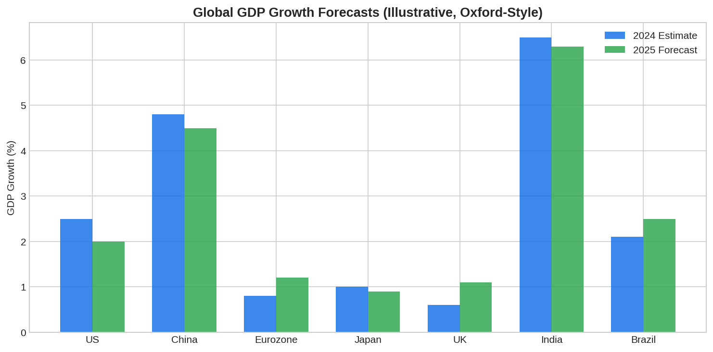

The **Oxford Economics Global Economic Model** is the most widely used commercial macroeconomic forecasting platform, covering 87 countries with fully linked equations for trade, capital flows, exchange rates, commodity prices, and interest rates. For institutional traders and macro quant funds, it provides a rigorous, scenario-capable framework for forecasting GDP, inflation, and rates — the key inputs for positioning across asset classes. Understanding how these models work helps traders interpret consensus forecasts, build contrarian views, and design [macro factor strategies](https://paperswithbacktest.com/wiki/macro-factor-investing-explained).

## How the Global Model Works

The Oxford model is a large-scale system of simultaneous equations linking national economies through trade and financial channels. Each country model contains equations for: GDP components (consumption, investment, government spending, net exports), labor market dynamics, price and wage determination, monetary policy (Taylor-style rules), fiscal policy, and the financial sector.

Country models are linked through **global assumptions** about trade volumes and prices, competitiveness, capital flows, interest rate differentials, exchange rates, and commodity prices. A shock in one country propagates through the system via these channels.

$$\Delta Y_{\text{US}} \xrightarrow{\text{trade}} \Delta \text{Exports}_{\text{EU}} \xrightarrow{\text{output}} \Delta Y_{\text{EU}} \xrightarrow{\text{rates}} \Delta i_{\text{EU}}$$



## Key Features for Traders

**Scenario analysis**: The model's primary value for traders is testing "what if" scenarios. What happens to EM equities if the Fed raises rates 200 bps more than expected? How does an oil price spike affect European GDP? The model traces the impulse responses through the linked global system.

**Bi-monthly baseline updates**: Oxford Economics updates forecasts twice monthly, incorporating the latest data releases. Traders use these updates to track consensus shifts and identify where their views diverge from the model baseline.

**Sector and city models**: Beyond country-level macro, Oxford provides sector models (100 sectors across 77 countries) and city-level forecasts for 1,000 cities. These feed into sector rotation strategies and real estate investment decisions.

## Alternative Global Models

| Model | Provider | Countries | Primary Users |
|-------|----------|-----------|---------------|
| Global Economic Model | Oxford Economics | 87 + Eurozone | Banks, hedge funds, corporates |
| GEM (Global Economy Model) | IMF | Multi-country | Policy institutions |
| NiGEM | NIESR | 60+ | Central banks, treasuries |
| FRB/US | Federal Reserve | US-focused | Fed staff, academics |
| SIGMA | Federal Reserve | Multi-country | International policy analysis |

## Python: Using Macro Forecasts as Trading Signals

```python
import numpy as np

def macro_forecast_signal(gdp_forecast, inflation_forecast, rate_forecast):
    """
    Convert macro model forecasts into a simple trading signal.
    Positive signal = risk-on, negative = risk-off.
    """
    # Normalize forecasts
    growth_signal = (gdp_forecast - 2.0) / 1.0  # 2% as neutral
    inflation_signal = -(inflation_forecast - 2.5) / 1.0  # High inflation = negative
    rate_signal = -(rate_forecast - 3.0) / 1.0  # High rates = negative
    
    # Composite signal
    composite = 0.5 * growth_signal + 0.3 * inflation_signal + 0.2 * rate_signal
    return np.clip(composite, -1, 1)

# Example: Q1 2025 forecasts
scenarios = {
    "Base case":    (2.5, 2.3, 3.5),
    "Soft landing": (2.0, 2.0, 3.0),
    "Stagflation":  (0.5, 4.5, 5.0),
    "Recession":    (-1.0, 1.5, 2.0),
}

for name, (gdp, cpi, rate) in scenarios.items():
    signal = macro_forecast_signal(gdp, cpi, rate)
    stance = "Risk-On" if signal > 0.2 else "Risk-Off" if signal < -0.2 else "Neutral"
    print(f"{name:>15}: signal={signal:+.2f} → {stance}")
```

## Limitations and Risks

Commercial macro models are consensus tools — they capture the mainstream view, which is already priced into markets. Alpha comes from identifying where the model is wrong, not from following its baseline. Model parameters are estimated on historical relationships that can break down in novel situations. The models are also expensive — Oxford Economics subscriptions run to tens of thousands of dollars annually.

## Conclusion

The Oxford Economics Global Model represents the institutional standard for macro forecasting and scenario analysis. For algo traders, its primary value lies not in blindly following forecasts, but in understanding the structural relationships between economies and using the model as a framework for testing contrarian macro views. Combined with [DSGE models](https://paperswithbacktest.com/wiki/dsge-models-explained-algo-trading) and factor-based approaches, it forms a complete macro trading toolkit.

---

**Explore further on PapersWithBacktest:**
- Browse [backtested macro strategies](https://paperswithbacktest.com/strategies) with Python code and performance metrics
- Access [clean historical market data](https://paperswithbacktest.com/datasets) for equities, crypto, and futures
- Take the [algo trading course](https://paperswithbacktest.com/course) — 60+ video lessons and notebooks
- Related wiki pages: [DSGE Models Explained](https://paperswithbacktest.com/wiki/dsge-models-explained-algo-trading) · [All Weather Portfolio](https://paperswithbacktest.com/wiki/all-weather-portfolio) · [IS-LM Model](https://paperswithbacktest.com/wiki/is-lm-model-curves-characteristics-limitations)
