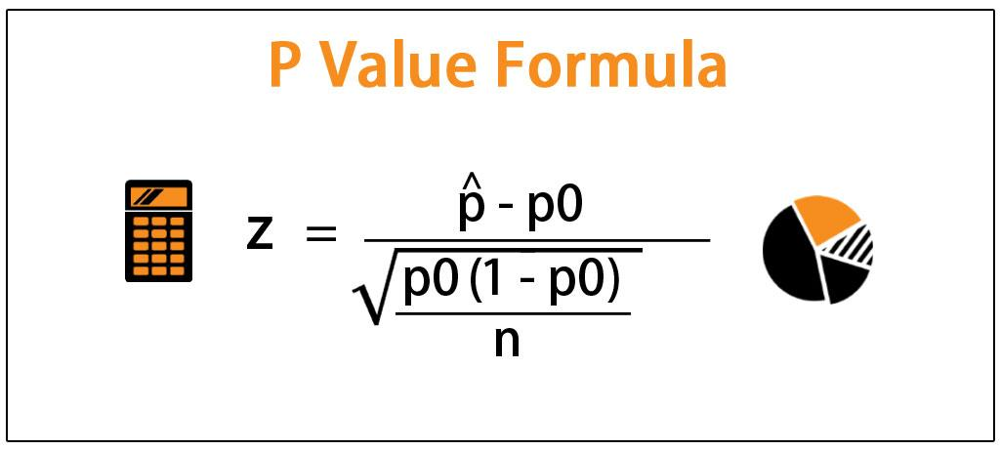

In trading, especially algorithmic trading, statistical analysis is key in creating and verifying strategies that succeed. A fundamental statistical concept applied here is the p-value calculation, which measures statistical significance in hypothesis testing. This article addresses how p-value calculations can be applied practically in algorithmic trading. P-values estimate the probability that the observed results occurred by random chance, assuming a null hypothesis is correct.

Algorithmic trading relies on complex models to make predictions based on historical and real-time market data. These models often use statistical tests to validate their assumptions and predictions. This is where the p-value becomes crucial—by providing a quantitative measure of significance, it allows traders to evaluate whether their results could be attributed to luck or represent genuine patterns and trends.



Understanding p-values and their application in hypothesis testing can significantly enhance a trader's ability to design data-driven strategies. By separating statistically relevant data from noise, traders are better equipped to make informed decisions, thereby minimizing reliance on chance and maximizing the potential for sustained profitability. This affirms the p-value's role as a vital component in the statistical framework of algorithmic trading, empowering traders to optimize their strategies with evidence-based confidence.

## Table of Contents

## Understanding the P-Value

A p-value, or probability value, is a fundamental concept in hypothesis testing, representing the probability of obtaining an observed result, or more extreme outcomes, assuming that the null hypothesis is true. Essentially, it quantifies the strength of evidence against the null hypothesis. A small p-value indicates that the observed data is unlikely under the null hypothesis, thus providing strong evidence to consider rejecting the null. Conversely, a large p-value suggests that the observed data is consistent with the null hypothesis, providing little reason to doubt it.

In hypothesis testing, the null hypothesis generally represents a statement of no effect or no difference. For instance, when comparing the performance of an algorithmic trading strategy to a benchmark, the null hypothesis might assert that there is no significant difference between the two. 

Mathematically, the p-value is determined by computing the probability of observing a test statistic that is at least as extreme as the one computed from the sample data. This involves the concept of a probability distribution and the area under the curve of this distribution that corresponds to the observed test statistic:

$$

p = P(T \geq t|H_0) 
$$

where $P$ refers to probability, $T$ is the test statistic under the null hypothesis $H_0$, and $t$ is the observed value.

In practice, p-values are typically calculated using statistical software. For example, the following Python code snippet shows how to compute a p-value using the `scipy` library for a simple t-test:

```python
from scipy import stats

# Sample data
sample1 = [2.3, 3.4, 2.8, 3.5, 3.2]
sample2 = [3.3, 3.5, 4.1, 4.3, 3.9]

# Conduct t-test
t_statistic, p_value = stats.ttest_ind(sample1, sample2)

print(f"T-statistic: {t_statistic}")
print(f"P-value: {p_value}")
```

In terms of statistical significance, a p-value threshold of 0.05 is commonly used as a cutoff. If the calculated p-value is less than 0.05, it is generally considered statistically significant, suggesting that the observed effect is unlikely due to random chance alone, and the null hypothesis may be rejected in favor of the alternative hypothesis. However, this threshold is not a strict rule and should be determined based on the specific context and the potential consequences of Type I (false positive) and Type II (false negative) errors.

Understanding p-values is essential for making informed decisions in many fields, including [algorithmic trading](/wiki/algorithmic-trading), where it is crucial to differentiate strategies that are genuinely effective from those that perform well only by chance.

## Importance of P-Value in Hypothesis Testing

P-values play an indispensable role in hypothesis testing by quantifying the evidence against the null hypothesis. In algorithmic trading, where enormous datasets are analyzed to construct trading models, p-values determine whether the observed performance of a trading strategy is attributable to genuine skill or mere randomness.

Algorithmic trading strategies are often developed based on specific assumptions and tested against historical data. Here, p-values offer a quantitative measure of statistical significance that helps traders ascertain if the results they observe are replicable or just statistical anomalies. For instance, if a trader designs a strategy that historically outperforms the market, calculating the p-value allows them to assess the confidence level of these results. A low p-value provides evidence against the null hypothesis that the strategy’s performance is equivalent to random chance, thereby affirming the strategy's effectiveness.

By employing p-values, traders can effectively filter out unreliable strategies, reducing the risk of deploying models that may perform well in backtests but fail in live markets. Suppose traders find a trading strategy has a p-value of 0.01; this indicates a 1% probability that the observed outcome is due to chance, implying strong statistical evidence to support the strategy. Conversely, a high p-value suggests that the strategy's past performance might be a product of random market movements, signaling the need for reconsideration or further refinement.

Moreover, p-values facilitate informed decision-making by providing a framework for evaluating the robustness of a strategy. Traders gain confidence knowing that their trading models are backed by empirical data, thus adhering to principles of statistical significance. This practice ensures that strategies are not merely a product of overfitting or bias, offering a more rigorous approach to trading that prioritizes long-term success over short-lived gains. 

In conclusion, p-values serve as a critical tool in the toolkit of algorithmic trading, helping traders differentiate between skill-based success and randomness-driven performance. Through careful analysis and application of p-values, traders can build more reliable, evidence-based trading strategies that withstand the complexities of financial markets.

## Calculating P-Value: Methodology

P-values are computed through statistical software or reference tables, which rely on the assumed probability distributions of the tested data. The primary goal of this computation is to ascertain the probability of observing data as extreme, or more so, than the actual observed data under the null hypothesis. This involves evaluating the area under the probability distribution curve that extends beyond the observed test statistic.

To calculate the p-value, one must understand the structure of the test being conducted. Tests can be either one-tailed or two-tailed. A one-tailed test assesses the probability of observing a value greater than or less than a certain point in one direction, while a two-tailed test scrutinizes both directions. This distinction influences the p-value significantly, as it changes the critical areas of interest on the distribution curve.

Another critical [factor](/wiki/factor-investing) in calculating p-values is the degrees of freedom, which often pertains to the number of independent values or quantities in a statistical calculation. For example, in a t-test, the degrees of freedom are typically computed as the sample size minus one. This value is crucial in determining the exact shape of the distribution used for deciding p-value calculations, particularly in t-distributions and chi-squared tests.

In practical terms, the calculation of a p-value often involves the following steps:

1. **Select the Hypothesis Test**: Define the null hypothesis (H0) and the alternative hypothesis (H1). Determine whether a one-tailed or two-tailed test is needed.

2. **Calculate the Test Statistic**: Depending on the test type, calculate the appropriate test statistic (e.g., t-statistic, z-score).

3. **Determine the Distribution**: Identify the probability distribution that applies to your data or test statistic. Common distributions include the normal, t-distribution, and chi-squared distribution.

4. **Compute the P-Value**: Using statistical software, calculate the p-value. Software like Python’s `scipy.stats` library can simplify this process:

```python
from scipy import stats

# Example for a two-sample t-test
# Sample data
sample1 = [2.4, 2.5, 2.7, 3.1, 3.2]
sample2 = [2.9, 3.0, 3.1, 3.8, 4.0]

# Perform the t-test
t_statistic, p_value = stats.ttest_ind(sample1, sample2)

print(f"T-statistic: {t_statistic}, P-value: {p_value}")
```

This code snippet demonstrates the calculation of a p-value for a t-test comparing two independent samples. The `stats.ttest_ind` function generates both the t-statistic and the p-value, facilitating an informed decision on whether to reject the null hypothesis. Through such computations, traders and researchers can substantiate their findings with statistical confidence.

## Example: P-Value Calculation in Algorithmic Trading

Consider an algorithmic trading strategy designed to outperform a benchmark index, such as the S&P 500. The null hypothesis posits that the strategy's returns are statistically equivalent to those of the benchmark, implying any observed difference is merely due to chance.

For analysis, the strategy underwent [backtesting](/wiki/backtesting) over a defined period. During this process, daily returns of both the trading strategy and the benchmark index were collected. A common statistical test to compare means is the t-test, which can help determine if the average returns of the strategy are significantly different from the benchmark.

### Hypothetical Backtesting Scenario

Suppose the algorithmic strategy yielded an average daily return that appears higher than the benchmark. The hypothesis test is set as follows:
- Null Hypothesis ($H_0$): The mean return of the trading strategy is equal to the mean return of the benchmark.
- Alternative Hypothesis ($H_a$): The mean return of the trading strategy is different from the mean return of the benchmark.

### Python Code for P-Value Calculation

Using Python, the calculation of the p-value can be accomplished through libraries like `scipy` for statistical functions. Here's a basic code snippet that demonstrates this process:

```python
import numpy as np
from scipy import stats

# Sample data: daily returns of strategy and benchmark over the backtest period
strategy_returns = np.array([0.0015, 0.0020, 0.0035, ...])  # Insert actual values here
benchmark_returns = np.array([0.0010, 0.0016, 0.0025, ...])  # Insert actual values here

# Perform t-test
t_stat, p_value = stats.ttest_ind(strategy_returns, benchmark_returns)

print(f"T-statistic: {t_stat}")
print(f"P-value: {p_value}")
```

### Interpretation of Results

Upon calculation, suppose the p-value obtained is 0.02. Given a significance level ($\alpha$) of 0.05, this p-value provides strong evidence against the null hypothesis. Consequently, the null hypothesis can be rejected, suggesting the trading strategy's returns are statistically different from those of the benchmark. This result indicates that the strategy's performance likely stems from its inherent qualities rather than chance, thus providing traders confidence in its effectiveness.

The application of p-value calculations in this context serves as an essential step, ensuring that a strategy's success is evaluated with statistical rigor, paving the way for informed decision-making in algorithmic trading.

## Conclusion

The p-value remains a crucial element in statistical analysis, particularly for evaluating the significance of observed data. In algorithmic trading, it functions as a vital component for validating trading strategies and supporting robust decision-making. By effectively utilizing p-value calculations, traders can discern between genuine trading opportunities and those that may be largely attributed to randomness.

A profound understanding of p-values empowers traders to focus on strategies that demonstrate genuine predictive power and reliability. This statistical perspective enables traders to filter out noise and concentrate on strategies that showcase statistically significant results, offering a higher likelihood of consistent performance moving forward. For instance, if a trading strategy yields a p-value below a commonly accepted threshold (e.g., 0.05), this strongly suggests that the strategy's results are not random, and the performance exhibited can be trusted to an extent.

Python, a prevalent language in data analysis and algorithmic trading, can be utilized to calculate p-values using libraries such as SciPy. Here is a simple example demonstrating the calculation of a p-value in Python:

```python
from scipy import stats

# Example data: returns from a strategy and a benchmark
strategy_returns = [0.03, 0.05, 0.01, 0.04, 0.02]
benchmark_returns = [0.02, 0.04, 0.01, 0.03, 0.01]

# Perform a t-test to compare the means of the two datasets
t_statistic, p_value = stats.ttest_ind(strategy_returns, benchmark_returns)

print(f"P-Value: {p_value}")
```

By incorporating p-values into decision-making processes, traders enhance their capacity to create evidence-based trading strategies. This practice positions them to achieve stable and replicable results amidst the perpetual fluctuations of the algorithmic trading environment. Ultimately, recognizing and applying the principles associated with p-values contribute significantly to the development and refinement of strategies that align with statistical validations, thus fostering improved confidence in trading decisions.

## References & Further Reading

[1]: ["Statistical Methods for Testing Developmental Toxicity"](https://link.springer.com/chapter/10.1007/978-1-4684-6379-8_7) by Wei Yang and Richard G. Peterson

[2]: ["Advances in Financial Machine Learning"](https://www.amazon.com/Advances-Financial-Machine-Learning-Marcos/dp/1119482089) by Marcos Lopez de Prado

[3]: ["Evidence-Based Technical Analysis: Applying the Scientific Method and Statistical Inference to Trading Signals"](https://www.amazon.com/Evidence-Based-Technical-Analysis-Scientific-Statistical/dp/0470008741) by David Aronson

[4]: ["Python for Data Analysis"](https://realpython.com/python-for-data-analysis/) by Wes McKinney

[5]: ["Quantitative Trading: How to Build Your Own Algorithmic Trading Business"](https://books.google.com/books/about/Quantitative_Trading.html?id=j70yEAAAQBAJ) by Ernest P. Chan