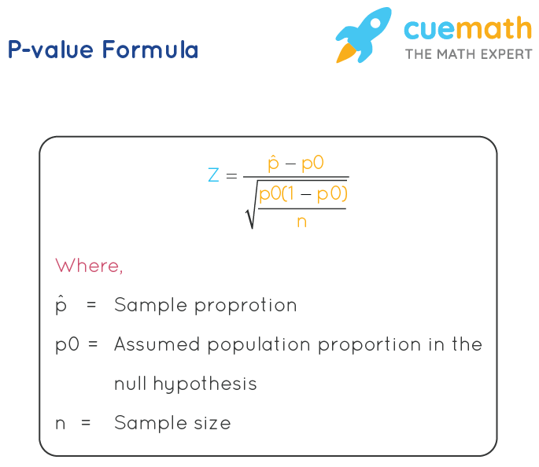

## Table of Contents

## What is a p-value?

A p-value is a number that helps you decide if the results of a study or experiment are meaningful or just happened by chance. Imagine you're flipping a coin and it lands on heads 10 times in a row. You might wonder if the coin is fair or if you just got lucky. The p-value helps answer that question by telling you how likely it is to get those results if the coin is fair. If the p-value is very small, it suggests that the results are unlikely to happen by chance, and there might be something special about the coin.

In scientific studies, researchers use p-values to test their ideas. They set up an experiment, collect data, and then calculate the p-value to see if their results support their idea. If the p-value is below a certain level, usually 0.05, they might say their results are "statistically significant." This means they believe their findings are real and not just due to random chance. However, a small p-value doesn't prove the idea is correct; it just suggests that the results are worth looking into more.

## Why is the p-value important in statistical analysis?

The p-value is important in statistical analysis because it helps researchers figure out if their findings are real or just due to chance. Imagine you're testing a new medicine to see if it works better than a sugar pill. After the experiment, you find that the medicine seems to work. But how do you know if this is because the medicine is good, or if it's just luck? The p-value gives you a way to answer this question. It tells you how likely it is to get your results if the medicine is no better than the sugar pill. If the p-value is very small, it suggests that the results are unlikely to happen by chance, making the findings more believable.

Using the p-value also helps keep science honest. It stops researchers from saying their results are important when they might not be. If everyone agrees to use a small p-value, like 0.05, as a cutoff, it makes it easier to compare different studies. This way, the scientific community can trust the results more. However, it's important to remember that a small p-value doesn't prove something is true; it just suggests that the results are worth looking into more. So, while the p-value is a useful tool, it should be used carefully and alongside other methods to make sure the conclusions are as accurate as possible.

## How is a p-value calculated?

To calculate a p-value, you start by setting up what you want to test, called a null hypothesis. This is like saying, "Nothing special is happening; any differences we see are just by chance." Then, you collect data from your experiment or study. Next, you use this data to figure out how likely it is to get the results you saw if the null hypothesis is true. This is done using a statistical test, like a t-test or chi-square test, which gives you a test statistic. The test statistic is then compared to a distribution (like a normal distribution or t-distribution) to find the p-value. The p-value is the chance of getting a test statistic as extreme as, or more extreme than, the one you calculated, assuming the null hypothesis is true.

For example, if you're testing if a new fertilizer makes plants grow taller, your null hypothesis might be that the fertilizer doesn't help at all. After measuring the heights of plants with and without the fertilizer, you use a t-test to get a test statistic. If this test statistic is 2.5, you look at the t-distribution to see how often you'd get a value of 2.5 or higher if the fertilizer had no effect. If this happens less than 5% of the time (a p-value of less than 0.05), you might say the results are statistically significant, suggesting the fertilizer might actually help plants grow taller.

## What is the difference between a p-value and a significance level?

A p-value and a significance level are both important in [statistics](/wiki/bayesian-statistics), but they are different things. A p-value is a number that tells you how likely it is to get your results by chance if your starting idea (null hypothesis) is true. For example, if you flip a coin and it lands on heads 10 times in a row, the p-value tells you how likely that is to happen if the coin is fair. The smaller the p-value, the less likely it is that your results happened by chance.

A significance level, often called alpha, is a number you choose before you start your experiment. It's like setting a rule for how much chance you're willing to accept. Usually, people choose a significance level of 0.05, which means they're okay with a 5% chance that their results could be due to luck. If your p-value is smaller than your significance level, you can say your results are "statistically significant," meaning they're unlikely to be due to chance. So, while the p-value is calculated from your data, the significance level is a standard you set to decide if your p-value is small enough to be important.

## Can you explain the concept of null hypothesis in relation to p-values?

The null hypothesis is a starting point for any experiment or study. It's like saying, "Nothing special is happening; any differences we see are just by chance." For example, if you're testing a new medicine, the null hypothesis might be that the medicine doesn't work any better than a sugar pill. When you do your experiment and collect data, you use this data to test the null hypothesis. The p-value comes into play here. It tells you how likely it is to get your results if the null hypothesis is true. So, if you find a very small p-value, it suggests that the results you saw are unlikely to happen by chance, making you think the null hypothesis might not be correct.

The relationship between the null hypothesis and the p-value is important because it helps you decide if your results mean something. Imagine you're flipping a coin and it lands on heads 10 times in a row. The null hypothesis says the coin is fair, and the p-value tells you how likely it is to get 10 heads in a row if the coin is fair. If the p-value is very small, it suggests that the coin might not be fair after all. So, the p-value helps you decide whether to stick with the null hypothesis or to think about a different explanation for your results. This way, the p-value acts as a guide to help you understand if your findings are worth looking into more.

## What are common misconceptions about p-values?

One common misconception about p-values is that they tell you the chance that your hypothesis is true. But that's not right. A p-value actually tells you how likely it is to get your results if the null hypothesis is true. So, it's not about proving your idea; it's about showing how unlikely it is that your results happened by chance. If you get a small p-value, it doesn't mean your idea is definitely right; it just means your results are worth looking into more.

Another big misunderstanding is thinking that a p-value of less than 0.05 means your results are important or big. The p-value only tells you if your results are unlikely to happen by chance, not if they are important in real life. A small p-value can come from a tiny difference that doesn't matter much in the real world. So, it's important to look at the size of the effect and how it matters in practice, not just the p-value.

Lastly, some people think that the p-value is the only thing that matters in a study. But that's not true. Other things like the design of the study, how the data was collected, and other statistical measures are also important. The p-value is just one tool to help understand the data, and it should be used with other methods to get a full picture of what the results mean.

## How do you interpret a p-value in the context of hypothesis testing?

When you're doing a study or experiment, you start with an idea called the null hypothesis, which says that nothing special is happening and any differences you see are just by chance. The p-value helps you figure out if your results support this idea or not. It tells you how likely it is to get your results if the null hypothesis is true. If the p-value is small, it means your results are unlikely to happen by chance if the null hypothesis is right. Usually, if the p-value is less than 0.05, people say the results are "statistically significant," which means they think the results are real and not just due to luck.

But remember, a small p-value doesn't prove your idea is correct. It just suggests that the results are worth looking into more. If you get a p-value of 0.03, it means there's only a 3% chance of getting your results if the null hypothesis is true. This might make you think the null hypothesis is wrong, but it doesn't mean your new idea is definitely right. It's important to look at other things like how big the effect is and if it matters in real life, not just the p-value. So, while the p-value is a useful tool, it should be used carefully and with other methods to make sure your conclusions are as accurate as possible.

## What is the relationship between p-values and type I and type II errors?

P-values are closely related to type I and type II errors in hypothesis testing. A type I error happens when you wrongly say that something is true when it's actually not. In other words, you reject the null hypothesis when it's actually true. The p-value helps you control the chance of making this mistake. If you set a significance level, like 0.05, and your p-value is less than this, you might reject the null hypothesis. But if you do this, there's still a small chance (up to 5% in this case) that you've made a type I error. So, the p-value tells you how likely it is to make this kind of mistake if you decide your results are important.

A type II error is the opposite; it happens when you miss something that's actually true. This means you fail to reject the null hypothesis when it's actually false. The p-value doesn't directly tell you about type II errors, but it's still related. If your p-value is just above your significance level, you might not reject the null hypothesis, but there could still be a real effect you're missing. The power of a test, which is the chance of correctly rejecting a false null hypothesis, is important here. A high power means you're less likely to make a type II error. So, while the p-value helps you avoid type I errors, you need to think about the power of your test to also avoid type II errors.

## Can you provide an example of p-value calculation using a t-test?

Imagine you're testing if a new fertilizer makes plants grow taller. You have two groups of plants: one group gets the new fertilizer, and the other group gets a regular fertilizer. After a few weeks, you measure the heights of all the plants. You want to know if the difference in heights between the two groups is big enough to say the new fertilizer works better. So, you set up your null hypothesis, which says the new fertilizer doesn't make a difference. Then, you use a t-test to compare the heights of the two groups.

The t-test gives you a test statistic, which you compare to a t-distribution to find the p-value. Let's say the average height of plants with the new fertilizer is 20 cm, and the average height of plants with the regular fertilizer is 18 cm. After running the t-test, you get a test statistic of 2.5. You look at the t-distribution and find that the chance of getting a test statistic of 2.5 or higher, if the new fertilizer doesn't make a difference, is only 2%. This means your p-value is 0.02. Since this p-value is less than the common significance level of 0.05, you can say the results are statistically significant. This suggests that the new fertilizer might really help plants grow taller, but you'd need to do more tests to be sure.

## How does sample size affect the p-value?

Sample size can have a big effect on the p-value. Imagine you're flipping a coin to see if it's fair. If you only flip it a few times, like 10, and it lands on heads 7 times, the p-value might be pretty high. This means you might think the coin could still be fair because the sample size is small, and the results could just be by chance. But if you flip the coin 1000 times and it lands on heads 700 times, the p-value would be much smaller. With a bigger sample size, the p-value goes down because it's less likely that such a big difference happened by chance.

So, a larger sample size can make it easier to find small differences that are real, not just by chance. This is because with more data, the results are more reliable. But remember, a small p-value with a big sample size doesn't always mean the difference is important in real life. It just means you can be more sure that the difference you found is not just due to luck.

## What are some advanced methods for p-value adjustment in multiple comparisons?

When you do lots of tests at the same time, you might find some results that look important just by chance. To fix this, scientists use special methods to adjust p-values. One common way is called the Bonferroni correction. It's simple: if you're doing 10 tests, you divide your usual significance level (like 0.05) by 10. So, now you only say a result is important if its p-value is less than 0.005. This makes it harder to say something is important, but it helps stop you from thinking something is special when it's not.

Another way to adjust p-values is the Holm-Bonferroni method. This one is a bit smarter because it doesn't treat all tests the same. You start with the smallest p-value and compare it to 0.05 divided by the number of tests. If it's smaller, you say that result is important. Then you look at the next smallest p-value, but now you compare it to 0.05 divided by one less than the number of tests, and so on. This way, you're less likely to miss real results while still keeping the chance of making mistakes low. Both methods help make sure your findings are more trustworthy when you're doing lots of tests.

## How can p-values be misused or misinterpreted in research studies?

P-values can be misused or misinterpreted in research studies in several ways. One common mistake is thinking that a small p-value proves a theory is true. But a p-value only tells you how likely it is to get your results by chance if your starting idea (null hypothesis) is correct. It doesn't say anything about how true or important your new idea is. So, if you see a p-value of 0.01, it doesn't mean your new idea is definitely right; it just means the results are unlikely to happen by chance if the null hypothesis is true. This can lead people to think their results are more important than they really are.

Another way p-values can be misused is by focusing too much on them and ignoring other important parts of a study. Sometimes, researchers might only look at the p-value and not think about how big the effect is or if it matters in real life. A small p-value can come from a tiny difference that doesn't make a big impact in the real world. Also, if you do a lot of tests, you might find some small p-values just by chance, which can make you think you've found something special when you haven't. So, it's important to use p-values carefully and with other methods to make sure you're getting the full picture of what your results mean.

## What is the P-Value and how do we understand it?

A p-value, or probability value, is a fundamental concept in hypothesis testing, representing the probability of obtaining an observed result, or more extreme outcomes, assuming that the null hypothesis is true. Essentially, it quantifies the strength of evidence against the null hypothesis. A small p-value indicates that the observed data is unlikely under the null hypothesis, thus providing strong evidence to consider rejecting the null. Conversely, a large p-value suggests that the observed data is consistent with the null hypothesis, providing little reason to doubt it.

In hypothesis testing, the null hypothesis generally represents a statement of no effect or no difference. For instance, when comparing the performance of an algorithmic trading strategy to a benchmark, the null hypothesis might assert that there is no significant difference between the two. 

Mathematically, the p-value is determined by computing the probability of observing a test statistic that is at least as extreme as the one computed from the sample data. This involves the concept of a probability distribution and the area under the curve of this distribution that corresponds to the observed test statistic:

$$

p = P(T \geq t|H_0) 
$$

where $P$ refers to probability, $T$ is the test statistic under the null hypothesis $H_0$, and $t$ is the observed value.

In practice, p-values are typically calculated using statistical software. For example, the following Python code snippet shows how to compute a p-value using the `scipy` library for a simple t-test:

```python
from scipy import stats

# Sample data
sample1 = [2.3, 3.4, 2.8, 3.5, 3.2]
sample2 = [3.3, 3.5, 4.1, 4.3, 3.9]

# Conduct t-test
t_statistic, p_value = stats.ttest_ind(sample1, sample2)

print(f"T-statistic: {t_statistic}")
print(f"P-value: {p_value}")
```

In terms of statistical significance, a p-value threshold of 0.05 is commonly used as a cutoff. If the calculated p-value is less than 0.05, it is generally considered statistically significant, suggesting that the observed effect is unlikely due to random chance alone, and the null hypothesis may be rejected in favor of the alternative hypothesis. However, this threshold is not a strict rule and should be determined based on the specific context and the potential consequences of Type I (false positive) and Type II (false negative) errors.

Understanding p-values is essential for making informed decisions in many fields, including [algorithmic trading](/wiki/algorithmic-trading), where it is crucial to differentiate strategies that are genuinely effective from those that perform well only by chance.

## References & Further Reading

[1]: ["Statistical Methods for Testing Developmental Toxicity"](https://link.springer.com/chapter/10.1007/978-1-4684-6379-8_7) by Wei Yang and Richard G. Peterson

[2]: ["Advances in Financial Machine Learning"](https://www.amazon.com/Advances-Financial-Machine-Learning-Marcos/dp/1119482089) by Marcos Lopez de Prado

[3]: ["Evidence-Based Technical Analysis: Applying the Scientific Method and Statistical Inference to Trading Signals"](https://www.amazon.com/Evidence-Based-Technical-Analysis-Scientific-Statistical/dp/0470008741) by David Aronson

[4]: ["Python for Data Analysis"](https://realpython.com/python-for-data-analysis/) by Wes McKinney

[5]: ["Quantitative Trading: How to Build Your Own Algorithmic Trading Business"](https://books.google.com/books/about/Quantitative_Trading.html?id=j70yEAAAQBAJ) by Ernest P. Chan