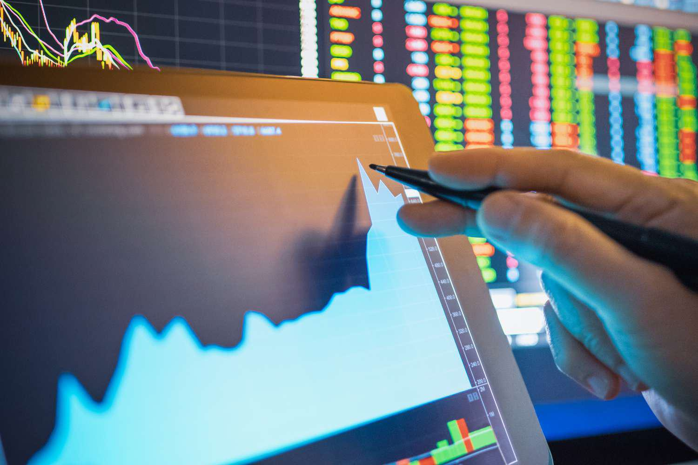

In trading and investment, the mastery of various terms and concepts is crucial for achieving success. Among these, the term 'package deal' emerges as a pivotal element encountered frequently in both trading and business contexts. A package deal usually involves multiple components or transactions that must be executed together, aimed at securing strategic advantages or reducing risks. In the trading domain, particularly within algorithmic trading, the concept of package deals becomes even more significant. Algorithmic trading, often referred to as algo trading, has revolutionized the financial markets with its efficiency and precision, enabling traders to execute orders at speeds and frequencies that are beyond human capability.

By integrating package deals into algorithmic trading strategies, traders can optimize their decision-making processes and secure favorable conditions in volatile markets. This article explains what package deals are with practical examples and investigates their use in algorithmic trading. The discussion will equip readers with a comprehensive understanding of how such packages can be strategically utilized. As a result, traders will be better positioned to incorporate these concepts into their trading strategies, potentially enhancing their overall trading performance and mitigating risks.



## Table of Contents

## What is a Package Deal?

A package deal is a transaction comprising multiple components or trades that are executed simultaneously. This concept is widely utilized in both trading and business to guarantee that all elements of a transaction are fulfilled together, reducing risks and securing advantageous conditions.

In the context of trading, package deals are pivotal for managing risks and controlling prices or conditions across various assets. For instance, in algorithmic trading, traders often leverage package deals to execute trades that involve complex strategies, such as arbitrage and options spreads. This simultaneous execution ensures that the intended market conditions are met across all related trades without discrepancies that could arise if executed separately.

In business, package deals might involve the bundling of products or services, or hiring multiple employees through a single transaction. This approach can streamline operations, attract customers with bundled offerings, and efficiently meet strategic business objectives.

Understanding how package deals work is essential for traders and business professionals who aim to use comprehensive strategies. A clear grasp of the mechanics ensures that the desired outcomes are reached efficiently, whether through managing financial assets in a trading strategy or leveraging bundled offers in business settings. In trading, automatic execution mechanisms, such as those employed in algorithmic trading systems, are often used to ensure the seamless execution of package deals. This can be illustrated through the use of limit orders, which specify the maximum or minimum price at which the involved trades should be executed, thus protecting against market volatility and price slippage.

## Package Deals in Algorithmic Trading

Algorithmic trading, often referred to as algo trading, leverages computational models to automate the execution of trades based on predefined criteria. This process involves the use of sophisticated algorithms to scan and analyze market data at high speeds and make trading decisions without human intervention. A fundamental aspect of algo trading is the ability to execute multiple trades simultaneously, which is where package deals become crucial.

Package deals in [algorithmic trading](/wiki/algorithmic-trading) facilitate the execution of complex strategies such as options spreads and [arbitrage](/wiki/arbitrage). Options spreads are strategies that involve buying and selling options of the same class on the same underlying asset with different strike prices or expiration dates to mitigate risk. For example, a "bull call spread" might involve buying a call option at a lower strike price while selling another at a higher strike price on the same underlying asset. Here, a package deal ensures both trades are executed concurrently to maintain the integrity of the strategy.

Arbitrage strategies also benefit significantly from package deals. Arbitrage involves taking advantage of price discrepancies between different markets or financial instruments. By using package deals, traders can execute buy and sell orders simultaneously across disparate markets, minimizing exposure to price movements and locking in profit.

One of the primary advantages of package deals in algo trading is the assurance that specific market conditions are met before executing trades. This is achieved through the integration of conditions or triggers in the algorithm. For instance, a trader might set a limit order within the package deal, which ensures a trade is only executed if the price reaches a predetermined level. This control mechanism enhances both the efficiency and profitability of trading strategies by minimizing slippage and optimizing entry and [exit](/wiki/exit-strategy) points.

Consider the following Python code snippet illustrating a simple algorithmic strategy incorporating a package deal with limit orders:

```python
import alpaca_trade_api as tradeapi
from datetime import datetime, timedelta

# Initialize API
api = tradeapi.REST('<API_KEY>', '<API_SECRET>', base_url='https://paper-api.alpaca.markets')

# Define the trading strategy
def execute_trade():
    current_price = api.get_last_trade('AAPL').price
    if current_price < 150:  # Replace with desired condition
        # Package deal: Buy AAPL and Sell MSFT with limit order
        api.submit_order(
            symbol='AAPL',
            qty=10,
            side='buy',
            type='limit',
            time_in_force='gtc',
            limit_price=148.5
        )
        api.submit_order(
            symbol='MSFT',
            qty=5,
            side='sell',
            type='limit',
            time_in_force='gtc',
            limit_price=250.0
        )

execute_trade()
```

In this illustration, the algorithm sets conditions for purchasing Apple shares and selling Microsoft shares using limit orders. The use of a package deal ensures that both orders are contingent on each other and meet specified market conditions, thus improving the strategic alignment and execution efficiency.

In summary, package deals significantly enhance the capability of algorithmic trading systems by enabling the execution of multifaceted strategies and ensuring trades conform to pre-established conditions. Their role is paramount in optimizing performance and managing risk in automated trading environments.

## Real World Examples of Package Deals

Package deals are versatile strategies that apply to multiple sectors beyond trading, extending to areas such as real estate and general business transactions. They involve combining various components into a single agreement, ensuring that all parts are executed simultaneously or under predefined conditions, thus creating a synergistic effect.

In trading, a package deal might be exemplified through a long-short strategy. This involves taking a long position in one asset and a short position in another, balancing potential gains and losses to capitalize on market inefficiencies or anticipated price movements. By executing these trades as a package, traders ensure simultaneity, which is crucial for maintaining the desired hedge and mitigating the risk of adverse price movements occurring between trades.

Outside the trading arena, package deals find substantial application in real estate and bundled product sales. In real estate, a common package deal might involve purchasing multiple properties collectively, offering buyers a favorable price due to the bulk nature of the transaction. This approach is beneficial for both sellers, who can offload multiple assets at once, and buyers, who receive a discount, thereby enhancing investment returns.

In business, bundling products or services serves as another practical illustration of package deals. For instance, a telecommunications company might offer a package that includes internet, cable television, and mobile phone services at a combined price lower than purchasing each service separately. This strategy not only attracts more customers but also streamlines sales, as customers perceive greater value in the bundled offering.

These examples demonstrate the flexibility and utility of package deals in various contexts. Whether in complex financial markets or consumer-oriented industries, package deals can offer enhanced value, risk management, and operational efficiency, underscoring their widespread applicability.

## Advantages and Disadvantages of Package Deals in Trading

Package deals in trading present a framework where multiple trades or transactions are executed as a consolidated unit. This approach offers notable advantages in terms of risk management and achieving precision in trade execution. By predetermining the conditions and prices under which all components of a package deal are executed, traders can protect investments from the erratic nature of market movements.

### Advantages

1. **Risk Mitigation**: By consolidating multiple trades into a single package, traders can manage risk more effectively. This strategy helps in balancing risk across different trades, as the success of one component can offset the potential losses in another. For example, executing a hedged strategy like a long-short equities trade within a package deal can protect against market downturns while maintaining exposure to potential gains.

2. **Strategic Trade Execution**: Package deals allow the execution of complex strategies that require synchronized trading actions. This is especially pertinent in high-frequency and algorithmic trading, where timing and sequence are crucial. For example, traders might use package deals to execute a basket of currency trades that require simultaneous execution to benefit from arbitrage opportunities.

3. **Price and Condition Locks**: A package deal ensures that all trade components meet the specified conditions before execution, effectively locking in prices. This eliminates the risk that arises from partial fills or unfavorable price movements in the interim. Traders can thus safeguard their investment strategies from drastic market shifts.

### Disadvantages

1. **Complexity**: While package deals offer strategic benefits, they inherently add layers of complexity to trading operations. Designing a package deal requires sophisticated modeling to account for interdependencies between trades, as well as the market conditions that trigger execution.

2. **Execution Issues**: The requirement that all components of a package meet predefined conditions can sometimes lead to execution problems. If one part of the package can't be executed due to market conditions, it may prevent the entire deal from being completed. This can lead to missed opportunities or require the trader to revert to more straightforward trading strategies.

3. **Cost Considerations**: Package deals may incur higher transaction costs due to the complexity of managing multiple trades simultaneously. Additionally, they may require advanced technological infrastructure and computational resources, especially in the context of algorithmic trading.

Understanding both the benefits and drawbacks of package deals is vital for traders formulating their trading strategies. While the ability to mitigate risk and execute trades with strategic precision is invaluable, it is equally important to consider the inherent complexity and potential for execution failure. As such, employing package deals entails a calculated balance, ensuring that the advantages outweigh the potential drawbacks in any given trading scenario.

## Conclusion

Package deals serve as a versatile tool in both business and trading, offering significant strategic and financial advantages. In algorithmic trading, they are pivotal for the effective execution of intricate strategies. By simultaneously executing multiple trades under predefined conditions, package deals allow traders to optimize their strategies, ensuring that desired market conditions are met. This structured approach helps mitigate the risks associated with market [volatility](/wiki/volatility-trading-strategies).

Understanding and applying package deals enables traders to improve their trading performance while minimizing potential downside risks. The capability to lock in specific prices or conditions through package deals provides a safety net against adverse market movements, safeguarding investments. Moreover, the application of package deals extends beyond trading into business negotiations, where they allow for the bundling of products or services to create attractive offerings for customers.

This article aimed to clarify the concept of package deals and highlight their practical applications, empowering readers to utilize them effectively. By integrating package deals into their strategies, traders and business professionals alike can tackle complex transactions with greater confidence and precision.

## References & Further Reading

[1]: Bergstra, J., Bardenet, R., Bengio, Y., & Kégl, B. (2011). ["Algorithms for Hyper-Parameter Optimization."](https://papers.nips.cc/paper/4443-algorithms-for-hyper-parameter-optimization) Advances in Neural Information Processing Systems 24.

[2]: ["Advances in Financial Machine Learning"](https://www.amazon.com/Advances-Financial-Machine-Learning-Marcos/dp/1119482089) by Marcos Lopez de Prado

[3]: ["Evidence-Based Technical Analysis: Applying the Scientific Method and Statistical Inference to Trading Signals"](https://www.amazon.com/Evidence-Based-Technical-Analysis-Scientific-Statistical/dp/0470008741) by David Aronson

[4]: ["Machine Learning for Algorithmic Trading"](https://github.com/stefan-jansen/machine-learning-for-trading) by Stefan Jansen

[5]: ["Quantitative Trading: How to Build Your Own Algorithmic Trading Business"](https://www.amazon.com/Quantitative-Trading-Build-Algorithmic-Business/dp/1119800064) by Ernest P. Chan