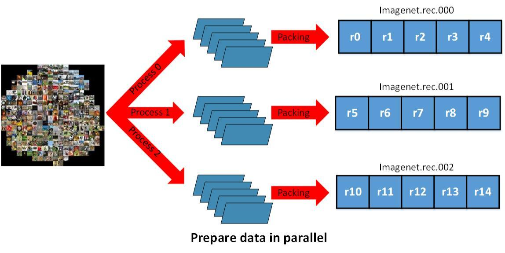

## Table of Contents

## What is packed data in the context of machine learning?

Packed data in machine learning refers to a way of organizing data to make it more efficient for processing, especially when dealing with sequences like text or time series. When data is packed, similar items are grouped together, which can reduce the amount of memory needed and speed up computations. For example, if you're working with sentences, packing might involve grouping all the words from multiple sentences into a single array, making it easier for the computer to handle them all at once.

In practical terms, packing data can be particularly useful in neural networks, where it helps in processing batches of data more efficiently. For instance, in natural language processing, sentences of different lengths can be packed into a single tensor, where shorter sentences are padded to match the length of the longest one. This allows the model to process multiple sentences in parallel, improving the training speed and reducing the computational resources needed. By using packed data, machine learning models can achieve better performance and scalability.

## Why is packed data important for machine learning models?

Packed data is important for machine learning models because it helps them work faster and use less memory. When data is packed, it means that similar pieces of information are grouped together. This makes it easier for the computer to handle the data all at once, instead of dealing with each piece separately. For example, if you have a lot of sentences, packing them means putting all the words into one big list. This way, the computer can process many sentences at the same time, which saves time and makes the model more efficient.

Another reason packed data is important is that it helps with handling different lengths of data. In machine learning, especially in areas like natural language processing, you often have to deal with sentences or sequences that are not all the same length. By packing the data, you can add extra spaces (padding) to make all the sequences the same length. This allows the model to process the data in batches, which is much faster than processing each sequence one by one. Overall, using packed data makes machine learning models more powerful and able to handle more data with less effort.

## How does packed data differ from traditional data formats?

Packed data is different from traditional data formats because it groups similar items together to make processing easier and faster. In traditional formats, data is often stored in a straightforward way, like a list where each item is separate. For example, if you have sentences, traditional data might store each sentence as its own list of words. But with packed data, all the words from different sentences might be put into one big list, with some way to keep track of where each sentence starts and ends. This grouping can make it quicker for computers to work with the data, especially when dealing with many items at once.

Another difference is how packed data handles sequences of different lengths. Traditional data formats might struggle with this because they are designed to handle data of uniform size. For example, if you have sentences of different lengths, a traditional format might not know how to process them together. Packed data solves this by adding padding to make all sequences the same length, allowing them to be processed in batches. This is particularly useful in [machine learning](/wiki/machine-learning), where processing data in batches can speed up training and improve efficiency. By using packed data, models can work with more data in less time, making them more powerful and efficient.

## What are the common techniques used to pack data for machine learning?

One common technique to pack data for machine learning is called padding. Padding means adding extra spaces or zeros to make all the sequences the same length. For example, if you have sentences of different lengths, you can add zeros to the shorter ones so they match the length of the longest sentence. This way, all the sentences can be put into one big list, making it easier for the computer to process them all at once. Padding helps with batch processing, which is when the model works on many items together, making it faster and more efficient.

Another technique is called sequence packing. This involves putting all the items from different sequences into one big sequence, while keeping track of where each original sequence starts and ends. For example, if you have three sentences, you can put all their words into one list and use another list to mark where each sentence begins. This can be done using a list of indices or lengths that show the start and end points of each sequence. Sequence packing helps save memory and speed up processing because the computer can work on all the data at the same time.

A third technique is called dynamic batching. This means grouping sequences of similar lengths together into batches. Instead of making all sequences the same length with padding, you can sort them by length and then put similar ones into the same batch. This reduces the need for padding and can make processing even more efficient. By using these techniques, machine learning models can handle data better and work faster.

## Can you explain the process of data packing in machine learning?

Data packing in machine learning involves organizing data in a way that makes it easier and faster for the computer to process. Imagine you have a bunch of sentences, and each sentence has a different number of words. Instead of keeping each sentence as its own separate list, you can put all the words from all the sentences into one big list. This big list is called a packed sequence. To keep track of where each sentence starts and ends, you use another list that shows the starting point of each sentence. This way, the computer can process all the words at once, which is much faster than processing each sentence one by one.

One common way to pack data is by using padding. Padding means adding extra spaces or zeros to make all the sequences the same length. For example, if you have sentences of different lengths, you can add zeros to the shorter ones so they match the length of the longest sentence. This allows all the sentences to be put into one big list, and the computer can process them in batches. Another way to pack data is called dynamic batching. This means grouping sequences of similar lengths together into batches. By sorting the sequences by length and putting similar ones into the same batch, you can reduce the need for padding and make processing even more efficient. Using these techniques, machine learning models can work with data more effectively and speed up their training process.

## What are the benefits of using packed data in training machine learning models?

Using packed data in training machine learning models makes the process faster and more efficient. When data is packed, similar items are grouped together into one big list, allowing the computer to work on many items at the same time. This is called batch processing, and it's much quicker than processing each item one by one. For example, if you have a lot of sentences, packing them means putting all the words into one big list. This way, the computer can process many sentences together, which saves time and makes the model train faster.

Another benefit of packed data is that it helps handle sequences of different lengths. In machine learning, especially in areas like natural language processing, you often have to deal with sentences or sequences that are not all the same length. By packing the data, you can add extra spaces (padding) to make all the sequences the same length. This allows the model to process the data in batches, which is much faster than processing each sequence one by one. Overall, using packed data makes machine learning models more powerful and able to handle more data with less effort.

## What challenges might arise when using packed data in machine learning?

One challenge of using packed data in machine learning is dealing with the extra memory needed for padding. When you pack data, you often add zeros or spaces to make all sequences the same length. This can use up more memory, especially if the difference in sequence lengths is big. For example, if you have some very short sentences and some very long ones, you might need to add a lot of padding to the short ones. This can make the packed data take up more space than it would if you just kept each sentence separate.

Another challenge is that packed data can sometimes make the model less accurate. When you add padding, the model might treat the padding as real data, which can mess up the training. For example, if the model is trying to understand the meaning of sentences, it might get confused by the extra zeros at the end. This can lead to the model making mistakes or not learning as well as it could. So, while packing data can make things faster, it's important to balance that with the need for the model to be accurate.

## How does packed data impact the performance of machine learning algorithms?

Packed data can make machine learning algorithms run faster and use less memory. When data is packed, similar items are grouped together into one big list. This lets the computer work on many items at the same time, which is called batch processing. For example, if you have a lot of sentences, packing them means putting all the words into one big list. This way, the computer can process many sentences together, which saves time and makes the training of the model quicker. By using packed data, the model can handle more data in less time, making it more efficient.

However, packed data can also cause some problems. One issue is that it might use more memory because of padding. Padding means adding extra spaces or zeros to make all sequences the same length. If the sequences are very different in length, this can take up a lot of extra space. Another problem is that the model might get confused by the padding and treat it as real data. This can make the model less accurate because it might learn from the extra zeros instead of focusing on the real data. So, while packed data can help with speed and efficiency, it's important to make sure it doesn't hurt the model's accuracy.

## What tools or libraries are commonly used to handle packed data in machine learning?

One of the most commonly used libraries for handling packed data in machine learning is PyTorch. PyTorch has built-in functions that make it easy to pack sequences and add padding. For example, you can use the `pack_padded_sequence` function to pack sequences of different lengths into one big list, and the `pad_sequence` function to add padding to make all sequences the same length. These tools help make the training of machine learning models faster and more efficient.

Another popular library is TensorFlow, which also provides tools for handling packed data. TensorFlow's `tf.keras.preprocessing.sequence` module includes functions like `pad_sequences` that can add padding to sequences. This makes it easier to process batches of data, which can speed up the training process. Both PyTorch and TensorFlow are widely used in the machine learning community because they make it easier to work with packed data and improve the performance of models.

## How can one optimize machine learning models using packed data?

Optimizing machine learning models using packed data involves grouping similar items together to make processing faster and more efficient. When you pack data, you can use techniques like padding to make all sequences the same length. This allows the computer to work on many items at the same time, which is called batch processing. For example, if you have a lot of sentences, you can put all the words into one big list and use padding to make sure they are all the same length. This way, the model can train faster because it doesn't have to process each sentence one by one. Libraries like PyTorch and TensorFlow have tools that make it easy to pack data and add padding, which helps improve the performance of the model.

However, there are some challenges to consider when using packed data. One issue is that padding can use up more memory, especially if the sequences are very different in length. Another problem is that the model might get confused by the padding and treat it as real data, which can make the model less accurate. To balance these issues, you can use techniques like dynamic batching, where you group sequences of similar lengths together. This reduces the need for padding and can make processing even more efficient. By carefully managing how you pack data, you can make your machine learning models faster and more effective without sacrificing accuracy.

## What are the advanced techniques for packing data specifically for deep learning models?

Advanced techniques for packing data in [deep learning](/wiki/deep-learning) models include dynamic batching and attention-based packing. Dynamic batching involves grouping sequences of similar lengths together into batches. This reduces the amount of padding needed, which can save memory and speed up processing. For example, if you have sentences of different lengths, you can sort them by length and then put similar ones into the same batch. This way, the model can work on sequences that are close in length at the same time, making the training process more efficient. Another technique is attention-based packing, which uses attention mechanisms to focus on relevant parts of the data. This can help the model ignore padding and focus on the actual content, improving accuracy.

Another advanced technique is using recurrent [neural network](/wiki/neural-network) (RNN) optimizations like packed padded sequences. In PyTorch, you can use the `pack_padded_sequence` function to pack sequences of different lengths into one big list, which can then be processed by an RNN. This helps the model handle variable-length sequences more efficiently. For example, if you have sentences of different lengths, you can pack them into a single tensor and use an RNN to process them. This way, the model can train faster and use less memory because it doesn't have to process each sequence one by one. By using these advanced techniques, deep learning models can work with packed data more effectively and achieve better performance.

## How does the choice of packed data format affect model scalability and deployment?

The choice of packed data format can significantly impact the scalability of a machine learning model. When data is packed efficiently, it allows the model to process larger batches of data more quickly. This is important for scalability because it means the model can handle more data in less time, which is crucial when dealing with large datasets. For example, using dynamic batching to group sequences of similar lengths can reduce the need for padding, making the model more memory-efficient and faster. This helps the model scale to bigger datasets and more complex tasks without slowing down.

In terms of deployment, the packed data format can affect how easily the model can be integrated into different environments. If the packed data format is well-suited to the deployment platform, it can make the model run more smoothly and use fewer resources. For instance, if a model uses PyTorch's `pack_padded_sequence` function to handle variable-length sequences, it can be deployed more efficiently on platforms that support PyTorch. This means the model can perform well in real-world applications, making it easier to deploy and maintain. By choosing the right packed data format, you can ensure that the model scales well and deploys effectively.