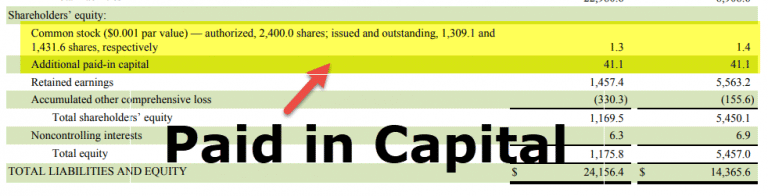

In the world of finance, understanding the various components of equity is crucial for investors and analysts alike. Among these components, Paid-In Capital stands out as a fundamental aspect, representing the money a company raises through the issuance of stocks. It is essential in determining a company's financial health and capital structure, providing insights into how a company finances its operations and growth opportunities.

Paid-In Capital is recorded on a company's balance sheet and typically consists of several elements, including the par value of issued stock and any amounts received that exceed this par value, known as Additional Paid-In Capital. Understanding Paid-In Capital involves breaking down its calculation, which requires acknowledging these key components to assess a company's capital-raising effectiveness.



This article will explore the elements constituting Paid-In Capital, its distinction from other equity components, and its calculation. Additionally, we will analyze its relevance in the context of algorithmic trading, where precise financial metrics and calculations are pivotal in developing trading strategies. Algorithmic traders often utilize Paid-In Capital calculations to evaluate investment opportunities and predict corporate actions' effects on stock prices. Hence, comprehending how Paid-In Capital integrates into trading algorithms can offer strategic investment insights.

Understanding the intricacies of Paid-In Capital not only aids investors in assessing a company's financial strategies but also enhances algorithmic trading models' robustness, ultimately leading to more informed investment decisions.

## Table of Contents

## Understanding Paid-In Capital

Paid-In Capital, also referred to as contributed capital, is an integral component of a company's equity section on the balance sheet. It represents the funds that a company has received from shareholders in exchange for stock, both common and preferred. This capital reflects the money a company can utilize for business operations or investment opportunities, underscoring its vital role in financial structuring.

On a company's balance sheet, equity is divided into several components, among which Paid-In Capital is a primary element. Unlike retained earnings, which are accrued profits not distributed as dividends, Paid-In Capital is directly linked to the equity transactions where the company issues shares. Retained earnings emphasize a company's ability to generate profits over time, while Paid-In Capital focuses on the capital raised through shareholders. Another distinct term is contributed surplus, which he difference between the issue price of shares and the amount calculated based on the par or stated value of those shares.

Paid-In Capital can be further categorized into two main components: par value and amounts paid in excess of par (also known as additional paid-in capital or share premium). Par value is the nominal or face value of a stock as indicated in the corporate charter. Historically, par value was used as a minimum price for selling shares and served as a protection for investors by ensuring that shares were not issued below this stated value. However, in contemporary financial practice, par value is often set at a minimal figure, sometimes as low as one cent, and its economic significance is largely diminished.

Amounts paid in excess of par represent the capital that investors are willing to pay above the par value of the stock. For example, if a company's shares have a par value of $1 and are sold to investors at $10 each, then $9 would be recorded as additional paid-in capital. This part of Paid-In Capital is crucial for companies as it indicates the excess amount investors are willing to invest, often reflecting the perceived growth potential or financial health of the company.

In financial terms, the equation for calculating Paid-In Capital can be expressed as:

$$
\text{Paid-In Capital} = (\text{Number of Shares Issued} \times \text{Par Value}) + \text{Additional Paid-In Capital}
$$

This equation underscores the relationship between issued shares, their par value, and the amounts contributed above this nominal figure by investors. Understanding this component is critical for investors, analysts, and companies, as it highlights the ability of a company to raise funds and manage shareholder equity effectively.

## Types of Stock Affecting Paid-In Capital

Paid-In Capital, a critical component of a company's equity, is influenced by the type of stock issued by the company. Common stock, preferred stock, and treasury stock each play distinct roles in shaping the company's capital structure and affect Paid-In Capital in various ways.

**Common Stock**

Common stock represents equity ownership in a company and typically confers voting rights to shareholders. When a company issues common stock, the proceeds from this issuance contribute to the Paid-In Capital on the balance sheet. Paid-In Capital is calculated by summing the par value of the issued shares and the additional paid-in capital, which is the amount received above the par value. For example, if a company issues 1,000 shares with a par value of $1 per share but sells them at $10 each, the Paid-In Capital includes the par value ($1,000) and the additional paid-in capital ($9,000), totaling $10,000.

**Preferred Stock**

Preferred stock is another type of equity security, which, unlike common stock, generally does not [carry](/wiki/carry-trading) voting rights. However, it offers fixed dividends, making it a hybrid between equity and debt. Companies use preferred stock to raise capital with fixed returns, appealing to investors seeking stability. Preferred stock affects Paid-In Capital similarly to common stock, with the issuance proceeds adding to it. The fixed dividend feature often allows companies to avoid diluting the [earning](/wiki/earning-announcement) power of existing common shareholders, providing a tool to manage the overall capital structure effectively.

**Treasury Stock**

Treasury stock consists of shares that a company has repurchased from the public and is held in the company's treasury. These shares reduce shareholders' equity as they are essentially a reversal of previously issued equity. When companies buy back their stock, it decreases the canopies of outstanding shares, and the amount paid for these shares is deducted from the Paid-In Capital. This action can be a strategic move to return capital to shareholders, signal confidence, or improve financial ratios like earnings per share. However, it doesn't directly impact Paid-In Capital in terms of its initial calculation, as the repurchase is typically recorded as a separate line item under shareholders' equity.

In summary, common stock issuance increases Paid-In Capital through funds raised, preferred stock allows for capital inflow with fixed cost implications, and treasury stock buybacks effectively decrease the total equity, impacting investors' perceived company value. Each type of stock contributes uniquely to the financial and strategic framework of the company. Understanding these aspects is crucial for investors and analysts in making informed decisions about a company's financial health and strategy.

## Calculating Paid-In Capital and Par Value

Calculating Paid-In Capital involves understanding how much investors have contributed in exchange for stock, above any par value set by the company. Here's a step-by-step guide to calculating Paid-In Capital, alongside explanations of par value and Additional Paid-In Capital.

### Step-by-Step Guide on Calculating Paid-In Capital

Paid-In Capital is typically calculated by summing the par value of the issued stock and the Additional Paid-In Capital (APIC). Below are the steps to perform this calculation:

1. **Identify the Par Value**:  
   Par value is the nominal or face value assigned to a share of stock. Historically, par value represented the minimum price at which shares could be issued. Today, it has minimal significance except for legal or accounting functions. Modern companies often set a very low or even zero par value to avoid liability, but it still appears as an important aspect of corporate securities.

2. **Determine the Number of Issued Shares**:  
   This is the total number of shares that a company has sold to investors, including those for treasury stock before repurchase.

3. **Calculate Total Par Value**:  
   To find the total par value of issued shares:
$$
   \text{Total Par Value} = \text{Number of Issued Shares} \times \text{Par Value per Share}

$$

4. **Calculate Additional Paid-In Capital (APIC)**:  
   APIC is the amount received from shareholders over and above the par value of the stock. It is crucial because it reflects the additional contributions made by investors and is often a significant component of equity.

   To calculate APIC:
$$
   \text{APIC} = (\text{Issue Price per Share} - \text{Par Value per Share}) \times \text{Number of Issued Shares}

$$

5. **Calculate Paid-In Capital**:  
   Total Paid-In Capital is the sum of the total par value of the issued shares and the APIC. It can be expressed as:
$$
   \text{Paid-In Capital} = \text{Total Par Value} + \text{APIC}

$$

### Example Calculation

Consider a hypothetical company that issues 1,000 shares with a par value of $1 per share. It sells these shares at $10 each.

- **Total Par Value**: $1,000 \times 1 = 1,000$
- **APIC**: $(10 - 1) \times 1,000 = 9,000$
- **Paid-In Capital**: $1,000 + 9,000 = 10,000$

### Significance of Additional Paid-In Capital

Additional Paid-In Capital represents the extra amount investors are willing to pay over the par value, providing insights into investor confidence in a company's prospects. For companies, APIC offers an insight into how much capital has been raised beyond the minimal equity value, potentially used for expansion, paying off debts, or pursuing new business opportunities. For investors, analyzing APIC helps understand the company's capital structure, particularly during initial public offerings or follow-on offerings, reflecting company growth and investment opportunities.

## Algorithmic Trading and Paid-In Capital

The integration of Paid-In Capital metrics within [algorithmic trading](/wiki/algorithmic-trading) frameworks represents a compelling avenue for enhancing investment strategies. Paid-In Capital, comprising funds obtained from issuing stock above its par value, provides insights into the capital structure and financial health of companies. In algorithmic trading, these metrics are leveraged to evaluate investment opportunities and optimize trading decisions through a systematic and automated approach.

To utilize Paid-In Capital in trading algorithms, quantitative analysts and developers embed financial data into sophisticated models that dissect corporate financial statements. Such algorithms analyze the ratio of equity financing to overall capital, offering insights into a company's financial strategy and potential market actions. By including Paid-In Capital as a variable, they can prioritize investments in companies demonstrating robust equity financing, which might be indicative of strong financial health and growth potential.

Algorithmic strategies must also account for corporate actions that impact Paid-In Capital, such as stock splits, stock buybacks, and new stock issuances. These actions can alter a company’s capital structure and influence its stock price. For instance, a stock buyback reduces outstanding shares and can increase earnings per share, potentially elevating the stock's market value. Algorithms are designed to detect these actions and recalibrate trading strategies accordingly, ensuring that they align with changes in Paid-In Capital and other key financial metrics.

Here's an example of how a simple algorithm might be structured in Python to [factor](/wiki/factor-investing) in Paid-In Capital:

```python
import pandas as pd

def evaluate_investment_opportunities(financial_data):
    """
    Function evaluates companies based on Paid-In Capital metrics
    for potential investment opportunities.

    Args:
    - financial_data (DataFrame): Contains companies' financial information.

    Returns:
    - selected_companies (list): List of company names that meet the criteria.
    """
    # Threshold for selecting companies
    paid_in_capital_threshold = 10000000  # Example threshold, adjust as necessary

    # Filter companies with Paid-In Capital above the threshold
    selected_companies = financial_data[
        financial_data['Paid-In Capital'] > paid_in_capital_threshold
    ]['Company Name'].tolist()

    return selected_companies

# Example usage
data = {'Company Name': ['Company A', 'Company B', 'Company C'],
        'Paid-In Capital': [12000000, 8000000, 15000000]}

financial_data = pd.DataFrame(data)
investments = evaluate_investment_opportunities(financial_data)
print("Selected investment opportunities:", investments)
```

This example highlights a simplified approach where the algorithm selects companies based on a predefined Paid-In Capital threshold, indicating readiness for further analysis.

In conclusion, Paid-In Capital remains pivotal for algorithmic traders aiming to capture nuanced insights into a company's financial structure and market potential. By systematically integrating these metrics into automated trading models, traders can enhance their understanding of market dynamics influenced by corporate capital structure decisions.

## Examples and Practical Applications

Calculating Paid-In Capital involves determining the total amount of capital a company has received from equity investors in exchange for stock. This process is crucial for understanding a company’s financial position and assessing its capacity to generate additional funds. 

### Real-world Example: Calculating Paid-In Capital

Consider a hypothetical company, Oasis Corp, which has issued 10,000 shares of common stock with a par value of $1 per share. The shares are sold at $10 each. The Paid-In Capital can be calculated as follows:

1. **Par Value Calculation**: Multiply the number of shares by the par value.
$$
   \text{Par Value} = 10,000 \, \text{shares} \times \$1 = \$10,000

$$

2. **Additional Paid-In Capital (APIC) Calculation**: Calculate the additional money paid over the par value. 
$$
   \text{Amount Paid in Excess of Par} = (\$10 - \$1) \times 10,000 \, \text{shares} = \$90,000

$$

3. **Total Paid-In Capital**: Combine par value and APIC.
$$
   \text{Total Paid-In Capital} = \$10,000 + \$90,000 = \$100,000

$$

This example illustrates how a company can raise substantial funds through stock issuance, with the larger portion coming from the amount paid in excess of par.

### Significance of Additional Paid-In Capital

Additional Paid-In Capital (APIC) represents the amount investors are willing to pay above the par value of the stock, reflecting their confidence in the company's potential for growth and profitability. A high APIC indicates strong investor interest and trust in the company's prospects. This component of equity can enhance a company's perceived financial health, as it suggests flexibility in funding future operations or projects without additional debt.

### Case Studies: Impact of Capital Structure Decisions

**Case Study 1: Tech Innovators Inc.**  
Tech Innovators decided to issue preferred stock to raise funds for new product development. The fixed dividends associated with preferred stock provided a stable return for investors, enhancing the company's attractiveness as an investment. This decision improved the company's capital structure by infusing equity without increasing debt, thereby maintaining a favorable credit profile.

**Case Study 2: Financial Dynamics Ltd.**  
Financial Dynamics repurchased a portion of its outstanding treasury stock, a decision aimed at increasing Earnings Per Share (EPS) and enhancing shareholder value. However, this reduced the Paid-In Capital, affecting the overall equity structure. While the move resulted in short-term gains on the stock market, it limited the company’s ability to leverage stock sale for future capital needs.

These cases underscore the intricate balance companies must strike in capital structure decisions, impacting their strategic options and investor perceptions in trading environments.

## Limitations and Considerations

Paid-In Capital, while a crucial component of a company’s financial structure, presents several limitations when relied upon solely for investment decisions. Understanding these limitations is essential for investors looking to make informed choices and for traders developing algorithmic models.

One primary limitation of Paid-In Capital is its inability to reflect a company's ongoing profitability. Paid-In Capital represents funds raised by issuing stock and does not account for the operating performance or financial health that accrual and cash flow measures provide. Investors seeking to evaluate the profitability and operational efficiency of a firm need to consider metrics beyond Paid-In Capital, such as net income, revenue growth, and return on equity. Using Paid-In Capital in isolation can provide an incomplete picture, as it does not indicate how effectively the raised capital is being utilized to generate profits.

For algorithmic trading models, relying heavily on Paid-In Capital introduces the risk of overlooking dynamics that influence stock prices and corporate health. Algorithms designed to assess investment opportunities may incorporate Paid-In Capital to evaluate shareholder contributions but must integrate other financial metrics to achieve a comprehensive analysis. Metrics such as earnings per share, debt-to-equity ratio, and market trends provide insights into a firm's performance and market conditions that Paid-In Capital alone cannot capture.

Moreover, corporate actions like stock buybacks, issuance of additional shares, or mergers can significantly impact Paid-In Capital and its interpretation. Algorithmic strategies need to account for these actions by analyzing historical data and forecasting their effects on company valuation. For instance, a company conducting a share buyback will reduce its treasury stock, impacting Paid-In Capital and altering the equity balance. In Python, algorithmic traders might simulate these corporate actions:

```python
def simulate_buyback(paid_in_capital, treasury_stock, shares_to_buyback, share_price):
    treasury_stock += shares_to_buyback
    paid_in_capital -= shares_to_buyback * share_price
    return paid_in_capital, treasury_stock

# Example usage:
paid_in_capital = 1000000  # initial paid-in capital
treasury_stock = 0  # initial treasury stock
shares_to_buyback = 5000  # number of shares
share_price = 50  # price per share

new_paid_in_capital, new_treasury_stock = simulate_buyback(paid_in_capital, treasury_stock, shares_to_buyback, share_price)
```

Investors should exercise caution when using Paid-In Capital as a standalone metric. Its historical and accounting-based nature means it may not provide timely insights into the company’s market position or growth potential. Balancing Paid-In Capital with other financial indicators and qualitative factors is essential for comprehensive investment analysis.

## Conclusion

Paid-In Capital is an essential aspect of corporate finance, serving as a key indicator of a company's financial health and its ability to raise funds through equity. Its calculation and interpretation are crucial in both traditional and algorithmic trading strategies, providing insights into a company's market behavior and investment potential. Investors and companies, striving to navigate complex financial landscapes, frequently depend on Paid-In Capital to make informed decisions.

In traditional financial analysis, understanding Paid-In Capital helps reveal the extent to which a company is funded by investors as opposed to debt. This knowledge aids in evaluating the company's leverage and financial stability. A higher Paid-In Capital can indicate a more robust financial position, thereby influencing investment decisions.

In the context of algorithmic trading, the role of Paid-In Capital extends to automated systems that assess financial metrics to optimize trading strategies. Algorithmic models often integrate Paid-In Capital data to evaluate corporate actions and capital structures, potentially identifying undervalued or overvalued securities. The ability to input this metric into trading algorithms allows for more precise and informed trading decisions, enhancing the capacity to exploit market inefficiencies.

As financial markets continue to evolve, the understanding and interpretation of Paid-In Capital remain vital. It equips investors and companies with a deeper understanding of a firm's capitalization, improving their ability to strategize effectively. This comprehension is particularly important as market dynamics shift and the reliance on data-driven decision-making becomes more pronounced. In summary, Paid-In Capital is an indispensable tool for gauging corporate financial health and optimizing trading strategies in a rapidly changing economic environment.

## References & Further Reading

[1]: ["Financial Reporting and Analysis"](https://www.investopedia.com/terms/f/financial-analysis.asp) by Charles H. Gibson

[2]: Fernald, M., & Rogers, P. (2013). ["Algorithmic Trading & DMA: An Introduction to Direct Access Trading Strategies."](https://www.amazon.com/Algorithmic-Trading-DMA-introduction-strategies/dp/0956399207) 4Myeloma Press.

[3]: ["Accounting for Investments, Equities, Futures and Options"](https://www.wiley.com/en-us/Accounting+for+Investments%2C+Volume+1%3A+Equities%2C+Futures+and+Options-p-9781118179611) by R. Venkata Subramani

[4]: ["Analysis of Financial Statements"](https://corporatefinanceinstitute.com/resources/accounting/analysis-of-financial-statements/) by Leopold A. Bernstein and John J. Wild

[5]: Fabozzi, F. J. (2008). ["Handbook of Finance, Volume 1: Financial Markets and Instruments."](https://books.google.com/books/about/Handbook_of_Finance_Financial_Markets_an.html?id=7LOD1CmBD-cC) Wiley.