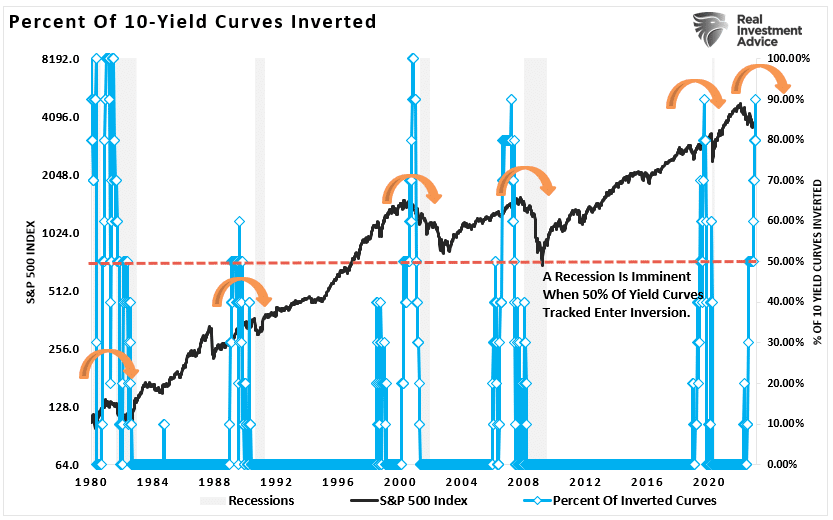

## Table of Contents

## What is a pain trade in financial markets?

A pain trade in financial markets is when the market moves in a way that hurts most investors. It's like when everyone expects the market to go up, but instead, it goes down, causing losses for many people. This can happen because the majority of investors have positioned themselves in a certain way, expecting a particular outcome, but the market does the opposite.

For example, if everyone thinks the stock market will keep going up and they invest a lot in stocks, a pain trade would be if the market suddenly drops. This unexpected move causes pain because many investors lose money. Pain trades can be frustrating because they often go against what most people believe will happen, and they can lead to big losses for those who were not prepared for the unexpected turn.

## How does a pain trade affect investors?

A pain trade can really hurt investors because it goes against what most of them expect. When everyone thinks the market will go one way and it goes the other way instead, many investors lose money. For example, if everyone buys stocks thinking they will go up, but then the market goes down, those investors will see their investments lose value. This can be tough because it catches people off guard and can lead to big losses.

The impact of a pain trade can also make investors feel unsure and worried about their next moves. When the market does something unexpected, it can shake people's confidence in their investment strategies. Some might sell their investments quickly to avoid more losses, which can make the market move even more in the opposite direction. This cycle can make the pain trade even worse for those who were not ready for the market to do the opposite of what they thought it would do.

## Can you provide examples of historical pain trades?

One big pain trade happened in 2008 during the financial crisis. Many people thought housing prices would keep going up, so they invested a lot in real estate and related financial products. But then, housing prices crashed, and it caused huge losses for those investors. Banks and financial institutions that had bet on the housing market going up also got into big trouble. This pain trade not only hurt individual investors but also led to a global economic crisis because so many people and institutions were affected.

Another example is the dot-com bubble burst in the early 2000s. A lot of investors thought that internet companies would keep growing and making money, so they put a lot of money into tech stocks. But when it turned out that many of these companies were not making profits and their stock prices were too high, the market crashed. People who had invested heavily in these stocks saw their investments lose a lot of value. This pain trade showed how dangerous it can be when everyone gets too excited about a certain type of investment without thinking about the risks.

## What causes a pain trade to occur?

A pain trade happens when the market moves in a way that most people don't expect. It's like when everyone thinks the market will go up, but it goes down instead. This can happen because a lot of investors have the same idea about where the market is going. They might all buy the same kind of investment, like stocks or real estate, thinking it will keep going up. But if something unexpected happens, like a big economic change or a surprise event, the market can move the other way. This catches most investors off guard and causes them to lose money.

Another reason for a pain trade is when too many people are betting on the same thing. For example, if everyone thinks interest rates will stay low, they might borrow a lot of money to invest. But if interest rates suddenly go up, it can hurt those investors because borrowing becomes more expensive. This can make the market move in the opposite direction of what everyone expected. Pain trades show how important it is to think about different possibilities and not just follow what everyone else is doing.

## How can investors identify a potential pain trade?

Investors can identify a potential pain trade by paying attention to what most people are doing and thinking. If everyone is talking about how a certain investment will keep going up, like stocks or real estate, it might be a sign that a pain trade could happen. When too many people are betting on the same thing, it can create a situation where the market is likely to move in the opposite direction if something unexpected happens. So, if you see a lot of excitement and everyone is investing in the same way, it's a good idea to be careful and think about what could go wrong.

Another way to spot a potential pain trade is by looking at market sentiment and economic indicators. If everyone seems too sure about the market going one way, it might be a red flag. Also, keeping an eye on things like interest rates, employment numbers, and other economic signs can help you see if the market might be about to do something unexpected. By staying aware of these things and not just following the crowd, investors can be better prepared for a pain trade and maybe even avoid big losses.

## What strategies can be used to mitigate the risks of a pain trade?

To lessen the risks of a pain trade, investors should think about spreading their money across different types of investments. Instead of putting all their money into one thing, like stocks or real estate, they can invest in a mix of things like bonds, commodities, and even different countries' markets. This way, if one type of investment goes down because of a pain trade, the others might stay steady or even go up, helping to balance out the losses.

Another good strategy is to keep an eye on what everyone else is doing and not just follow the crowd. If you see that everyone is excited about the same investment and betting that it will keep going up, it might be a good time to be careful. By thinking about what could go wrong and being ready for the market to do something unexpected, investors can protect themselves better. It's also smart to have a plan for what to do if the market does move against what most people expect, so you can make quick decisions without panicking.

## How do pain trades influence market sentiment?

Pain trades can really shake up how people feel about the market. When the market moves in a way that hurts a lot of investors, it can make everyone feel unsure and worried. If everyone thought the market would go up but it goes down instead, people start to doubt their own ideas about where the market is heading. This can lead to a lot of fear and uncertainty, making investors more cautious and less likely to take big risks.

This change in how people feel can also make the market move even more in the opposite direction. When investors are scared, they might start selling their investments quickly to avoid more losses. This selling can push the market down even further, making the pain trade worse. So, pain trades not only cause immediate losses but can also create a cycle of fear and selling that affects the market for a longer time.

## What role do institutional investors play in pain trades?

Institutional investors, like big banks and investment funds, can have a big impact on pain trades. When these big players all think the market will go one way and they invest a lot of money in that direction, it can set the stage for a pain trade. If everyone is betting on the same thing, like stocks going up, and then the market does the opposite, it can cause huge losses for these institutions. Because they have so much money, their actions can move the market a lot, making the pain trade even worse for everyone.

When a pain trade happens, institutional investors can also make things worse by reacting quickly. If they start selling their investments to cut their losses, it can push the market down even more. This can create a cycle where the market keeps going down because everyone is selling, and it can take a long time for things to calm down. So, what institutional investors do before and during a pain trade can really affect how bad it gets and how long it lasts.

## How can technical analysis help in predicting pain trades?

Technical analysis can help investors spot possible pain trades by looking at charts and patterns in the market. If a lot of people are betting that the market will go one way, like up, technical analysis can show if the market is getting too excited. If the charts show that the market has gone up a lot without taking a break, it might be a sign that a pain trade could happen soon. This is because the market might be due for a big move in the other direction, which can hurt a lot of investors.

By using tools like moving averages and trend lines, investors can see if the market is about to change direction. If the market has been going up but starts to show signs of slowing down or changing, it could mean that a pain trade is coming. Technical analysis helps investors stay ready for these big changes by showing them when the market might be about to do something unexpected. This way, they can be more prepared and maybe avoid big losses when a pain trade happens.

## What are the psychological impacts of pain trades on traders?

Pain trades can really mess with a trader's mind. When the market moves in a way that nobody expected, it can make traders feel scared and unsure. They start to doubt their own plans and ideas about where the market is going. This can lead to a lot of stress and worry, making it hard for them to make good choices about what to do next. Instead of thinking clearly, they might just react quickly out of fear, which can make things even worse.

The fear and uncertainty from a pain trade can also make traders lose confidence in themselves. When they see their investments losing a lot of money, it can shake their belief in their own skills and knowledge. This can lead to a cycle where they feel more and more unsure, which can stop them from making smart moves in the future. Over time, the stress and fear from pain trades can wear traders down, making it tough for them to keep going in the market.

## How do pain trades differ across various asset classes?

Pain trades can happen in different ways depending on the type of investment, like stocks, bonds, or real estate. In the stock market, a pain trade might happen if everyone thinks stock prices will keep going up, but then they suddenly drop. This can hurt a lot of people who invested in stocks, causing big losses. In the bond market, a pain trade could happen if everyone expects interest rates to stay low, but they go up instead. This makes bonds worth less, and people who bought them lose money.

Different asset classes can also be affected by different things that cause pain trades. For example, in the real estate market, a pain trade might happen if everyone thinks housing prices will keep going up, but then they crash. This can be because of changes in the economy or new rules about buying homes. In the commodities market, like oil or gold, a pain trade could happen if everyone bets on the price going one way, but then something unexpected happens, like a big change in supply or demand, and the price goes the other way. So, while pain trades can happen in any type of investment, the reasons and effects can be different depending on what you're investing in.

## What advanced metrics or indicators should experts monitor to anticipate pain trades?

Experts should keep an eye on things like the put/call ratio to anticipate pain trades. This ratio shows how many people are betting that the market will go down (puts) compared to how many are betting it will go up (calls). If the ratio is really low, it means a lot of people are expecting the market to go up, which could be a sign that a pain trade is coming if the market does the opposite. Another important thing to watch is the VIX, also known as the fear index, which measures how much people expect the market to move around. If the VIX is very low, it can mean that everyone feels too safe, and a big surprise could lead to a pain trade.

Another useful metric is the level of margin debt, which shows how much money people are borrowing to invest. If margin debt is really high, it means a lot of people are betting big on the market going up, and if it goes down instead, it could cause a pain trade because they'll have to sell their investments to pay back their loans. Also, watching the Commitment of Traders (COT) report can help. This report shows what big investors are doing, and if they're all betting the same way, it could be a sign that a pain trade is coming if the market moves against them. By keeping an eye on these indicators, experts can be more prepared for when the market might do something unexpected.

## References & Further Reading

[1]: Bergstra, J., Bardenet, R., Bengio, Y., & Kégl, B. (2011). ["Algorithms for Hyper-Parameter Optimization."](https://dl.acm.org/doi/10.5555/2986459.2986743) Advances in Neural Information Processing Systems 24.

[2]: ["Advances in Financial Machine Learning"](https://www.amazon.com/Advances-Financial-Machine-Learning-Marcos/dp/1119482089) by Marcos Lopez de Prado

[3]: ["Evidence-Based Technical Analysis: Applying the Scientific Method and Statistical Inference to Trading Signals"](https://www.amazon.com/Evidence-Based-Technical-Analysis-Scientific-Statistical/dp/0470008741) by David Aronson

[4]: ["Machine Learning for Algorithmic Trading"](https://github.com/stefan-jansen/machine-learning-for-trading) by Stefan Jansen

[5]: ["Quantitative Trading: How to Build Your Own Algorithmic Trading Business"](https://www.amazon.com/Quantitative-Trading-Build-Algorithmic-Business/dp/1119800064) by Ernest P. Chan