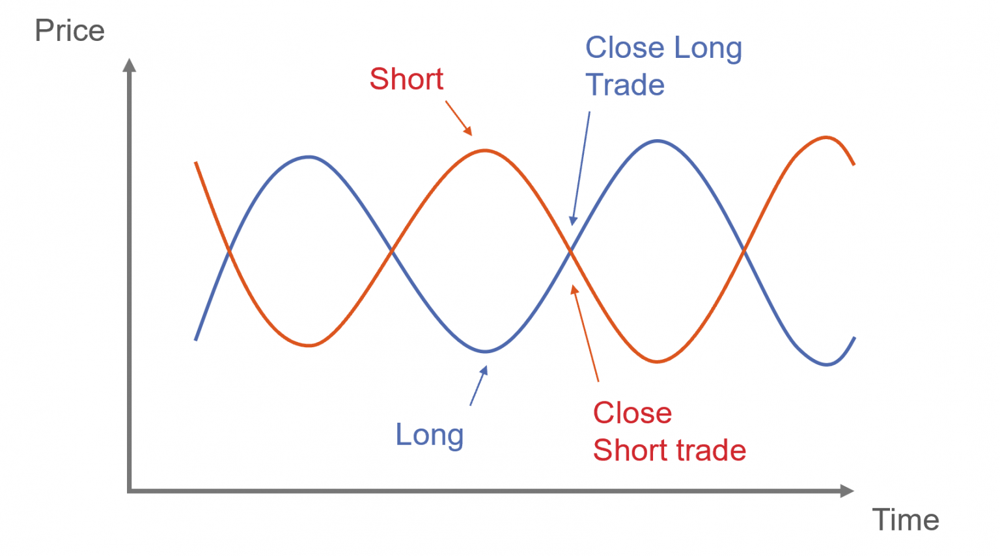

Algorithmic trading has fundamentally transformed financial markets, allowing traders to harness computational power to execute complex trading strategies with remarkable precision and speed. These automated strategies utilize advanced mathematical models and extensive data analysis to identify profitable opportunities and eliminate human error, thereby enhancing efficiency and execution.

Among these sophisticated strategies, pair trading has emerged as a notable approach. As a market-neutral strategy, pair trading focuses on exploiting the price relationship between two correlated assets. By taking advantage of temporary divergences in the prices of these assets, traders can potentially secure profits irrespective of overall market direction. This characteristic notably differentiates pair trading, as it aims to minimize exposure to systemic market risks and can perform under various market conditions, whether bullish, bearish, or neutral.



This article provides an exploration of pair trading within the context of algorithmic trading, covering its foundational principles, benefits, and limitations. Understanding pair trading involves unraveling the strategy’s mechanics, which include taking simultaneous long and short positions in asset pairs to capitalize on historical price correlations. Traders use statistical tools to monitor these correlations and identify opportune moments to enter or exit trades.

By examining pair trading's role in modern financial markets, we aim to present a comprehensive understanding of how algorithmic advancements have facilitated the strategy's implementation. We consider both the appeal of pair trading, notably its potential for diversification and risk management, and its challenges in execution and maintenance. As technologies continue to evolve, pair trading remains a dynamic strategy, offering significant opportunities for traders who can master its intricacies.

## Table of Contents

## Understanding Pair Trading

Pair trading is a sophisticated trading strategy that involves establishing two simultaneous positions in a pair of financial instruments that are expected to exhibit strong correlation. This strategy is market-neutral, which means it aims to profit from the relative movement between two correlated assets, irrespective of the overall market direction. The fundamental assumption underpinning pair trading is that any temporary divergence in the prices of these two correlated assets will eventually revert to their historical mean, offering an opportunity for financial gain.

The concept of pair trading can be traced back to its theoretical foundations in statistical [arbitrage](/wiki/arbitrage) and mean reversion dynamics. It relies on the historical correlation between two assets — typically stocks, though it can also extend to other financial instruments such as futures, currencies, and exchange-traded funds (ETFs). The core principle is that, while the prices of these assets may drift apart in the short term, their long-term price relationship will remain stable and predictable.

The implementation of [pair trading](/wiki/pair-trading) involves identifying pairs of assets with a long-standing correlation and entering into a long position on the underperforming asset while simultaneously taking a short position on the outperforming asset. The hope is that the assets' prices will converge, thus generating profits when this reversion to the mean occurs. 

Mathematically, the relationship between the prices of the two assets at any given time $t$ can be expressed using a spread, $S_t$, which is defined as:

$$
S_t = P_{a,t} - \beta P_{b,t}
$$

where:
- $P_{a,t}$ is the price of asset $a$ at time $t$.
- $P_{b,t}$ is the price of asset $b$ at time $t$.
- $\beta$ is a coefficient that represents the hedge ratio or the strength of the correlation between the two assets.

Advanced statistical techniques such as cointegration tests are employed to verify the stability and strength of the correlation between the assets. The strategy thus attempts to exploit statistical discrepancies between the two assets' price movements.

Pair trading's versatility across different asset classes, such as stocks, futures, currencies, and ETFs, enhances its attractiveness. However, traders must be vigilant in continually assessing the correlation dynamics and ensuring that the assumed statistical relationships hold over time. Proper execution of this strategy necessitates robust analytical tools and risk management frameworks to validate the potential for price convergence and to mitigate potential losses.

Overall, pair trading's distinct feature of being market neutral provides traders with an advantage by reducing systematic market risk exposure, while simultaneously offering the potential for profit across varying market conditions.

## The Mechanics of Pair Trading

Pair trading involves executing two simultaneous financial positions: buying (or going long) on an underperforming asset and selling (or going short) on an outperforming asset. This strategy hinges on identifying pairs of assets that historically show high correlation or cointegration.

Correlation measures the degree to which two securities move in relation to each other. It is calculated using the Pearson correlation coefficient ($\rho$), which ranges from -1 to 1. A value close to 1 implies a strong positive correlation, indicating that the assets generally move in the same direction. Conversely, a value near -1 suggests a strong negative correlation, meaning they often move in opposite directions. A correlation near 0 means there is little to no linear relationship between the asset prices. High correlation, however, is not sufficient for pair trading, as it only reflects a linear relationship.

Cointegration, on the other hand, is a more robust requirement for pair trading. Two time series are cointegrated if a linear combination of them results in a stationary series. This implies a long-term equilibrium relationship, which is essential for predicting that price deviations between the two assets will revert to the mean over time. The Engle-Granger two-step method is frequently used to test for cointegration: first, by running an ordinary least squares (OLS) regression to get the residuals, and then checking if these residuals are stationary.

Once a pair of suitable assets is determined, traders use statistical methods and technical analysis to monitor the spread between them. The spread is defined as the price difference between the two assets and is often monitored to identify trading opportunities. Significant deviations from the historical mean of the spread may trigger a trade. For instance, if the spread widens beyond a certain threshold, traders might short the asset that moved up and long the asset that moved down, assuming the spread will converge back to its mean.

Statistical tools like moving averages, Bollinger Bands, or z-scores are applied to time the trades effectively. The z-score, a statistical measurement of a value's relationship to the mean in a group of values, is commonly used in pair trading. It is calculated by:

$$
z = \frac{X - \mu}{\sigma}
$$

where $X$ is the current spread, $\mu$ is the mean of the spread, and $\sigma$ is the standard deviation of the spread. A z-score outside of a defined boundary (e.g., ±2) may indicate an overextension in the spread, suggesting an opportunity to place a trade.

Automating the monitoring and execution of these trades is common, as it ensures high precision and can handle a large [volume](/wiki/volume-trading-strategy) of trades. Computational algorithms can swiftly analyze market data, execute trades, and adjust positions to maintain the balance required by the pair trading strategy.

## Pair Trading in Algorithmic Trading

Algorithmic trading utilizes automated systems to execute pair trading strategies, enhancing both efficiency and precision. These systems operate by continuously monitoring market conditions, identifying opportunities, and executing trades with minimal human oversight. Pair trading algorithms focus on analyzing the correlations and cointegration between pairs of assets. The goal is to exploit temporary deviations in their historical price relationship to maximize profitability while minimizing risk.

To effectively implement pair trading within an algorithmic framework, the algorithms utilize statistical methods to assess the correlation coefficients and cointegration vectors of potential asset pairs. A high correlation coefficient indicates a strong relationship, suggesting a potential candidate for pair trading. Similarly, cointegration testing ensures that the underlying relationship between asset prices is stable over time, despite temporary fluctuations. Here's an example of how one might assess the correlation and cointegration in Python using libraries such as `pandas` and `statsmodels`:

```python
import numpy as np
import pandas as pd
import statsmodels.api as sm
from statsmodels.tsa.stattools import coint

# Load the historical price data of two assets
data = pd.DataFrame({
    'Asset1': [100, 102, 101, 105, 108, 110],
    'Asset2': [200, 202, 198, 210, 215, 212]
})

# Calculate the correlation between the two assets
correlation = data['Asset1'].corr(data['Asset2'])
print(f"Correlation: {correlation}")

# Perform cointegration test
coint_test = coint(data['Asset1'], data['Asset2'])
print(f"Cointegration test statistic: {coint_test[0]}")
print(f"p-value: {coint_test[1]}")
```

Automating pair trading strategies offers distinct advantages. The speed at which algorithms can execute trades is a crucial [factor](/wiki/factor-investing) in capturing fleeting market opportunities. This rapid execution contributes to the overall accuracy of trades, ensuring that orders are placed precisely as market conditions change. Furthermore, algorithmic systems are adept at handling large volumes of data and executing a significant number of trades simultaneously, which is pivotal in highly liquid and volatile markets.

In summary, by embedding pair trading within automated systems, traders can optimize the strategy's execution through continuous monitoring and adjustments. This automation not only ensures real-time responsiveness but also provides a scalable solution that can be applied to numerous asset pairs, thereby broadening the scope and potential profitability of pair trading strategies.

## Advantages and Challenges of Pair Trading

Pair trading is a versatile strategy that offers several advantages, notably its market-neutral nature. This inherent characteristic helps reduce exposure to systemic market risks, as profits rely on the relative price movements between two correlated assets rather than the direction of the broader market. In practice, this means that traders can potentially profit regardless of whether the market is trending upwards, downwards, or moving sideways.

One of the key advantages of pair trading is its adaptability to various market conditions. By focusing on the relative performance of two assets, traders can exploit price inefficiencies and divergences without being overly concerned about overall market trends. This flexibility allows pair trading to be suitable for a wide range of market environments, enhancing its attractiveness to traders seeking consistent returns.

However, pair trading is not without its challenges. Identifying suitable pairs is one of the primary obstacles faced by traders. The success of the strategy relies heavily on finding pairs of assets that exhibit historical correlation or cointegration. This requires rigorous statistical analysis and a deep understanding of the underlying economic or financial relationships that drive asset prices. Moreover, the correlations between assets can change over time due to shifts in market conditions, industry dynamics, or external events, necessitating continuous monitoring and adjustment.

Managing leverage is another significant challenge in pair trading. While leverage can amplify returns, it also increases the potential for losses. Traders must ensure that they have adequate risk management frameworks in place to mitigate the impact of adverse price movements. This often involves setting strict entry and [exit](/wiki/exit-strategy) rules, position sizing, and employing stop-loss orders to protect against unforeseeable market events.

Effective risk management is crucial to the success of pair trading strategies. Given the potential for correlations to break down and the unpredictability of market movements, traders must be vigilant in adjusting their strategies to accommodate evolving conditions. This requires utilizing sophisticated analytics and computational tools to continuously assess market data and refine trading models.

In conclusion, while pair trading presents distinct advantages by being market-neutral and adaptable, it demands careful pair selection, diligent risk management, and ongoing strategy reevaluation to navigate its complexities and maximize its potential in financial markets.

## Implementing Pair Trading Strategies

Implementing pair trading strategies requires a methodical approach involving several critical steps: selecting suitable asset pairs, determining entry and exit thresholds, and conducting thorough [backtesting](/wiki/backtesting). These steps ensure that the strategy is both sound and effective over various market conditions.

### Asset Selection

The first step in implementing a pair trading strategy is the selection of an appropriate pair of assets. Ideally, these assets should exhibit a historically high correlation or cointegration, as this relationship forms the basis of the pair trading strategy. Correlation measures the degree to which two assets move in relation to each other, while cointegration indicates a long-term equilibrium relationship. Cointegration is often preferred over mere correlation since it accounts for potential divergence and convergence over time.

### Determining Trading Thresholds

Once a pair is selected, traders must establish thresholds for opening and closing positions. A common method for setting these thresholds is using statistical measures such as z-score. The z-score quantifies the distance, in standard deviations, between the current spread and its historical mean. A typical rule might involve entering trades when the z-score exceeds a certain level, indicating divergence, and exiting when it reverts to zero, signifying convergence. The formula for the z-score can be expressed as:

$$

z = \frac{(spread - \mu)}{\sigma} 
$$

where:
- $spread$ is the price difference between the two assets,
- $\mu$ is the historical mean of the spread,
- $\sigma$ is the standard deviation of the spread.

### Backtesting

Robust backtesting is vital to validate the pair trading strategy before it is deployed in a live market environment. Backtesting involves applying the strategy to historical data to evaluate its performance and to refine trading rules. Key metrics analyzed during backtesting include returns, risk-adjusted returns, drawdowns, and the frequency of trades.

### Tools and Platforms

Modern trading platforms facilitate the design, testing, and execution of pair trading strategies. Python, with libraries such as NumPy, pandas, and statsmodels, is widely used for simulation and backtesting due to its powerful data handling and statistical analysis capabilities. An example of Python code to calculate the z-score is shown below:

```python
import numpy as np
import pandas as pd
from statsmodels.tsa.stattools import adfuller

# Function to compute z-score
def calculate_z_score(spread):
    mean = spread.mean()
    std = spread.std()
    return (spread - mean) / std

# Example dataframe
data = pd.DataFrame({
    'asset1': [100, 102, 104, 103, 105],
    'asset2': [101, 99, 105, 106, 107]
})

# Calculate spread
data['spread'] = data['asset1'] - data['asset2']

# Calculate z-score
data['z_score'] = calculate_z_score(data['spread'])

print(data[['spread', 'z_score']])
```

This code demonstrates a simple process for calculating the trading threshold based on the z-score, enabling traders to identify opportune moments for executing a pair trade.

By effectively combining asset selection, statistical analysis, and backtesting using modern tools, traders can implement successful pair trading strategies that are both adaptive and resilient to market changes.

## Conclusion

Pair trading remains a viable strategy within [algorithmic trading](/wiki/algorithmic-trading), providing significant opportunities for diversification and risk mitigation. Its core principle of being market-neutral offers a distinct advantage in reducing exposure to systemic risks. By relying on the relative price movements of two correlated assets rather than their absolute prices, traders can potentially capitalize on various market conditions, whether in uptrends, downtrends, or sideways movements.

The adaptability of pair trading is another factor that makes it attractive to traders and investors. As financial markets evolve, the ability to adjust to changing asset correlations and market environments is crucial. Pair trading allows for this flexibility, supporting a dynamic approach to trading strategies.

Despite the challenges associated with pair trading, such as identifying suitable asset pairs and managing correlation shifts, advancements in technology and data analysis are expected to enhance its effectiveness and accessibility. Machine learning and [artificial intelligence](/wiki/ai-artificial-intelligence) continue to develop, offering sophisticated tools for assessing market data, performing real-time analysis, and executing trades with greater precision. Automated systems, powered by these technologies, can handle immense volumes of data and perform complex computations faster than a human trader can, allowing for a more efficient implementation of pair trading strategies.

As data analytics continues to grow, traders will benefit from improved methods to quantify correlations, perform backtesting, and simulate various market scenarios. This evolution will likely make pair trading more robust and potentially more profitable, ensuring its place in the future of algorithmic trading.

## References & Further Reading

[1]: Gatev, E., Goetzmann, W. N., & Rouwenhorst, K. G. (2006). ["Pairs Trading: Performance of a Relative Value Arbitrage Rule."](https://www.nber.org/papers/w7032) The Review of Financial Studies, 19(3), 797-827.

[2]: Avellaneda, M., & Lee, J. H. (2010). ["Statistical Arbitrage in the U.S. Equities Market."](https://papers.ssrn.com/sol3/papers.cfm?abstract_id=1153505) Quantitative Finance, 10(7), 761-782.

[3]: Vidyamurthy, G. (2004). ["Pairs Trading: Quantitative Methods and Analysis."](https://www.wiley.com/en-us/Pairs+Trading%3A+Quantitative+Methods+and+Analysis-p-9780471460671) John Wiley & Sons.

[4]: Engle, R. F., & Granger, C. W. J. (1987). ["Co-Integration and Error Correction: Representation, Estimation, and Testing."](https://www.jstor.org/stable/1913236?read-now=1) Econometrica, 55(2), 251-276.

[5]: Elliott, R. J., van der Hoek, J., & Malcolm, W. P. (2005). ["Pairs Trading."](http://stat.wharton.upenn.edu/~steele/Courses/434/434Context/PairsTrading/PairsTradingQFin05.pdf) Quantitative Finance, 5(3), 257-269.