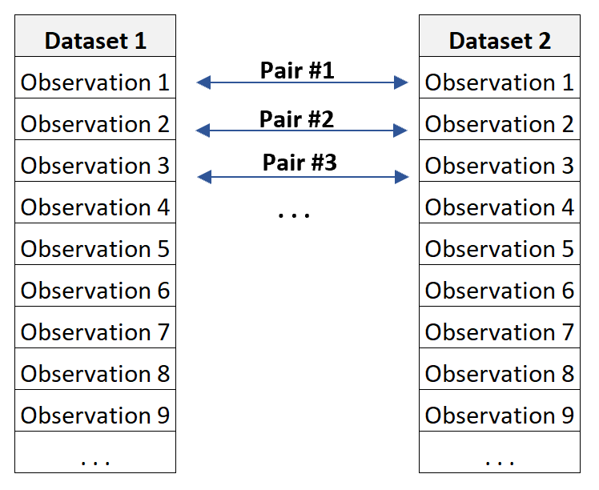

## Table of Contents

## What are paired shares?

Paired shares are a way for companies to raise money by selling two types of stocks together. One type of stock is usually common stock, which gives the owner voting rights and a chance to get dividends. The other type is preferred stock, which often doesn't give voting rights but offers a fixed dividend and priority over common stock if the company goes bankrupt.

Companies use paired shares to attract different kinds of investors. Some investors might want the steady income from preferred stock, while others might want the potential for growth and voting rights that come with common stock. By offering both types together, the company can appeal to a wider range of people and raise more money.

## How do paired shares work?

Paired shares work by selling two different types of stocks together as a single unit. One part of the pair is usually common stock, which lets the owner vote on company decisions and possibly get dividends. The other part is preferred stock, which usually doesn't let you vote but gives you a fixed dividend and a better chance to get your money back if the company goes bankrupt. When you buy paired shares, you get both types at the same time, and they can't be separated.

Companies use paired shares to get money from different kinds of investors. Some people like the steady income from preferred stock, while others want the chance to grow their money and have a say in the company with common stock. By offering both together, the company can attract more investors and raise more money. This can help the company grow or pay off debts.

## What is the purpose of issuing paired shares?

The main reason companies issue paired shares is to raise money from different types of investors. Some investors want steady income, while others want to grow their money and have a say in the company. By offering paired shares, which include both common and preferred stocks, the company can attract both kinds of investors. This helps the company get more money, which they can use to grow their business or pay off debts.

Paired shares work by selling two different types of stocks together as one unit. You can't separate them. One part is common stock, which gives you voting rights and a chance to get dividends. The other part is preferred stock, which usually doesn't give you voting rights but offers a fixed dividend and priority if the company goes bankrupt. By offering both types together, the company can appeal to a wider range of people and raise more money.

## Can you provide examples of companies that have used paired shares?

One example of a company that used paired shares is General Motors (GM). In 2010, after coming out of bankruptcy, GM issued paired shares to raise money. They offered common stock and mandatory convertible preferred stock together. This helped GM attract investors who wanted both the potential for growth from common stock and the steady income from preferred stock.

Another example is Citigroup. In 2009, during the financial crisis, Citigroup issued paired shares to raise capital. They offered common stock and trust preferred securities as a pair. This allowed Citigroup to appeal to investors looking for different types of returns and helped the company stabilize its finances during a tough time.

## What are the benefits of paired shares for companies?

Paired shares help companies raise money from different kinds of investors. Some people want to make money over time and have a say in the company, so they like common stock. Others want a steady income and less risk, so they like preferred stock. By selling both types of stock together, companies can attract both groups of investors. This means they can get more money to grow their business or pay off debts.

Another benefit is that paired shares can make the company look more stable and attractive to investors. When a company offers both common and preferred stock, it shows that they are thinking about different investors' needs. This can make investors feel more confident about the company's future. Plus, if the company is going through a tough time, like a financial crisis, paired shares can help them raise money quickly and keep the business running smoothly.

## What are the potential risks or drawbacks of paired shares for investors?

Paired shares can be risky for investors because they come with two types of stocks that you can't separate. If you want to sell just one part of the pair, you can't do it. This means you're stuck with both, even if one part isn't doing well. For example, if the common stock goes down in value but the preferred stock stays the same, you can't just sell the common stock to cut your losses.

Another risk is that preferred stock might not grow in value as much as common stock. While preferred stock gives you a steady income, it usually doesn't offer the same chance for big gains that common stock does. If the company does really well, the common stock might go up a lot, but the preferred stock might not change much. This can be frustrating if you're hoping to make a lot of money.

Lastly, there's the risk of the company not doing well. If the company goes bankrupt, the preferred stock gives you a better chance to get your money back than common stock. But if the company is really in trouble, even preferred stock might not be enough to protect your investment. So, it's important to think about the company's health before buying paired shares.

## How do paired shares affect voting rights?

Paired shares include both common stock and preferred stock. Common stock usually gives you the right to vote on important company decisions, like who should be on the board of directors or whether to approve big changes in the company. When you buy paired shares, you get this voting power from the common stock part of the pair.

On the other hand, preferred stock usually doesn't give you voting rights. This means that even though you own part of the company through the preferred stock, you don't get to vote on company decisions. So, when you buy paired shares, you have voting rights from the common stock, but not from the preferred stock.

## What regulatory considerations should companies be aware of when issuing paired shares?

When companies want to issue paired shares, they need to think about the rules set by the Securities and Exchange Commission (SEC) and other financial regulators. The SEC has rules about how companies can sell stocks and what they need to tell investors. When issuing paired shares, companies must make sure they follow these rules. They need to give clear information about both the common and preferred stocks in the pair, so investors know exactly what they're buying. This includes details about voting rights, dividends, and what happens if the company goes bankrupt.

Also, companies need to think about the rules from stock exchanges where they want to list their paired shares. Each exchange has its own rules about what kinds of stocks can be traded and how they should be sold. Companies must make sure their paired shares fit these rules. If they don't, the shares might not be allowed on the exchange, which would make it harder to sell them to investors. By following all these rules, companies can make sure they issue paired shares the right way and avoid any legal problems.

## How do paired shares impact a company's capital structure?

Paired shares change a company's capital structure by adding both common and preferred stocks at the same time. When a company issues paired shares, it gets money from investors who buy these shares. This money can help the company grow or pay off debts. The capital structure shows how a company is financed, and by adding paired shares, the company mixes different types of financing. This mix can make the company look more stable and attractive to different kinds of investors.

The mix of common and preferred stocks in paired shares can also affect how the company manages its money. Common stock lets investors vote on big decisions, so it gives them a say in the company. Preferred stock, on the other hand, usually doesn't let investors vote but gives them a steady income and a better chance to get their money back if the company goes bankrupt. By having both types of stocks, the company can balance the need for growth with the need for stability. This balance can help the company plan better for the future and manage its finances more effectively.

## What are the accounting implications of issuing paired shares?

When a company issues paired shares, it affects how they record money in their books. Paired shares include both common and preferred stocks, so the company needs to keep track of both types separately. The money they get from selling paired shares is split between the common stock and preferred stock accounts. This means the company's total equity goes up, but it's important to show the right amounts for each type of stock. The company also needs to think about any costs they paid to issue the shares, like fees to banks or lawyers, and subtract these costs from the money they got.

The accounting for paired shares also involves thinking about dividends. Preferred stock usually pays a fixed dividend, so the company needs to set aside money to pay these dividends regularly. This can affect the company's cash flow and how much money they have left for other things. On the other hand, common stock dividends can change, so the company has more flexibility with those. By keeping good records of both types of stocks and their dividends, the company can make sure they're following the rules and showing a clear picture of their finances.

## How do paired shares influence corporate governance?

Paired shares can change how a company is run because they include both common and preferred stocks. Common stock gives investors the right to vote on big decisions, like who should be on the board of directors or whether to approve big changes in the company. This means that when a company issues paired shares, the people who buy them can have a say in how the company is managed. This can make the company more democratic because more people get to vote on important things.

On the other hand, preferred stock usually doesn't give voting rights. This means that even though investors own part of the company through the preferred stock, they don't get to vote on company decisions. So, when a company issues paired shares, it creates a mix of investors with and without voting power. This can affect how decisions are made because the company needs to think about what both groups of investors want. Balancing the needs of voters and non-voters can make corporate governance more complicated but also more fair.

## What future trends might we see regarding the use of paired shares?

In the future, more companies might use paired shares to get money from different kinds of investors. As the economy changes, companies will look for new ways to raise money. Paired shares let companies attract both people who want to grow their money with common stock and people who want steady income with preferred stock. This can help companies get more money to grow or pay off debts, especially during tough times like financial crises.

Another trend we might see is that rules about paired shares could change. Governments and financial regulators might make new rules to make sure companies use paired shares fairly and tell investors everything they need to know. These rules could affect how companies issue paired shares and how investors buy them. As a result, companies will need to be careful to follow all the rules and keep investors happy.

## References & Further Reading

[1]: Perold, A.F., & Sharpe, W.F. (1988). ["Dynamic Strategies for Asset Allocation."](https://www.jstor.org/stable/4479087) Financial Analysts Journal, 44(1), 6-12.

[2]: ["Adaptive Markets: Financial Evolution at the Speed of Thought"](https://www.amazon.com/Adaptive-Markets-Financial-Evolution-Thought/dp/0691135142) by Andrew W. Lo

[3]: Chan, E. P. (2013). ["Algorithmic Trading: Winning Strategies and Their Rationale."](https://github.com/ftvision/quant_trading_echan_book) John Wiley & Sons.

[4]: Gebbie, T., & Wilcox, D. (2017). ["Pairs trading on the JSE using a combined cointegration and distance approach in a high frequency setting."](https://pmc.ncbi.nlm.nih.gov/articles/PMC9315098/) European Journal of Operational Research, 262(2), 679-692.

[5]: Hasbrouck, J. (2009). ["Trading Costs and Returns for U.S. Equities: Estimating Effective Costs from Daily Data."](https://pages.stern.nyu.edu/~jhasbrou/Research/GibbsCurrent/HasbrouckJF.pdf) The Journal of Finance, 64(3), 1445-1477.