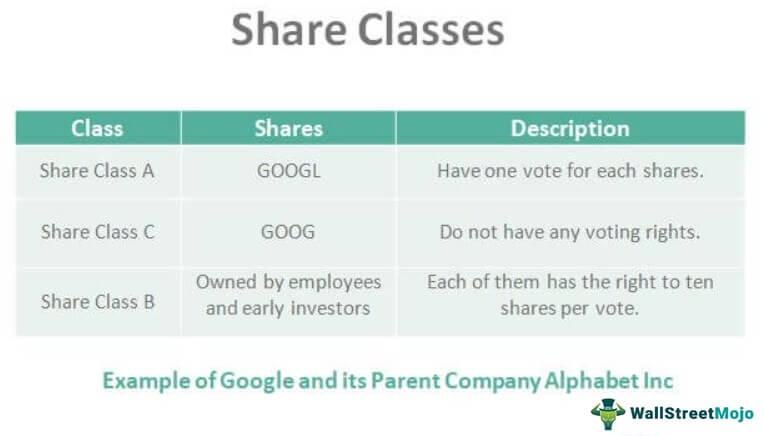

The world of stock trading has evolved significantly over the years with the introduction of technology and advanced mathematical models. Among the many strategies available to investors, paired shares and algorithmic trading stand out as sophisticated methods aimed at optimizing returns. This article will explore a stock trading investment strategy that incorporates paired shares and algorithmic trading, offering an intricate look at how these strategies can be employed effectively.

Paired shares, also known as "Siamese Shares" or "Stapled Stock," involve the trading of two separate companies' stocks as a single unit under one corporate management. Typically, one company focuses on generating income through dividends, while the other emphasizes capital appreciation. This dual approach allows investors to benefit from both income and growth, a compelling attribute for those looking to diversify their stock portfolio.



On the other hand, algorithmic trading makes use of complex algorithms to execute trades based on predefined criteria. This technology allows for rapid trade executions at optimal times, minimizing human errors and emotional biases. When combined with the paired shares strategy, algorithmic trading can enhance trading efficiency and profitability, offering a streamlined approach to handling investments.

The synergy between paired shares and algorithmic trading offers a powerful investment strategy that can be advantageous in various market conditions. By employing algorithmic trading to manage the timing and execution of trades involving paired shares, investors can potentially maximize returns while maintaining efficiency and managing risk. However, like any strategy, this approach is not without its challenges, including market volatility and technological risks.

This article will examine the mechanics behind paired shares and algorithmic trading, the benefits of combining these two strategies, and the potential pitfalls to watch out for. Through real-world examples and case studies, we will highlight how investors can leverage this sophisticated strategy to their advantage, while also emphasizing the importance of understanding the associated risks.

## Table of Contents

## Understanding Paired Shares

Paired shares refer to a financial structure where the stocks of two separate companies are traded as a single unit under one corporate management. This arrangement is often identified by terms such as "Siamese Shares" or "Stapled Stock." The main feature of paired shares is that they are sold and traded together, usually represented by a single stock certificate. This means when an investor purchases a unit of paired shares, they simultaneously invest in both companies involved.

In most paired shares structures, one company is structured to focus on generating income through dividends. Typically, this company operates in a sector or market that provides stable and predictable cash flows, such as utilities or real estate. Investors looking for regular income streams find this component attractive due to its dividend payments.

Conversely, the second company in this pairing is typically geared towards capital appreciation. It usually operates in industries where growth potential is significant, such as technology or emerging markets. This company reinvests its earnings into business expansion and development rather than issuing dividends. Consequently, it appeals to investors seeking long-term growth and increased stock value.

The appeal of paired shares lies in their ability to offer a balanced investment approach, providing exposure to both income and growth opportunities. By purchasing paired shares, investors inherently diversify their portfolio within a single investment. The combination of these two companies in one share can mitigate risk as the income from one company can offset potential underperformance by the other.

Examples of companies that have utilized paired shares structures in the past include high-profile real estate and development firms. In the 1980s and 1990s, paired shares were popular particularly in the real estate sector, with companies like the Florida-based hotel group, Carnival Hotels and Resorts, adopting this structure to capitalize on both stable rental revenues and dynamic property development projects. More recently, certain financial and utility firms have shown interest in considering paired structures to attract a broader investor base.

The paired shares approach provides financial architects with a strategic tool to align disparate business units while offering a diversified investment vehicle to the market. As financial markets evolve, the role and structure of paired shares may continue to adapt, providing value to investors keen on both income stability and capital growth.

## How Paired Shares Function

Investing in paired shares means purchasing joint stocks of two distinct companies, managed collectively. This structure provides investors with dual benefits—exposure to both income generation and capital growth. When trading paired shares, investors buy them as a single security on stock exchanges, simplifying transactions and streamlining portfolio management.

Each paired share typically consists of two distinct components: one oriented towards income through dividend payments, and another towards capital appreciation. The income-focused component is often a stable, dividend-paying company, while the growth-focused company is more likely to reinvest earnings to drive stock value increase. This synergy allows investors to balance the potential for income and appreciation within one unified package.

For instance, consider an investor interested in a paired share comprising Company A, which focuses on yielding steady dividends, and Company B, which targets growth in stock value. The investor receives a combined stock certificate for this paired share. This certificate represents their stake in both companies, allowing the investor to benefit from Company A’s dividends and Company B’s capital gains.

Financially, paired shares offer a diversified approach to investment by allocating resources into varied sectors or business models under a single investment instrument. They provide an inherent hedge by coupling the predictable returns from dividends with potentially higher-risk growth investments. This distribution can mitigate market [volatility](/wiki/volatility-trading-strategies) impacts, offering a buffer during economic fluctuations.

An advantage for investors lies in the ease of managing paired shares. With a unified stock certificate, trading becomes straightforward, reducing complexities compared to holding separate stocks. This simplified management is particularly beneficial for retail investors who may lack the capacity for active, detailed oversight of multiple individual securities.

However, it is essential to assess the individual components of a paired share. Each company's performance, industry sector, and market dynamics independently affect the overall value and predictable returns of paired shares. Investors must evaluate these factors before committing to ensure alignment with their financial goals and risk appetite. Thus, paired shares can be seen as a strategic tool for investors seeking a balanced portfolio with diversified exposure under a consolidated management structure.

## Algorithmic Trading in Depth

Algorithmic trading involves using computer algorithms to automate the process of executing stock trades. These algorithms are designed to make trading decisions based on specific criteria, such as timing, price, or quantity, and they can process large amounts of data at speeds unattainable by human traders. This rapid execution capability reduces the likelihood of human error and emotional biases that can negatively impact trading outcomes.

The core advantage of [algorithmic trading](/wiki/algorithmic-trading) lies in its ability to perform trades at optimal times by analyzing market conditions, which enhances trading efficiency. By continuously assessing historical and real-time data, algorithms can identify patterns and predict market movements more accurately. For example, they can be programmed to execute buy or sell orders when a stock crosses a certain price threshold or when particular technical indicators align.

Incorporating algorithmic trading into a strategy involving paired shares can significantly enhance both efficiency and profitability. Since paired shares link the stocks of two different companies under one management, algorithms can manage the dynamic relationship between these stocks to optimize returns. Algorithms might, for instance, simultaneously execute complementary trades in the two paired shares to exploit [arbitrage](/wiki/arbitrage) opportunities, balancing the income potential from dividends with capital appreciation from stock price movements.

Algorithmic trading strategies can vary in complexity, ranging from simple predefined rule-based systems to advanced predictive models utilizing [machine learning](/wiki/machine-learning) and [artificial intelligence](/wiki/ai-artificial-intelligence). A basic example might involve a strategy that buys or sells based on moving averages or other technical indicators. More complex systems might deploy [statistical arbitrage](/wiki/statistical-arbitrage) or employ neural networks to model market behavior.

The relevance of algorithmic trading has grown substantially in modern markets due to the increased data availability and computational power. Algorithms can scan multiple markets and securities rapidly, identifying opportunities that are invisible to human traders. This capability is particularly valuable in high-frequency trading, where thousands of trades are executed within seconds, exploiting even the smallest price discrepancies.

To illustrate, consider a Python implementation for a simple moving average crossover strategy, which could be a starting point for more elaborate algorithmic programs:

```python
import numpy as np
import pandas as pd
import yfinance as yf  # For more datasets, visit: https://paperswithbacktest.com/datasets

# Download historical data for a stock
data = yf.download('AAPL', start='2020-01-01', end='2023-01-01')
data['SMA_short'] = data['Close'].rolling(window=20, min_periods=1).mean()
data['SMA_long'] = data['Close'].rolling(window=50, min_periods=1).mean()

# Create trading signals
data['Signal'] = 0
data['Signal'][data['SMA_short'] > data['SMA_long']] = 1
data['Position'] = data['Signal'].diff()

# Output some of the generated signals for visual inspection
print(data[['Close', 'SMA_short', 'SMA_long', 'Signal', 'Position']].tail())
```

In this example, the algorithm calculates the short-term and long-term simple moving averages (SMA) and generates trading signals based on their crossover points. Such strategies can be expanded by incorporating additional indicators or optimizing parameters through [backtesting](/wiki/backtesting).

In conclusion, algorithmic trading plays a vital role in modern financial markets, enhancing both efficiency and decision-making through the automation and high-speed processing of trading operations. As technology and methodologies continue to evolve, the integration of algorithmic trading with strategies like paired shares will likely remain a critical aspect of sophisticated trading approaches.

## Combining Paired Shares with Algo Trading

The synergy between paired shares and algorithmic trading offers investors a refined strategy to navigate the stock market. By leveraging algorithmic trading, investors can effectively manage the intricate timing and execution of trades involving paired shares, thus optimizing their investment returns. Algorithmic trading utilizes advanced mathematical models and computational power to execute trades at optimal moments, mitigating human error and emotional biases.

A key advantage of this combination is the efficiency gained in execution. Algorithms can process vast amounts of market data rapidly and identify opportunities faster than any human trader. This speed is crucial when dealing with paired shares, where the valuation of two companies must be considered simultaneously. Algorithms can be programmed to monitor the price movements and correlation between the paired stocks continuously, executing buy or sell orders within milliseconds to exploit any market inefficiencies.

Risk management is another significant benefit. Algorithmic strategies can be designed to adhere to strict risk parameters, ensuring that the investment remains aligned with the investor's risk tolerance. For paired shares, this might include maintaining a balanced exposure to both income-generating and growth-oriented stocks, adjusting the position size as needed to maintain the desired risk profile.

Despite its advantages, this strategy is not without challenges. Investors must be aware of potential pitfalls such as algorithmic trading errors, which might arise from flaws in the code or unexpected market conditions. Furthermore, the [liquidity](/wiki/liquidity-risk-premium) of paired shares can pose a risk if the market for one of the paired companies is less active, potentially leading to wider spreads and increased costs.

Case studies highlight the effective application of this strategy. For instance, let's consider a scenario involving a real estate investment trust (REIT) paired with a property development company. An algorithm designed to trade this pair might identify an opportunity where the REIT's price lags behind the real estate market movements that justify a rise—prompting a purchase of the REIT shares. Concurrently, the algorithm could sell the property development company's shares if they were overperforming against historical trends relative to real estate indices. By constantly analyzing historical data and real-time fluctuations, the algorithm ensures that the investor's portfolio remains optimally balanced.

In conclusion, the integration of algorithmic trading with paired shares can offer a dynamic and efficient investment strategy, combining high-speed execution with sophisticated risk management. However, it demands diligence in algorithm development and maintenance to address potential market changes and technical glitches. As the financial landscape continues to evolve, investors employing such strategies should aim for continuous learning and adaptability.

## Challenges and Risks

Paired shares, along with algorithmic trading, offer numerous advantages to investors, but they also present a unique set of challenges and risks that must be navigated with care.

Market volatility profoundly impacts the trading of paired shares. These shares, by their nature, involve two separate companies, each subject to its own market conditions. Consequently, the intrinsic value of paired shares can be more volatile due to the dual exposure. To mitigate this risk, investors can employ strategies such as diversification to balance the volatility across different asset classes or sectors. Additionally, employing stop-loss orders could help safeguard against unexpected sharp declines in share prices.

Algorithmic trading, while advantageous for its speed and efficiency, is not without its drawbacks. One of the primary concerns is algorithmic errors or bugs, which can significantly affect the execution of trades. For example, coding errors may lead to incorrect trade placements or, in worst-case scenarios, substantial financial losses. Regularly updating and testing algorithms can help prevent these issues, and incorporating machine learning techniques can enhance the adaptability and accuracy of trading strategies.

Liquidity is another critical [factor](/wiki/factor-investing) to consider with paired shares. Because these shares are traded as a single security encompassing two different companies, they may not always have the same level of market liquidity as traditional stocks. This can lead to difficulty in entering or exiting positions without affecting the share price. To mitigate liquidity risks, investors should assess the trading [volume](/wiki/volume-trading-strategy) and bid-ask spreads, ensuring that there is sufficient market activity to support their investment strategy.

Continuous learning and staying abreast of market trends are essential for successfully managing these risks. The landscape of stock trading is ever-evolving, and strategies must adapt to keep pace. Engaging in educational resources, following market analyses, and potentially collaborating with financial experts can provide investors with the insights needed to make informed decisions. Tools such as financial news aggregators, economic indicators, and technical analysis software can be instrumental in staying updated with current market conditions.

In conclusion, while the combination of paired shares and algorithmic trading provides substantial growth opportunities, it is imperative for investors to thoroughly understand and address the associated risks. Whether considering market volatility, algorithm errors, or liquidity issues, proactive risk management and a commitment to continuous learning are vital components of a successful investment strategy.

## Conclusion

The combination of paired shares and algorithmic trading represents a sophisticated approach to stock trading. This strategy merges the growth potential of two different companies into one trading unit, allowing investors to balance their portfolio between income and capital appreciation. Simultaneously, algorithmic trading automates and optimizes the execution of these trades, minimizing human error and emotional decision-making.

However, investors must remain cautious about the inherent risks involved in this strategy. Market volatility, algorithmic errors, and liquidity issues of paired shares can pose significant challenges. Additionally, sudden market shifts or regulatory changes can impact the effectiveness of both paired share structures and algorithmic models. Therefore, continuous learning and staying informed about market trends are crucial for success in this domain.

For investors willing to invest the time and effort, this combination offers promising opportunities for maximizing returns. By effectively managing risks and leveraging the benefits of both paired shares and algorithmic trading, traders can navigate the stock market with greater precision.

Potential investors are advised to deepen their understanding of these strategies. Engaging with educational resources, staying updated with market developments, and consulting financial experts are imperative steps to harness the full potential of paired shares and algorithmic trading. The synergy of these approaches, when executed with diligence and insight, can lead to successful investment outcomes.

## References & Further Reading

[1]: Perold, A.F., & Sharpe, W.F. (1988). ["Dynamic Strategies for Asset Allocation."](https://www.jstor.org/stable/4479087) Financial Analysts Journal, 44(1), 6-12.

[2]: ["Adaptive Markets: Financial Evolution at the Speed of Thought"](https://www.amazon.com/Adaptive-Markets-Financial-Evolution-Thought/dp/0691135142) by Andrew W. Lo

[3]: Chan, E. P. (2013). ["Algorithmic Trading: Winning Strategies and Their Rationale."](https://github.com/ftvision/quant_trading_echan_book) John Wiley & Sons.

[4]: Gebbie, T., & Wilcox, D. (2017). ["Pairs trading on the JSE using a combined cointegration and distance approach in a high frequency setting."](https://pmc.ncbi.nlm.nih.gov/articles/PMC9315098/) European Journal of Operational Research, 262(2), 679-692.

[5]: Hasbrouck, J. (2009). ["Trading Costs and Returns for U.S. Equities: Estimating Effective Costs from Daily Data."](https://pages.stern.nyu.edu/~jhasbrou/Research/GibbsCurrent/HasbrouckJF.pdf) The Journal of Finance, 64(3), 1445-1477.