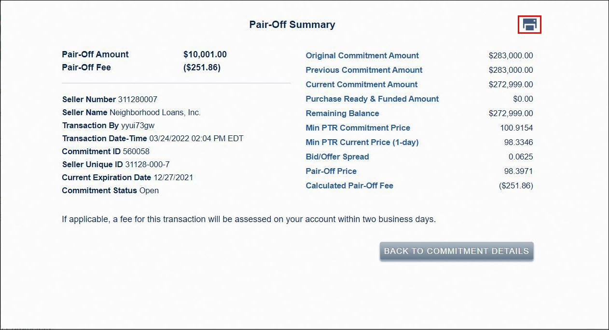

The financial world is undergoing continuous transformation, driven by innovative strategies and emerging concepts which significantly influence investment decisions. Among these, algorithmic trading and economic strategies are pioneering advancements that enhance the efficiency of financial operations. This article focuses on exploring these economic strategies, with particular emphasis on the novel concept of a 'pairoff' in financial operations.

Algorithmic trading, which utilizes complex algorithms to automate trading processes, is becoming increasingly central in financial markets. This approach prioritizes speed and precision, allowing traders to implement strategies across global markets effectively. An understanding of these mechanisms is essential for investors and traders aiming to optimize their approaches in today's dynamic market landscape.



One concept gaining recognition is the 'pairoff' transaction, designed to streamline financial operations and mitigate risks associated with securities transactions. By offsetting open short and long positions without requiring physical delivery, pairoffs reduce settlement risks and can lead to increased operational efficiency. Leveraging strategies such as these can substantially enhance the market strategies of investors and provide them with a competitive edge in a complex market environment.

This article will reference established financial theories to provide a comprehensive understanding of these contemporary strategies. By evaluating and integrating these advanced concepts, investors and traders can expect to achieve greater efficiency and profitability, navigating the complexities of modern financial markets with improved confidence and insight.

## Table of Contents

## Understanding the Pairoff in Financial Operations

A pairoff is a vital mechanism within financial operations aimed at mitigating settlement risks by offsetting open short and long positions without the need for physical delivery of securities. The primary goal is to streamline financial transactions and minimize exposure to market uncertainties that can arise during the settlement period.

Originally, pairoff transactions were predominantly utilized between brokerage firms. These transactions facilitated the cash settlement of differences in opposing trade positions, thereby eliminating the need for securities to change hands physically. This approach significantly reduces logistical costs and market impact since it avoids the complexities associated with the actual transfer of securities.

It is important to distinguish pairoff transactions from market manipulation. While pairoffs aim to offset genuine trade imbalances and enhance operational efficiency, market manipulation involves deceitful practices designed to create false or misleading impressions about market activity. Such practices are illegal and undermine market integrity.

Understanding the core principles of pairoff transactions is crucial for their incorporation into automated financial trading systems. By enabling the electronic offsetting of positions, these transactions can be seamlessly integrated into [algorithmic trading](/wiki/algorithmic-trading) platforms, allowing for more efficient trade executions that reduce operational risk and improve overall market stability. This foundational knowledge aids in leveraging technological advancements to optimize financial strategies, making feng operations more agile and responsive to market dynamics.

## Algorithmic Trading Strategies

Algorithmic trading utilizes advanced computer programs to make rapid trading decisions based on pre-established criteria. This approach fundamentally transforms trading by leveraging algorithms to initiate trades autonomously, thereby enhancing efficiency and reducing latency. A pivotal component of this is the pairoff strategy, which perfectly complements algorithmic trading by offsetting open short and long positions, facilitating streamlined operations without the requirement for physical delivery of securities.

Platforms deploying algorithmic trading capitalize on data-driven insights, employing sophisticated models to execute trades often devoid of human intervention. This eliminates emotional biases and allows for consistent strategy application. By incorporating pairoff strategies, these platforms can efficiently manage and mitigate risks associated with open positions, fostering operational efficiency.

Key algorithmic trading strategies predominantly include trend-following, [arbitrage](/wiki/arbitrage), and market-making. Trend-following strategies analyze market [momentum](/wiki/momentum) to identify a directional movement, making buy or sell decisions aligned with prevailing trends. Mathematically, trend-following might involve evaluating moving averages:

$$
\text{Signal} = \text{Short-Term Moving Average} - \text{Long-Term Moving Average}
$$

Arbitrage exploits price discrepancies across different markets or instruments, enabling profit without directional market exposure. A simple Python snippet for price comparison in an arbitrage strategy could be as follows:

```python
def arbitrage_opportunity(price_a, price_b, threshold):
    if abs(price_a - price_b) >= threshold:
        print("Arbitrage opportunity detected!")
    else:
        print("No arbitrage opportunity at the moment.")
```

Market-making involves providing [liquidity](/wiki/liquidity-risk-premium) to markets by simultaneously quoting both buy and sell prices, enabling smooth market flow. Algorithmic trading systems optimize these market-making strategies by ensuring constant price updating and balance maintenance, which is crucial in fast-evolving market conditions.

Integrating pairoff transactions within these algorithmic strategies elevates trading efficiency, as it ensures seamless execution and minimizes the complexities of settlement. Consequently, traders and investors are equipped with a competitive advantage in managing their portfolios within intensely competitive markets. This integration not only amplifies returns but also upholds risk management, essential for sustainable trading success.

## Economic and Financial Gains from Algo Trading

Algorithmic trading, often abbreviated as algo trading, presents a transformative approach to financial markets, providing significant economic and financial gains. One of its primary advantages is speed, as algorithms can analyze and execute trades within milliseconds, far quicker than human traders. This speed drastically increases the number of trading opportunities that can be captured, thereby enhancing overall market efficiency. Moreover, the accuracy offered by algorithmic systems reduces the margin for error compared to human execution, improving the precision of trades.

A notable feature of algo trading is its ability to harness both historical and real-time data, allowing traders to backtest strategies robustly before executing them in live markets. This process involves simulating strategies over historical data to evaluate performance. Traders can optimize parameters and refine strategies to ensure they are resilient to different market conditions. In Python, a simple backtest can be conducted using libraries like pandas and numpy, enabling traders to efficiently iterate and refine their approaches.

```python
import pandas as pd
import numpy as np

# Sample backtesting function
def simple_moving_average_backtest(prices, short_window, long_window):
    signals = pd.DataFrame(index=prices.index)
    signals['price'] = prices
    signals['short_mavg'] = prices.rolling(window=short_window, min_periods=1, center=False).mean()
    signals['long_mavg'] = prices.rolling(window=long_window, min_periods=1, center=False).mean()
    signals['signal'] = 0.0
    signals['signal'][short_window:] = np.where(signals['short_mavg'][short_window:] > signals['long_mavg'][short_window:], 1.0, 0.0)  
    signals['positions'] = signals['signal'].diff()
    return signals
```

Economically, algorithmic trading offers substantial scalability, enabling the execution of multiple strategies simultaneously without incurring significant additional costs. The automation reduces the opportunity cost of missed trades and allows for the efficient allocation of capital across different market segments.

Furthermore, implementing pairoff strategies within algorithmic systems can enhance market liquidity and facilitate efficient price discovery. A pairoff involves offsetting open short and long positions to minimize settlement risks. By incorporating this strategy, algo trading systems can provide liquidity more consistently and help stabilize prices, thereby contributing to overall market stability.

In conclusion, algorithmic trading, particularly when paired with pairoff strategies, offers considerable economic and financial advantages. It enhances the speed and accuracy of trade execution, allows for robust strategy development through [backtesting](/wiki/backtesting), and improves market liquidity and stability, making it an indispensable tool in modern financial markets.

## Challenges and Considerations

Despite its many advantages, algorithmic trading is accompanied by several challenges and considerations that must be navigated to ensure success and compliance.

One significant challenge is the technical issues that can arise with algorithmic trading systems. These systems require robust and reliable technology infrastructures since any delays or failures in execution can lead to significant financial losses. Ensuring software and hardware reliability, as well as implementing effective risk management protocols, is crucial.

Another critical [factor](/wiki/factor-investing) is liquidity concerns. Algorithmic trading strategies often depend on the availability of liquidity to enter and [exit](/wiki/exit-strategy) positions efficiently. Limited liquidity can result in slippage, where the final execution price differs from the intended price, reducing profitability. Traders must incorporate measures to predict and mitigate slippage in high-frequency trading strategies.

Market [volatility](/wiki/volatility-trading-strategies) also poses a challenge. Algorithms designed to operate under specific market conditions may not perform as expected during times of extreme volatility. This can lead to substantial deviations from predicted outcomes and potentially large losses. Developing robust models that can adapt to changing market environments is essential for minimizing these risks.

Transaction costs must be carefully considered, as they can erode the profits from algorithmic trading strategies. Costs such as brokerage fees, bid-ask spreads, and other execution-related expenses can collectively impact the overall profitability of trades, particularly in high-frequency contexts. Therefore, optimizing the balance between transaction costs and potential gains is critical.

Overfitting is another concern in algorithmic trading. This occurs when a strategy is tailored too closely to historical data, capturing patterns that may not hold in future markets. Such models may perform well in backtesting but fail in live trading environments. To avoid overfitting, traders should employ cross-validation techniques and maintain a focus on explanatory variables that [carry](/wiki/carry-trading) predictive power.

Lastly, the regulatory environment surrounding algorithmic trading is complex and continually evolving. Market participants must possess a comprehensive understanding of relevant regulations to maintain ethical practices and compliance. This includes monitoring regulatory changes and ensuring that trading strategies adhere to legal standards such as those set by regulatory bodies like the U.S. Securities and Exchange Commission (SEC) and the European Securities and Markets Authority (ESMA).

In summary, while algorithmic trading provides significant benefits in terms of speed, efficiency, and accuracy, these strategies come with unique challenges. Successful implementation requires addressing technical issues, managing liquidity and volatility risks, optimizing transaction costs, preventing overfitting, and ensuring regulatory compliance.

## Conclusion

Economic strategies that incorporate financial operations like pairoffs can significantly enhance the effectiveness of algorithmic trading. These innovative approaches require a comprehensive understanding of various components, including market dynamics, data analytics, and the regulatory frameworks governing trade practices.

The complexity and speed of modern financial markets necessitate the use of advanced technological solutions, and algorithmic trading stands at the forefront of this evolution. As technology evolves, traders now have access to unprecedented volumes of data, allowing them to refine trading algorithms for increased precision and efficiency. This data accessibility fuels the potential for further innovation, as algorithmic strategies can be continuously optimized based on real-time market conditions.

Algorithmic trading offers multiple economic advantages. These include the ability to execute trades with remarkable speed and accuracy, minimizing the delay between market movement and response. Moreover, the automated nature of these strategies reduces the likelihood of human error and emotional decision-making, contributing to more consistent performance. By leveraging historical and real-time market data, traders can backtest their trading strategies, ensuring their robustness before they are deployed in live environments.

The incorporation of pairoff transactions within algorithmic systems further enhances these benefits. Pairoffs can effectively manage exposure and reduce risks without the need for physical delivery, providing additional liquidity to the markets and improving price discovery processes. This not only stabilizes markets but also provides traders with a competitive edge over those relying solely on traditional trading methods.

The road to successful algorithmic trading, however, is paved with challenges. Implementing such strategies necessitates a strong grasp of market structures and keen data analysis skills to adapt swiftly to market volatility. Traders must also remain vigilant about compliance with the ever-evolving regulatory landscape to ensure ethical trading practices.

In conclusion, when carefully executed, algorithmic trading strategies that incorporate economic mechanisms like pairoffs offer substantial economic gains. They democratize trading by leveling the playing field, providing sophisticated tools for both institutional and retail traders. As technology continues to advance, the applications of algorithmic trading are likely to expand, further cementing its role as a cornerstone of modern financial markets.

## References & Further Reading

[1]: Bergstra, J., Bardenet, R., Bengio, Y., & Kégl, B. (2011). ["Algorithms for Hyper-Parameter Optimization."](https://dl.acm.org/doi/10.5555/2986459.2986743) Advances in Neural Information Processing Systems 24.

[2]: ["Advances in Financial Machine Learning"](https://www.amazon.com/Advances-Financial-Machine-Learning-Marcos/dp/1119482089) by Marcos Lopez de Prado

[3]: ["Evidence-Based Technical Analysis: Applying the Scientific Method and Statistical Inference to Trading Signals"](https://www.amazon.com/Evidence-Based-Technical-Analysis-Scientific-Statistical/dp/0470008741) by David Aronson

[4]: ["Machine Learning for Algorithmic Trading"](https://github.com/stefan-jansen/machine-learning-for-trading) by Stefan Jansen

[5]: ["Quantitative Trading: How to Build Your Own Algorithmic Trading Business"](https://www.amazon.com/Quantitative-Trading-Build-Algorithmic-Business/dp/1119800064) by Ernest P. Chan