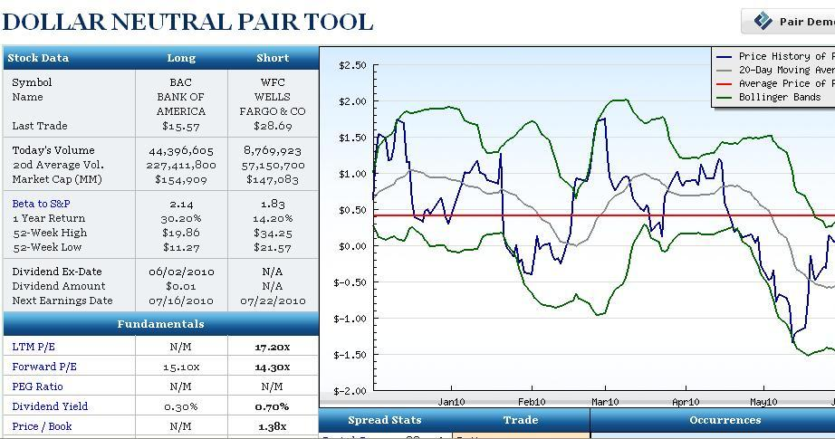

## Table of Contents

## What is a pairs trade?

A pairs trade is a trading strategy where you buy one stock and sell another stock at the same time. The idea is to find two stocks that usually move together, like two companies in the same industry. For example, if you think Coca-Cola will do better than Pepsi, you would buy Coca-Cola stock and sell Pepsi stock. The goal is to make money from the difference in how the two stocks perform, not from the overall market going up or down.

This strategy can be useful because it can help reduce risk. Since you are betting on the difference between the two stocks, it doesn't matter as much if the whole market goes up or down. If both stocks move together as expected, and one does better than the other, you can make a profit. However, if the stocks start to move differently than expected, you could lose money. So, it's important to choose pairs that have a strong history of moving together.

## How does a pairs trade work?

A pairs trade works by taking advantage of the relationship between two stocks that usually move together. Imagine you have two companies in the same industry, like Ford and General Motors. If you think Ford will do better than General Motors in the near future, you would buy Ford stock and sell General Motors stock at the same time. This way, you're betting that the difference in their performance will make you money. If Ford goes up more than General Motors, or if General Motors goes down more than Ford, you make a profit from the difference.

The key to a successful pairs trade is finding two stocks that have a strong history of moving together. This is called having a high correlation. By choosing stocks that are closely related, you reduce the risk that comes from the overall market moving up or down. Instead, your profit comes from the difference in how the two stocks perform relative to each other. However, if something unexpected happens and the stocks start to move differently than usual, you could lose money. So, it's important to keep an eye on the stocks and be ready to adjust your trade if needed.

## What are the basic components needed to execute a pairs trade?

To execute a pairs trade, you need to find two stocks that usually move together. These stocks should be from the same industry or have similar business models, so they have a high correlation. For example, you might choose two car companies like Ford and General Motors. Once you've picked your pair, you need to decide which stock you think will do better than the other. If you think Ford will do better than General Motors, you would buy Ford stock and sell General Motors stock at the same time.

The next step is to actually make the trade. You buy the stock you think will do better (in this case, Ford) and sell the stock you think will do worse (General Motors). The idea is to make money from the difference in how the two stocks perform. If Ford goes up more than General Motors, or if General Motors goes down more than Ford, you make a profit. It's important to keep an eye on both stocks and be ready to adjust your trade if the stocks start moving differently than expected.

## What types of securities are typically used in pairs trading?

Pairs trading usually involves stocks. Traders pick two stocks that are similar, like two car companies or two tech companies. These stocks should move together most of the time. For example, if you think one car company will do better than another, you might buy the stock of the company you think will do better and sell the stock of the other company.

Besides stocks, pairs trading can also use other types of securities like exchange-traded funds (ETFs) or futures. ETFs are like baskets of stocks that track an index or sector. Futures are contracts to buy or sell something at a set price in the future. Just like with stocks, you would pick two ETFs or futures that usually move together and trade them based on which one you think will do better than the other.

## How do you identify a pair of stocks for trading?

To identify a pair of stocks for trading, you first need to find two companies that are similar. They should be in the same industry or have similar business models. For example, you might choose two car companies like Ford and General Motors, or two tech companies like Apple and Microsoft. The key is that these stocks should usually move together, which means they have a high correlation. You can check this by looking at historical data to see how the stocks have moved in the past.

Once you have found two stocks that usually move together, you need to decide which one you think will do better than the other. You might look at news, financial reports, or other information to help you decide. If you think one stock will go up more than the other, or if you think one will go down less than the other, that's the pair you want to trade. For example, if you think Ford will do better than General Motors, you would buy Ford stock and sell General Motors stock at the same time.

## What statistical methods are used to find correlations between stocks in pairs trading?

To find correlations between stocks for pairs trading, traders often use a statistical method called the correlation coefficient. This number, which ranges from -1 to 1, shows how closely two stocks move together. A correlation coefficient close to 1 means the stocks move in the same direction most of the time. A number close to -1 means they move in opposite directions. If the number is close to 0, the stocks don't move together much at all. Traders look for stocks with a high positive correlation because those are the ones that usually move together, which is what you want for a pairs trade.

Another common method is to use regression analysis. This helps traders see how one stock's price changes when the other stock's price changes. By looking at historical data, traders can see if there's a pattern in how the two stocks move together. If the pattern is strong and consistent, it can give traders more confidence in choosing those stocks for a pairs trade. Both the correlation coefficient and regression analysis help traders pick pairs of stocks that are likely to keep moving together, making the pairs trade strategy more likely to work.

## What are the common entry and exit strategies in pairs trading?

In pairs trading, the entry strategy involves finding the right time to start the trade. Traders usually look for a moment when the two stocks start to move differently from their usual pattern. For example, if Ford and General Motors usually move together but suddenly Ford's stock price goes down while General Motors stays the same, a trader might see this as a good time to buy Ford and sell General Motors. This difference in movement is called a divergence. Traders use statistical tools like the correlation coefficient to spot these divergences and decide when to enter the trade.

The [exit](/wiki/exit-strategy) strategy in pairs trading is about knowing when to end the trade. Traders usually set a target for how much they want to make or lose. If the difference between the two stocks reaches this target, the trader will close the trade. For example, if Ford starts to go up more than General Motors, the trader might decide to sell Ford and buy back General Motors once the difference hits a certain point. Traders also use stop-loss orders to limit their losses. If the stocks start moving in a way that loses money, the stop-loss order will automatically close the trade to prevent further loss.

## How do you manage risk in pairs trading?

Managing risk in pairs trading starts with choosing the right pair of stocks. You want to pick stocks that usually move together, like two car companies or two tech companies. This way, even if the market goes up or down, the stocks should move together, which can help reduce your risk. But if the stocks start moving differently than expected, you could lose money. So, it's important to keep an eye on how the stocks are doing and be ready to adjust your trade if needed.

Another way to manage risk is by setting clear entry and exit points. When you start a pairs trade, you look for a moment when the two stocks start to move differently from their usual pattern. This is called a divergence. You enter the trade when you see this divergence, hoping the stocks will go back to moving together. To manage risk, you also set a target for how much you want to make or lose. If the difference between the stocks reaches this target, you close the trade. Using stop-loss orders can also help. These orders automatically close your trade if the stocks start moving in a way that loses money, helping you limit your losses.

## What are the advantages of pairs trading compared to other trading strategies?

Pairs trading has some big advantages over other trading strategies. One big plus is that it can help you make money even when the market is going up or down. This is because you are betting on the difference between two stocks, not on the whole market. So, if you think one car company will do better than another, you can buy the stock of the first company and sell the stock of the second one. If you are right, you make money from the difference, no matter what the market does.

Another advantage is that pairs trading can be less risky than other strategies. Since you are trading two stocks that usually move together, like two tech companies, the risk from the overall market going up or down is lower. You are more focused on how the two stocks perform compared to each other. But you still need to watch the stocks closely and be ready to change your trade if things don't go as planned. This way, you can manage your risk better and maybe lose less money if the trade doesn't work out.

## What are the potential pitfalls and challenges in pairs trading?

Pairs trading can be tricky because it depends a lot on the two stocks moving together like they usually do. If something unexpected happens, like a big news event that affects one stock but not the other, the stocks might start moving differently. This can make you lose money because your trade was based on them moving together. Also, [picking](/wiki/asset-class-picking) the right pair of stocks is hard. You need to find two stocks that are really similar and have a strong history of moving together. If you pick the wrong pair, your trade might not work out like you hoped.

Another challenge is knowing when to start and stop the trade. You need to watch the stocks closely to spot the right time to enter the trade, which can be stressful. If you get the timing wrong, you might miss out on making money or even lose money. Also, even if you do everything right, the market can still surprise you. Sometimes, the stocks might not go back to moving together like you expected, which can lead to losses. So, while pairs trading can be less risky than other strategies, it still needs a lot of attention and careful planning.

## How can advanced quantitative models enhance pairs trading strategies?

Advanced quantitative models can really help make pairs trading better. These models use math to look at lots of data from the past to find patterns in how stocks move together. By using these models, traders can pick pairs of stocks that are more likely to keep moving together. The models can also help traders figure out the best times to start and stop their trades. This can make the trades more successful because the models can spot small changes in how the stocks are moving that a person might miss.

Another way these models help is by managing risk. They can tell traders how much money they might make or lose, which helps set good targets for when to close a trade. The models can also suggest stop-loss points, which are like safety nets that stop the trade if things start going badly. By using these advanced tools, traders can make smarter choices and maybe lose less money if the trade doesn't work out. So, while pairs trading can be tricky, these models can make it a bit easier and more successful.

## What are some real-world examples of successful pairs trades?

One famous example of a successful pairs trade happened with Royal Dutch Petroleum and Shell Transport & Trading. Back in the early 2000s, these two companies were part of the same oil company but traded as separate stocks. They usually moved together, but sometimes one would go up more than the other. Traders noticed this and started buying the stock that was going down and selling the one that was going up. When the stocks went back to moving together, the traders made money from the difference. This pairs trade worked well because the stocks had a strong history of moving together.

Another example is with Coca-Cola and PepsiCo. These two companies are big rivals in the soda business, and their stocks often move in similar ways. If a trader thought Coca-Cola was going to do better than PepsiCo, they would buy Coca-Cola stock and sell PepsiCo stock. If Coca-Cola's stock went up more than PepsiCo's, or if PepsiCo's went down more than Coca-Cola's, the trader would make money from the difference. This kind of pairs trade can be successful because the companies are in the same industry and their stocks usually follow each other closely.

## What is Model-Based Pairs Trading?

Model-based pairs trading leverages statistical methods to enhance decision-making and improve the profitability of trading strategies. At its core, this approach utilizes quantitative models to identify and exploit price divergences between two correlated securities, expecting a reversion to their historical spread relationship. The technique hinges on the concept of spread series forecastability, where historical price spreads can be analyzed to predict future price movements.

An essential aspect of model-based pairs trading is the focus on stationary processes. A stationary process is one whose statistical properties, such as mean and variance, do not change over time. This property is vital in pairs trading, as it implies that the spread between two correlated assets reverts to a long-term mean, providing a basis for predicting future convergence.

Various models are used in pairs trading to assess and predict the behavior of asset pairs:

1. **ARMA (Autoregressive Moving Average)**: The ARMA model combines two components—autoregression (AR) and moving average (MA)—to capture the momentum and mean-reversion tendencies in the spread series. The AR component models the relationship between an observation and previous observations, while the MA component accounts for the relationship between current and past forecast errors.
$$
   X_t = c + \sum_{i=1}^{p} \phi_i X_{t-i} + \sum_{i=1}^{q} \theta_i \epsilon_{t-i} + \epsilon_t

$$

   Here, $X_t$ represents the spread at time $t$, $c$ is a constant, $\phi_i$ are the autoregressive parameters, $\theta_i$ are the moving average parameters, and $\epsilon_t$ is the white noise error term.

2. **Cointegration**: Cointegration techniques are employed when two or more non-stationary time series are linked by a stable, long-term equilibrium relationship. In pairs trading, if the underlying price series of two securities are co-integrated, their spread is stable over time, implying that deviations from this relationship are temporary and will correct themselves.

   The Engle-Granger two-step method is a common approach to test for cointegration. First, a regression is run between the two security prices:
$$
   Y_t = \alpha + \beta X_t + \epsilon_t

$$

   The residuals ($\epsilon_t$) from this regression are tested for stationarity using unit root tests like the Augmented Dickey-Fuller (ADF) test. If the residuals are stationary, the series are co-integrated.

Model-based pairs trading requires rigorous statistical validation and constant monitoring to adjust to changing market dynamics. These methods provide a robust framework to identify potential pairs trading opportunities, enhance market neutrality, and optimize risk-adjusted returns. Integrating statistical models into pairs trading helps automate decision-making, enabling traders to efficiently manage large [volume](/wiki/volume-trading-strategy)s of data and react swiftly to market changes.

## References & Further Reading

[1]: Gatev, E. G., Goetzmann, W. N., & Rouwenhorst, K. G. (2006). ["Pairs Trading: Performance of a Relative Value Arbitrage Rule."](https://www.nber.org/papers/w7032) The Journal of Finance, 61(5), 2223-2254.

[2]: Vidyamurthy, G. (2004). ["Pairs Trading: Quantitative Methods and Analysis."](https://www.wiley.com/en-us/Pairs+Trading%3A+Quantitative+Methods+and+Analysis-p-9780471460671) John Wiley & Sons.

[3]: Avellaneda, M., & Lee, J. H. (2010). ["Statistical Arbitrage in the U.S. Equities Market."](https://papers.ssrn.com/sol3/papers.cfm?abstract_id=1153505) Quantitative Finance, 10(7), 761-782.

[4]: Pole, A. (2007). ["Statistical Arbitrage: Algorithmic Trading Insights and Techniques."](https://books.google.com/books/about/Statistical_Arbitrage.html?id=xSjXTnKqIKoC) John Wiley & Sons.

[5]: Engle, R. F., & Granger, C. W. J. (1987). ["Co-Integration and Error Correction: Representation, Estimation, and Testing."](https://www.jstor.org/stable/1913236)90087-0) Econometrica, 55(2), 251-276.