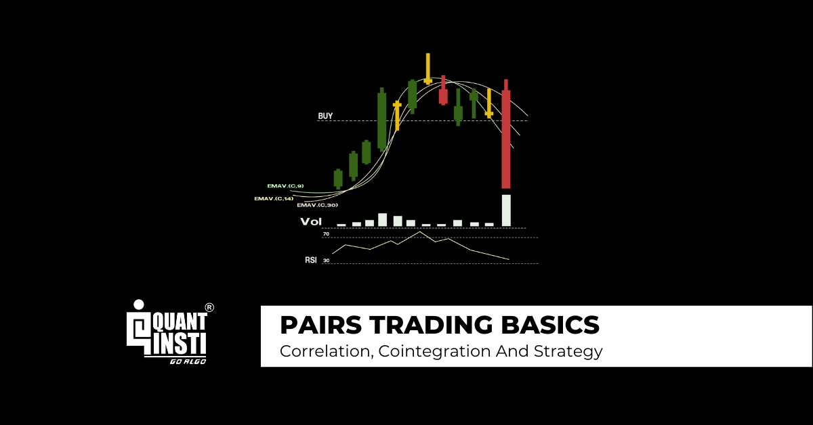

## Table of Contents

## What is pairs trading?

Pairs trading is a trading strategy where you buy one stock and sell another stock at the same time. The idea is to pick two stocks that usually move together in price. For example, if you think Stock A and Stock B usually go up and down together, but right now Stock A is cheaper than Stock B, you might buy Stock A and sell Stock B. You hope that the prices will come back together, so you can make money from the difference.

This strategy is often used by people who want to make money from small changes in the stock market, without taking big risks. It's called a "market-neutral" strategy because it tries to make money no matter if the overall market goes up or down. The key to pairs trading is to find two stocks that are closely related, like two companies in the same industry, and to watch them closely to see when their prices start to move apart.

## How does pairs trading work?

Pairs trading works by finding two stocks that usually move together in price. These stocks are often from the same industry, like two car companies or two tech companies. When you see that one stock is cheaper than the other, even though they usually move together, you buy the cheaper stock and sell the more expensive one. This is called taking a long position on the cheaper stock and a short position on the more expensive stock.

The goal is to make money when the prices of the two stocks come back together. If the cheaper stock goes up and the more expensive stock goes down, you can make money from the difference. This strategy tries to make money no matter if the overall stock market goes up or down. It's all about watching the two stocks closely and waiting for the right moment to trade.

## What are the key principles behind pairs trading?

Pairs trading is based on the idea that two stocks that usually move together in price will eventually come back together if they start to move apart. This means you need to find two stocks that are closely related, like two companies in the same industry. For example, if you pick two car companies, their stock prices might go up and down together because they are affected by the same things, like the price of gas or how many cars people are buying.

The main thing in pairs trading is to watch these two stocks closely. When you see that one stock is cheaper than the other, even though they usually move together, you buy the cheaper stock and sell the more expensive one. You hope that the prices will come back together, so you can make money from the difference. This strategy tries to make money no matter if the overall stock market goes up or down, which is why it's called a "market-neutral" strategy.

## What types of securities are typically used in pairs trading?

Pairs trading usually involves stocks from the same industry or sector. For example, you might choose two car companies or two tech companies. These stocks are picked because they often move together in price due to similar market conditions affecting them, like changes in technology or consumer demand.

Sometimes, pairs trading can also use other types of securities like exchange-traded funds (ETFs) or even futures contracts. ETFs are like baskets of stocks that track a certain part of the market, so you might trade two ETFs that follow the same industry. Futures contracts are agreements to buy or sell something at a future date, and they can be used in pairs trading if they are related to the same market or commodity.

The key is to find two securities that are closely related and watch them closely. When one becomes cheaper than the other, you buy the cheaper one and sell the more expensive one, hoping their prices will come back together so you can make money from the difference.

## How do you select a pair of stocks for trading?

To select a pair of stocks for trading, you need to find two companies that are closely related. This usually means they are in the same industry or sector. For example, you might choose two car companies or two tech companies. These stocks should have a history of moving together in price because they are affected by the same things, like changes in the market or consumer demand. You can look at historical price data to see if the stocks have moved together in the past. This helps you understand if they are good candidates for pairs trading.

Once you have found two stocks that usually move together, you need to watch them closely. You are looking for a time when one stock becomes cheaper than the other, even though they usually move together. This is your chance to buy the cheaper stock and sell the more expensive one. You hope that the prices will come back together, so you can make money from the difference. The key is to be patient and wait for the right moment to trade.

## What are the common statistical methods used to identify pairs?

To find good pairs for trading, people often use a method called correlation analysis. This means they look at how closely two stocks move together over time. They use a number called the correlation coefficient, which goes from -1 to 1. If the number is close to 1, it means the stocks move a lot alike. If it's close to -1, they move in opposite ways. A number close to 0 means the stocks don't move together much at all. Traders want to find stocks with a high positive correlation because that means they usually move together.

Another method is called cointegration analysis. This looks at whether two stocks not only move together but also come back to a common trend over time. It's a bit more complicated than correlation because it checks if the stocks stay close to each other even if they go up and down a lot. Traders use cointegration to find pairs that might be good for trading because they are likely to come back together after moving apart. Both correlation and cointegration help traders pick the right pairs to make money from the difference in their prices.

## How do you calculate the spread in pairs trading?

The spread in pairs trading is the difference between the prices of the two stocks you are trading. To calculate it, you take the price of one stock and subtract the price of the other stock. For example, if Stock A is trading at $50 and Stock B is trading at $45, the spread is $50 - $45 = $5. This spread tells you how far apart the two stocks are in price at any given time.

You watch this spread closely because your goal is to make money when it comes back to a normal level. If the spread gets bigger, you might buy the cheaper stock and sell the more expensive one, hoping that the spread will shrink again. When the spread does come back together, you can close your positions and make money from the difference. Keeping an eye on the spread helps you know when to trade and when to wait.

## What are the entry and exit signals in pairs trading?

In pairs trading, you look for entry signals to know when to start trading. An entry signal happens when the spread between the two stocks you are watching gets bigger than usual. If you see that one stock is a lot cheaper than the other, even though they usually move together, that's your signal to buy the cheaper stock and sell the more expensive one. You want to do this because you think the spread will come back to normal, and you can make money from the difference.

Exit signals tell you when to stop trading and close your positions. An exit signal happens when the spread between the two stocks comes back to a normal level. If you bought the cheaper stock and sold the more expensive one, you would sell the stock you bought and buy back the stock you sold when the spread gets small again. This is how you make money from the difference in their prices. Watching the spread closely helps you know when to enter and exit your trades.

## What are the risks associated with pairs trading?

Pairs trading can be risky because even if two stocks usually move together, they might not always do what you expect. If something big happens to one company or the whole market changes a lot, the prices might not come back together like you hoped. This means you could lose money if the spread between the two stocks keeps getting bigger instead of smaller. Also, if you use borrowed money to trade, the losses can be even bigger.

Another risk is that it can be hard to find the right pair of stocks to trade. You need to spend a lot of time looking at data and watching the market to pick the best pairs. If you pick the wrong pair, you might not make money even if you follow all the rules. Plus, trading costs like fees and commissions can add up, making it harder to make a profit from small changes in the spread.

## How can you manage risk in pairs trading?

Managing risk in pairs trading starts with choosing the right pair of stocks. You need to pick two companies that are closely related and usually move together in price. This means doing a lot of research and looking at historical data to find the best pairs. It's also important to set clear rules for when to enter and exit trades. If you see the spread between the two stocks getting too big, it might be a good idea to stop trading and wait for a better chance.

Another way to manage risk is by not using too much borrowed money. When you borrow money to trade, your losses can be bigger if things don't go your way. It's safer to use your own money and only trade with what you can afford to lose. Also, keep an eye on trading costs like fees and commissions, because they can eat into your profits. By being careful and patient, you can lower the risks in pairs trading.

## What are some advanced strategies in pairs trading?

One advanced strategy in pairs trading is called mean reversion trading. This means you look for times when the spread between two stocks is a lot bigger than usual. You buy the cheaper stock and sell the more expensive one, hoping that the spread will come back to its normal level. This strategy needs a lot of data and math to figure out what the normal spread is and when it's time to trade. You need to be patient and watch the market closely to make this work.

Another advanced strategy is using statistical [arbitrage](/wiki/arbitrage). This is a bit more complicated and involves trading many pairs of stocks at the same time. You use computers and math to find lots of pairs that are good for trading. Then, you trade them all together, hoping that the small profits from each pair will add up to a big profit overall. This strategy needs a lot of money and technology, so it's usually used by big traders and hedge funds.

## How do you evaluate the performance of a pairs trading strategy?

To evaluate the performance of a pairs trading strategy, you need to look at how much money you made or lost over time. This means keeping track of your profits and losses from each trade. You can use a number called the return on investment (ROI) to see how well your strategy is doing. If your ROI is positive, it means you made more money than you spent. If it's negative, you lost money. You also need to think about the costs of trading, like fees and commissions, because they can make your profits smaller or your losses bigger.

Another way to evaluate your pairs trading strategy is by looking at how often you made money compared to how often you lost money. This is called the win rate. A high win rate means you made money on most of your trades, which is good. But you also need to look at how big your wins and losses were. If you made a lot of small wins but had a few big losses, your strategy might not be as good as it seems. By looking at both your ROI and your win rate, you can get a good idea of how well your pairs trading strategy is working.

## What is Pairs Trading?

Pairs trading is a financial market strategy characterized by its market-neutral stance, primarily used in the context of [algorithmic trading](/wiki/algorithmic-trading). At its core, pairs trading involves simultaneously buying one asset while shorting another, aiming to capitalize on the relative movement between them rather than their absolute price movements. This tactic allows traders to potentially profit from both market upturns and downturns, mitigating the influence of broader market trends and focusing instead on the price dynamics between paired assets.

The execution of a pairs trading strategy is fundamentally reliant on statistical relationships between selected pairs of assets, typically two stocks. The identification of these pairs is traditionally grounded in statistical metrics such as correlation and co-integration. Correlation measures the degree to which two securities move in relation to each other, albeit without distinguishing between temporary and long-term associations. Mathematically, it can be expressed as:

$$
\text{Correlation}(X, Y) = \frac{\text{Cov}(X, Y)}{\sigma_{X}\sigma_{Y}}
$$

Where $\text{Cov}(X, Y)$ is the covariance of asset prices $X$ and $Y$, and $\sigma_{X}$ and $\sigma_{Y}$ are the standard deviations of $X$ and $Y$ respectively.

A more robust method for identifying viable trading pairs is co-integration, which assesses whether a long-term equilibrium relationship exists between the price series of two securities. A co-integrated pair suggests that any deviation from their equilibrium is likely temporary and will revert, a condition that is highly exploitable in pairs trading.

In practice, the pairs trading process begins with identifying two assets whose prices historically move together. Traders then monitor the spread, or price difference, between these assets. When the spread deviates from its historical mean by a certain threshold, this signals a trading opportunity. The trader would buy the underperforming asset and short-sell the outperforming one, expecting the spread to eventually revert to its historical average.

Statistical tests such as the Augmented Dickey-Fuller test can be applied to confirm whether the spread series is stationary, a crucial condition for effective pairs trading. Once a theoretically promising pair is chosen, this traditional approach employs rigorous monitoring and execution strategies, often automated via algorithmic systems, to capture perceived inefficiencies in asset pricing.

Therefore, pairs trading stands out as a sophisticated, quantitatively driven strategy that leverages statistical relationships to uncover profit opportunities, independent of overall market directions.

## What are the Core Concepts in Pairs Trading?

Pairs trading, an algorithmic trading strategy, heavily relies on several core statistical concepts to identify and execute trades that can potentially bring profits irrespective of market direction. These concepts are correlation, co-integration, and the Z-score, all of which contribute to determining relationships between pairs of securities.

**Correlation** is the statistical measure that describes how two securities move in relation to each other. It ranges from -1 to 1, where 1 indicates perfect positive correlation, -1 a perfect negative correlation, and 0 no correlation at all. In pairs trading, correlation is used initially to determine if two stocks have historically moved together, making them potential candidates for a trading pair. However, correlation does not imply causation or guarantee the relationship's stability over time, necessitating further analysis.

**Co-integration** is a crucial concept in pairs trading, as it focuses on the long-term relationship between two time series. Two time series are co-integrated if they share a common stochastic trend and any deviation from this trend is temporary, implying that they will revert to a mean over time. This property is vital in pairs trading because it indicates that while prices of the pair may diverge in the short term, they are likely to converge in the future, creating a trading opportunity. Identifying co-integrated pairs is more robust than relying solely on correlation, as it accounts for the possibility of price divergence.

The **Z-score** is a statistical measure that describes a value's position relative to the mean of a group of values. In pairs trading, the Z-score is used to determine the degree of deviation from the historical mean ratio of the pair's prices. A high absolute Z-score suggests that the pair is overbought or oversold, indicating a possible entry or [exit](/wiki/exit-strategy) point for trades. The formula for the Z-score is:

$$
Z = \frac{X - \mu}{\sigma}
$$

Where $X$ is the current value, $\mu$ is the mean, and $\sigma$ is the standard deviation. In practical terms, a Z-score beyond a certain threshold might trigger either a buy or sell signal, depending on whether the strategy identifies a reversion opportunity.

The **augmented Dickey-Fuller (ADF) test** is a critical statistical test used to determine the stationarity of a series, which is a precondition for co-integration. Stationarity implies that the properties of the time series, such as mean and variance, do not change over time. The ADF test examines the null hypothesis that a unit root is present in a time series sample. A stationary series will reject this hypothesis, supporting the identification of co-integrated pairs. In implementing pairs trading, passing the ADF test enhances confidence that the time series exhibit stationarity, thereby increasing the likelihood of successful mean reversion.

Selecting **statistically meaningful pairs** is fundamental for successful pairs trading. This process involves analyzing the correlation and verifying the co-integration of securities via tests like the ADF. By doing so, traders can identify pairs with reliable long-term relationships, ensuring the strategies employed are based on statistically significant and stable relationships rather than random short-term fluctuations. This meticulous selection process helps mitigate risks while enhancing the probability of profitable trades.

## How can one develop a Pairs Trading Strategy?

Developing a pairs trading strategy involves a systematic approach that includes careful stock selection, identification of entry and exit points, and defining trade thresholds based on statistical measures like Z-scores. This structured methodology is crucial to harness the potential benefits of the pairs trading approach while minimizing associated risks.

### Stock Selection

The initial step in forming a pairs trading strategy is selecting suitable stock pairs. This selection often relies on historical price data and statistical techniques to ascertain a long-term equilibrium relationship between two assets. Stocks from the same sector or industry are typically chosen due to their tendency to exhibit correlated movements influenced by similar economic factors. Employing co-integration tests helps verify if the spreads between paired stocks are mean-reverting, a condition essential for a pairs trade to be potentially profitable.

Statistical tools like the Augmented Dickey-Fuller (ADF) test are used to test the stationarity of the spread. Stationarity implies that although the individual stock prices may deviate in the short term, they tend to revert to a historical mean over time. A significant ADF test result suggests a viable pair for trading.

### Identifying Entry and Exit Points

Once a pair is identified, establishing entry and exit points is key to capturing profitable opportunities. The difference between the two stock prices, known as the spread, is monitored. Entry points are identified when the spread deviates significantly from its historical average, indicating a potential mispricing due to the mean-reverting nature of the pair.

When the spread exceeds a specific threshold, termed the "entry Z-score," a trader would initiate a position: buying the undervalued stock and selling short the overvalued one. The trades are held until the spread reverts to the mean, at which point the positions are exited. The exit point is typically determined when the spread returns to the "zero Z-score," signifying mean reversion completion, or when it reaches a pre-defined "exit Z-score" which confirms the end of the mispricing.

### Defining Thresholds for Trades Based on Z-Scores

Z-scores play an instrumental role in pairs trading by quantitatively defining the entry and exit signals. The Z-score measures how far the spread deviates from its historical mean in terms of standard deviations. It is expressed by the formula:

$$
Z = \frac{(X - \mu)}{\sigma}
$$

where $X$ is the current value of the spread, $\mu$ is the mean of the spread, and $\sigma$ is the standard deviation of the spread.

In Python, calculating a Z-score can be done using the following snippet:

```python
import numpy as np

def calculate_z_score(spread, mean, std_dev):
    return (spread - mean) / std_dev

# Example usage
spread = np.array([2.5, 2.8, 3.0])  # example spread data
mean = np.mean(spread)
std_dev = np.std(spread)
z_score = calculate_z_score(spread[-1], mean, std_dev)
```

Threshold values for Z-scores are critical as they determine sensitivity to spread changes and frequency of trading signals. Commonly, a Z-score threshold of ±2 or ±1.5 might be set for entry points, reflecting periods of significant deviation. These values may vary based on the trader's risk tolerance and backtested results of hypothetical trading strategies.

In conclusion, a successful pairs trading strategy blends careful stock selection with precise identification of entry and exit points, governed by well-defined Z-score thresholds. By using statistical tools and historical analysis, traders can potentially exploit market inefficiencies, aiming for consistent returns while maintaining a market-neutral position.

## References & Further Reading

[1]: Vidyamurthy, Ganapathy. (2004). ["Pairs Trading: Quantitative Methods and Analysis"](https://www.amazon.com/Pairs-Trading-Quantitative-Methods-Analysis/dp/0471460672). John Wiley & Sons.

[2]: Gatev, E., Goetzmann, W. N., & Rouwenhorst, K. G. (2006). ["Pairs Trading: Performance of a Relative-Value Arbitrage Rule."](https://www.nber.org/papers/w7032) The Review of Financial Studies, 19(3), 797-827.

[3]: Engle, R. F., & Granger, C. W. J. (1987). ["Co-Integration and Error Correction: Representation, Estimation, and Testing."](https://www.semanticscholar.org/paper/Co-integration-and-error-correction%3A-estimation-and-Engle-Granger/9885b611792aedb706ba905e610b4a0a409d5984) Econometrica, 55(2), 251-276.

[4]: Elliot N. Waves, J. (1999). ["Cointegration in Financial Markets: An Introduction."](https://www.amazon.com/Elliott-Wave-Principle-Market-Behavior/dp/0471988499)00058-6) Journal of Banking & Finance.

[5]: Vidyamurthy, G. (2004). ["How to Pick Pairs for Pairs Trading: Learn the Science Behind the Pair Selection."](https://www.researchgate.net/publication/47801548_Pairs_Trading_Quantitative_Methods_and_Analysis_G_Vidyamurthy) 

[6]: [Machine Learning for Algorithmic Trading](https://github.com/PacktPublishing/Machine-Learning-for-Algorithmic-Trading-Second-Edition) by Stefan Jansen

[7]: McKinney, Michael. (2020). ["Statistics for Algorithmic Trading: Learn About Statistical Arbitrage Techniques, Including Pairs Trading."](https://www.mckinsey.com/featured-insights/2020-year-in-review) 

[8]: Calvori, F., & Gigante, G. (2007). ["Applying Kalman Filter to Pairs Trading."](https://letianzj.github.io/kalman-filter-pairs-trading.html) Financial Econometrics Research.