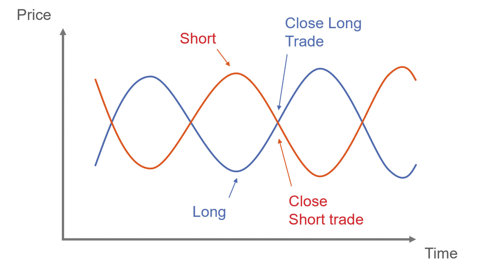

In recent years, algorithmic trading has become increasingly popular among traders due to its ability to execute trades with unparalleled efficiency and precision. These computer-driven strategies can analyze market data at high speeds, identify trading opportunities, and execute orders faster than human traders. One strategy that has emerged as particularly popular within this domain is pair trading.

Pair trading, sometimes referred to as statistical arbitrage, involves the simultaneous buying and selling of two related assets. This strategy aims to capitalize on market inefficiencies by exploiting the price relationship between the chosen assets. By identifying pairs of securities that historically move together, traders can take advantage of temporary divergences in their price patterns.



This article explores the concept of pair trading as it applies to algorithmic trading. We will examine its potential benefits, the mechanics of how it operates, and why it represents a valuable addition to the toolkit of algorithmic traders. Pair trading not only provides opportunities to generate profits from price movements but also offers a market-neutral approach that can be effective in different market conditions. By understanding the intricacies and applications of pair trading, traders can enhance their capacity to navigate complex financial markets and identify profitable opportunities.

## Table of Contents

## Understanding Pair Trading

Pair trading, also known as [statistical arbitrage](/wiki/statistical-arbitrage), is a prominent trading strategy that focuses on the dynamics between two correlated assets. In this approach, a trader takes a long position in one asset while concurrently taking a short position in another. The primary objective is to capitalize on the convergence of the price spread between these two assets, exploiting temporary market inefficiencies.

At its core, pair trading is based on the principle of market neutrality. This means that the strategy is designed to generate profits irrespective of the overall market direction. By balancing long and short positions, the trader mitigates the risk associated with broad market movements, which is a significant advantage over traditional directional trading strategies.

The selection of asset pairs is critical in pair trading. Ideally, these assets should have a historical correlation, meaning their prices have tended to move together over time. The divergence of prices offers the potential for profit as the trader anticipates that the spread will revert to its historical mean. Traders often employ statistical models such as cointegration tests or Pearson correlation to identify such pairs.

Mathematically, if $A$ and $B$ are the prices of two correlated assets, the spread $S$ can be defined as:

$$
S = A - \beta B
$$

where $\beta$ is a coefficient that represents the historical relationship between the two assets. The strategy involves monitoring $S$ and initiating trades when $S$ deviates significantly from its historical average. The expected reversion provides the trader with opportunities to buy or sell the spread for profit.

Modeling the expected return involves determining the likelihood of mean reversion, a task frequently tackled using statistical or [machine learning](/wiki/machine-learning) models. For instance, the Ornstein-Uhlenbeck process, a type of mean-reverting stochastic process, is commonly applied to model such price dynamics.

Additionally, the accuracy of [pair trading](/wiki/pair-trading) strategies can be enhanced using Python libraries, enabling traders to automate the identification and execution of trades. Example Python code for evaluating potential pairs might include:

```python
import numpy as np
import pandas as pd
from statsmodels.tsa.stattools import coint

# Example data: Prices of two correlated assets
asset1 = np.random.normal(loc=100, scale=10, size=100)  # Synthetic data
asset2 = asset1 + np.random.normal(loc=0, scale=1, size=100)

# Cointegration test
score, p_value, _ = coint(asset1, asset2)

print('Cointegration test score: ', score)
print('P-value: ', p_value)
```

The results can help ascertain whether a significant statistical relationship exists, guiding the potential trade execution.

Overall, pair trading offers a sophisticated means of leveraging statistical relationships between assets to create opportunities for profit, making it an invaluable tool for algorithmic traders seeking market-neutral strategies.

## How Pair Trading Works in Algorithmic Trading

Algorithmic trading employs advanced computer algorithms to execute trades at velocities and scales beyond human capabilities. In pair trading, this technological advantage is harnessed to analyze extensive datasets and identify pairs of assets that exhibit correlated price movements. The essence of this strategy is to capitalize on the temporary mispricing between such pairs by taking a long position in one asset while simultaneously taking a short position in its correlated counterpart.

Once a suitable pair is identified, algorithms continuously monitor the price spread between the assets. A vital aspect of algorithmic pair trading is the implementation of statistical and machine learning methodologies, which enhance the accuracy and efficiency of this monitoring process. These techniques help in predicting the potential convergence of the price spread back to its historical mean, which is the primary condition for executing trades.

The algorithm is designed to execute trades when it detects a profitable opportunity, i.e., when the price spread deviates sufficiently from its mean and is likely to revert. By systematically performing these actions, algorithmic systems reduce human error and ensure that trades are executed at optimal times and prices. This execution is achieved with minimal latency, due to the high-speed capabilities of [algorithmic trading](/wiki/algorithmic-trading) systems.

To illustrate, consider this simplified Python snippet that demonstrates a basic outline for implementing a pair trading algorithm:

```python
import numpy as np
import pandas as pd
from sklearn.linear_model import LinearRegression

# Load asset price data
prices_A = pd.Series(...)  # Price data for Asset A
prices_B = pd.Series(...)  # Price data for Asset B

# Calculate the price spread
spread = prices_A - prices_B

# Determine a signal when the spread deviation is significant
def zscore(spread):
    return (spread - spread.mean()) / spread.std()

z_signal = zscore(spread)

# Example trading logic
threshold = 2  # Arbitrary threshold for trading signal
if z_signal[-1] > threshold:
    # Execute a trade: short Asset A, long Asset B
    pass
elif z_signal[-1] < -threshold:
    # Execute a trade: long Asset A, short Asset B
    pass
```

This basic framework highlights how pair trading algorithms utilize statistical techniques to identify trading signals. Automated strategies often integrate more sophisticated models, including machine learning techniques like [reinforcement learning](/wiki/reinforcement-learning) or neural networks, to refine prediction accuracy and adapt to evolving market conditions. These advanced techniques not only enhance the identification process but also improve the execution by incorporating a broader set of variables and patterns that may not be readily apparent through traditional statistical approaches.

By adopting algorithmic pair trading, traders are equipped to respond swiftly to market inefficiencies, exploiting opportunities with precision and significantly reducing the manual effort and emotional bias often associated with trading decisions.

## Advantages of Pair Trading in Algorithmic Trading

Pair trading, within the framework of algorithmic trading, is celebrated for its market-neutral strategy, inherently reducing the risk associated with market [volatility](/wiki/volatility-trading-strategies). This neutrality is achieved by simultaneously taking contrary positions on two correlated financial instruments, thereby minimizing the impact of market-wide movements. This position allows traders to potentially extract profits in both upward and downward trending markets, as success hinges more on the price relationship between the paired assets rather than market direction. 

The utilization of algorithmic approaches in pair trading markedly enhances trading efficiency. Algorithms are designed to process and analyze vast datasets with remarkable speed, enabling traders to quickly identify and act upon transient market opportunities that would be challenging to capture manually. This rapid processing and execution capability ensure that traders can engage in a higher [volume](/wiki/volume-trading-strategy) of trades with minimal latency, increasing the potential for profitability.

Pair trading also offers a diversification advantage. By investing in multiple asset pairs, traders spread their risk across different positions, reducing the impact of a loss in a single trade. This diversification can contribute to more stable returns over time, as the performance does not overly rely on any single trading pair.

Furthermore, the advent of sophisticated data analytics and machine learning techniques has revolutionized the ability to detect patterns across large datasets. Exploiting these technological advancements, algorithmic pair trading can substantially increase the probability of conducting successful trades. By identifying subtle, non-random price movements and correlations between asset pairs, traders are better positioned to predict and capitalize on price convergences, thus enhancing the overall effectiveness and profitability of their trading strategies.

## Challenges and Risks of Pair Trading

Pair trading, despite its potential advantages, is not without challenges and risks. One of the primary risks is the possibility of misidentifying correlations or relationships between assets. Pair trading relies on the assumption that two assets move together in a mean-reverting relationship. However, if the statistical analysis is flawed or the correlation is spurious, trades based on incorrect assumptions can lead to significant losses. The correlation coefficient, often denoted as $\rho$, is used to measure the strength of the relationship between two assets. Misinterpretation of $\rho$ can lead to selecting inappropriate pairs.

Market conditions pose another significant risk. Financial markets are dynamic and can experience rapid changes due to economic, political, or social events, which may render historical correlations between assets invalid. Statistical models used in pair trading, typically calibrated on historical data, might become inaccurate if the underlying economic conditions shift. This inherent risk underscores the importance of regularly updating models to reflect current market conditions.

High-frequency trading, a common approach in algorithmic strategies like pair trading, requires a robust technological infrastructure. The cost associated with these technologies can be prohibitive for individual traders or smaller institutions. High-performance computing resources are needed to process large datasets and execute trades within milliseconds. Additionally, latency—any delay in processing and executing trades—can erode the profitability of pair trading strategies which often depend on capturing minute market inefficiencies.

Another technical challenge in pair trading is the potential for model overfitting. Overfitting occurs when a statistical model describes random error or noise instead of the underlying data pattern. An overfitted model may perform well on historical or training data but fail to generalize and predict future market behavior. This issue highlights the necessity for model validation techniques such as cross-validation, where the model's performance is tested on different subsets of data.

Pair trading also requires continuous monitoring and adjustment to ensure models remain effective. The constant evolution of markets necessitates the frequent recalibration of algorithms. Failure to adapt to new information can diminish the success of a previously profitable trading strategy.

In summary, pair trading poses several challenges and risks, including misidentification of asset correlations, rapidly changing market conditions, high costs associated with technology infrastructure, and the danger of model overfitting. Despite these challenges, with careful planning and robust risk management strategies, traders can mitigate these risks and potentially achieve profitable outcomes.

## Implementing Pair Trading Strategies

Implementing a successful pair trading strategy requires a combination of thorough research, robust algorithm development, and continuous refinement. The process begins with selecting the most suitable pairs of assets, which involves identifying two instruments that exhibit a statistically significant historical correlation. This correlation can be quantified using metrics such as the Pearson correlation coefficient or cointegration tests. The objective is to find pairs where the price spread fluctuates around a stable mean.

Once potential pairs are identified, [backtesting](/wiki/backtesting) is crucial. Backtesting involves applying historical data to simulate the performance of the strategy over past periods. This helps in assessing the effectiveness of the pair and the trading strategy. The key metrics often evaluated during backtesting include the cumulative return, Sharpe ratio, and drawdown levels. Here is a sample Python script that demonstrates backtesting a simple pair trading strategy:

```python
import numpy as np
import pandas as pd
import statsmodels.api as sm

# Load historical price data for two assets
asset1_prices = pd.Series(...)
asset2_prices = pd.Series(...)

# Calculate the spread
spread = asset1_prices - asset2_prices

# Define a threshold for opening and closing positions
entry_threshold = spread.std()
exit_threshold = 0

# Initiate positions
positions = pd.Series(index=spread.index, data=0)
positions[spread > entry_threshold] = -1  # Short asset1, long asset2
positions[spread < -entry_threshold] = 1  # Long asset1, short asset2

# Simulate returns
returns = positions.shift() * (asset1_prices.pct_change() - asset2_prices.pct_change())
portfolio_performance = returns.cumsum()

# Evaluate strategy
print("Cumulative Return:", portfolio_performance.iloc[-1])
```

After developing the algorithm, minimizing latency is vital. This involves ensuring the trading system is capable of fast execution, which may include optimizing network configurations, using efficient programming techniques, and deploying algorithms on high-performance servers.

Continuous monitoring and adjustment of the strategy are essential to maintain effectiveness. This involves real-time analysis of trade performance and recalibrating strategy parameters as required. Market conditions and correlations between pairs can change, necessitating frequent data analysis and model updates.

Before executing trades in live markets, testing strategies in simulated environments, or "paper trading," can be highly beneficial. This process involves executing trades in a controlled environment that mimics real market conditions, allowing traders to validate their strategies without risking actual capital.

By systematically implementing these steps, traders can enhance their pair trading strategies, aiming for consistent profitability while managing the inherent risks of algorithmic trading.

## Conclusion

Pair trading presents a compelling opportunity for algorithmic traders aiming to capitalize on market inefficiencies. By focusing on the relative performance of two correlated assets, the strategy inherently minimizes systematic risks associated with market movements. This market-neutral attribute allows traders to potentially achieve consistent returns regardless of broader market trends. The strategy's appeal lies in its ability to isolate and exploit price disparities between related assets.

When properly implemented, pair trading can serve as an effective hedging tool, cushioning traders against the fluctuations inherent in market dynamics. This is particularly advantageous in volatile environments where traditional investment strategies may falter. With precise execution, it is possible to achieve a consistent [arbitrage](/wiki/arbitrage) profit while maintaining overall risk exposure to a minimum.

Nevertheless, traders should not overlook the inherent risks and challenges in pair trading. Misjudgments in selecting asset pairs or inaccuracies in predictive models can lead to unfavorable outcomes. Furthermore, the need for a robust technological infrastructure is paramount, as trading strategies must quickly adapt to changing market conditions. The risk of model overfitting remains a concern, as overly complex models may perform well on historical data but falter under real-world conditions.

As technology advances, the sophistication of pair trading strategies continues to grow. Enhanced machine learning techniques and improved computational power enable more accurate predictions and timely execution. The increasing adoption of these advanced techniques indicates a promising future for pair trading in algorithmic trading. Traders who remain vigilant to the evolving landscape and adapt their strategies accordingly are best positioned to reap the benefits of this technique.

## References & Further Reading

[1]: David, J., & Livich, M. (2013). ["Pairs Trading: Quantitative Methods and Analysis"](https://www.wiley.com/en-us/Pairs+Trading%3A+Quantitative+Methods+and+Analysis-p-9780471460671) by Ganapathy Vidyamurthy.

[2]: Marcos López de Prado. (2018). ["Advances in Financial Machine Learning"](https://www.amazon.com/Advances-Financial-Machine-Learning-Marcos/dp/1119482089).

[3]: Chan, E. P. (2009). ["Quantitative Trading: How to Build Your Own Algorithmic Trading Business"](https://github.com/ftvision/quant_trading_echan_book).

[4]: Aronson, D. R. (2007). ["Evidence-Based Technical Analysis: Applying the Scientific Method and Statistical Inference to Trading Signals"](https://onlinelibrary.wiley.com/doi/book/10.1002/9781118268315).

[5]: Jansen, S. (2018). ["Machine Learning for Algorithmic Trading - Second Edition"](https://www.oreilly.com/library/view/machine-learning-for/9781839217715/).

[6]: Elliott, R., Hoek, J., & Malcolm, W. P. (2005). ["Pairs Trading"](http://stat.wharton.upenn.edu/~steele/Courses/434/434Context/PairsTrading/PairsTradingQFin05.pdf). Statistical Arbitrage Strategy.

[7]: Tharp, V. K. (2008). ["The Definitive Guide to Position Sizing"](https://www.amazon.com/Definitive-Guide-Position-Sizing-Objectives/dp/0935219099).