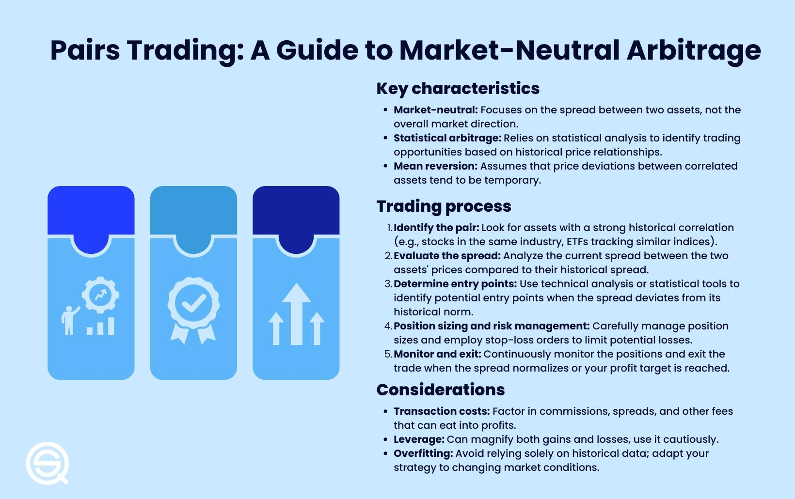

## Table of Contents

## What is pairs trading and how does it work?

Pairs trading is a trading strategy where you buy one stock and sell another stock at the same time. The idea is to find two stocks that usually move together in price. When the prices of these two stocks start to move away from each other, you can make a trade. You buy the stock that has gone down in price and sell the stock that has gone up in price. The goal is to make money when the prices of the two stocks move back towards each other.

This strategy works because it doesn't depend on the overall market going up or down. Instead, it focuses on the relationship between the two stocks. For example, if you think Coca-Cola and Pepsi usually move together, but suddenly Coca-Cola's price goes down and Pepsi's price goes up, you might buy Coca-Cola and sell Pepsi. If the prices then move back towards each other, you can make a profit. It's like betting that the two stocks will return to their normal pattern of moving together.

## Why would someone choose to engage in pairs trading?

Someone might choose pairs trading because it can be a way to make money even when the stock market is not doing well. Instead of betting on the whole market going up, pairs trading focuses on the relationship between two specific stocks. If you think two companies usually move together but one is suddenly cheaper than the other, you can buy the cheaper one and sell the more expensive one. When their prices move back to normal, you can make a profit.

Another reason to use pairs trading is that it can help reduce risk. Because you are buying one stock and selling another at the same time, the ups and downs of the market might not affect your trade as much. If the market goes down, the stock you bought might go down too, but the stock you sold might also go down, balancing out your losses. This makes pairs trading a safer way to trade for some people who want to protect their money while still trying to make a profit.

## What are the key steps to start pairs trading?

To start pairs trading, first you need to find two stocks that usually move together. Look at companies in the same industry or that sell similar products. You can use charts and data to see how their prices have moved in the past. Once you find a pair, watch for times when one stock's price goes down and the other's goes up. This is your chance to start a trade.

When you see the right moment, buy the stock that has gone down in price and sell the stock that has gone up in price. This is called going long on one stock and short on the other. Keep an eye on both stocks until their prices start to move back towards each other. When they do, you can close your trade by selling the stock you bought and buying back the stock you sold. If you did it right, you'll make a profit from the difference in their prices.

## How do you select the right pair of stocks for trading?

To select the right pair of stocks for trading, you need to find two companies that are similar and usually move together in price. Look for companies in the same industry, like two car makers or two tech companies. You can use charts and data to see how their prices have moved in the past. A good way to do this is to look at their correlation, which is a number that shows how closely their prices move together. A high correlation means the stocks usually move in the same direction, which is what you want for pairs trading.

Once you have found a pair with a high correlation, you need to watch for times when their prices start to move away from each other. This is your chance to start a trade. If one stock's price goes down and the other's goes up, you can buy the one that went down and sell the one that went up. This is called going long on the cheaper stock and short on the more expensive one. The key is to make sure the stocks have a strong history of moving together, so you can be confident they will move back towards each other after you start your trade.

## What are the common statistical methods used to identify a trading pair?

One common statistical method to identify a trading pair is by looking at the correlation between two stocks. Correlation is a number that tells you how closely two stocks move together. A correlation close to 1 means the stocks move a lot like each other, which is good for pairs trading. You can use a tool called a correlation coefficient to figure this out. You look at the prices of the two stocks over time and calculate how often they move up and down together. If the correlation is high, like above 0.8, it means the stocks are good candidates for pairs trading.

Another method is to use a technique called cointegration. Cointegration is a bit more complicated, but it helps you find stocks that not only move together but also stay close to each other over time. You look at the long-term relationship between the prices of the two stocks. If they tend to come back to a similar price difference after moving away, they might be good for pairs trading. You can use statistical tests like the Augmented Dickey-Fuller test to see if the stocks are cointegrated. If they are, it means their prices have a stable relationship, which is what you want for a successful pairs trading strategy.

## How can you calculate the spread between two stocks in pairs trading?

To calculate the spread between two stocks in pairs trading, you need to find the difference between their prices. If you are looking at Coca-Cola and Pepsi, for example, you would subtract the price of one from the price of the other. Let's say Coca-Cola is trading at $50 and Pepsi is trading at $55. The spread would be $55 - $50 = $5. This spread tells you how far apart the prices of the two stocks are at that moment.

You can also use a ratio to calculate the spread. Instead of looking at the difference in dollars, you can look at how many times one stock's price is compared to the other. Using the same example, the ratio would be $55/$50 = 1.1. This means Pepsi's price is 1.1 times Coca-Cola's price. Watching this ratio over time can help you see when the stocks are moving away from their normal relationship. When the ratio gets too high or too low, it might be a good time to start a pairs trade.

## What are the risks involved in pairs trading and how can they be mitigated?

Pairs trading has risks like any other trading strategy. One big risk is that the two stocks you are trading might not move back together like you expect. This can happen if something big changes in the market or if one company does something unexpected. If the stocks keep moving apart, you could lose money. Another risk is that the stock you sold short might go up a lot, making you lose more money than you expected. Also, trading costs like commissions and fees can eat into your profits, especially if you are making a lot of trades.

To lower these risks, you can do a few things. First, do a lot of research before you start trading. Make sure the stocks you pick have a strong history of moving together, and keep an eye on any news that might change their relationship. You can also use stop-loss orders to limit how much money you can lose on a trade. A stop-loss order will automatically close your trade if the loss gets too big. Lastly, think about how much you are trading. Don't put all your money into one trade, and be ready to change your strategy if the market changes. By being careful and doing your homework, you can make pairs trading less risky.

## How do you determine entry and exit points in pairs trading?

To determine entry points in pairs trading, you need to watch the spread or ratio between the two stocks you are trading. When the spread gets bigger or the ratio moves away from its normal range, it might be a good time to start a trade. For example, if Coca-Cola and Pepsi usually have a price ratio of around 1, but it suddenly goes to 1.2, you might decide to buy Coca-Cola and sell Pepsi. The idea is to enter the trade when the stocks are far apart from each other, because you expect them to move back together.

To figure out when to [exit](/wiki/exit-strategy) a pairs trade, you need to watch the spread or ratio again. You want to close your trade when the stocks move back to their normal relationship. If you bought Coca-Cola and sold Pepsi when the ratio was 1.2, you might decide to close the trade when the ratio goes back to 1. This means selling Coca-Cola and buying back Pepsi. The goal is to make a profit from the difference in their prices as they move back together. Keep an eye on the market and be ready to exit if the stocks don't move back as expected, to avoid losing money.

## What are some advanced strategies for optimizing pairs trading?

One advanced strategy for optimizing pairs trading is to use mean reversion models. These models help you predict when the prices of the two stocks will move back to their normal relationship. You can use statistical tools like moving averages or standard deviation to see how far the spread or ratio is from its average. When the spread is far away from its average, it might be a good time to start a trade. By using these models, you can make better guesses about when to enter and exit trades, which can help you make more money.

Another strategy is to use machine learning to find better pairs for trading. Machine learning can look at a lot of data and find patterns that are hard for people to see. It can help you find stocks that are more likely to move together and tell you the best times to trade them. You can also use machine learning to adjust your trades as the market changes. This can make your pairs trading more successful by helping you pick better stocks and make smarter trades.

## How can historical data be used to improve pairs trading strategies?

Historical data can help you find good pairs for trading by looking at how stocks moved in the past. You can see if two stocks usually go up and down together. If they do, they might be good to trade together. You can also use historical data to figure out the normal spread or ratio between the two stocks. This helps you know when the stocks are far apart and it might be a good time to start a trade. By looking at the past, you can make better guesses about what might happen in the future.

You can also use historical data to test your trading ideas before you start trading for real. This is called [backtesting](/wiki/backtesting). You can pretend to trade using old data to see if your strategy would have made money. If it did, you might feel more sure about using it in the real market. If it didn't, you can change your strategy to make it better. Using historical data this way can help you make smarter trades and avoid losing money.

## What role does market neutrality play in pairs trading?

Market neutrality is important in pairs trading because it helps you make money even when the whole stock market is going up or down. In pairs trading, you buy one stock and sell another at the same time. This means you are not betting on the whole market moving in one direction. Instead, you are betting that the two stocks you picked will move back to their normal relationship with each other. This can protect you from big changes in the market because the ups and downs might affect both stocks the same way, balancing out your trade.

By focusing on the relationship between two stocks instead of the whole market, pairs trading can be less risky. If the market goes down, the stock you bought might go down too, but the stock you sold might also go down, which can help keep your losses small. This makes pairs trading a safer way to trade for people who want to protect their money while still trying to make a profit. Market neutrality is what makes this possible, letting you focus on the pair of stocks instead of worrying about the whole market.

## How can one evaluate the performance of a pairs trading strategy over time?

To evaluate the performance of a pairs trading strategy over time, you need to look at how much money you made or lost from your trades. You can do this by keeping track of each trade's profit or loss and adding them up over time. This will show you if your strategy is working well or if you need to change something. You can also compare your strategy's performance to the overall market or to other trading strategies to see if it's doing better or worse.

Another way to evaluate your pairs trading strategy is by looking at how often you made money and how big your wins and losses were. This is called the win rate and the risk-reward ratio. If you win more often than you lose and your wins are bigger than your losses, your strategy might be good. You can also use charts and graphs to see how your strategy's performance changes over time. This can help you spot any patterns or problems and make your strategy better.

## What is Understanding Pair Trading?

Pair trading, also known as [statistical [arbitrage](/wiki/arbitrage)](/wiki/statistical-arbitrage), is a prominent trading strategy that focuses on the dynamics between two correlated assets. In this approach, a trader takes a long position in one asset while concurrently taking a short position in another. The primary objective is to capitalize on the convergence of the price spread between these two assets, exploiting temporary market inefficiencies.

At its core, pair trading is based on the principle of market neutrality. This means that the strategy is designed to generate profits irrespective of the overall market direction. By balancing long and short positions, the trader mitigates the risk associated with broad market movements, which is a significant advantage over traditional directional trading strategies.

The selection of asset pairs is critical in pair trading. Ideally, these assets should have a historical correlation, meaning their prices have tended to move together over time. The divergence of prices offers the potential for profit as the trader anticipates that the spread will revert to its historical mean. Traders often employ statistical models such as cointegration tests or Pearson correlation to identify such pairs.

Mathematically, if $A$ and $B$ are the prices of two correlated assets, the spread $S$ can be defined as:

$$
S = A - \beta B
$$

where $\beta$ is a coefficient that represents the historical relationship between the two assets. The strategy involves monitoring $S$ and initiating trades when $S$ deviates significantly from its historical average. The expected reversion provides the trader with opportunities to buy or sell the spread for profit.

Modeling the expected return involves determining the likelihood of mean reversion, a task frequently tackled using statistical or [machine learning](/wiki/machine-learning) models. For instance, the Ornstein-Uhlenbeck process, a type of mean-reverting stochastic process, is commonly applied to model such price dynamics.

Additionally, the accuracy of [pair trading](/wiki/pair-trading) strategies can be enhanced using Python libraries, enabling traders to automate the identification and execution of trades. Example Python code for evaluating potential pairs might include:

```python
import numpy as np
import pandas as pd
from statsmodels.tsa.stattools import coint

# Example data: Prices of two correlated assets
asset1 = np.random.normal(loc=100, scale=10, size=100)  # Synthetic data
asset2 = asset1 + np.random.normal(loc=0, scale=1, size=100)

# Cointegration test
score, p_value, _ = coint(asset1, asset2)

print('Cointegration test score: ', score)
print('P-value: ', p_value)
```

The results can help ascertain whether a significant statistical relationship exists, guiding the potential trade execution.

Overall, pair trading offers a sophisticated means of leveraging statistical relationships between assets to create opportunities for profit, making it an invaluable tool for algorithmic traders seeking market-neutral strategies.

## References & Further Reading

[1]: David, J., & Livich, M. (2013). ["Pairs Trading: Quantitative Methods and Analysis"](https://www.wiley.com/en-us/Pairs+Trading%3A+Quantitative+Methods+and+Analysis-p-9780471460671) by Ganapathy Vidyamurthy.

[2]: Marcos López de Prado. (2018). ["Advances in Financial Machine Learning"](https://www.amazon.com/Advances-Financial-Machine-Learning-Marcos/dp/1119482089).

[3]: Chan, E. P. (2009). ["Quantitative Trading: How to Build Your Own Algorithmic Trading Business"](https://github.com/ftvision/quant_trading_echan_book).

[4]: Aronson, D. R. (2007). ["Evidence-Based Technical Analysis: Applying the Scientific Method and Statistical Inference to Trading Signals"](https://onlinelibrary.wiley.com/doi/book/10.1002/9781118268315).

[5]: Jansen, S. (2018). ["Machine Learning for Algorithmic Trading - Second Edition"](https://www.oreilly.com/library/view/machine-learning-for/9781839217715/).

[6]: Elliott, R., Hoek, J., & Malcolm, W. P. (2005). ["Pairs Trading"](http://stat.wharton.upenn.edu/~steele/Courses/434/434Context/PairsTrading/PairsTradingQFin05.pdf). Statistical Arbitrage Strategy.

[7]: Tharp, V. K. (2008). ["The Definitive Guide to Position Sizing"](https://www.amazon.com/Definitive-Guide-Position-Sizing-Objectives/dp/0935219099).