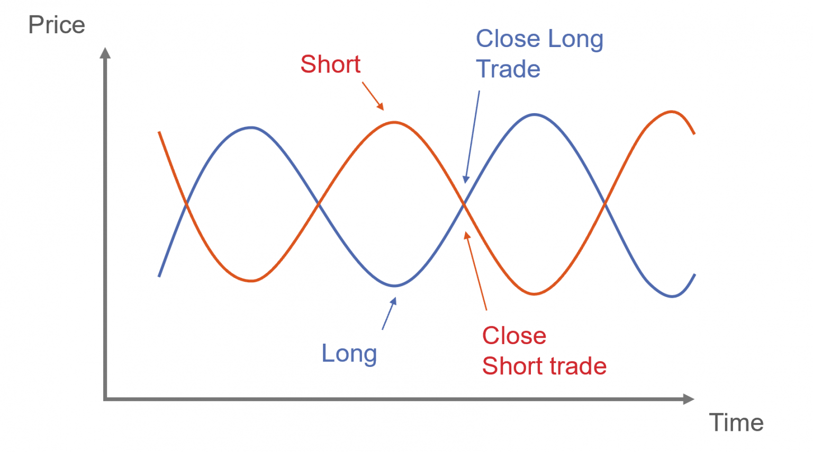

In the fast-paced world of finance, finding strategies that offer both robustness and profitability is crucial. Pairs trading is one such market-neutral trading strategy that has gained significant attention, particularly in algorithmic trading. This approach involves the simultaneous buying and selling of two highly correlated securities to exploit temporary anomalies in their price relationship. By maintaining a balanced long and short position, pairs trading seeks to provide a hedge against market movements, thereby reducing the overall exposure to market risk.

This article aims to provide an in-depth understanding of pairs trading, its mechanics, advantages, and its application within algorithmic trading frameworks. Originating from statistical arbitrage techniques, pairs trading utilizes historical data to identify price divergences between two securities and anticipates their reversion to historical norms. This method not only leverages statistical and technical analysis but also increasingly incorporates machine learning and artificial intelligence to enhance predictability and efficiency.



We'll explore how investment strategies like pairs trading are implemented using algorithms and highlight examples that underscore their effectiveness. Algorithmic models aid in the automating of trading processes, processing vast amounts of data to identify entry and exit points with precision. Moreover, the integration of advanced technologies enables the execution of trades at speeds and accuracies that are unfeasible for manual trading, thus offering a competitive edge in volatile markets.

Through these discussions, this article will shed light on pairs trading as a versatile and sophisticated tool for investors, elucidating how systematic strategies can optimize returns while mitigating risks associated with traditional investment approaches.

## Table of Contents

## Understanding Pairs Trading

Pairs trading is a market-neutral trading strategy that involves taking simultaneous long and short positions in two stocks, which exhibit a strong historical correlation. The strategy was introduced by technical analysts at Morgan Stanley in the mid-1980s and is based on the principles of statistical and technical analysis.

### Theoretical Framework

The core idea behind pairs trading is to identify two stocks whose historical price movements are highly correlated. This correlation suggests that the stocks have a persistent price relationship, despite short-term deviations. A pairs trade is executed when the prices of these stocks diverge; the trader assumes that they will eventually revert to their historical correlation.

Mathematically, if $P_A(t)$ and $P_B(t)$ represent the prices of stock A and stock B at time $t$, the idea is to look for situations where the spread $S(t) = P_A(t) - P_B(t)$ deviates significantly from its historical mean. The trading strategy involves buying the underperforming stock (go long) and shorting the outperforming stock, expecting that the spread will revert to its mean.

### Practical Implications

In practice, pairs trading requires several key steps:

1. **Selection of Stock Pairs**: Identifying pairs begins with statistical tools like correlation and cointegration tests that reveal stocks moving together. The Pearson correlation coefficient or more advanced methods like Engel-Granger cointegration tests can be utilized to determine suitable stock pairs.

2. **Modeling the Spread**: The behavior of the spread can be modeled to predict reversion. Simple methods use the historical mean and standard deviation of the spread, while more advanced approaches might employ Ornstein-Uhlenbeck processes to model mean-reverting behavior.

3. **Entry and Exit Points**: The decision to enter or exit a pair trade is crucial. Entry occurs when the spread deviates from the historical mean by a certain threshold, typically based on the standard deviation. Exit follows when the spread reverts to the mean or breaches a predefined risk management criterion.

4. **Monitoring and Risk Management**: Continuous monitoring is essential to manage risks such as market shifts that permanently alter the correlation between stocks. Tools like stop-loss and take-profit orders can be implemented to automate risk management.

```python
# Example of calculating spread and setting entry/exit thresholds in Python

import numpy as np

# Historical price data for stock A and B
price_A = np.array([100, 102, 104, 103, 107])
price_B = np.array([50, 51, 52, 52, 53])

# Calculate the spread
spread = price_A - price_B
mean_spread = np.mean(spread)
std_spread = np.std(spread)

# Define entry and exit thresholds
entry_threshold = mean_spread + std_spread
exit_threshold = mean_spread

# Identify entry and exit points
for t in range(len(spread)):
    if spread[t] > entry_threshold:
        print(f"Enter trade at time {t}, spread: {spread[t]}")
    elif spread[t] < exit_threshold:
      print(f"Exit trade at time {t}, spread: {spread[t]}")
```

Pairs trading is designed to capture mean-reversion while minimizing market exposure due to its market-neutral nature. However, selecting appropriate pairs and managing divergence are critical to mitigate risks associated with historical data assumptions and changing market conditions.

## Components of a Pairs Trading Strategy

A successful pairs trading strategy fundamentally requires identifying pairs of securities that exhibit a strong historical correlation. This process involves selecting the right assets, determining appropriate hedging ratios, and establishing entry and [exit](/wiki/exit-strategy) points based on statistical deviations. Each component is crucial for optimizing the strategy's efficiency and effectiveness.

Selecting the right assets typically begins with finding securities that are likely to move in tandem due to a shared economic [factor](/wiki/factor-investing), industry, or supply chain relationship. Identifying these pairs typically requires the analysis of historical price data. Traders utilize statistical methods such as the Pearson correlation coefficient to quantify the degree of correlation between two securities. High correlation values, close to ±1, indicate a stronger connection and are thus preferred for pairs trading.

Once potential pairs are identified, determining the hedging ratio is essential to balance the positions effectively. The hedging ratio is calculated by considering the historical price movements of the selected securities and adjusting the capital allocation to either security to maintain a market neutral position. This often involves the use of the formula:

$$
\text{Hedging Ratio} = \frac{\sigma_A}{\sigma_B}
$$

where $\sigma_A$ and $\sigma_B$ represent the standard deviation of the returns of securities A and B, respectively. This ratio helps in deciding how many units of the second security (B) should be traded for each unit of the first security (A), ensuring that the portfolio remains balanced even amidst market fluctuations.

Determining the entry and exit points is arguably the most dynamic component. These points are identified by measuring statistical deviations from the historical mean of the price spread between the two securities. A common approach is to employ Z-scores, which allow traders to quantify the divergence of the spread from its mean in terms of standard deviations:

$$
Z = \frac{(X - \mu)}{\sigma}
$$

where $X$ is the current spread, $\mu$ is the historical mean of the spread, and $\sigma$ is the standard deviation.

Modern traders enhance the selection process using advanced techniques such as Principal Component Analysis (PCA) and clustering algorithms. PCA is beneficial for dimensionality reduction, allowing traders to simplify the complex data structure by focusing on factors that contribute the most variance. Using PCA, traders can transform their dataset into principal components and identify key factors influencing movements in price data, thus refining the selection of viable pairs.

Clustering algorithms, such as K-means or hierarchical clustering, further aid in grouping securities based on similarity. These algorithms segment data into clusters representing securities that exhibit comparable patterns or behaviors, which can then serve as a foundation for pairing decisions. By leveraging these statistical and computational tools, traders can identify robust pairs and improve the precision of their strategies.

Together, these components form the bedrock of a well-constructed pairs trading strategy, allowing traders to systematically leverage high correlation, balanced hedging, and precise entry/exit decisions for market-neutral profits.

## Implementing Pairs Trading with Algorithmic Models

Algorithmic trading significantly enhances the implementation of pairs trading by automating the crucial task of identifying optimal entry and exit points. This approach leverages data-driven models to efficiently analyze and predict stock price movements, thereby streamlining trading operations.

### Linear Regression in Pairs Trading

Linear regression is a fundamental statistical method used in pairs trading to develop predictive models of stock price relationships. By establishing a linear equation of the form:

$$
y = \beta_0 + \beta_1x + \epsilon
$$

where $y$ and $x$ are the prices of two correlated stocks, $\beta_0$ is the intercept, $\beta_1$ is the slope of the regression line, and $\epsilon$ is the error term, traders can identify deviations from the expected correlation. When the relative price of one stock deviates significantly from the regression line, it signals a potential trade opportunity: short the overvalued stock and go long on the undervalued one, anticipating a reversion to the mean.

### Kalman Filters for Dynamic Adjustments

The Kalman filter is another powerful tool used to predict time-varying stock prices. Unlike static models, Kalman filters provide a recursive solution to estimate stock prices that can adapt to evolving market conditions. The filter consists of two main stages: the prediction step and the update step. In the prediction step, the future state of the stock prices is predicted based on past data, while the update step corrects this prediction based on new observed data. The equations characterizing the filter are:

1. **Prediction Step:**
$$
   \hat{x}_{k|k-1} = A \hat{x}_{k-1|k-1} + B u_k

$$
$$
   P_{k|k-1} = A P_{k-1|k-1} A^T + Q

$$

2. **Update Step:**
$$
   K_k = P_{k|k-1} H^T (H P_{k|k-1} H^T + R)^{-1}

$$
$$
   \hat{x}_{k|k} = \hat{x}_{k|k-1} + K_k (z_k - H \hat{x}_{k|k-1})

$$
$$
   P_{k|k} = (I - K_k H) P_{k|k-1}

$$

Where $\hat{x}$, $P$, $A$, $B$, $Q$, $K$, $H$, $R$, and $z$ represent the state estimate, error covariance, state transition matrix, control input matrix, process noise covariance, Kalman gain, observation model, measurement noise covariance, and measurement, respectively. Through seamless iterations, traders can dynamically adjust their positions in response to market changes.

### Advanced Algorithmic Models

Beyond linear regression and Kalman filters, traders employ more sophisticated models such as [machine learning](/wiki/machine-learning) algorithms to refine pairs trading strategies. Techniques like clustering and dimensionality reduction (e.g., PCA) can be used to identify the most promising pairs by examining correlations across multiple stocks. Reinforcement learning algorithms offer a framework where the strategy can continually learn and adapt based on trading outcomes.

For example, using Python, a trader can implement a linear regression model using libraries such as `scikit-learn`:

```python
from sklearn.linear_model import LinearRegression
import numpy as np

# Sample price data for two stocks
stock_x = np.array([100, 101, 102, 105, 108])
stock_y = np.array([10, 11, 12, 14, 15])

# Reshape data
X = stock_x.reshape(-1, 1)

# Instantiate and fit the model
model = LinearRegression().fit(X, stock_y)

# Predict stock_y prices
predicted_y = model.predict(X)
```

Thus, algorithmic models empower traders to implement more agile and responsive pairs trading strategies by leveraging predictive algorithms that can readily adapt to a variety of market conditions.

## Evaluation of Pairs Trading Strategies

Performance metrics are fundamental in assessing the effectiveness of pairs trading strategies, providing insights into the risk and reward structure of these financial models. Key metrics such as alpha, beta, and the Sharpe ratio are widely utilized to evaluate the performance and viability of pairs trading systems.

Alpha measures the excess return of an investment relative to the return of a benchmark index, indicating the active return on an investment. In pairs trading, alpha is used to assess how much the strategy outperforms or underperforms relative to the expected correlation-adjusted returns.

Beta represents the sensitivity of an investment's returns to movements in the benchmark index, reflecting the degree of exposure to systematic market risk. In the context of pairs trading, beta helps determine the hedging effectiveness between the paired stocks and the suitability of the pairs.

The Sharpe ratio evaluates the risk-adjusted return of a trading strategy, calculated as the difference between the strategy's returns and the risk-free rate, divided by the standard deviation of the excess returns. A higher Sharpe ratio indicates a more attractive risk-adjusted performance.

Different pairs trading models, such as those using Kalman Filters and Linear Regression, can be compared using these metrics. Kalman Filters are used to dynamically estimate the state of a system, allowing traders to track and predict stock price movements effectively. This model adapts to changing market conditions by updating its predictions based on new data, making it suitable for real-time trading.

In contrast, Linear Regression is a more static method, utilizing historical data to establish and test relationships between the paired stocks. This model is less responsive to immediate market changes but can provide reliable estimates under stable market conditions.

To illustrate the application of these models in pairs trading, consider [backtesting](/wiki/backtesting) results obtained using a Python-based approach:

```python
import numpy as np
import pandas as pd
from statsmodels.tsa.stattools import adfuller
from statsmodels.regression.linear_model import OLS
from pykalman import KalmanFilter

def backtest_pairs_trading(stock_a, stock_b, start_date, end_date):
    # Load price data
    data_a = pd.read_csv(f'data/{stock_a}.csv', index_col='Date', parse_dates=True)[start_date:end_date]
    data_b = pd.read_csv(f'data/{stock_b}.csv', index_col='Date', parse_dates=True)[start_date:end_date]

    # Calculate spread using linear regression
    model = OLS(data_a['Close'], data_b['Close'])
    hedge_ratio = model.fit().params[0]
    spread = data_a['Close'] - hedge_ratio * data_b['Close']

    # Kalman Filter for dynamic hedge ratio
    kf = KalmanFilter(n_dim_obs=1, n_dim_state=2, initial_state_mean=[0, 0],
                      initial_state_covariance=np.eye(2),
                      transition_matrices=np.eye(2),
                      observation_matrices=np.array([[1, data_b['Close'][0]]]))
    state_means, _ = kf.filter(data_a['Close'].values)
    kalman_spread = data_a['Close'] - state_means[:, 1] * data_b['Close']

    # Evaluate performance with the Sharpe ratio
    sharpe_ratio_lr = (spread.mean() / spread.std())
    sharpe_ratio_kf = (kalman_spread.mean() / kalman_spread.std())

    return sharpe_ratio_lr, sharpe_ratio_kf

# Example Usage
backtest_pairs_trading('AAPL', 'MSFT', '2020-01-01', '2023-01-01')
```

In this Python script, the Linear Regression model calculates a static hedge ratio, whereas the Kalman Filter updates the hedge ratio dynamically, reflecting the real-time market dynamics. By comparing the Sharpe ratios from these approaches, traders can evaluate the risk-adjusted returns of each model.

Backtesting results demonstrate the importance of selecting the appropriate model based on trading objectives and market conditions. Kalman Filters may provide an edge in volatile markets due to their adaptability, whereas Linear Regression may be preferred for stable market environments. Ultimately, understanding and applying these metrics and models empower traders to optimize and refine their pairs trading strategies for better performance and profitability.

## Real-World Examples and Case Studies

Pairs trading has shown its merits in real-world applications, with numerous examples demonstrating its effectiveness and exposing its challenges. An insightful case study involves the deployment of pairs trading strategies by hedge funds and large financial institutions during periods of economic [volatility](/wiki/volatility-trading-strategies). These entities take advantage of price discrepancies in correlated securities to hedge against systemic market risks.

One illustrative example is the 2007-2008 financial crisis. In this volatile market, pairs trading strategies were used extensively to mitigate losses. Funds identified pairs of financially stable companies with historically strong price correlations. For instance, pairs involving consumer staples, which tend to be less volatile during economic downturns, were favored. Traders exploited short-term mispricings induced by market panic, betting on a return to equilibrium as market conditions stabilized.

A case study in the technology sector during this period observed the pairing of Intel and AMD, two companies with a historically strong positive correlation due to their similar business models. During the crisis, irrational investor behavior led to diverging stock prices despite unchanged fundamentals. A pairs trading strategy capitalized on these temporary inefficiencies by shorting the overperforming stock and taking a long position on the underperforming one, yielding a profitable convergence post-crisis.

Beyond economic downturns, pairs trading has been tested in less volatile conditions. A study conducted in the European markets from 2010 to 2015 investigated companies within the banking sector, which are inherently volatile due to regulatory changes and economic policies. By using statistical tools such as cointegration tests and Kalman Filters, traders identified pairs that exhibited mean-reverting characteristics, facilitating effective pairs trading strategies that generated alpha even in stable market conditions.

However, the application of pairs trading strategies is not without challenges. Identifying suitable pairs is complex and relies on robust statistical analysis and market intuition. In several instances, traditionally correlated stocks have decoupled due to changes in industry dynamics or external economic factors, leading to potential losses. Moreover, during extreme market conditions, the assumption of mean reversion can be temporarily invalid, necessitating rigorous risk management practices.

Traders have adapted by integrating machine learning and AI technologies to enhance pairs selection processes. For instance, using clustering algorithms and dynamic models allows for adaptive strategy modifications when correlations weaken or break. These sophisticated methods improve resilience to real-world challenges faced in pairs trading, promising better alignment with rapid market shifts.

In summary, real-world applications of pairs trading demonstrate its potential to capture [arbitrage](/wiki/arbitrage) opportunities while highlighting the necessity for advanced analytical and risk management techniques to address inherent challenges, especially in dynamic and volatile market environments.

## Advantages and Challenges of Pairs Trading

Pairs trading, as a market-neutral strategy, provides several advantages, chief among them being the mitigation of systematic market risk. By going long on one security and short on another, traders can neutralize the effects of overall market movements, thereby focusing on the individual performance of the paired securities. This isolation enables the trader to target specific arbitrage opportunities arising from temporary mispricings or deviations in historically correlated stocks.

One of the main benefits of pairs trading is its potential for consistent returns irrespective of market direction, achieved through the exploitation of the mean-reverting behavior of stock prices. When stocks deviate from their historical mean, pairs trading capitalizes on the anticipated convergence by establishing positions designed to profit from this reversion.

Despite these advantages, pairs trading is not without its challenges. Finding suitable pairs with high correlations is a fundamental difficulty. Stock relationships are not static, and correlations can weaken over time due to changing economic conditions or company-specific developments. Traders must therefore continuously monitor and adjust their pairs to maintain the strategy's efficacy. Utilizing statistical methods, such as cointegration analysis, can assist in selecting pairs that exhibit stable long-term relationships.

Another significant challenge is the reliance on historical data to predict future movements. The assumption that past relationships will persist in the future might not always hold true, especially in volatile markets or during structural breaks. This reliance exposes traders to risks of model overfitting, where a strategy performs well in backtesting but falters in real-world application. 

To overcome these challenges and optimize their strategies, traders should employ rigorous statistical analyses and adapt their models to account for changing market dynamics. Leveraging technology, traders can use machine learning algorithms to dynamically assess and predict pair relationships, thereby refining entry and exit signals.

Incorporating robust risk management measures is also crucial. For instance, setting predefined stop-loss levels can prevent excessive losses if trades do not go as expected. Furthermore, continuous research and strategy testing, both in historical and live environments, can improve the robustness of pairs trading implementations.

In summary, while pairs trading offers a compelling approach to capturing market inefficiencies, it requires careful pair selection and adaptive algorithms to address its inherent challenges, thereby increasing the probability of achieving sustainable profitability.

## Conclusion

Pairs trading remains an essential component within [algorithmic trading](/wiki/algorithmic-trading) strategies, offering a mechanism to achieve market neutrality and capitalize on [statistical arbitrage](/wiki/statistical-arbitrage) opportunities. The robustness of pairs trading primarily lies in understanding the relationships between asset pairs and accurately predicting their mean-reverting behavior. Successful implementation demands a thorough grasp of statistical methods and a deep engagement with data-driven analytical techniques. Leveraging historical data, quantitative analysis, and sophisticated algorithms allows traders to identify pairs and manage trades effectively, fostering a systematic approach to risk management and profit maximization.

One of the primary advantages of pairs trading is its ability to reduce exposure to market-wide risks. By simultaneously holding a long position in one security and a short position in its correlated pair, traders are shielded against directional market movements, focusing instead on the relative performance between the two. The strategy's market-neutral nature makes it adaptable across various market conditions, particularly appealing during periods of economic uncertainty.

However, the efficacy of pairs trading is not without challenges. The strategy heavily relies on historical correlations, which may not persist under changing market dynamics. Furthermore, identifying optimal pairs and precise entry and exit points necessitates high-level computational tools and analytical rigor. As the financial markets become increasingly competitive, integrating advanced technologies such as [artificial intelligence](/wiki/ai-artificial-intelligence) (AI) and machine learning (ML) could provide a significant edge. These technologies enhance pattern recognition capabilities and improve predictive accuracy, allowing for more dynamic adjustment of trading parameters.

By incorporating AI and ML, future pairs trading strategies could not only refine the selection process through adaptive algorithms but also enable real-time decision-making based on vast amounts of market data. This evolution has the potential to further optimize trading efficiencies and address some of the extant limitations by providing enhanced insights and improving trade execution.

In conclusion, as technology continues to evolve, pairs trading stands to gain from these advancements. Modern traders who adopt a sophisticated approach, combining historical insights with cutting-edge technology and rigorous analytics, can fully exploit the advantages that pairs trading offers, maintaining its relevance and effectiveness in the ever-evolving landscape of algorithmic trading.

## References & Further Reading

[1]: Gatev, E. G., Goetzmann, W. N., & Rouwenhorst, K. G. (2006). ["Pairs Trading: Performance of a Relative-Value Arbitrage Rule."](https://www.nber.org/papers/w7032) Journal of Finance, 61(5), 2155-2182.

[2]: Vidyamurthy, G. (2004). ["Pairs Trading: Quantitative Methods and Analysis."](https://archive.org/details/pairstradingquan0000vidy) John Wiley & Sons.

[3]: Elliot, R. J., van der Hoek, J., & Malcolm, W. P. (2005). ["Pairs Trading."](http://stat.wharton.upenn.edu/~steele/Courses/434/434Context/PairsTrading/PairsTradingQFin05.pdf) Quantitative Finance, 5(3), 271-276.

[4]: Lopez de Prado, M. (2018). ["Advances in Financial Machine Learning."](https://www.amazon.com/Advances-Financial-Machine-Learning-Marcos/dp/1119482089) John Wiley & Sons.

[5]: Chan, E. (2009). ["Quantitative Trading: How to Build Your Own Algorithmic Trading Business."](https://github.com/ftvision/quant_trading_echan_book) John Wiley & Sons.

[6]: Avellaneda, M., & Lee, J. H. (2010). ["Statistical Arbitrage in the U.S. Equities Market."](https://papers.ssrn.com/sol3/papers.cfm?abstract_id=1153505) Quantitative Finance, 10(7), 761-782.

[7]: Jansen, S. (2020). ["Machine Learning for Algorithmic Trading: Predictive Models to Extract Signals from Market and Alternative Data for Systematic Trading Strategies with Python."](https://www.amazon.com/Machine-Learning-Algorithmic-Trading-alternative/dp/1839217715) Packt Publishing.

[8]: Engel, R. F., & Granger, C. W. J. (1987). ["Co-integration and Error Correction: Representation, Estimation, and Testing."](https://www.jstor.org/stable/pdf/1913236.pdf) Econometrica, 55(2), 251-276.