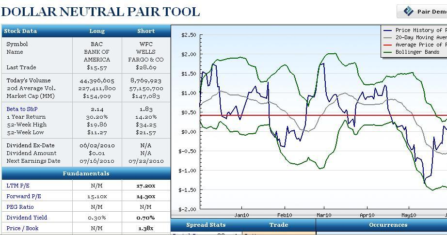

## Table of Contents

## What is pairs trading?

Pairs trading is a trading strategy where you buy one stock and sell another stock at the same time. The idea is to pick two stocks that usually move together in price. For example, you might choose two companies in the same industry, like two car makers. When the prices of these two stocks start to move away from each other, you can make a trade. You buy the stock that has gone down and sell the stock that has gone up. The goal is to make money when the prices come back together.

This strategy can help reduce risk because you are not betting on the overall market going up or down. Instead, you are betting that the two stocks will return to their usual relationship. If you do it right, you can make money even if the market is going down. However, it's not always easy. You need to be good at picking the right pairs and knowing when to make your trades. If the two stocks don't come back together like you expect, you could lose money.

## How does pairs trading work?

Pairs trading works by finding two stocks that usually move together in price, like two companies in the same industry. When the prices of these stocks start to move away from each other, you make a trade. You buy the stock that has gone down in price and sell the stock that has gone up. The idea is to bet that the prices will come back together. If they do, you can make money from the difference.

For example, let's say you are looking at two car companies, Company A and Company B. Normally, their stock prices move together. But one day, Company A's stock price goes up a lot while Company B's stays the same. You think this difference won't last, so you sell Company A's stock and buy Company B's stock. If Company A's price goes back down and Company B's goes up, you can make money from both trades. This strategy can help reduce risk because you're not betting on the whole market going up or down, just that these two stocks will return to their usual relationship.

## What are the key principles behind pairs trading?

Pairs trading is based on the idea that two stocks that usually move together will eventually return to their normal relationship. When the prices of these two stocks start to move away from each other, it's a chance to make a trade. You buy the stock that has gone down and sell the stock that has gone up. The goal is to make money when the prices come back together. This strategy works best with stocks from the same industry or sector, because they often have similar factors affecting their prices.

The key to pairs trading is finding the right pair of stocks and knowing when to make your trades. You need to watch the stocks closely and understand their usual relationship. When the difference in their prices gets too big, that's when you make your move. But it's not always easy. If the stocks don't come back together like you expect, you could lose money. So, it's important to have a good plan and be ready to adjust if things don't go as planned.

## What types of securities are typically used in pairs trading?

Pairs trading usually involves stocks from the same industry or sector. This is because stocks in the same industry often have similar factors affecting their prices, like changes in the economy or new laws. For example, you might pair two car companies or two tech companies. The idea is to find two stocks that usually move together but have started to move apart.

Sometimes, pairs trading can also use other types of securities like exchange-traded funds (ETFs) or even futures contracts. ETFs are like baskets of stocks that track a certain part of the market, so they can be good for pairs trading if you want to bet on a whole industry instead of just two companies. Futures contracts are agreements to buy or sell something at a future date, and they can be used in pairs trading if you want to bet on the price difference between two related commodities or indexes.

## How do you identify a pair of stocks for trading?

To identify a pair of stocks for trading, you first need to find two companies that are in the same industry or sector. This is because companies in the same industry often face similar economic conditions, regulations, and market trends. For example, you might choose two tech companies like Apple and Microsoft, or two car makers like Ford and General Motors. The key is to pick stocks that usually move together in price over time.

Once you have chosen your pair, you need to look at their historical price data. You want to see how closely their prices have moved together in the past. This can be done by calculating the correlation between the two stocks. A high correlation means the stocks have moved together a lot, which is what you want for pairs trading. After you find a pair with a strong historical correlation, you watch for times when their prices start to move apart. When this happens, you can buy the stock that has gone down and sell the stock that has gone up, betting that they will return to their usual relationship.

## What statistical methods are used to find cointegration in pairs trading?

To find cointegration in pairs trading, you use a statistical method called the Engle-Granger two-step method. This method helps you see if two stocks move together in the long run, even if they might be different in the short term. First, you run a regression to find the relationship between the two stock prices. This means you try to predict one stock's price using the other stock's price. After that, you check the residuals, which are the differences between the actual prices and the prices your regression predicted. If these residuals are stationary, meaning they don't have a trend and stay around a constant value over time, then the two stocks are cointegrated.

Another method you can use is the Johansen test. This test is more complex, but it can check for cointegration between more than two stocks at once. It looks at the whole system of stock prices to see if there's a long-term relationship among them. Like the Engle-Granger method, the Johansen test checks for stationarity in the residuals, but it does this in a way that can handle multiple relationships at the same time. Both methods are important tools for pairs traders because they help find pairs of stocks that will likely move back to their usual relationship, which is key to making successful trades.

## How do you calculate the spread in pairs trading?

In pairs trading, the spread is the difference between the prices of the two stocks you're trading. To calculate the spread, you subtract the price of one stock from the price of the other stock. For example, if you're trading Company A and Company B, and Company A's stock is $50 and Company B's stock is $40, the spread is $50 - $40 = $10. You can also look at the spread as a ratio or percentage, but the basic idea is the same: it's the difference between the two prices.

Once you have the spread, you watch it to see if it changes. When the spread gets bigger or smaller than usual, it might be a good time to make a trade. If the spread is bigger, you might buy the cheaper stock and sell the more expensive one, betting that the spread will go back to normal. If the spread is smaller, you might do the opposite. The key is to understand the usual size of the spread and be ready to act when it changes.

## What are the common entry and exit strategies in pairs trading?

In pairs trading, common entry strategies involve watching the spread between the two stocks. When the spread gets bigger than usual, that's often a sign to enter a trade. You buy the stock that has gone down in price and sell the stock that has gone up. This is called going long on the cheaper stock and shorting the more expensive one. You're betting that the spread will go back to normal, so the cheaper stock will go up and the more expensive one will go down. Another way to enter is by using statistical signals, like when the spread moves more than two standard deviations away from its average. This tells you the spread is unusually big, and it might be a good time to trade.

Exit strategies in pairs trading are about knowing when to close your trades. One common way is to set a target for the spread. When the spread gets back to a certain level, you close your trades to lock in your profits. Another way is to use a stop-loss order, which helps limit your losses if the trade doesn't go as planned. If the spread keeps getting bigger instead of going back to normal, the stop-loss order will automatically close your trades to stop you from losing too much money. It's important to have clear entry and exit rules to make sure you're trading smartly and not just guessing.

## How do you manage risk in pairs trading?

Managing risk in pairs trading is all about being careful and having a plan. One way to do this is by setting stop-loss orders. A stop-loss order is like a safety net. It tells your broker to close your trade if the price moves against you too much. This helps you not lose too much money if the stocks don't move back together like you thought they would. Another way to manage risk is by not putting all your money into one trade. It's better to spread your money across different trades. This way, if one trade goes wrong, you won't lose everything.

It's also important to keep an eye on how much you're trading. Don't use too much money on one trade. This is called position sizing, and it helps you keep your risk under control. You should also always be ready to change your plan if things don't go as expected. The market can be unpredictable, so being flexible and ready to adjust your trades can help you manage risk better. By being careful and having a good plan, you can make pairs trading safer and more likely to succeed.

## What are the advantages of pairs trading over other trading strategies?

Pairs trading has some big advantages over other trading strategies. One big plus is that it can help you make money even when the whole market is going down. With pairs trading, you're not betting on the market going up or down. You're betting that two stocks will go back to moving together like they usually do. This means you can make money in different kinds of markets, not just when things are going well. Another good thing about pairs trading is that it can help you manage risk better. By trading two stocks at the same time, you're balancing your bets. If one stock goes down a lot, the other stock might go up, so you don't lose as much money.

Another advantage of pairs trading is that it uses math and data to help you make better choices. By looking at how two stocks have moved together in the past, you can make smarter trades. This can make your trading more scientific and less like guessing. Plus, pairs trading can help you focus on specific industries or sectors. Instead of trying to understand the whole market, you can just look at two companies in the same field. This can make your trading simpler and more targeted.

## How can pairs trading be optimized using advanced algorithms?

Pairs trading can be made better by using fancy math and computer programs called advanced algorithms. These algorithms can look at a lot of data quickly and find patterns that people might miss. For example, they can use something called machine learning to learn from past trades and get better at picking the right pairs of stocks. They can also use something called high-frequency trading to make trades very fast, which can help catch small changes in the spread between the two stocks. By using these tools, traders can make smarter choices and maybe make more money.

Another way to use advanced algorithms in pairs trading is by using them to find the best times to start and stop trades. These algorithms can look at things like how much the spread between the two stocks is moving around, or how often it goes back to normal. They can also help set up stop-loss orders in a smart way, so you don't lose too much money if things go wrong. By using these algorithms, traders can make their pairs trading more accurate and less risky, which can lead to better results over time.

## What are some real-world examples of successful pairs trading strategies?

One famous example of pairs trading success happened in the 1980s with a group called Morgan Stanley's Quantitative Strategies Group. They used pairs trading to make a lot of money. They looked at pairs of stocks like Royal Dutch and Shell, which are two big oil companies. These stocks usually moved together, but sometimes they would move apart. When that happened, the group would buy the cheaper stock and sell the more expensive one. They made big profits when the prices came back together.

Another example is from a hedge fund called DE Shaw. They used advanced math and computers to find good pairs of stocks to trade. They looked at things like how much the stocks moved together in the past and how the spread between them changed. By using these methods, DE Shaw was able to make successful trades and earn a lot of money. Their strategy showed how using data and technology can make pairs trading work even better.

## How does pairs trading work?

Pairs trading is a strategic investment approach focused on exploiting the price dynamics between two securities that have historically shown a correlated movement. This correlation suggests a relationship in their price patterns, making these paired assets ideal for this trading strategy. The essence of pairs trading lies in the notion that when the historical price relationship between these two securities deviates, it will eventually revert to the mean, providing an opportunity to profit from this convergence.

The process begins with the identification of a pair of assets whose prices have been observed to move together over time. This historical comovement is crucial as it forms the basis for predicting future interactions between the two assets. When the price spread between the two assets widens or narrows beyond a typical range, it signals a potential mispricing. At this juncture, traders can buy the underperforming asset (with the expectation of its price increase) and short the outperforming one (anticipating a price decrease), capitalizing on the eventual convergence of their price relationship.

Mathematically, the difference in the value of the two co-moving assets at any time 't' can be represented as:

$$
s(t) = p_1(t) - p_2(t)
$$

where $p_1(t)$ and $p_2(t)$ are the prices of the two assets at time 't'. The strategy relies on this spread, $s(t)$, reverting to its historical mean, $\bar{s}$, which is calculated over a significant period. The mean reversion principle assumes that deviations from this mean are temporary and that the spread will return to its mean:

$$
E[s(t)] \rightarrow \bar{s}
$$

The effectiveness of this strategy depends significantly on the accurate assessment of the correlation between the assets and the assumption that their prices will revert to historical averages. Traders employ statistical and mathematical tools to confirm the stability and validity of this relationship. Methods such as cointegration tests can be utilized to ensure the selected pairs have a long-term equilibrium relationship, supporting the premise of eventual convergence.

In summary, pairs trading operates on the principle that financial markets are inefficient, presenting opportunities for profit when historically correlated asset prices deviate. By systematically identifying these deviations and anticipating their resolution, pairs traders aim to exploit market inefficiencies while maintaining a market-neutral stance, which diminishes exposure to broader market risks. This strategy requires precision and a robust understanding of historical price behaviors, which are instrumental in predicting future market movements for the paired assets.

## What is Algorithmic Pairs Trading?

Algorithmic trading involves the use of automated systems and software to execute pairs trading strategies with enhanced efficiency. These systems leverage statistical models that continuously monitor market data for price deviations, allowing traders to capitalize on even the slightest inefficiencies within the market. The integration of algorithms in pairs trading confers a significant advantage, primarily by significantly reducing the reaction time to market movements, enabling trades to be executed with precision and speed.

A key component of algorithmic pairs trading is the reliance on statistical methods to identify and exploit price discrepancies between historically correlated assets. For instance, a common statistical approach involves the implementation of the z-score in monitoring the spread between two related financial instruments:

$$
z = \frac{(X_t - Y_t) - \text{mean}(X_t - Y_t)}{\text{std}(X_t - Y_t)}
$$

Where $X_t$ and $Y_t$ represent the prices of the two assets at time $t$, and $\text{mean}(X_t - Y_t)$ and $\text{std}(X_t - Y_t)$ denote the historical average and standard deviation of the price spread, respectively. A z-score that exceeds a predetermined threshold can trigger a trade, wherein the underperforming asset is purchased, and the outperforming asset is sold short, anticipating a reversion to the mean.

Algorithmic systems utilize these statistical insights to make trading decisions swiftly, which is crucial in taking advantage of short-lived market anomalies. In practice, implementing such systems may involve programming in languages such as Python, owing to its comprehensive libraries for data analysis and [machine learning](/wiki/machine-learning). An example code snippet for executing a simple pairs trade based on z-score might look as follows:

```python
import numpy as np

def compute_z_score(series_a, series_b):
    spread = series_a - series_b
    mean = np.mean(spread)
    std_dev = np.std(spread)
    z_score = (spread[-1] - mean) / std_dev
    return z_score

if compute_z_score(asset_a_prices, asset_b_prices) > threshold:
    buy(asset_a)
    sell_short(asset_b)
```

Algorithmic pairs trading systems thus streamline the decision-making process, allowing traders to systematically exploit market conditions while mitigating human errors and biases. The automation provided by such systems enables the continuous and disciplined execution of trading strategies, which is indispensable for maintaining competitive advantage in fast-paced markets.

## What are the steps to designing a pairs trading strategy?

Identifying and executing a successful pairs trading strategy relies on a structured approach that involves both qualitative and quantitative analysis. The first step in designing such a strategy is to identify pairs of assets with a historical correlation, indicating that their prices have historically moved in tandem. These asset pairs should also exhibit potential for future convergence in their pricing relationship. Historical data analysis is crucial at this stage, helping traders to look for assets that have shown consistent mean-reverting behavior.

Once potential pairs are identified, the next crucial phase involves visual testing. This includes charting historical price data to observe any patterns of divergence and subsequent convergence. By back-testing potential pairs, traders can evaluate how these pairs have behaved during past divergences, offering insights into possible future performance. Back-testing serves to validate the consistency of mean reversion, which is the cornerstone of pairs trading strategies.

To enhance the precision of predictions, quantitative models like cointegration tests and Ornstein-Uhlenbeck processes can be incorporated. Cointegration involves statistical tests to ascertain whether a long-term equilibrium relationship exists between two time series. Mathematically, if $x_t$ and $y_t$ are two non-stationary time series, they are cointegrated if a linear combination like $z_t = x_t - \beta y_t$ is stationary. Meanwhile, the Ornstein-Uhlenbeck process models mean-reverting stochastic processes and can be defined as:

$$
dX_t = \theta (\mu - X_t) dt + \sigma dW_t
$$

where $X_t$ is the process value, $\theta$ is the speed of reversion, $\mu$ is the long-term mean, $\sigma$ is the volatility, and $dW_t$ is the Wiener process. These models help forecast spread behavior and determine entry and exit points based on statistical thresholds.

Implementing these strategies can be optimized by utilizing algorithmic platforms such as QuantConnect, which provide environments for [backtesting](/wiki/backtesting) and executing trades efficiently. These platforms support historical data retrieval, strategy simulation, and facilitate the execution of trades via automated algorithms. Traders can use Python to develop scripts that automate the identification of divergences and convergence trades, such as the following simplified code snippet:

```python
import numpy as np
import statsmodels.api as sm

def is_cointegrated(series1, series2):
    coint_result = sm.tsa.stattools.coint(series1, series2)
    return coint_result[1] < 0.05  # p-value less than 0.05 indicates cointegration

# Example usage with historical data series
asset1_prices = np.random.random(100)  # Replace with actual historical data
asset2_prices = np.random.random(100)  # Replace with actual historical data

if is_cointegrated(asset1_prices, asset2_prices):
    print("The asset pair is cointegrated and suitable for pairs trading.")
```

The combination of historical analysis, quantitative modeling, and algorithmic execution forms the groundwork of a robust pairs trading strategy, offering the potential for profitable trading while minimizing exposure to market-wide risks.

## References & Further Reading

[1]: Gatev, E. G., Goetzmann, W. N., & Rouwenhorst, K. G. (2006). ["Pairs Trading: Performance of a Relative Value Arbitrage Rule."](https://www.nber.org/papers/w7032) The Review of Financial Studies, 19(3), 797-827.

[2]: Vidyamurthy, G. (2004). ["Pairs Trading: Quantitative Methods and Analysis."](https://archive.org/details/pairstradingquan0000vidy) Wiley Finance.

[3]: Elliott, R. J., Van der Hoek, J., & Malcolm, W. P. (2005). ["Pairs Trading."](http://stat.wharton.upenn.edu/~steele/Courses/434/434Context/PairsTrading/PairsTradingQFin05.pdf) Quantitative Finance, 5(3), 271-276.

[4]: Chan, E. P. (2009). ["Quantitative Trading: How to Build Your Own Algorithmic Trading Business."](https://github.com/ftvision/quant_trading_echan_book) Wiley Trading.

[5]: Pole, A. (2007). ["Statistical Arbitrage: Algorithmic Trading Insights and Techniques."](https://books.google.com/books/about/Statistical_Arbitrage.html?id=xSjXTnKqIKoC) Wiley Finance.

[6]: Avellaneda, M., & Lee, J.-H. (2010). ["Statistical Arbitrage in the U.S. Equities Market."](https://papers.ssrn.com/sol3/papers.cfm?abstract_id=1153505) Quantitative Finance, 10(7), 1-22.