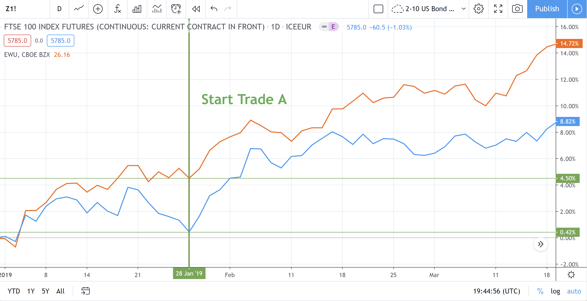

Pairs trading is a sophisticated market-neutral trading strategy designed to generate profits under various market conditions through statistical arbitrage. Originating from the innovative work of Morgan Stanley's quantitative group in the 1980s, this strategy leverages the concept of convergence trading by exploiting price discrepancies between historically correlated financial instruments. The core mechanism involves simultaneously taking a long position in one asset and a short position in another, capitalizing on the expectation that their price relationship will revert to a historical norm.

The efficacy of pairs trading lies in its focus on the relative price movements of a selected pair of securities. Traders monitor these securities for deviations from their established price relationships. When the correlation diverges beyond a defined threshold, a trading opportunity is identified, prompting the execution of trades. The assumption is that the identified divergence is temporary and the prices will eventually converge, allowing the trader to capture a profit from the closing of positions as the spread diminishes.



In the decades since its inception, pairs trading has become an essential strategy for institutional firms, hedge funds, and investment banks. Its appeal is rooted in its market-neutral nature, enabling traders to profit in various market conditions without taking a directional stance. As it does not rely on broader market movements, pairs trading offers potential advantages in both bull and bear markets, contributing to its widespread adoption in the financial industry.

## Table of Contents

## How Pairs Trading Works

Pairs trading is a strategic investment approach focused on exploiting the price dynamics between two securities that have historically shown a correlated movement. This correlation suggests a relationship in their price patterns, making these paired assets ideal for this trading strategy. The essence of pairs trading lies in the notion that when the historical price relationship between these two securities deviates, it will eventually revert to the mean, providing an opportunity to profit from this convergence.

The process begins with the identification of a pair of assets whose prices have been observed to move together over time. This historical comovement is crucial as it forms the basis for predicting future interactions between the two assets. When the price spread between the two assets widens or narrows beyond a typical range, it signals a potential mispricing. At this juncture, traders can buy the underperforming asset (with the expectation of its price increase) and short the outperforming one (anticipating a price decrease), capitalizing on the eventual convergence of their price relationship.

Mathematically, the difference in the value of the two co-moving assets at any time 't' can be represented as:

$$
s(t) = p_1(t) - p_2(t)
$$

where $p_1(t)$ and $p_2(t)$ are the prices of the two assets at time 't'. The strategy relies on this spread, $s(t)$, reverting to its historical mean, $\bar{s}$, which is calculated over a significant period. The mean reversion principle assumes that deviations from this mean are temporary and that the spread will return to its mean:

$$
E[s(t)] \rightarrow \bar{s}
$$

The effectiveness of this strategy depends significantly on the accurate assessment of the correlation between the assets and the assumption that their prices will revert to historical averages. Traders employ statistical and mathematical tools to confirm the stability and validity of this relationship. Methods such as cointegration tests can be utilized to ensure the selected pairs have a long-term equilibrium relationship, supporting the premise of eventual convergence.

In summary, pairs trading operates on the principle that financial markets are inefficient, presenting opportunities for profit when historically correlated asset prices deviate. By systematically identifying these deviations and anticipating their resolution, pairs traders aim to exploit market inefficiencies while maintaining a market-neutral stance, which diminishes exposure to broader market risks. This strategy requires precision and a robust understanding of historical price behaviors, which are instrumental in predicting future market movements for the paired assets.

## Algorithmic Pairs Trading

Algorithmic trading involves the use of automated systems and software to execute pairs trading strategies with enhanced efficiency. These systems leverage statistical models that continuously monitor market data for price deviations, allowing traders to capitalize on even the slightest inefficiencies within the market. The integration of algorithms in pairs trading confers a significant advantage, primarily by significantly reducing the reaction time to market movements, enabling trades to be executed with precision and speed.

A key component of algorithmic pairs trading is the reliance on statistical methods to identify and exploit price discrepancies between historically correlated assets. For instance, a common statistical approach involves the implementation of the z-score in monitoring the spread between two related financial instruments:

$$
z = \frac{(X_t - Y_t) - \text{mean}(X_t - Y_t)}{\text{std}(X_t - Y_t)}
$$

Where $X_t$ and $Y_t$ represent the prices of the two assets at time $t$, and $\text{mean}(X_t - Y_t)$ and $\text{std}(X_t - Y_t)$ denote the historical average and standard deviation of the price spread, respectively. A z-score that exceeds a predetermined threshold can trigger a trade, wherein the underperforming asset is purchased, and the outperforming asset is sold short, anticipating a reversion to the mean.

Algorithmic systems utilize these statistical insights to make trading decisions swiftly, which is crucial in taking advantage of short-lived market anomalies. In practice, implementing such systems may involve programming in languages such as Python, owing to its comprehensive libraries for data analysis and [machine learning](/wiki/machine-learning). An example code snippet for executing a simple pairs trade based on z-score might look as follows:

```python
import numpy as np

def compute_z_score(series_a, series_b):
    spread = series_a - series_b
    mean = np.mean(spread)
    std_dev = np.std(spread)
    z_score = (spread[-1] - mean) / std_dev
    return z_score

if compute_z_score(asset_a_prices, asset_b_prices) > threshold:
    buy(asset_a)
    sell_short(asset_b)
```

Algorithmic pairs trading systems thus streamline the decision-making process, allowing traders to systematically exploit market conditions while mitigating human errors and biases. The automation provided by such systems enables the continuous and disciplined execution of trading strategies, which is indispensable for maintaining competitive advantage in fast-paced markets.

## Steps to Designing a Pairs Trading Strategy

Identifying and executing a successful pairs trading strategy relies on a structured approach that involves both qualitative and quantitative analysis. The first step in designing such a strategy is to identify pairs of assets with a historical correlation, indicating that their prices have historically moved in tandem. These asset pairs should also exhibit potential for future convergence in their pricing relationship. Historical data analysis is crucial at this stage, helping traders to look for assets that have shown consistent mean-reverting behavior.

Once potential pairs are identified, the next crucial phase involves visual testing. This includes charting historical price data to observe any patterns of divergence and subsequent convergence. By back-testing potential pairs, traders can evaluate how these pairs have behaved during past divergences, offering insights into possible future performance. Back-testing serves to validate the consistency of mean reversion, which is the cornerstone of pairs trading strategies.

To enhance the precision of predictions, quantitative models like cointegration tests and Ornstein-Uhlenbeck processes can be incorporated. Cointegration involves statistical tests to ascertain whether a long-term equilibrium relationship exists between two time series. Mathematically, if $x_t$ and $y_t$ are two non-stationary time series, they are cointegrated if a linear combination like $z_t = x_t - \beta y_t$ is stationary. Meanwhile, the Ornstein-Uhlenbeck process models mean-reverting stochastic processes and can be defined as:

$$
dX_t = \theta (\mu - X_t) dt + \sigma dW_t
$$

where $X_t$ is the process value, $\theta$ is the speed of reversion, $\mu$ is the long-term mean, $\sigma$ is the volatility, and $dW_t$ is the Wiener process. These models help forecast spread behavior and determine entry and exit points based on statistical thresholds.

Implementing these strategies can be optimized by utilizing algorithmic platforms such as QuantConnect, which provide environments for [backtesting](/wiki/backtesting) and executing trades efficiently. These platforms support historical data retrieval, strategy simulation, and facilitate the execution of trades via automated algorithms. Traders can use Python to develop scripts that automate the identification of divergences and convergence trades, such as the following simplified code snippet:

```python
import numpy as np
import statsmodels.api as sm

def is_cointegrated(series1, series2):
    coint_result = sm.tsa.stattools.coint(series1, series2)
    return coint_result[1] < 0.05  # p-value less than 0.05 indicates cointegration

# Example usage with historical data series
asset1_prices = np.random.random(100)  # Replace with actual historical data
asset2_prices = np.random.random(100)  # Replace with actual historical data

if is_cointegrated(asset1_prices, asset2_prices):
    print("The asset pair is cointegrated and suitable for pairs trading.")
```

The combination of historical analysis, quantitative modeling, and algorithmic execution forms the groundwork of a robust pairs trading strategy, offering the potential for profitable trading while minimizing exposure to market-wide risks.

## Benefits and Challenges of Pairs Trading

Pairs trading presents a distinct advantage by mitigating market risk while focusing on the dynamics between specific asset pairs. This strategy capitalizes on market-neutral positions whereby gains in one asset offset losses in another when prices converge, effectively reducing exposure to broad market movements. The self-funding nature of pairs trading is another notable advantage. Funds generated from short selling one asset are simultaneously allocated to purchase another asset, ensuring efficient capital usage. This reduces the need for additional capital outlay, as profits from the short position finance the long position.

Implementing pairs trading requires a robust understanding of market conditions and is heavily reliant on proficient position sizing and comprehensive risk management. Position sizing involves determining the optimal amount of capital allocated to each trade, necessitating careful consideration to balance risk and reward. Effective risk management is crucial to protect the portfolio from potential market adversities.

Despite its benefits, pairs trading comes with its share of challenges. A critical challenge lies in ensuring that the price spread between asset pairs remains stationary. Stationarity implies that statistical properties, such as mean and variance, of the price spread do not change over time, which is pivotal for the strategy’s success. When spreads deviate from stationarity, predicting price convergence becomes precarious. Traders must employ rigorous statistical tests, such as the Augmented Dickey-Fuller test, to ascertain stationarity before engaging in pairs trading.

Market [volatility](/wiki/volatility-trading-strategies) poses another significant challenge. Fluctuations in volatility can disrupt the expected price convergence patterns, making it difficult to predict when and if asset prices will return to their historical mean. This unpredictability requires traders to remain vigilant, using advanced statistical models and continuous monitoring to adapt to rapidly changing market environments.

Overall, while pairs trading offers unique benefits by minimizing market risk and optimizing capital efficiency, it also demands a strategic approach characterized by strong market knowledge, precise execution, and rigorous statistical analysis to navigate its inherent complexities.

## Conclusion

Pairs trading remains a compelling strategy for traders aiming to achieve market-neutral returns, effectively capturing profit opportunities irrespective of broader market movements. This strategy's appeal is bolstered by advancements in technology and machine learning, which have significantly enhanced the precision and scope of pairs trading. Machine learning algorithms, for instance, can sift through vast datasets to uncover non-obvious relationships between asset pairs, improving the strategy's efficacy.

Despite its benefits, pairs trading is not without risks. Market conditions can change unexpectedly, leading to deviations from historical price relationships. Consequently, a well-designed approach is crucial to mitigate such risks and potentially provide consistent returns. Key elements of a robust strategy include a thorough understanding of statistical methods such as cointegration tests and the use of models like the Ornstein-Uhlenbeck process to predict mean-reverting behavior.

Traders must continuously refine their methods by leveraging state-of-the-art algorithmic platforms and staying informed about market trends. This iterative process is essential for optimizing success in pairs trading. Regular backtesting, coupled with real-time adjustments to trading algorithms, ensures adaptability to dynamic market conditions. Ultimately, those who effectively balance analytics with prudent risk management are likely to harness the strategy's full potential, achieving reliable outcomes over time.

## References & Further Reading

[1]: Gatev, E. G., Goetzmann, W. N., & Rouwenhorst, K. G. (2006). ["Pairs Trading: Performance of a Relative Value Arbitrage Rule."](https://www.nber.org/papers/w7032) The Review of Financial Studies, 19(3), 797-827.

[2]: Vidyamurthy, G. (2004). ["Pairs Trading: Quantitative Methods and Analysis."](https://archive.org/details/pairstradingquan0000vidy) Wiley Finance.

[3]: Elliott, R. J., Van der Hoek, J., & Malcolm, W. P. (2005). ["Pairs Trading."](http://stat.wharton.upenn.edu/~steele/Courses/434/434Context/PairsTrading/PairsTradingQFin05.pdf) Quantitative Finance, 5(3), 271-276.

[4]: Chan, E. P. (2009). ["Quantitative Trading: How to Build Your Own Algorithmic Trading Business."](https://github.com/ftvision/quant_trading_echan_book) Wiley Trading.

[5]: Pole, A. (2007). ["Statistical Arbitrage: Algorithmic Trading Insights and Techniques."](https://books.google.com/books/about/Statistical_Arbitrage.html?id=xSjXTnKqIKoC) Wiley Finance.

[6]: Avellaneda, M., & Lee, J.-H. (2010). ["Statistical Arbitrage in the U.S. Equities Market."](https://papers.ssrn.com/sol3/papers.cfm?abstract_id=1153505) Quantitative Finance, 10(7), 1-22.