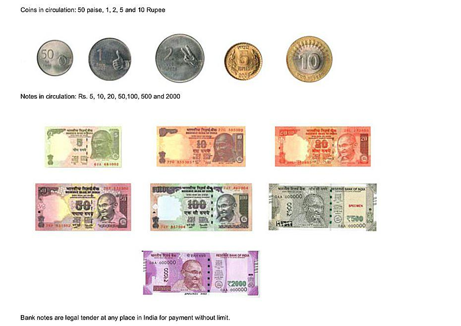

## Table of Contents

## What is the Pakistani Rupee?

The Pakistani Rupee is the official currency of Pakistan. It is used every day by people in Pakistan to buy things like food, clothes, and other goods. The symbol for the Pakistani Rupee is Rs, and its international code is PKR. Just like how different countries have their own money, the Pakistani Rupee is what people in Pakistan use.

The Pakistani Rupee was first used in 1948, soon after Pakistan became its own country. Before that, the Indian Rupee was used. The State Bank of Pakistan is in charge of the Pakistani Rupee. They make sure there is enough money and that it stays valuable. The value of the Pakistani Rupee can change compared to other currencies, like the US Dollar or the Euro, depending on how the economy is doing.

## When was the Pakistani Rupee introduced?

The Pakistani Rupee was introduced in 1948. This was right after Pakistan became its own country. Before 1948, people in Pakistan used the Indian Rupee. But when Pakistan became independent, they needed their own money.

The State Bank of Pakistan is the one that takes care of the Pakistani Rupee. They make sure there is enough money for everyone and that it stays valuable. The symbol for the Pakistani Rupee is Rs, and its international code is PKR. The value of the Pakistani Rupee can go up or down compared to other countries' money, like the US Dollar or the Euro.

## What are the denominations of the Pakistani Rupee?

The Pakistani Rupee comes in different sizes of money, called denominations. For coins, you can find 1 Rupee, 2 Rupees, and 5 Rupees. These are the small money that you can use to buy things that don't cost a lot. For paper money, or banknotes, there are many different amounts. You can find banknotes of 10 Rupees, 20 Rupees, 50 Rupees, 100 Rupees, 500 Rupees, 1000 Rupees, and even 5000 Rupees. These are used for buying things that cost more.

The State Bank of Pakistan decides which denominations to make and how many of each to print or mint. Sometimes, they might stop using some denominations if they are not needed anymore. For example, they used to have a 5 Rupee note, but now it's only a coin. The designs on the money can change too, but they always show important people or places from Pakistan's history and culture.

## How has the design of the Pakistani Rupee changed over time?

The design of the Pakistani Rupee has changed a lot since it was first introduced in 1948. Early banknotes featured images of important places and people from Pakistan's history. For example, the first series of notes showed pictures of the Shah Faisal Mosque in Islamabad and the famous poet Allama Iqbal. Over time, new designs were introduced to reflect Pakistan's culture and achievements. The State Bank of Pakistan makes sure that the designs are updated to prevent counterfeiting and to keep the currency looking fresh and relevant.

In recent years, the designs have become more colorful and include more security features to make the notes harder to fake. For instance, the newer banknotes have special inks that change color and tiny hidden images that can only be seen under a special light. The designs also try to show more of Pakistan's diverse culture, like different traditional dresses and landmarks from all over the country. The coins have also changed, with newer ones featuring more detailed images and sometimes different shapes to help people tell them apart easily.

## What is the historical exchange rate of the Pakistani Rupee against the US Dollar?

Since the Pakistani Rupee was introduced in 1948, its value compared to the US Dollar has changed a lot. At the start, 1 US Dollar was worth about 3.3 Pakistani Rupees. This rate stayed pretty steady for a while, but over time, the Pakistani Rupee started to lose value. By the 1970s, 1 US Dollar was worth around 11 Pakistani Rupees. The value kept going down, and by the 1980s, 1 US Dollar was worth about 16 Pakistani Rupees.

The 1990s and 2000s saw even bigger changes. In the early 1990s, 1 US Dollar was worth around 25 Pakistani Rupees, but by the end of the decade, it was around 50 Pakistani Rupees. The 2000s were also tough, with the exchange rate reaching about 60 Pakistani Rupees per US Dollar by 2008. In recent years, the Pakistani Rupee has continued to weaken. By 2023, 1 US Dollar was worth more than 280 Pakistani Rupees. These changes show how the economy and other things can affect how much one country's money is worth compared to another's.

## What factors influence the value of the Pakistani Rupee?

The value of the Pakistani Rupee can change because of many things. One big thing is how much stuff Pakistan sells to other countries compared to how much they buy. If Pakistan sells more than it buys, the Rupee can get stronger. But if Pakistan buys more than it sells, the Rupee can get weaker. Another thing is how much money people want to keep in Pakistani Rupees. If lots of people want to save or invest in Rupees, it can make the Rupee stronger. But if people want to change their Rupees to other money, like US Dollars, it can make the Rupee weaker.

The economy of Pakistan also plays a big role. If the economy is doing well, with more jobs and more things being made, the Rupee can get stronger. But if the economy is not doing well, with fewer jobs and less stuff being made, the Rupee can get weaker. Also, things like inflation, which is when prices go up, can make the Rupee weaker. The government and the State Bank of Pakistan try to control these things to keep the Rupee stable, but it's hard because many things can change at the same time.

## How does inflation affect the Pakistani Rupee?

Inflation means that the prices of things like food, clothes, and other stuff go up over time. When there is a lot of inflation in Pakistan, it can make the Pakistani Rupee weaker. This happens because when prices go up, people need more Rupees to buy the same things they used to buy before. So, the value of the Rupee goes down because it can buy less.

The State Bank of Pakistan tries to control inflation by changing how much money is in the economy. If they think there is too much money and prices are going up too fast, they might make it harder for people to borrow money. This can help slow down inflation and make the Rupee stronger. But if inflation is too high for a long time, it can be hard to stop, and the Rupee can keep losing value.

## What are the major economic events that have impacted the Pakistani Rupee?

Over the years, several big economic events have changed the value of the Pakistani Rupee. One important event was in the 1970s when Pakistan had a lot of trouble with its economy. The government had to borrow a lot of money from other countries, and this made the Rupee weaker. Also, in the 1990s, Pakistan faced big problems with its money because of high inflation and not selling enough things to other countries. This made the Rupee lose value even more.

Another big event was in 2008 when the world had a big financial crisis. This affected many countries, including Pakistan. The Rupee got much weaker because Pakistan had to borrow more money and had less money coming in from selling things to other countries. More recently, in 2018 and 2019, Pakistan had to ask for help from the International Monetary Fund (IMF) because its economy was not doing well. This also made the Rupee weaker because the IMF asked Pakistan to make some tough changes to its economy.

These events show how the Pakistani Rupee can be affected by what happens in Pakistan's economy and what happens in the world. When Pakistan's economy is not doing well, or when there are big problems in the world, the Rupee can lose value. The government and the State Bank of Pakistan try to make things better, but it can be hard because many things can change at the same time.

## How does the Pakistani Rupee compare to other currencies in the region?

The Pakistani Rupee is weaker than many other currencies in the region, like the Indian Rupee, the Bangladeshi Taka, and the Sri Lankan Rupee. For example, 1 US Dollar is worth more Pakistani Rupees than it is worth Indian Rupees or Bangladeshi Takas. This means that things in Pakistan can be cheaper for people from other countries, but it also means that Pakistan has to work harder to sell things to other countries to get more money.

The value of the Pakistani Rupee can change a lot compared to these other currencies. Sometimes, it loses value faster than the others because of problems in Pakistan's economy, like high inflation or not selling enough things to other countries. But sometimes, if Pakistan's economy is doing better or if there are big problems in other countries, the Pakistani Rupee can lose value more slowly or even get a little stronger compared to other currencies in the region.

## What are the current monetary policies affecting the Pakistani Rupee?

The State Bank of Pakistan uses different ways to try to keep the Pakistani Rupee stable. One big way is by changing the [interest rate](/wiki/interest-rate-trading-strategies), which is how much it costs to borrow money. If the State Bank thinks there is too much money and prices are going up too fast, they might make the interest rate higher. This makes it more expensive for people to borrow money, so they spend less, and prices can go up more slowly. If they think there is not enough money and the economy is not doing well, they might make the interest rate lower. This makes it cheaper for people to borrow money, so they spend more, and the economy can do better.

Another way the State Bank tries to help the Pakistani Rupee is by controlling how much money is in the economy. They do this by buying and selling things like US Dollars. If they think the Rupee is getting too weak, they might sell US Dollars to make the Rupee stronger. If they think the Rupee is getting too strong, they might buy US Dollars to make the Rupee weaker. These actions can help keep the Rupee stable, but they can be hard to do because many things can change at the same time.

## How do international trade and foreign investment impact the Pakistani Rupee?

International trade and foreign investment can have a big effect on the Pakistani Rupee. When Pakistan sells more things to other countries than it buys, it can make the Rupee stronger. This is because other countries need to use their money, like US Dollars, to buy Pakistani things. When Pakistan gets more of these foreign currencies, it can make the Rupee worth more. On the other hand, if Pakistan buys more things from other countries than it sells, it can make the Rupee weaker. This happens because Pakistan has to use more Rupees to buy foreign money, which makes the Rupee less valuable.

Foreign investment also plays a big role. When people from other countries want to invest in Pakistan, like starting businesses or buying property, they need to change their money into Pakistani Rupees. This can make the Rupee stronger because there is more demand for it. But if foreign investors decide to take their money out of Pakistan, they change their Rupees back into their own money, like US Dollars. This can make the Rupee weaker because there is less demand for it. So, how much Pakistan trades with other countries and how much foreign money comes into Pakistan can really change the value of the Pakistani Rupee.

## What are the future predictions for the Pakistani Rupee's value?

People who study money and the economy have different ideas about what will happen to the Pakistani Rupee in the future. Some think it might keep getting weaker because Pakistan has a lot of debt and sometimes has trouble selling enough things to other countries. If Pakistan can't sell enough, it might need to borrow more money, which can make the Rupee weaker. Also, if inflation keeps going up, it can make the Rupee lose value because people need more Rupees to buy the same things.

But there is also hope that the Pakistani Rupee could get stronger. If Pakistan can make its economy better by selling more things to other countries and getting more foreign money to invest, the Rupee could become more valuable. The government and the State Bank of Pakistan are trying to do things to make the economy better, like making it easier for people to start businesses and making sure prices don't go up too fast. If these plans work, the Pakistani Rupee might not lose as much value, or it might even get a little stronger.

## References & Further Reading

[1]: Bergstra, J., Bardenet, R., Bengio, Y., & Kégl, B. (2011). ["Algorithms for Hyper-Parameter Optimization."](https://papers.nips.cc/paper/4443-algorithms-for-hyper-parameter-optimization) Advances in Neural Information Processing Systems 24.

[2]: ["Advances in Financial Machine Learning"](https://www.amazon.com/Advances-Financial-Machine-Learning-Marcos/dp/1119482089) by Marcos Lopez de Prado

[3]: ["Evidence-Based Technical Analysis: Applying the Scientific Method and Statistical Inference to Trading Signals"](https://www.amazon.com/Evidence-Based-Technical-Analysis-Scientific-Statistical/dp/0470008741) by David Aronson

[4]: ["Machine Learning for Algorithmic Trading"](https://github.com/stefan-jansen/machine-learning-for-trading) by Stefan Jansen

[5]: ["Quantitative Trading: How to Build Your Own Algorithmic Trading Business"](https://books.google.com/books/about/Quantitative_Trading.html?id=j70yEAAAQBAJ) by Ernest P. Chan

[6]: Khan, A.Q., & Saqib, N. (1993). ["Exchange Rate Determination in Pakistan: An Econometric Analysis"](https://www.jstor.org/stable/41259991), The Pakistan Development Review.

[7]: Ahmed, V., & Mahmood, T. (2002). ["Fiscal Strategy and Economic Growth: Evidence from Pakistan"](https://www.intechopen.com/chapters/61175), The Pakistan Development Review.

[8]: State Bank of Pakistan. ["Financial Stability Report"](https://www.sbp.org.pk/FSR/2021/Complete.pdf)