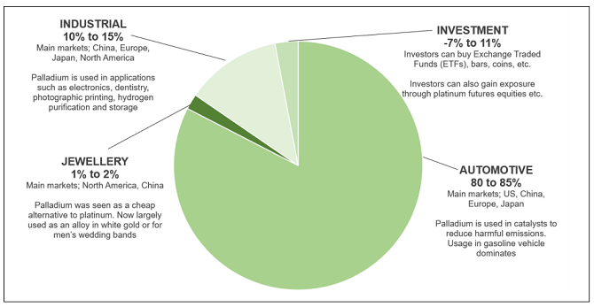

## Table of Contents

## What is palladium and where does it come from?

Palladium is a shiny, silvery metal that is part of a group of metals called the platinum group. It is very strong and does not rust easily, which makes it useful in many things like jewelry, cars, and electronics. Palladium is also good at helping chemical reactions happen, so it is used in things like making medicine and cleaning up pollution.

Palladium comes from the earth, mostly from places where there are big rocks deep underground. The biggest amounts of palladium are found in Russia and South Africa. People dig deep into the earth to get these rocks, and then they use special ways to take the palladium out of the rocks. Sometimes, smaller amounts of palladium can also be found in places like Canada and the United States.

## What are the primary uses of palladium in industry?

Palladium is very important in the car industry. It is used in something called a catalytic converter, which is a part of a car that helps clean up the dirty gases that come out of the car's exhaust. The palladium helps change these harmful gases into less harmful ones, making the air cleaner. Because more and more cars are being made and used around the world, the need for palladium in catalytic converters is growing.

Palladium is also used a lot in making electronics. It is a good conductor of electricity and does not rust easily, which makes it perfect for parts inside phones, computers, and other gadgets. Palladium is used in things like connectors and switches because it helps the electricity flow well and lasts a long time. This makes our electronic devices work better and last longer.

In addition to cars and electronics, palladium is used in the jewelry industry and in making certain chemicals. In jewelry, palladium is mixed with other metals to make white gold, which is popular because it looks shiny and does not tarnish. In the chemical industry, palladium is used as a catalyst to help speed up reactions that make medicines and other important chemicals. This shows how versatile and important palladium is in many different industries.

## How is palladium used in the automotive industry?

Palladium is really important in cars. It is used in something called a catalytic converter, which is a part of the car that helps clean up the dirty gases that come out of the exhaust. When a car runs, it makes harmful gases like carbon monoxide and nitrogen oxides. The palladium inside the catalytic converter helps change these bad gases into safer ones like carbon dioxide and nitrogen. This makes the air cleaner and helps the environment.

Because more and more cars are being made and used all over the world, the need for palladium in cars is growing. Car makers need to put catalytic converters in every new car they make to follow rules about keeping the air clean. So, palladium is a big deal in the car industry, and it helps make sure that cars are not as bad for the environment as they could be.

## What role does palladium play in the electronics sector?

Palladium is very useful in the electronics sector because it is a good conductor of electricity and does not rust easily. This makes it perfect for small parts inside phones, computers, and other gadgets. Palladium is used in things like connectors and switches because it helps the electricity flow well and lasts a long time. This makes our electronic devices work better and last longer.

Because palladium is so good at conducting electricity and staying strong, it is used in many important parts of electronics. For example, palladium is used in the tiny parts that connect different pieces of a circuit together. These parts need to work well and not wear out quickly, and palladium helps make sure they do that. So, palladium plays a big role in making our electronic devices reliable and efficient.

## Can palladium be used in jewelry, and if so, how?

Yes, palladium can be used in jewelry. It is a shiny metal that looks like silver, and it does not rust easily. This makes it perfect for making jewelry that lasts a long time and keeps its shine. Palladium is often mixed with other metals to make something called white gold. White gold is very popular because it looks nice and does not tarnish.

Palladium is also used by itself to make jewelry. People like it because it is light and easy to wear. It is not as heavy as other metals like gold or platinum, so it is comfortable for everyday use. Palladium jewelry is also good for people who have sensitive skin because it is less likely to cause allergic reactions compared to other metals.

## What are the current trends affecting palladium demand?

Right now, one big trend that is making more people want palladium is the growth in the car industry. More and more cars are being made and sold all over the world, and each new car needs a catalytic converter to help clean up the air. Palladium is a key part of these catalytic converters, so as more cars are made, the need for palladium goes up. Also, some places are making stricter rules about how clean car exhaust needs to be, which means even more palladium is needed to meet these rules.

Another trend is the increasing use of palladium in electronics. As more people use phones, computers, and other gadgets, the demand for palladium in these devices goes up. Palladium is used in tiny parts inside these electronics because it helps electricity flow well and lasts a long time. With technology always getting better and more people using electronic devices, the need for palladium in this area keeps growing.

These trends show that palladium is becoming more and more important in our daily lives. Whether it's helping to clean the air from car exhaust or making our phones and computers work better, palladium's role is growing. This means that finding and using palladium in a smart way is something that many industries are thinking about.

## How does palladium compare to other precious metals like platinum and gold?

Palladium, platinum, and gold are all precious metals, but they have different properties and uses. Palladium is lighter than both platinum and gold, which makes it a good choice for jewelry that people want to wear every day. It's also less likely to cause skin allergies than other metals, which is another reason people like it for jewelry. Palladium is often mixed with other metals to make white gold, which is popular because it looks shiny and does not tarnish. In the car industry, palladium is used a lot in catalytic converters to help clean up the air, something that platinum can also do but is more expensive.

Compared to platinum and gold, palladium is less well-known but still very important. Platinum is heavier and more durable than palladium, and it's often used in high-end jewelry and also in catalytic converters. Platinum is more expensive than palladium, which is why some car makers choose palladium instead. Gold, on the other hand, is very soft and often mixed with other metals to make it stronger. Gold is used a lot in jewelry and also in electronics, but it's not used in catalytic converters like palladium and platinum. Each of these metals has its own special uses and value, but palladium is becoming more popular because it's useful in many different ways and can be less costly than platinum.

## What are the risks associated with investing in palladium?

Investing in palladium can be risky because its price can go up and down a lot. The price of palladium depends on how much people want it and how much there is to buy. For example, if more cars are made and they need palladium for their catalytic converters, the price might go up. But if something happens that makes less palladium needed, like new rules or new technology, the price could go down. Also, palladium comes from a few places like Russia and South Africa, so if something happens in those countries, it can affect how much palladium is available and change the price.

Another risk is that palladium is not as well-known or easy to buy and sell as gold or silver. This means that it might be harder to find a good place to buy or sell palladium, and it might take longer to turn it into cash if you need to. Also, because palladium is used in specific things like cars and electronics, if there are changes in those industries, it can affect the demand for palladium. So, it's important to think about these risks before deciding to invest in palladium.

## How can one invest in palladium, and what are the different methods available?

One way to invest in palladium is by buying physical palladium. This means you can buy palladium bars or coins from dealers who sell precious metals. You need to find a trusted dealer and make sure you have a safe place to keep the palladium, like a safe or a bank's safe deposit box. Buying physical palladium can be good because you own the metal directly, but it can also be hard to sell quickly and you need to think about the costs of storing and insuring it.

Another way to invest in palladium is through financial products like exchange-traded funds (ETFs) or futures contracts. ETFs are like funds that you can buy and sell on the stock market, and they track the price of palladium. This is easier than buying physical palladium because you don't need to store it, but you still need to pay fees to the fund manager. Futures contracts are agreements to buy or sell palladium at a set price in the future. They can be risky because the price of palladium can change a lot, but they can also be a way to make money if you guess the price changes right.

You can also invest in companies that mine or use palladium. By buying stocks in these companies, you can benefit if the price of palladium goes up or if the company does well. This way, you're not directly investing in palladium, but your investment can still be affected by what happens with palladium prices. It's important to research the companies and understand how they work before you invest in them.

## What historical data should be considered when analyzing palladium as an investment?

When looking at palladium as an investment, it's helpful to know about its price history. Palladium prices have gone up and down a lot over the years. For example, in the early 2000s, palladium prices shot up to over $1,000 per ounce because of a shortage. But then, they fell back down to around $200 per ounce by 2008. Since then, prices have been climbing again, reaching new highs above $2,000 per ounce in recent years. This shows that palladium can be a risky investment because its price can change a lot.

Another thing to think about is what has affected palladium prices in the past. One big factor is how much palladium is needed for cars. As more cars are made, especially in places like China, the demand for palladium goes up. Also, where palladium comes from matters. Most palladium comes from Russia and South Africa, so if something happens in those countries, it can change how much palladium is available and affect the price. Understanding these past trends can help you make better guesses about what might happen with palladium prices in the future.

## How do geopolitical factors influence the palladium market?

Geopolitical factors can have a big impact on the palladium market because most of the world's palladium comes from just a few places, like Russia and South Africa. If something happens in these countries, like political problems or strikes at the mines, it can make it harder to get palladium. This can cause the price to go up because there's less palladium to buy. For example, if there are new rules or taxes in these countries, it might cost more to mine palladium, which can also make the price go up.

Also, things like trade rules and international relations can affect the palladium market. If countries put up trade barriers or have disagreements, it can make it harder to move palladium from one place to another. This can lead to less palladium being available in some places, which can push the price up. On the other hand, if countries work together well and make it easier to trade, it can help keep the supply of palladium steady and might help keep prices from going up too much.

## What advanced strategies can be used to hedge against palladium price volatility?

One way to protect against big changes in palladium prices is by using futures contracts. These are agreements to buy or sell palladium at a set price in the future. If you think the price of palladium will go up, you can buy a futures contract now at a lower price and sell it later when the price is higher. This can help you make money even if the price goes up a lot. On the other hand, if you think the price might go down, you can sell a futures contract now and buy it back later at a lower price. This can help you avoid losing money if the price drops.

Another strategy is to use options. Options give you the right, but not the obligation, to buy or sell palladium at a certain price before a certain time. If you're worried that the price might go up, you can buy a call option, which lets you buy palladium at a set price. If the price goes up, you can use the option to buy palladium at the lower price and then sell it at the higher market price. If you're worried that the price might go down, you can buy a put option, which lets you sell palladium at a set price. If the price goes down, you can use the option to sell palladium at the higher set price, even if the market price is lower. This way, you can protect yourself from big price changes.

## References & Further Reading

[1]: ["The Palladium Price Report"](https://www.apmex.com/palladium-price) by London Platinum and Palladium Market

[2]: ["The Auto Industry's Secret Ally: Palladium"](https://www.forbes.com/sites/gauravsharma/2024/02/10/a-first-since-2018-auto-industry-drives-palladium-prices-below-platinum/) by The New York Times

[3]: Tully, James V., & Bailey, Rachel P. (2020). ["Palladium: A Unique Precious Metal for Green Catalytic Applications."](https://www.routledge.com/James-Tully-To-Think-and-Act-Differently/Livingston/p/book/9781032130484) ACS Catalysis.

[4]: ["Algorithmic Trading: Winning Strategies and Their Rationale"](https://www.wiley.com/en-us/Algorithmic+Trading%3A+Winning+Strategies+and+Their+Rationale-p-9781118460146) by Ernie P. Chan

[5]: Saunder, Sean. (2018). ["Investment Strategies in the Precious Metals Markets"](https://www.cmcmarkets.com/en-gb/investing-guides/investing-strategies) Journal of Business and Economics Research.