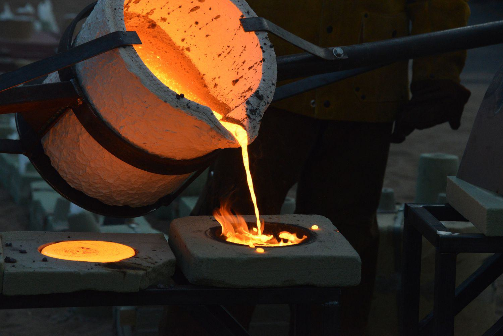

In recent years, palladium has emerged as a critical commodity, largely due to its extensive industrial applications, with a prominent focus on the automotive sector. This rare and precious metal, part of the platinum group metals, has found its place as an indispensable element in various manufacturing processes. Its remarkable properties render it essential, particularly in the production of catalytic converters, which are vital for reducing vehicular emissions. This necessity in catalytic converters stems from palladium's ability to facilitate the conversion of harmful gases from automotive exhausts into less harmful substances, thereby playing a crucial role in environmental protection and compliance with emission standards.

The financial landscape has recognized palladium not only for its industrial significance but also for its potential as a lucrative investment avenue. Its rarity, being approximately 30 times rarer than gold, coupled with consistent demand from diverse industrial sectors like electronics, dentistry, and jewelry, makes it an attractive option for traders and investors aiming to diversify their portfolios. The interplay of limited supply and heightened demand often results in price volatility, which can be strategically leveraged by astute investors.

In tandem with the rising interest in palladium, algorithmic trading has significantly transformed the methods by which investors interact with commodities. This technology-driven approach employs advanced mathematical models and algorithms to execute trading decisions, offering a multitude of benefits over traditional trading practices. Algorithmic trading encapsulates the power of data analysis, allowing investors to process massive datasets swiftly, optimize trading times, and manage market risks with greater precision. As a result, algo trading presents an opportunity to enhance investment outcomes, providing traders with a competitive edge in the dynamic palladium market.

This article aims to explore palladium's utility as an investment option and the pivotal role of algorithmic trading in optimizing investments in this promising commodity. By examining both the inherent advantages and potential challenges associated with these investments, we will provide insights into how these elements can be effectively integrated to bolster investment portfolios.

## Table of Contents

## Understanding Palladium as a Commodity

Palladium, a silvery-white metal, belongs to the platinum group metals (PGMs), which consist of six elements known for their similar physical and chemical properties. Among these, palladium is noteworthy for its rarity, being approximately 30 times less prevalent than gold. This scarcity significantly enhances its value and appeal as both a commodity and an investment option.

Geographically, palladium is primarily extracted from regions rich in mineral deposits, with the bulk of global production coming from Russia, South Africa, Canada, and the United States. Russia is particularly prominent in this regard, responsible for a substantial portion of the world's palladium mining, primarily through operations such as the Norilsk Nickel mines.

The distinct characteristics of palladium make it critical across diverse industrial applications. Its robust catalytic properties are instrumental in the automotive industry, where palladium is extensively utilized in catalytic converters. These devices play a vital role in reducing greenhouse gas emissions by converting harmful pollutants in vehicle exhausts into less damaging substances, thus fulfilling stringent environmental regulations.

Beyond the automotive sector, palladium's versatility extends to electronics, where it is used in multilayer ceramic capacitors and as a component in connectors and plating applications due to its excellent conductivity and oxidation resistance. In the field of jewelry, palladium is prized for its hypoallergenic properties and its ability to maintain a bright finish without tarnishing. Dentistry also benefits from palladium's non-toxic nature and durability, utilizing it in dental alloys for crowns and bridges.

The demand for palladium is driven by its integral role in these essential industries, creating a dynamic market influenced by both technological advancements and regulatory changes. However, the limited availability of palladium, in conjunction with fluctuating geopolitical landscapes, frequently leads to significant price [volatility](/wiki/volatility-trading-strategies). For investors, this volatility presents both challenges and opportunities, positioning palladium as a strategic choice in commodity markets seeking potential high returns and diversification benefits.

## Investment Opportunities in Palladium

Investors have several avenues to engage with palladium, each offering distinct advantages and risk profiles. One option is the direct ownership of physical palladium bullion. This tangible asset can be stored in secure facilities, providing a sense of security and direct exposure to palladium's market value. However, investors must consider storage costs and security concerns associated with holding physical metals.

Exchange-traded funds (ETFs) represent another popular investment method, combining convenience with financial exposure to palladium. For example, the Sprott Physical Platinum and Palladium Trust allows investors to gain exposure to palladium without the need for physical storage. ETFs trade on stock exchanges similar to equities, offering [liquidity](/wiki/liquidity-risk-premium) and a straightforward entry point into commodities markets.

Investors might also consider shares in mining companies involved in palladium extraction. These stocks provide indirect exposure to palladium prices, as mining companies' revenues and profitability are closely tied to commodity price fluctuations. However, investors should be aware that mining stocks often involve exposure to other metals, such as platinum or gold, since most mining companies operate in multiple metal markets.

The investment appeal of palladium is heightened by its potential for price appreciation, fueled by industrial demand and geopolitical influences. The automotive industry's reliance on palladium for catalytic converters, along with its applications in electronics and dentistry, underpins this demand. Geopolitical factors, such as mining conditions in Russia and South Africa, can also affect supply, contributing to price volatility and investment potential.

In summary, investing in palladium offers several pathways, each with unique considerations. Whether through physical bullion, ETFs, or mining stocks, the allure of palladium as a strategic investment lies in its scarcity, industrial importance, and susceptibility to global market forces.

## Role of Algorithmic Trading in Palladium Investment

Algorithmic trading, commonly known as algo trading, employs mathematical models and computer algorithms to automate and optimize trading strategies. In commodities markets, such as palladium, algo trading offers a significant advantage by navigating the complexity and volatility inherent in these markets.

The primary advantage of [algorithmic trading](/wiki/algorithmic-trading) in palladium investment is its ability to analyze extensive datasets swiftly and accurately. This capability allows investors to make well-informed decisions by identifying patterns and trends that might not be immediately apparent through manual analysis. Algorithms can process information at a much faster rate than human traders, incorporating a vast array of market indicators and historical data to predict price movements. This facilitates executing trades at optimal times, enhancing both the timing and precision of investment decisions.

A key feature of algorithmic trading is its capacity to manage risk more effectively than traditional manual trading methods. Through advanced risk management techniques, algo trading systems can identify potential risks and implement strategies to mitigate them promptly. For instance, algorithms can employ stop-loss orders or adjust positions in response to real-time market changes, reducing exposure to adverse price movements.

Moreover, the automation of trading processes results in quicker response times. Algorithms can execute trades instantly as market conditions meet predefined criteria, ensuring that investment opportunities are not missed. This speed is particularly advantageous in the palladium market, where prices can fluctuate rapidly due to factors such as supply disruptions or shifts in industrial demand.

In summary, the integration of algorithmic trading into palladium investments provides tactical benefits by leveraging data-driven insights and automation. This can lead to improved investment outcomes by optimizing trade execution and risk management, thereby enhancing the overall efficiency and effectiveness of trading strategies.

## Benefits and Challenges of Algo Trading in Palladium

Algorithmic trading, commonly referred to as algo trading, brings a number of benefits when applied to the palladium market. Among its primary advantages is the speed of trade execution. Algorithms can process vast amounts of information and execute trades in a fraction of a second. This is particularly beneficial in the palladium market, where price fluctuations can be pronounced due to its limited supply and high demand in industries such as automotive manufacturing.

Accuracy is another significant advantage of algorithmic trading. By automating the trading process, the potential for human error is reduced. Algorithms can consistently apply pre-defined rules to trading decisions, ensuring precision in a volatile market like palladium, where timely and accurate execution is paramount.

Additionally, algo trading allows for the [backtesting](/wiki/backtesting) of strategies against historical data. This provides investors with the ability to evaluate the effectiveness of their trading strategies using past market conditions. Through backtesting, investors can refine their approaches to balance risk and return before deploying their strategies in the live market.

Despite these advantages, there are challenges associated with algo trading in the palladium market. A key challenge is the need for advanced technical knowledge to develop and maintain trading algorithms. Creating an effective trading algorithm requires expertise in both programming and financial markets, which can be a barrier for some investors.

Moreover, the complexity of algorithms introduces the risk of software errors or bugs, which can lead to significant financial losses. Errors may arise from coding mistakes or unexpected market conditions that were not adequately factored into the algorithm's design.

As a result, investors considering incorporating algo trading into their palladium investments must weigh these benefits and challenges carefully. While the speed and accuracy offered by algorithmic systems provide a competitive edge, they must also ensure robust risk management practices are in place to address potential technical and market-related uncertainties. This careful balance of leveraging technology while managing its inherent risks is crucial for optimizing investment strategies in the palladium market.

## Conclusion

Palladium stands out as a compelling investment option due to its rarity and increasing demand, particularly in the automotive industry, where it plays a pivotal role in reducing vehicle emissions through catalytic converters. As a scarce resource, palladium's supply is limited, making its price sensitive to fluctuations in demand and geopolitical factors. This characteristic enhances its appeal as an investment, offering the potential for substantial returns.

The integration of algorithmic trading into palladium investments provides a strategic advantage by leveraging data-driven insights and automation. Algorithmic trading employs advanced mathematical models and algorithms to analyze and execute trades efficiently, thus enabling investors to quickly capitalize on market trends and mitigate risks associated with palladium's volatility. This systematic approach allows for the execution of trades at optimal times, reducing the likelihood of human error and emotional decision-making.

Despite the benefits, algorithmic trading presents challenges, chiefly for those lacking expertise in computational methods. The sophistication of algorithmic systems requires a high level of technical understanding to design, implement, and maintain robust trading strategies. Additionally, the dependence on technology introduces risks such as software bugs and system failures, which can have severe financial implications if not carefully managed.

Overall, the combination of palladium investment opportunities with algorithmic trading strategies provides a powerful avenue for portfolio diversification and return optimization. By navigating the intricacies of both palladium markets and algorithmic systems, investors can position themselves to exploit the unique advantages of this integration, potentially achieving enhanced investment outcomes in a competitive and ever-evolving market.

## References & Further Reading

[1]: ["The Palladium Price Report"](https://www.apmex.com/palladium-price) by London Platinum and Palladium Market

[2]: ["The Auto Industry's Secret Ally: Palladium"](https://www.forbes.com/sites/gauravsharma/2024/02/10/a-first-since-2018-auto-industry-drives-palladium-prices-below-platinum/) by The New York Times

[3]: Tully, James V., & Bailey, Rachel P. (2020). ["Palladium: A Unique Precious Metal for Green Catalytic Applications."](https://www.routledge.com/James-Tully-To-Think-and-Act-Differently/Livingston/p/book/9781032130484) ACS Catalysis.

[4]: ["Algorithmic Trading: Winning Strategies and Their Rationale"](https://www.wiley.com/en-us/Algorithmic+Trading%3A+Winning+Strategies+and+Their+Rationale-p-9781118460146) by Ernie P. Chan

[5]: Saunder, Sean. (2018). ["Investment Strategies in the Precious Metals Markets"](https://www.cmcmarkets.com/en-gb/investing-guides/investing-strategies) Journal of Business and Economics Research.