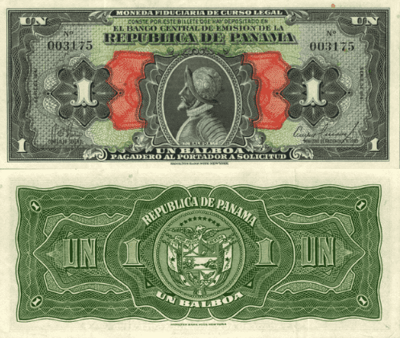

## Table of Contents

## What is the Panamanian Balboa?

The Panamanian Balboa is the official currency of Panama. It is named after the explorer Vasco Núñez de Balboa, who was the first European to see the Pacific Ocean from the Americas. The Balboa is equal in value to the US dollar, and both currencies are used in Panama. This means that if you have US dollars, you can use them in Panama just like Balboas.

Panama started using the Balboa in 1904, right after it became independent from Colombia. At first, only coins were made because the US dollar was used for paper money. Even today, Panama does not print its own paper money; it only uses US dollar bills. Balboa coins come in different sizes, like 1, 5, 10, 25, and 50 cent coins, and 1 and 2 Balboa coins. This system makes it easy for people in Panama to use money from both countries.

## When was the Panamanian Balboa first introduced?

The Panamanian Balboa was first introduced in 1904. This happened soon after Panama became its own country, separate from Colombia. The Balboa was named after Vasco Núñez de Balboa, a famous explorer who was the first European to see the Pacific Ocean from the Americas.

At the start, only coins were made for the Balboa. Panama did not make its own paper money. Instead, they used US dollar bills. This is still true today. The Balboa is worth the same as the US dollar, so people in Panama can use both kinds of money easily.

## Why was the Balboa named after Vasco Núñez de Balboa?

The Balboa was named after Vasco Núñez de Balboa because he was a very important explorer. He was the first European to see the Pacific Ocean from the Americas. This happened in 1513 when he reached the ocean from Panama. Because of this big discovery, Balboa became a famous name in Panama's history.

When Panama became its own country in 1903, they wanted to honor this explorer. So, they named their new currency the Balboa. This was a way to remember Balboa's big achievement and to show how proud Panama was of its history.

## How is the Balboa linked to the US dollar?

The Balboa is linked to the US dollar because they are worth the same amount. One Balboa is equal to one US dollar. This makes it easy for people in Panama to use both kinds of money. They can use Balboa coins and US dollar bills every day without needing to change money.

Panama started using the Balboa in 1904, right after it became its own country. At that time, they only made Balboa coins. They did not make their own paper money. Instead, they used US dollar bills. Even today, Panama still uses US dollar bills for paper money. This system helps keep things simple and stable for everyone in Panama.

## What are the denominations of the Balboa in circulation?

The Balboa comes in different coin sizes. You can find 1 cent, 5 cent, 10 cent, 25 cent, and 50 cent coins. There are also 1 Balboa and 2 Balboa coins. These are the only types of Balboa money you will see because Panama does not make its own paper money.

Instead of using Balboa bills, Panama uses US dollar bills. This means if you need to use paper money in Panama, you will use US dollars. The Balboa coins and US dollar bills work together because they are worth the same amount. So, people in Panama can use both kinds of money easily every day.

## Can you explain the historical events that led to the creation of the Balboa?

Panama became its own country in 1903 after separating from Colombia. Right after becoming independent, Panama needed its own money. So, in 1904, they created the Balboa. The Balboa was named after Vasco Núñez de Balboa, a famous explorer who was the first European to see the Pacific Ocean from the Americas. This was a way for Panama to honor its history and the big discovery Balboa made.

At first, Panama only made coins for the Balboa. They did not make their own paper money. Instead, they decided to use US dollar bills. This was because the US dollar was already strong and trusted around the world. The Balboa was made to be worth the same as the US dollar. This made it easy for people in Panama to use both Balboa coins and US dollar bills every day. Even today, Panama still uses US dollar bills for paper money, while the Balboa coins continue to be used alongside them.

## What role does the Balboa play in Panama's economy today?

The Balboa plays a big part in Panama's economy today. It is the official money of Panama and works together with the US dollar. The Balboa is worth the same as the US dollar, so people in Panama can use both kinds of money easily. This makes buying things and paying for things simple and easy for everyone. The Balboa helps keep the economy stable because it is tied to the strong US dollar.

Even though the Balboa is important, Panama only uses it for coins. They use US dollar bills for paper money. This means if you need to use paper money in Panama, you will use US dollars. The Balboa coins come in different sizes, like 1 cent, 5 cent, 10 cent, 25 cent, 50 cent, 1 Balboa, and 2 Balboa coins. These coins help people buy smaller things and make change. Together, the Balboa and the US dollar help keep Panama's economy running smoothly.

## How has the value of the Balboa remained stable over time?

The Balboa has stayed stable because it is worth the same as the US dollar. One Balboa is always equal to one US dollar. This link to the US dollar helps keep the Balboa's value steady. The US dollar is a strong and trusted currency around the world. By using the US dollar for paper money and the Balboa for coins, Panama makes sure that its money stays stable and easy to use.

Panama does not make its own paper money. Instead, they use US dollar bills. This means that the value of the Balboa stays the same as the US dollar, which does not change much over time. People in Panama can use both Balboa coins and US dollar bills every day without worrying about the value changing. This system helps keep Panama's economy stable and makes it easy for people to buy things and pay for services.

## What are the economic advantages of pegging the Balboa to the US dollar?

Pegging the Balboa to the US dollar helps keep Panama's money stable. When the Balboa is worth the same as the US dollar, people in Panama do not have to worry about their money losing value. This makes it easier for them to buy things and plan for the future. It also makes Panama a good place for businesses because they know the money will stay the same. This can help bring more jobs and money into the country.

Another big advantage is that it makes trading with other countries easier. Since the US dollar is used all over the world, Panama can trade with many different countries without having to change their money. This saves time and money. It also makes it easier for tourists to visit Panama because they can use US dollars there. This can help bring more people to the country and help the economy grow.

## Are there any disadvantages to Panama's currency system involving the Balboa?

One disadvantage of Panama's currency system is that it does not have control over its own money. Because the Balboa is tied to the US dollar, Panama cannot change the value of its money to help its own economy. If the US dollar goes up or down, the Balboa goes with it. This can make it hard for Panama to make its own money decisions that could help its people.

Another problem is that Panama cannot print its own paper money. It has to use US dollar bills. This means Panama has to follow the rules of the US for its paper money. If the US changes its money or makes new rules, Panama has to follow along. This can make things harder for Panama because it does not have full control over its own money system.

## How does the use of the Balboa affect Panama's monetary policy?

The use of the Balboa affects Panama's monetary policy a lot because the Balboa is tied to the US dollar. This means Panama cannot change the value of its own money. If the US dollar goes up or down, the Balboa has to go with it. This can make it hard for Panama to make its own money decisions that could help its economy. For example, if Panama wants to make its money worth less to help people buy more things, it cannot do that because the Balboa must stay the same as the US dollar.

Another big effect is that Panama cannot print its own paper money. It has to use US dollar bills. This means Panama has to follow the rules of the US for its paper money. If the US changes its money or makes new rules, Panama has to follow along. This can make things harder for Panama because it does not have full control over its own money system. So, while using the Balboa and US dollar together makes things simple and stable, it also means Panama has less control over its own monetary policy.

## What future challenges might the Balboa face in the global economic environment?

In the future, the Balboa might face challenges because it is tied to the US dollar. If the US dollar gets weaker or stronger, the Balboa has to follow. This can be hard for Panama if the US dollar changes a lot. For example, if the US dollar goes down, things in Panama might cost more for people from other countries. This could make fewer people want to visit or do business in Panama. Also, if the US has big money problems, like a big drop in the value of the dollar, it could hurt Panama's economy too.

Another challenge could come from changes in the world's money systems. More and more countries are using their own money or new kinds of money, like digital currencies. If other countries start using different money that is not tied to the US dollar, it might be harder for Panama to trade with them. Panama might need to think about new ways to use the Balboa or even change its money system to keep up with the world. This could be a big challenge because changing a country's money system is hard and can take a long time.

## References & Further Reading

[1]: ["The Currency of Panama."](https://usfirstexchange.com/the-currency-of-panama-explained) Library of Congress, February 27, 2019.

[2]: Moreno-Villalaz, Juan Luis. ["Financial Integration and Dollarization: The Case of Panama."](https://www.cato.org/sites/cato.org/files/serials/files/cato-journal/2005/1/cj25n1-14.pdf) Cato Journal, 1999.

[3]: Arias, Diego, & Martínez-López, Carlos. ["Panama: The Dollarized Economy."](https://www.amazon.com/M%C3%A9todos-Investigaci%C3%B3n-Psicolog%C3%ADa-Universitaria-Spanish/dp/8497274164) International Monetary Fund, Working Paper 18/222, July 2018.

[4]: ["Algorithmic Trading and DMA: An Introduction to Direct Access Trading Strategies"](https://www.amazon.com/Algorithmic-Trading-DMA-introduction-strategies/dp/0956399207) by Barry Johnson.

[5]: ["Panama Canal Expansion."](https://en.wikipedia.org/wiki/Panama_Canal_expansion_project) Panama Canal Authority, accessed October 2023.

[6]: Singh, Ashvin, & de la Cruz, Jose A. ["The Economics of the Panama Canal."](https://www.eurchembull.com/archives/volume-12/issue-8) ResearchGate, 2019.