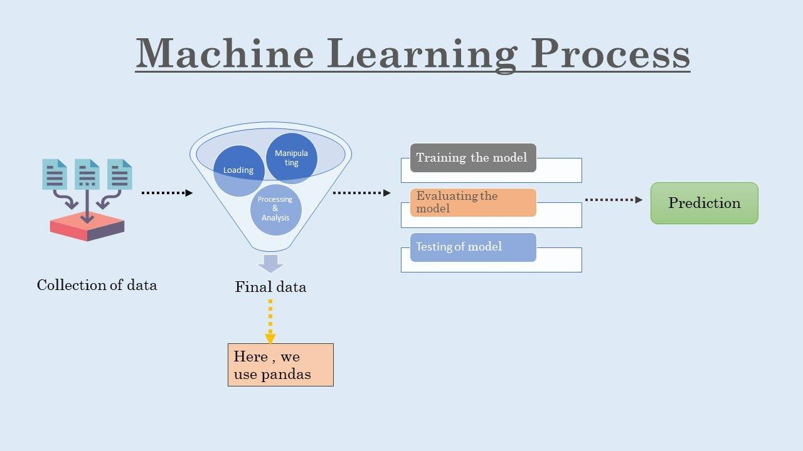

## Table of Contents

## What is Pandas and why is it important for machine learning?

Pandas is a popular software library for the Python programming language that is used for data manipulation and analysis. It provides easy-to-use data structures and operations for handling and analyzing structured data. Pandas is built on top of NumPy, another important library for numerical computing in Python, and it makes working with data much simpler and more efficient.

Pandas is important for machine learning because it helps with preparing and cleaning data, which is a crucial step in any machine learning project. Before you can train a machine learning model, you need to get your data into the right format and make sure it's clean and ready to use. Pandas makes it easy to load data from different sources, handle missing values, and perform various transformations on the data. This means you can spend less time on data preparation and more time on building and improving your machine learning models.

In summary, Pandas is a powerful tool that simplifies the process of working with data in Python. Its importance in machine learning lies in its ability to streamline data preparation, which is essential for developing effective machine learning models. By using Pandas, data scientists and machine learning practitioners can focus more on the modeling aspects of their projects, leading to better and faster results.

## How do you install Pandas and set up your environment for machine learning?

To install Pandas, you first need to have Python installed on your computer. Once you have Python, you can install Pandas using a package manager like pip. Open your command line or terminal and type ```pip install pandas```. This command will download and install Pandas and its dependencies. After the installation is complete, you can start using Pandas in your Python scripts by importing it with ```import pandas as pd```. This sets up the basic environment for working with Pandas.

Setting up your environment for [machine learning](/wiki/machine-learning) involves installing additional libraries that work well with Pandas. One important library is NumPy, which you can install with ```pip install numpy```. Another useful library is scikit-learn, which provides tools for machine learning. You can install it with ```pip install scikit-learn```. Once these libraries are installed, you can import them in your scripts alongside Pandas. For example, you might use ```import numpy as np``` and ```from sklearn import datasets```. This setup allows you to load data with Pandas, manipulate it with NumPy, and apply machine learning algorithms with scikit-learn, creating a powerful environment for your machine learning projects.

## What are the basic data structures in Pandas and how are they used in machine learning?

Pandas has two main data structures: Series and DataFrame. A Series is like a column in a spreadsheet. It's a one-dimensional labeled array that can hold any data type. In machine learning, you might use a Series to represent a single feature of your dataset, like the ages of people or the prices of houses. For example, if you have a dataset of house prices, you could create a Series to store all the prices: ```prices = pd.Series([200000, 300000, 250000])```. This makes it easy to analyze and manipulate that specific feature.

A DataFrame is like a whole spreadsheet. It's a two-dimensional labeled data structure with columns of potentially different types. In machine learning, DataFrames are very useful because they can hold your entire dataset. You can think of a DataFrame as a collection of Series, where each Series is a column. For example, if you have data about houses including their prices, sizes, and locations, you could create a DataFrame to hold all this information: ```houses = pd.DataFrame({'price': [200000, 300000, 250000], 'size': [1500, 2000, 1800], 'location': ['City', 'Suburb', 'Rural']})```. This allows you to easily manage, clean, and prepare your data for machine learning models.

In summary, Series and DataFrames are the building blocks of data manipulation in Pandas. They help you organize and work with your data efficiently, which is crucial in machine learning. By using these structures, you can transform raw data into a format that's ready for analysis and model training, making your machine learning projects more effective.

## How can you use Pandas to load and preprocess data for machine learning models?

To load data into Pandas, you can use functions like `pd.read_csv()` or `pd.read_excel()` depending on the format of your data. For example, if you have a CSV file named 'data.csv', you can load it into a DataFrame with `data = pd.read_csv('data.csv')`. Once the data is loaded, you can start preprocessing it. Preprocessing involves cleaning the data, handling missing values, and transforming it into a format suitable for machine learning models. For instance, if your dataset has missing values, you can use `data.dropna()` to remove rows with missing data or `data.fillna(value)` to fill them with a specific value.

After loading and cleaning the data, you might need to transform it further. This can include encoding categorical variables, scaling numerical features, or creating new features from existing ones. For example, if you have a column with categorical data like 'location', you can use `pd.get_dummies(data['location'])` to convert it into numerical dummy variables. If you need to scale your numerical features, you can use `from sklearn.preprocessing import StandardScaler` and then apply it to your data with `scaler = StandardScaler(); data[['feature1', 'feature2']] = scaler.fit_transform(data[['feature1', 'feature2']])`. These preprocessing steps help ensure that your data is in the best possible shape for training machine learning models, which can lead to better performance and more accurate predictions.

## What are some common data manipulation techniques in Pandas for machine learning?

In Pandas, one common technique for data manipulation is filtering. This means selecting certain rows or columns from your DataFrame based on specific conditions. For example, if you want to see only the houses in your dataset that cost less than $250,000, you can use `filtered_data = data[data['price'] < 250000]`. This helps you focus on the parts of the data that matter most for your machine learning task. Another technique is grouping data. This involves grouping rows by a certain column and then performing calculations on those groups. For instance, you might want to find the average house price in different locations. You can do this with `grouped_data = data.groupby('location')['price'].mean()`. Grouping helps you understand patterns and trends in your data, which can be very useful for machine learning.

Another important technique is handling missing data. In real-world datasets, you often find missing values, and you need to deal with them before training a machine learning model. You can remove rows with missing data using `cleaned_data = data.dropna()`, or you can fill in the missing values with a specific number or the mean of the column using `filled_data = data.fillna(data.mean())`. Choosing the right approach depends on your data and your machine learning task. Finally, transforming data is crucial. This can involve creating new features from existing ones or encoding categorical variables. For example, if you have a 'date' column, you might want to create new columns for the year, month, and day using `data['year'] = pd.to_datetime(data['date']).dt.year`. Or, if you have a categorical column like 'location', you can convert it into dummy variables with `encoded_data = pd.get_dummies(data['location'])`. These transformations make your data more suitable for machine learning models.

## How do you handle missing data in Pandas for machine learning applications?

Handling missing data in Pandas is important for machine learning because models don't work well with gaps in the information. You can use the `dropna()` function to remove rows or columns that have missing values. For example, if you want to get rid of all rows with any missing data, you can use ```data = data.dropna()```. This is a simple way to clean your dataset, but it might mean losing a lot of information if many rows have missing values. Another option is to fill in the missing values with a specific number, like zero, or with the mean or median of the column. You can do this with the `fillna()` function. For instance, to fill missing values with the mean of the column, you can use ```data = data.fillna(data.mean())```. This keeps more of your data but might change how your machine learning model sees the data.

Choosing the right way to handle missing data depends on what you're trying to do with your machine learning model. If you have a lot of missing values in a column that's not very important for your model, you might decide to drop that column instead of the rows. You can do this with ```data = data.drop('column_name', axis=1)```. On the other hand, if the column with missing values is crucial for your model, you might want to try to fill in those gaps more carefully. For example, you could use a more advanced method like interpolation, which guesses the missing values based on the values around them. You can do this with ```data = data.interpolate()```. Each method has its pros and cons, so it's important to think about what will work best for your specific machine learning project.

## What are the best practices for feature engineering using Pandas?

Feature engineering is all about making your data better for machine learning models. With Pandas, one good way to do this is by creating new features from existing ones. For example, if you have a date column, you can split it into year, month, and day using ```data['year'] = pd.to_datetime(data['date']).dt.year```. This can help your model understand patterns over time. Another useful technique is to combine features. If you have 'length' and 'width' columns, you could make a new 'area' column with ```data['area'] = data['length'] * data['width']```. This new feature might be more useful for your model than the original ones.

Another important part of feature engineering is handling categorical data. You can turn categories into numbers using one-hot encoding with ```encoded_data = pd.get_dummies(data['category'])```. This makes it easier for your model to understand the data. It's also a good idea to scale your numerical features so they're on the same level. You can do this with tools from scikit-learn like ```from sklearn.preprocessing import StandardScaler; scaler = StandardScaler(); data[['feature1', 'feature2']] = scaler.fit_transform(data[['feature1', 'feature2']])```. By using these techniques in Pandas, you can make your data more useful and help your machine learning models work better.

## How can you use Pandas to perform exploratory data analysis (EDA) for machine learning?

Exploratory Data Analysis (EDA) is like looking at your data to understand it better before you use it in machine learning. With Pandas, you can start by loading your data into a DataFrame using ```data = pd.read_csv('data.csv')```. Once your data is loaded, you can use Pandas to see basic information about your dataset. For example, you can use ```data.info()``` to see the column names, data types, and how many missing values there are. You can also use ```data.describe()``` to get [statistics](/wiki/bayesian-statistics) like the mean, median, and standard deviation for each column. This helps you see if there are any strange values or patterns in your data.

After looking at the basic information, you can dig deeper into your data with Pandas. You can make charts to see how your data looks. For example, to see how a feature is spread out, you can use ```data['feature'].hist()``` to make a histogram. If you want to see how two features relate to each other, you can use ```data.plot.scatter(x='feature1', y='feature2')``` to make a scatter plot. You can also group your data to find patterns. For instance, if you want to see the average value of a feature for different categories, you can use ```data.groupby('category')['feature'].mean()```. By doing these things with Pandas, you can learn a lot about your data and make better choices for your machine learning model.

## How do you integrate Pandas with popular machine learning libraries like scikit-learn?

Pandas and scikit-learn work together really well for machine learning projects. First, you use Pandas to load and clean your data. For example, you might use `data = pd.read_csv('data.csv')` to load a CSV file into a DataFrame. Then, you can clean the data by removing missing values with `data = data.dropna()` or filling them with `data = data.fillna(data.mean())`. After your data is clean, you can use Pandas to create new features or transform existing ones. For instance, if you have a date column, you can split it into year, month, and day with `data['year'] = pd.to_datetime(data['date']).dt.year`. This makes your data ready for machine learning.

Once your data is prepared with Pandas, you can easily use it with scikit-learn. You start by splitting your data into features (X) and target (y) using `X = data.drop('target', axis=1)` and `y = data['target']`. Then, you can split your data into training and testing sets with `from sklearn.model_selection import train_test_split; X_train, X_test, y_train, y_test = train_test_split(X, y, test_size=0.2, random_state=42)`. After that, you can use scikit-learn to train a model. For example, to train a simple linear regression model, you can use `from sklearn.linear_model import LinearRegression; model = LinearRegression(); model.fit(X_train, y_train)`. Finally, you can evaluate your model's performance on the test set with `model.score(X_test, y_test)`. By using Pandas to prepare your data and scikit-learn to build and evaluate your models, you can create powerful machine learning solutions.

## What advanced Pandas techniques can enhance machine learning model performance?

Advanced Pandas techniques can really help make your machine learning models work better. One way is by using multi-indexing, which lets you work with data that has more than one level of labels. For example, if you have data about sales in different cities and years, you can set up a multi-index with ```data.set_index(['city', 'year'], inplace=True)```. This helps you quickly look at and analyze data in different ways, like seeing how sales change over time in each city. Another technique is using the `apply()` function to create new features or clean your data. For instance, if you want to create a new column that shows if a house price is above the average, you can use ```data['above_average'] = data['price'].apply(lambda x: x > data['price'].mean())```. This kind of feature engineering can help your model understand your data better and make more accurate predictions.

Another advanced technique is using Pandas to handle time series data. If you have data that changes over time, like stock prices, you can use Pandas to do things like resampling or rolling calculations. For example, to calculate a 7-day moving average of stock prices, you can use ```data['7_day_ma'] = data['price'].rolling(window=7).mean()```. This can help your model see patterns in the data that it might miss otherwise. You can also use Pandas to do more complex data transformations, like using the `groupby()` function to create new features based on groups in your data. For instance, if you want to find the average price of houses in each neighborhood, you can use ```data['neighborhood_avg_price'] = data.groupby('neighborhood')['price'].transform('mean')```. By using these advanced techniques, you can make your data more useful and improve how well your machine learning models work.

## How can you optimize Pandas operations for large datasets in machine learning?

When working with large datasets in machine learning, optimizing Pandas operations is crucial for faster data processing. One way to do this is by using the `read_csv()` function with the `chunksize` parameter. This lets you read the data in smaller pieces, so your computer doesn't get overwhelmed. For example, you can use `for chunk in pd.read_csv('data.csv', chunksize=10000):` to process the data in chunks of 10,000 rows at a time. This method helps you work with big datasets without running out of memory. Another useful technique is to use the `category` data type for columns with repeated values, like 'location' or 'type'. You can change the data type with `data['location'] = data['location'].astype('category')`. This saves memory and makes operations on these columns faster.

Another way to optimize Pandas for large datasets is by using vectorized operations instead of loops. Vectorized operations are much faster because they use the power of NumPy, which is what Pandas is built on. For example, instead of using a loop to multiply two columns, you can use `data['new_column'] = data['column1'] * data['column2']`. This is much quicker and uses less memory. You can also use the `eval()` and `query()` functions to speed up calculations and filtering. For instance, `data.eval('new_column = column1 * column2', inplace=True)` is faster than doing the multiplication with regular code. By using these techniques, you can make your Pandas operations on large datasets much more efficient, which helps your machine learning projects run smoother and faster.

## What are some real-world examples of using Pandas in machine learning projects?

In a real-world machine learning project, a data scientist might use Pandas to analyze customer data for a retail company. They could load the data from a CSV file using ```data = pd.read_csv('customer_data.csv')``` and then use Pandas to clean and prepare the data. For example, they might use ```data = data.dropna()``` to remove any rows with missing values and ```data['age_group'] = pd.cut(data['age'], bins=[0, 18, 35, 65, 100], labels=['Child', 'Young Adult', 'Adult', 'Senior'])``` to create a new 'age_group' column. After preparing the data, they might use Pandas to explore it, like finding the average purchase amount by age group with ```data.groupby('age_group')['purchase_amount'].mean()```. This information could help the company target different age groups with personalized marketing strategies, which could improve sales.

Another example is using Pandas in a machine learning project for predicting house prices. A data scientist could start by loading the data with ```data = pd.read_csv('house_prices.csv')``` and then use Pandas to handle missing values and create new features. They might use ```data['price_per_sqft'] = data['price'] / data['sqft_living']``` to calculate the price per square foot, which could be a useful feature for the model. They could also use Pandas to split the data into training and testing sets with ```from sklearn.model_selection import train_test_split; X = data.drop('price', axis=1); y = data['price']; X_train, X_test, y_train, y_test = train_test_split(X, y, test_size=0.2, random_state=42)```. By using Pandas to prepare and explore the data, the data scientist can build a more accurate model to predict house prices, which could help real estate companies or home buyers make better decisions.