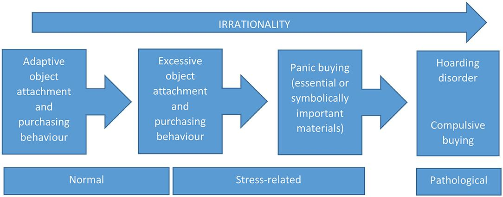

Panic buying has become a significant phenomenon in the ever-changing field of consumer behavior, especially during times of crisis. This article investigates the psychological factors driving panic buying, its effects on consumer behavior, and the role of algorithmic trading in exacerbating these behaviors. The interconnected nature of panic buying and market dynamics provides valuable insights for both consumers and market participants. Navigating today's complex market environment requires a comprehensive understanding of these elements. By examining various studies and expert opinions, we aim to unpack the psychology that fuels panic buying and its implications for economic and investment strategies.

Panic buying often manifests during emergencies, such as natural disasters, pandemics, or geopolitical tensions, where uncertainty and fear prompt consumers to make sudden purchasing decisions. This behavior can lead to shortages and disrupt market stability, creating significant challenges for retailers and policymakers alike. Furthermore, the influence of algorithmic trading in financial markets reinforces these trends, complicating the dynamics of supply and demand.



Understanding the psychological motivations and market implications of panic buying is essential for developing effective strategies to manage its effects. By recognizing the patterns and drivers behind panic buying, individuals and institutions can better anticipate potential disruptions and implement measures to maintain market stability. Future research and policy initiatives should incorporate these insights into economic models, enhancing our ability to predict and respond to panic buying phenomena.

## Table of Contents

## The Psychology Behind Panic Buying

Panic buying, a behavior characterized by impulsive and excessive purchasing of goods, is often triggered by feelings of uncertainty and fear. These emotions lead individuals to make irrational purchasing decisions, which are driven by several psychological factors.

A prominent driver of panic buying is the Fear of Missing Out (FOMO), a psychological state where individuals experience anxiety over the possibility of losing access to goods or resources. This fear is exacerbated during crises when the perception of scarcity is heightened, prompting consumers to purchase items in larger quantities than they need.

Herd mentality is another psychological [factor](/wiki/factor-investing) that plays a significant role in panic buying. This phenomenon occurs when individuals mirror the actions of a larger group, assuming the majority's behavior is the correct [course](/wiki/best-algorithmic-trading-courses) of action. During a crisis, witnessing others stockpile necessities can lead individuals to feel compelled to do the same, often disregarding their own needs or the actual necessity of the items being purchased.

Additionally, the desire for self-preservation during perceived threats drives individuals towards panic buying. When confronted with situations that threaten their well-being, people are naturally inclined to ensure their survival, which translates into acquiring resources that provide a sense of security and control. This behavior is often a subconscious response to anxiety about the future, leading to overconsumption of goods thought to be essential.

Research has identified consumer profiles that are more prone to panic buying, such as egalitarians and conformists. Egalitarians, who prioritize equal distribution of resources, may be driven by panic buying when they perceive potential inequities in resource allocation. Conformists, on the other hand, are more susceptible to herd behavior, following the actions of others to fit in and reduce personal anxiety.

Understanding these psychological drivers, such as FOMO, herd mentality, and self-preservation instincts, is essential for devising strategies to mitigate panic buying tendencies. By recognizing these factors, consumers can be educated to make more rational purchasing decisions, and businesses can design interventions to alleviate the impact of panic buying during crises.

## Consumer Behavior During Panic Buying

During crises, consumer behavior undergoes significant transformations, often characterized by a spike in demand for specific goods and services. This dramatic shift is primarily fueled by uncertainty and fear, which drive consumers to purchase quantities beyond their immediate needs. The phenomenon is particularly evident in essential items such as food, hygiene products, and medical supplies. A typical outcome of this behavior is the creation of shortages. The visibility of empty shelves can escalate panic, leading to a self-reinforcing cycle where increased demand depletes supply further, intensifying consumer anxiety.

Panic buying can be understood as a form of irrational consumer behavior rooted in psychological triggers like the fear of missing out (FOMO) and herd behavior. These factors compel individuals to conform to collective actions even when they are not rooted in personal necessity. This behavior is not exclusively driven by psychological factors but can be influenced by media coverage, government announcements, and social media, all of which play significant roles in shaping perceptions and reactions.

To manage these behaviors, retailers can adopt strategies aimed at alleviating panic buying. Fair distribution measures can be implemented to ensure equitable access to goods, thereby addressing the causal anxiety from perceived scarcity. This might include setting purchase limits on high-demand items and prioritizing inventory for vulnerable groups, such as healthcare workers and the elderly. Moreover, community engagement through transparent communication about stock levels and supply chain status can mitigate fear and distrust. Retailers can use these insights to foster a sense of communal responsibility, encouraging consumers to adopt rational buying behaviors that prioritize community well-being over individual panic.

Furthermore, technology can be leveraged to predict and mitigate panic buying. Data analytics and predictive modeling can help anticipate surges in demand by monitoring buying patterns and sentiment analysis on social media platforms. For example, Python libraries like Pandas and NumPy can analyze historical sales data to identify trends and anomalies. By utilizing such tools, retailers and policymakers can proactively respond to potential triggers of panic buying, aligning supply chain operations to meet consumer needs more effectively and reducing the likelihood of shortages.

By understanding these behavioral dynamics, retailers and policymakers can create strategic frameworks that not only manage immediate consumer behavior but also contribute to long-term stability in markets during crises.

## Impact on Financial Markets: Panic Buying and Algorithmic Trading

Panic buying, although commonly associated with consumer goods, extends its reach into financial markets, presenting significant implications for asset pricing and market stability. During periods of economic uncertainty, investors may engage in rapid purchasing of financial securities, driven by emotions similar to those observed in consumer markets, such as fear and herd mentality. This behavior can result in inflated asset prices due to the sudden surge in demand without corresponding improvements in the underlying value of the assets.

Algorithmic trading further magnifies these effects by performing trades at high speeds and volumes, which human traders cannot match. Algorithms that are designed to detect and respond to market trends operate on pre-set rules and can execute transactions within fractions of a second. In a panic buying scenario, these algorithms might identify the sudden increase in buying activity as a bullish market trend, leading them to initiate further purchases. This automated response amplifies price movements and can exacerbate market [volatility](/wiki/volatility-trading-strategies), as the algorithms compound the effects of the initial panic-driven trades.

The feedback loop created by [algorithmic trading](/wiki/algorithmic-trading) during panic buying periods can be illustrated through market data analysis. When a significant number of traders or automated systems react simultaneously to perceived market signals, the resulting influx of trades can create spikes in asset prices. As these prices move rapidly, other algorithmic systems react to these changes, further accelerating the trading activity. This phenomenon can be quantitatively examined using models that simulate market conditions under panic scenarios.

A simplified Python example demonstrating how such algorithms might contribute to volatility is shown below:

```python
import numpy as np
import matplotlib.pyplot as plt

# Simulating price changes during a panic buying event
np.random.seed(42)
time_steps = 100
initial_price = 100
price_changes = np.random.normal(0.5, 2, time_steps)  # mean change +0.5 (panic buying)
prices = np.cumsum(np.insert(price_changes, 0, initial_price))

# Visualizing the simulated market prices
plt.plot(prices, label='Simulated Asset Prices')
plt.title('Impact of Panic Buying and Algorithmic Trading')
plt.xlabel('Time Steps')
plt.ylabel('Price')
plt.legend()
plt.show()
```

In this hypothetical simulation, the mean positive price change (e.g., +0.5) indicates continuous buying pressure, similar to what might be observed during a panic event. The simulation illustrates the potential for significant price increases over short periods. 

Understanding the impact of panic buying and algorithmic trading on financial markets is crucial for market participants and regulators. By recognizing these dynamics, strategies can be developed to mitigate market instability, such as implementing circuit breakers to halt trading during extreme volatility and enforcing stricter regulations on high-frequency trading algorithms to prevent exacerbated market reactions.

## The Economic Implications of Panic Buying

Panic buying significantly impacts macroeconomic stability by altering demand and supply dynamics. This phenomenon becomes most evident during crises when consumer behavior shifts rapidly, leading to unexpected surges in demand for specific goods. These abrupt changes create supply chain disruptions and cause price volatility, often resulting in inflationary pressures.

### Demand and Supply Dynamics

Panic buying tends to skew demand beyond normal levels, creating temporary shortages and leading to increased prices as suppliers struggle to meet unexpected spikes. The basic economic principle, expressed as $Q_d = f(P)$, where $Q_d$ is quantity demanded and $P$ is price, becomes skewed during panic buying. As demand increases disproportionately, suppliers might be unable to react immediately due to logistical constraints, thus leading to a disequilibrium state where $Q_d > Q_s$ (quantity supplied), putting upward pressure on prices.

### Inflation and Pricing

This imbalance can lead to inflation, as prices rise not because of increased production costs, but due to demand-driven price hikes. Inflation metrics such as the Consumer Price Index (CPI) may see sudden increases, prompting economists to assess the health of the economy. An inflation rate increase is typically modeled as:

$$
\text{Inflation Rate} = \left( \frac{\text{CPI}_{\text{current}} - \text{CPI}_{\text{previous}}}{\text{CPI}_{\text{previous}}} \right) \times 100
$$

During panic buying, sudden volatility in CPI can cause a misleading perception of long-term economic trends, complicating monetary policy decisions.

### Economic Health and Monetary Policy

Policymakers closely observe these dynamics to make informed decisions about interest rates and other monetary tools. For instance, the central bank might choose to alter interest rates to stabilize the currency and control inflation. In extreme cases, strategic reserves may be deployed to buffer demand spikes and maintain supply continuity.

Economists and policymakers must distinguish between temporary spikes attributable to panic buying and underlying economic issues to enact effective measures. Misunderstanding these signals can lead to overcorrection in policy decisions, potentially exacerbating economic volatility.

Understanding these shifts allows businesses and policymakers to create contingency strategies, such as diversifying supply chains and implementing demand prediction models. By anticipating and managing panic buying, they can prevent potential economic disruptions and ensure market stability.

## Strategies to Manage and Mitigate Panic Buying

In addressing the challenges posed by panic buying, both consumers and market institutions must adopt strategies that mitigate its effects. Educating consumers about rational purchasing habits is a pivotal step in reducing panic-driven behaviors. By fostering an understanding of supply chain mechanics and the role of consumer demand, individuals can be guided to make more informed decisions. Public awareness campaigns that emphasize rational consumption and communal responsibility can illuminate the consequences of panic buying, not just on individual well-being but also on community stability.

Consumer education can be effectively implemented through various platforms, including social media, public service announcements, and educational workshops. Highlighting the benefits of measured purchasing, such as long-term cost savings and reduced environmental impact, can also encourage more sustainable consumer behavior. By fostering a sense of community responsibility, individuals may feel more inclined to prioritize shared resources over personal stockpiling, thereby contributing to more balanced market conditions.

Market regulators have a critical role in addressing the structural elements that amplify panic buying. One significant area of focus is algorithmic trading within financial markets. Algorithmic trading systems are designed to execute trades at speeds and volumes that far exceed human capacity, often based on predefined strategies or signals. These systems can exacerbate market volatility during episodes of panic buying by triggering large-scale purchases in response to rapid price movements or trends.

To manage this, regulators might consider implementing policies that impose circuit breakers or transaction limits during periods of excessive volatility. For example, suspending trading for specific assets when their price fluctuations exceed a certain threshold could prevent algorithmic trades from amplifying panic-driven trends. Moreover, increasing transparency around the algorithms used in trading and requiring periodic audits could ensure that market participants are aware of potential risks and can act accordingly.

Furthermore, regulatory frameworks could be strengthened to ensure that algorithmic trading does not disproportionately influence market prices. This might involve developing [machine learning](/wiki/machine-learning) models to predict and counteract the potential impact of panic buying on stock prices. Here is a basic Python example of how an algorithm might identify such signals:

```python
import numpy as np
from sklearn.ensemble import RandomForestClassifier
from sklearn.model_selection import train_test_split

# Hypothetical function to simulate trading signals
def generate_signals(data):
    features = np.array(data[['price_change', 'volume']])
    labels = np.array(data['panic_signal'])  # Assuming panic_signal is a binary indicator
    return train_test_split(features, labels, test_size=0.2, random_state=42)

X_train, X_test, y_train, y_test = generate_signals(market_data)

# Initializing a Random Forest Classifier for prediction
model = RandomForestClassifier(n_estimators=100)
model.fit(X_train, y_train)

# Predicting panic buying signals
predictions = model.predict(X_test)
```

By adopting these strategies, consumers and market institutions can collectively contribute to reducing the severity and frequency of panic buying episodes. An informed public, along with robust market regulations, can create an environment that is better equipped to manage and mitigate the disruptive effects of panic-driven behaviors on both local and global scales.

## Conclusion

Panic buying represents a convergence of psychological triggers and economic impacts, significantly affecting consumer behavior and market equilibrium. By recognizing the intricate dynamics at work, individuals and market institutions can play a crucial role in fostering stability and reducing the frequency and intensity of irrational purchasing actions. Understanding both the psychological drivers, such as fear and herd mentality, and their subsequent economic effects, such as supply shortages and price volatility, is vital for developing robust strategies to mitigate these phenomena.

Future efforts should prioritize incorporating psychological insights into economic frameworks to enhance the predictability and response strategies related to panic buying. Integrating elements such as consumer sentiment analysis into economic models could offer predictive capabilities that preempt panic-induced disruptions. Policymakers and researchers need to focus on crafting policies that are informed by these insights, potentially incorporating regulatory measures that limit the exacerbating roles of instantaneous algorithmic trading.

Continued research is essential to deepen our understanding of panic buying and its ramifications. By bridging psychological theories with economic practices, it becomes possible to design interventions that not only soften the immediate impacts of panic buying but also build resilient systems capable of withstanding future episodes of market stress.

## References & Further Reading

[1]: Yuen, K. F., Wang, X., Ma, F., & Li, K. X. (2020). ["The Psychological Causes of Panic Buying Following a Health Crisis."](https://www.mdpi.com/1660-4601/17/10/3513) Journal of Consumer Behaviour.

[2]: Loxton, M., Truskett, R., Scarf, B., Sindone, L., Baldry, G., & Zhao, Y. (2020). ["Consumer Behaviour during Crises: Preliminary Research on How Coronavirus Has Manifested Consumer Panic Buying, Herd Mentality, Changing Discretionary Spending and the Role of the Media in Influencing Behaviour."](https://www.mdpi.com/1911-8074/13/8/166) Journal of Risk and Financial Management.

[3]: Burggraf, C., Schmidt, B., & Wiersma, E. (2021). ["Panic Buying and Herd Behavior: Evidence from the COVID-19 Pandemic."](https://pubmed.ncbi.nlm.nih.gov/34106996/) Frontiers in Psychology.

[4]: Hirshleifer, D. (2001). ["Investor Psychology and Asset Pricing."](https://onlinelibrary.wiley.com/doi/abs/10.1111/0022-1082.00379) The Quarterly Journal of Economics.

[5]: Gomber, P., Arndt, B., Lutat, M., & Uhle, T. (2011). ["High Frequency Trading."](https://papers.ssrn.com/sol3/papers.cfm?abstract_id=1858626) In: Financial Markets and Corporate Strategy. Springer Texts in Business and Economics.