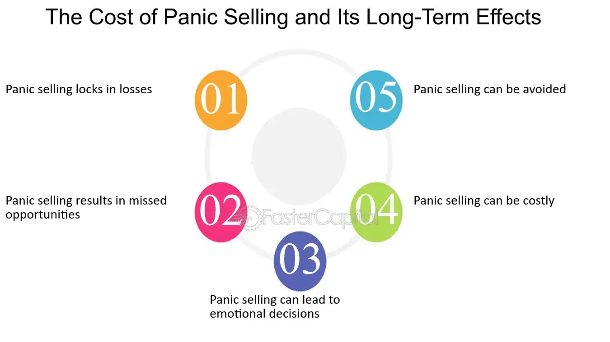

## Table of Contents

## What is panic selling?

Panic selling happens when a lot of people suddenly start selling their investments because they are scared. This usually happens when the price of something, like a stock, starts to go down quickly. People get worried that the price will keep falling, so they want to sell their investments before they lose even more money.

When everyone starts selling at the same time, it can make the price drop even faster. This can create a cycle where more people get scared and sell, making the price go down even more. It's important for investors to stay calm and think carefully before making decisions, instead of just following what everyone else is doing.

## What triggers panic selling in the stock market?

Panic selling in the stock market often starts when something big and unexpected happens. This could be bad news about a company, like a CEO leaving suddenly or a big drop in profits. It could also be something bigger, like a global event that makes people worried about the economy, such as a financial crisis or a natural disaster. When people hear this news, they get scared that their investments will lose value, so they rush to sell their stocks before the prices drop even more.

Once a few people start selling, it can create a chain reaction. Other investors see the prices going down and get worried too. They think that if they don't sell now, they might lose even more money later. This fear spreads quickly, and soon many people are selling their stocks in a hurry. This can make the prices fall even faster, which just makes more people panic and sell. It's like a snowball rolling down a hill, getting bigger and faster as it goes.

## How does panic selling affect individual investors?

Panic selling can hurt individual investors a lot. When everyone starts selling their stocks quickly because they are scared, the prices of those stocks go down fast. If an investor decides to sell during this time, they might sell their stocks for a lot less money than they bought them for. This means they lose money. It's like trying to sell your bike during a big sale when everyone is selling their bikes too; you might have to accept a lower price just to get rid of it.

On the other hand, if an investor waits too long and doesn't sell during the panic, their stocks could keep losing value. They might hope the prices will go back up, but if they don't, the investor could lose even more money. It's a tricky situation. The best thing for investors to do is to stay calm, not follow the crowd, and make decisions based on good information, not just fear.

## What are the psychological factors behind panic selling?

Panic selling is often driven by fear and the fear of missing out. When people see stock prices dropping quickly, they get scared that they will lose a lot of money. This fear makes them want to sell their stocks right away, even if it means selling at a lower price than they bought them for. They are afraid that if they wait, the prices might drop even more, and they will lose even more money. This fear can spread quickly from one person to another, making more and more people want to sell their stocks in a hurry.

Another big [factor](/wiki/factor-investing) is the fear of missing out, or FOMO. When people see others selling their stocks and getting out before the prices drop too much, they worry that they will be left behind if they don't do the same. They don't want to be the only ones holding onto stocks that are losing value. This can make them rush to sell, even if it's not the best decision for them. It's like seeing everyone else leave a party early because they think it's going to get bad, so you leave too, even though you were having a good time.

## Can panic selling lead to a market crash?

Panic selling can definitely lead to a market crash. When a lot of people start selling their stocks because they are scared, it makes the prices of those stocks go down really fast. If this keeps happening and more and more people join in, it can make the whole market go down. This is because when everyone is selling and no one is buying, there's no one to stop the prices from falling. It's like a big snowball rolling down a hill, getting bigger and faster as it goes.

A market crash happens when the prices of stocks fall so much that it affects the whole economy. When people see their investments losing a lot of value, they might stop spending money on other things too. This can make businesses struggle, and if enough businesses struggle, it can lead to a bigger economic problem. So, panic selling can start a chain reaction that leads to a market crash, which can be really bad for everyone.

## What are the short-term and long-term implications of panic selling?

In the short term, panic selling can make stock prices drop really fast. When a lot of people start selling their stocks because they are scared, it can make the prices go down even more. This can lead to big losses for people who sell their stocks during the panic. They might sell their stocks for a lot less than what they paid for them. Also, if someone waits too long and doesn't sell, their stocks could keep losing value. This can make people feel even more scared and unsure about what to do next.

In the long term, panic selling can have bigger effects on the whole economy. If panic selling leads to a market crash, it can make businesses struggle and people lose their jobs. When people see their investments losing a lot of value, they might stop spending money on other things too. This can slow down the economy and make it harder for everyone. But, if people stay calm and don't panic sell, the market can recover over time. It's important for investors to think carefully and not just follow what everyone else is doing.

## How can investors identify signs of panic selling?

Investors can spot panic selling by watching how quickly stock prices are falling. If prices start dropping really fast, it might mean that a lot of people are selling their stocks because they are scared. Another sign is when there is a lot of news about a company or the economy that makes people worried. If everyone is talking about bad news and the stock market is going down, it could be a sign of panic selling.

Also, investors can look at how much trading is happening. If there is a sudden big increase in the number of stocks being sold, it might mean that people are panicking. It's like seeing a lot of people running out of a building at the same time; it could mean there's a fire, or in this case, a panic. By keeping an eye on these things, investors can tell if panic selling is happening and make better decisions about their own investments.

## What strategies can investors use to avoid panic selling?

To avoid panic selling, investors should have a plan and stick to it. This means deciding ahead of time when to buy and sell stocks, based on careful research and not just feelings. When the market starts to go down and everyone else is selling, it can be hard to stay calm. But if you have a plan, you can look at it and see if it's really time to sell or if you should wait. This can help you make better decisions and not just follow what everyone else is doing.

Another good strategy is to not check your investments too often. If you are always looking at the stock market, it's easy to get scared when you see prices going down. Instead, check your investments less often, maybe once a week or even once a month. This can help you stay calm and not panic. Also, it's a good idea to talk to a financial advisor. They can help you understand what's happening in the market and make smart choices, instead of just selling everything because you're scared.

## How do financial regulations aim to mitigate the effects of panic selling?

Financial regulations try to stop panic selling from getting out of control. One way they do this is by having rules that stop trading for a little while if the stock market starts to drop too fast. This is called a circuit breaker. It gives everyone a chance to calm down and think before they keep selling. Another way is by making sure that companies have to tell the truth about their business. If people know the real story, they might not get as scared and start selling their stocks in a panic.

Regulations also make sure that big investors can't do things that make the market go crazy. For example, they can't spread false information to make people panic and sell their stocks. This helps keep the market fair and stops panic selling from starting in the first place. By having these rules, financial regulators try to keep the market stable and protect everyone's investments from big, sudden drops caused by panic.

## What role do market makers and institutional investors play during episodes of panic selling?

Market makers and institutional investors play important roles during times of panic selling. Market makers are like the helpers of the stock market. They buy and sell stocks to make sure there is always someone to trade with. When everyone is selling their stocks in a panic, market makers step in to buy some of those stocks. This helps to slow down the price drop and keep the market from going crazy. They help to keep things calm and make sure the market keeps working even when everyone else is scared.

Institutional investors, like big banks and investment funds, also have a big impact during panic selling. They have a lot of money and can buy a lot of stocks at once. When they see prices dropping fast because of panic selling, they might see it as a chance to buy stocks at a lower price. By buying stocks when everyone else is selling, they can help to stop the prices from falling too much. This can make the market more stable and help it recover faster after a panic.

## How can advanced trading algorithms detect and possibly exploit panic selling?

Advanced trading algorithms can spot panic selling by watching the stock market very closely. They look for signs like a lot of people selling stocks very quickly or big drops in stock prices. These algorithms use math and computer power to find patterns that show when panic selling is happening. They can see things that humans might miss because they can look at a lot of information at the same time. By spotting panic selling early, these algorithms can help investors know when to be careful.

Once these algorithms find panic selling, they can try to use it to make money. They might buy stocks that everyone else is selling in a panic, because the prices are low. Then, when the panic stops and the prices go back up, they can sell those stocks for more money. This is called exploiting the panic. But, it's not easy, and it can be risky. The algorithms need to be really smart to know when the panic will stop and the prices will go back up. If they guess wrong, they could lose money instead of making it.

## What historical examples illustrate the impact of panic selling on financial markets?

One big example of panic selling happened in 1929, which led to the Great Depression. It started when people got scared about the stock market and started selling their stocks really fast. This made the prices drop a lot, and more people got scared and sold their stocks too. It turned into a big panic, and the stock market crashed. This crash didn't just affect the stock market; it hurt the whole economy. A lot of people lost their jobs and their money, and it took a long time for things to get better.

Another example is the 2008 financial crisis. It started when people found out that a lot of banks had made bad loans. When this news came out, people got scared and started selling their stocks. This panic selling made the stock market go down a lot. Banks lost a lot of money, and some even went out of business. This led to a big economic problem that affected people all over the world. It took years for the economy to recover from this panic selling and the crisis it caused.

## References & Further Reading

[1]: Kahneman, D., & Tversky, A. (1979). ["Prospect Theory: An Analysis of Decision under Risk."](http://web.mit.edu/curhan/www/docs/Articles/15341_Readings/Behavioral_Decision_Theory/Kahneman_Tversky_1979_Prospect_theory.pdf) Econometrica, 47(2), 263-291.

[2]: Tversky, A., & Kahneman, D. (1973). ["Availability: A Heuristic for Judging Frequency and Probability."](https://www.sciencedirect.com/science/article/pii/0010028573900339) Cognitive Psychology, 5(2), 207-232.

[3]: U.S. Securities and Exchange Commission. (2010). ["Findings Regarding the Market Events of May 6, 2010."](https://www.sec.gov/news/studies/2010/marketevents-report.pdf)

[4]: Shiller, R. J. (2000). ["Irrational Exuberance."](https://www.jstor.org/stable/j.ctt7st4s) Princeton University Press.

[5]: Barberis, N., & Thaler, R. (2003). ["A Survey of Behavioral Finance."](https://www.semanticscholar.org/paper/A-Survey-of-Behavioral-Finance-Barberis-Thaler/a4ab7d7161deac0f532d121b1614cf7b97d90e78) Handbook of the Economics of Finance, 1, 1053-1128.

[6]: Cheng, I. H., & Kirilenko, A. A. (2011). ["Flash Crashes and the Market Mechanism."](https://papers.ssrn.com/sol3/papers.cfm?abstract_id=1686004) NBER Working Paper No. 17790.