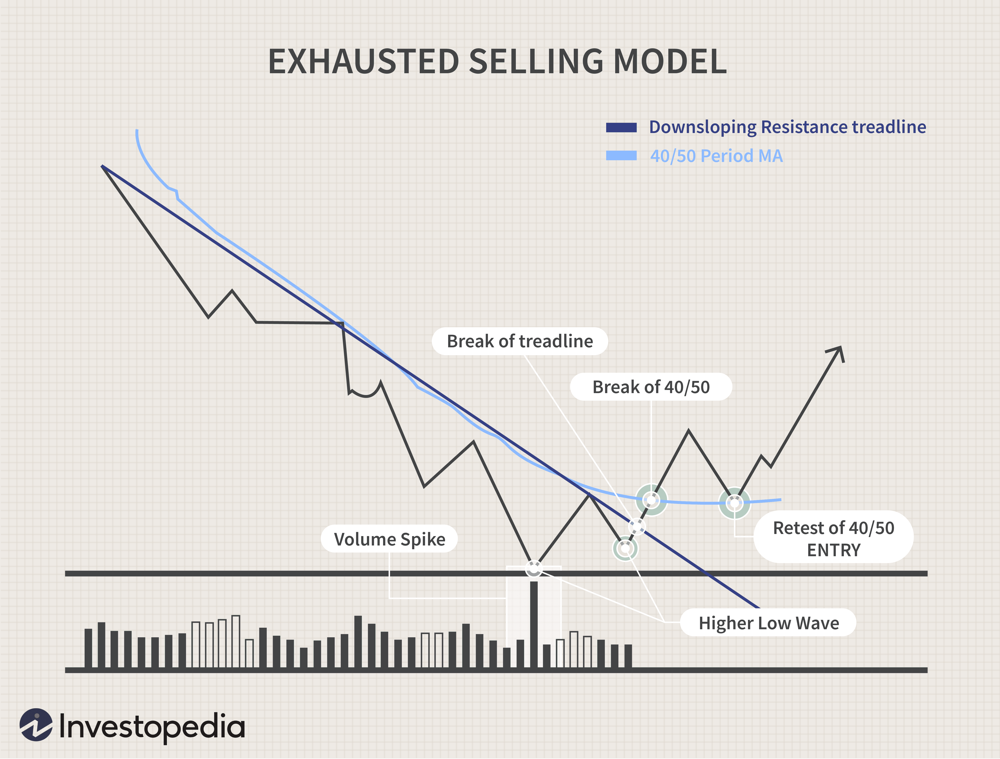

Panic selling is a significant event in financial markets where investors rapidly sell off their assets, often driven more by fear and emotional reactions than by rational analysis. This behavior typically follows sudden market changes, such as unexpected economic news, political instability, or scandals that disrupt investor confidence. For instance, a sudden drop in a major stock index or geopolitical tensions might trigger anxiety among investors, leading to hasty liquidation of assets to minimize perceived losses.

Algorithmic trading and investor psychology are pivotal in understanding the rapid escalation of panic selling. Algorithmic trading involves using computer programs to execute trades at high speed based on predefined criteria. These algorithms can exacerbate volatility by quickly reacting to market movements, sometimes intensifying the sell-off as prices fall. Meanwhile, investor psychology, marked by emotional biases and cognitive distortions, makes markets more susceptible to panic reactions. Investors often find themselves influenced by herd behavior, where they mimic others’ actions rather than rely on independent analysis. This herd mentality, combined with loss aversion—a tendency to prioritize avoiding losses over acquiring equivalent gains—can significantly hasten the pace of panic selling.



Understanding these dynamics is crucial for investors seeking to manage their emotions and avoid making impulsive decisions that could harm their long-term financial goals. By recognizing the triggers and contributing factors of panic selling, such as mass media influence and algorithmic response patterns, investors can develop strategies to withstand market turbulence. The article will further explore the causes of panic selling, its effects on the financial market ecosystem, and strategic responses to mitigate its impact, aiming to equip investors with the knowledge to navigate and capitalize on market fluctuations.

## Table of Contents

## Understanding Panic Selling

Panic selling is a large-scale stock market phenomenon driven primarily by fear, leading investors to sell assets abruptly rather than making decisions based on logical assessments. This behavior is often initiated by sudden adverse events and further propagated by market mechanisms, resulting in a positive feedback loop. Such loops occur when the selling pressure drives asset prices down, prompting even more investors to liquidate their positions in fear of further losses, thereby exacerbating the market decline.

Several factors can trigger panic selling. Market rumors can spur anxieties about asset value, while negative economic news can erode investor confidence. Additionally, widespread economic crises often instigate panic selling due to heightened uncertainty and risk aversion among investors.

Understanding the psychological components is crucial in comprehending panic selling. Cognitive biases like loss aversion—where individuals prefer to avoid losses over acquiring equivalent gains—play a significant role. Herd mentality also influences behavior, as investors tend to follow the crowd in periods of uncertainty, accelerating sell-offs.

Historical examples of panic selling provide insights into its potential severity and impact on markets. The 1929 Market Crash serves as one of the earliest examples, where fear among investors led to a catastrophic sell-off, marking the onset of the Great Depression. The 2008 Financial Crisis offers a more contemporary instance, where the collapse of major financial institutions and subsequent economic downturn incited widespread fear and asset liquidation. More recently, the COVID-19 pandemic in 2020 induced panic selling as investors reacted to unprecedented economic disruptions and global uncertainties. Each of these events underscores the profound effects panic selling has on financial markets and the broader economy, emphasizing the importance of understanding its dynamics to better navigate such scenarios.

## Psychological Factors and Investor Behavior

Investor behavior during panic selling is profoundly shaped by psychological factors. Among these, loss aversion and availability bias stand out as primary influencers.

Loss aversion is a concept derived from prospect theory, which posits that individuals experience the pain of losses more acutely than they do the pleasure of equivalent gains. This tendency can drive investors to sell off assets impulsively during market downturns, as the fear of further losses outweighs potential recovery or gains. Research in behavioral economics suggests that losses can be perceived as nearly twice as impactful as gains, which underlines how fear-induced panic selling is often irrational [Kahneman & Tversky, 1979].

Herd mentality also plays a significant role in panic selling. In times of market uncertainty, individuals often look to the behavior of others for cues on how to act, a psychological response known as social proof. This behavior can lead to mimicking actions without independent evaluation, causing a chain reaction where more and more investors sell off their holdings simply because others are doing so. Daniel Kahneman has highlighted that this form of collective behavior can intensify market [volatility](/wiki/volatility-trading-strategies) and lead to irrational decision-making.

Media portrayal and sensationalized news further amplify investor anxiety during market fluctuations. The immediacy and omnipresence of news can sometimes lead to exaggerated perceptions of risk, prompting investors to react hastily without thorough analysis. This effect can be attributed to the availability bias, where individuals overestimate the importance of information that is most readily available to them, typically the most dramatic or recent stories [Tversky & Kahneman, 1973]. Consequently, media-driven panic can distort market perceptions and exacerbate sell-offs.

The concept of the 'Idiocy of the Crowd' encapsulates how collective irrationality can lead to significant financial repercussions. In panic selling, the crowd's tendency to converge on similar actions—despite lacking individual rationality—illustrates a deviation from efficient market behaviors. This crowd-induced volatility can destabilize markets, causing broader economic implications.

Therefore, understanding these psychological triggers is crucial for developing strategies to counter panic selling, emphasizing the importance of maintaining a rational outlook during market volatility.

## The Role of Algorithmic Trading

Algorithmic trading plays a pivotal role in the dynamics of panic selling due to its capability to execute transactions at high speed and [volume](/wiki/volume-trading-strategy). Algorithms are designed to operate on preset criteria, automatically executing large orders without human emotional interference. This characteristic allows them to rapidly respond to market conditions, often amplifying price movements. Such amplification occurs as algorithms react to triggers such as price thresholds, technical indicators, or market news, cascading sell orders that exacerbate downward price spirals.

A notable phenomenon associated with [algorithmic trading](/wiki/algorithmic-trading) is the occurrence of flash crashes. These are sharp, rapid declines in security prices within a short duration, often resembling panic selling. Despite the absence of human emotional involvement, flash crashes are primarily driven by algorithmic trades that respond to erroneous data or cascading stop-loss triggers. An infamous example is the "Flash Crash" of May 6, 2010, when the Dow Jones Industrial Average plunged about 1,000 points in minutes before recovering [1].

Traders frequently employ algorithms along with technical analysis to identify market bottom points, enabling them to profit from panic-induced price dips. By analyzing historical price data, volume, and various indicators, algorithms can detect undervalued conditions and execute trades that capitalize on market corrections.

However, striking the right balance between algorithmic execution and human intuition remains crucial for successful trading during market upheavals. While algorithms can efficiently handle high-frequency trading scenarios, they lack the nuanced understanding of complex market psychology that human traders possess. Human oversight is necessary to adjust algorithm parameters and intervene in situations where algorithmic actions may trigger unintended consequences.

To illustrate the perception of risk in algorithmic trading, consider a simple Python implementation for analyzing moving averages—a common technique used to predict potential buy and sell signals in a market:

```python
import numpy as np
import pandas as pd

# Sample market data
data = {
    'Date': pd.date_range(start='1/1/2022', periods=100),
    'Close': np.random.normal(loc=100, scale=5, size=100)
}
df = pd.DataFrame(data)

# Calculate moving averages
df['SMA_20'] = df['Close'].rolling(window=20).mean()
df['SMA_50'] = df['Close'].rolling(window=50).mean()

# Determine buy/sell signals
df['Signal'] = np.where(df['SMA_20'] > df['SMA_50'], 'Buy', 'Sell')
```

This code demonstrates how traders might use simple moving averages to generate buy or sell signals, which can be utilized in an algorithmic trading system. While such tools provide valuable insights, the human element remains essential in interpreting broader economic signals and modifying strategies accordingly.

In conclusion, while algorithmic trading significantly influences market dynamics by accelerating the pace of panic selling, it crucially requires human oversight to integrate emotional and contextual understanding, ensuring informed and adaptable market participation.

---
[1] U.S. Securities and Exchange Commission (2010). "Findings Regarding the Market Events of May 6, 2010". 

## Financial Market Sell-Offs

Market sell-offs occur when a large number of investors decide to sell off their holdings, causing a decline in prices. These sell-offs can have varying levels of depth and impact, each influencing investor behavior differently. While some sell-offs may reach the panic-driven levels described as "panic selling," others do not originate from emotions but from strategic market repositioning and corrections.

Regular sell-offs are part of the natural ebb and flow of financial markets. They often arise from investors realigning their portfolios to capture profits or reduce risks, leading to short-term declines that do not fundamentally alter the market structure. Such sell-offs typically reflect a calculated response to new information, changing economic conditions, or adjustments to perceived overvaluations, rather than an irrational exodus driven by fear.

Sector-specific sell-offs, on the other hand, focus on particular industries or companies. These can result from company-specific issues like earnings misses, regulatory changes, or broader negative sentiment affecting the entire sector. For instance, the technology sector might experience a sell-off due to concerns over regulatory crackdowns, leading investors to reevaluate their positions in tech stocks.

Understanding market corrections is critical in differentiating between panic sell-offs and healthy adjustments. Corrections are generally viewed as normal and necessary for the sustainability of the market, providing an opportunity for prices to adjust to more justified levels. A correction is often defined as a decline of 10% or more from a recent peak, acting as a counterbalance to prolonged bullish trends and speculative excesses.

From an investment perspective, post-sell-off periods can yield opportunities, particularly for value investors. These investors look for undervalued stocks whose prices have been excessively driven down, providing a chance to buy them at a discount. Distinguishing between panic-induced sell-offs and those driven by strategic repositioning is crucial for capitalizing on these opportunities. Investors need to assess the underlying reasons for the sell-off, examining whether the decline presents a fundamental issue or unwarranted market overreaction. This distinction helps in making informed decisions to optimize the risk-reward balance in their investment portfolios.

## Strategies to Counteract Panic Selling

Investors can mitigate the effects of panic selling by employing robust risk management strategies. One effective method is diversification, which involves spreading investments across various asset classes to reduce the overall risk. By not concentrating investments in a single area, investors can lessen the impact of any single market swing. Strategic asset allocation further involves adjusting the composition of an investment portfolio in line with an individual's risk tolerance, investment goals, and market conditions.

Another vital tool for counteracting panic selling is the implementation of stop-loss orders. These orders automatically sell a security when it reaches a predetermined price, thereby limiting potential losses. By employing stop-loss orders, investors can prevent emotions from driving their decisions, ensuring that exits are guided by strategy rather than panic. For example, an investor might set a stop-loss order at 10% below the purchase price to contain potential losses in volatile market conditions.

Long-term investment strategies focused on [fundamental analysis](/wiki/fundamental-analysis) emphasize evaluating the intrinsic value of an asset rather than being swayed by short-term market fluctuations. Such an approach prevents investors from succumbing to market panic. For example, assessing metrics such as earnings, revenue, and growth prospects can inform decisions based on the underlying value of stocks rather than temporary price changes.

Emotional discipline is another crucial [factor](/wiki/factor-investing) in managing panic selling. Investors who maintain composure in volatile markets can make rational decisions despite fluctuations. Techniques like meditation, mindfulness, or even seeking financial advice can contribute to maintaining a level-headed approach. By focusing on long-term objectives rather than immediate market noise, investors can navigate periods of panic with greater resilience and possibly capitalize on opportunities that arise amidst market turbulence.

## Conclusion: Lessons from Historical Panic Selling

Historical financial crises serve as vivid reminders of the profound impact that uncontrolled panic selling can have on both markets and economies. Perhaps the most salient lesson from these past episodes is the importance of maintaining emotional discipline and strategic foresight. Investors who can control their emotions during volatile periods often find themselves in advantageous positions, allowing them to seize post-panic buying opportunities at reduced valuations. 

Understanding the psychological triggers of panic selling, such as loss aversion and herd behavior, provides investors with critical insights. Recognizing these behavioral tendencies enables more rational, informed decision-making. For instance, loss aversion, where investors fear losses more than they value equivalent gains, often leads to hasty selling decisions. By being aware of these biases, investors can preemptively develop strategies to counteract them, thereby enhancing their decision-making process.

Maintaining a balance between reacting to immediate market changes and adhering to long-established investment principles is crucial. This balance involves recognizing when market conditions reflect transitory volatility rather than fundamental changes. By sticking to core investment tenets, such as diversification and strategic asset allocation, investors can better withstand market turbulence. 

Moreover, learning from past market downturns aids in transforming the chaos of panic selling into opportunities for growth. Historical episodes, like the 2008 Financial Crisis, reveal that markets often rebound post-crisis, benefiting those who were patient and prudent. As such, past crises underscore the value of a long-term investment horizon and the potential rewards for those who remain strategically disciplined amidst market panic. 

In conclusion, historical analyses reveal that well-informed, emotionally disciplined investors are better equipped to navigate the challenges of panic-induced market turmoil, turning potential adversity into opportunities for growth and financial success.

## References & Further Reading

[1]: Kahneman, D., & Tversky, A. (1979). ["Prospect Theory: An Analysis of Decision under Risk."](http://web.mit.edu/curhan/www/docs/Articles/15341_Readings/Behavioral_Decision_Theory/Kahneman_Tversky_1979_Prospect_theory.pdf) Econometrica, 47(2), 263-291.

[2]: Tversky, A., & Kahneman, D. (1973). ["Availability: A Heuristic for Judging Frequency and Probability."](https://www.sciencedirect.com/science/article/pii/0010028573900339) Cognitive Psychology, 5(2), 207-232.

[3]: U.S. Securities and Exchange Commission. (2010). ["Findings Regarding the Market Events of May 6, 2010."](https://www.sec.gov/news/studies/2010/marketevents-report.pdf)

[4]: Shiller, R. J. (2000). ["Irrational Exuberance."](https://www.jstor.org/stable/j.ctt7st4s) Princeton University Press.

[5]: Barberis, N., & Thaler, R. (2003). ["A Survey of Behavioral Finance."](https://www.semanticscholar.org/paper/A-Survey-of-Behavioral-Finance-Barberis-Thaler/a4ab7d7161deac0f532d121b1614cf7b97d90e78) Handbook of the Economics of Finance, 1, 1053-1128.

[6]: Cheng, I. H., & Kirilenko, A. A. (2011). ["Flash Crashes and the Market Mechanism."](https://papers.ssrn.com/sol3/papers.cfm?abstract_id=1686004) NBER Working Paper No. 17790.